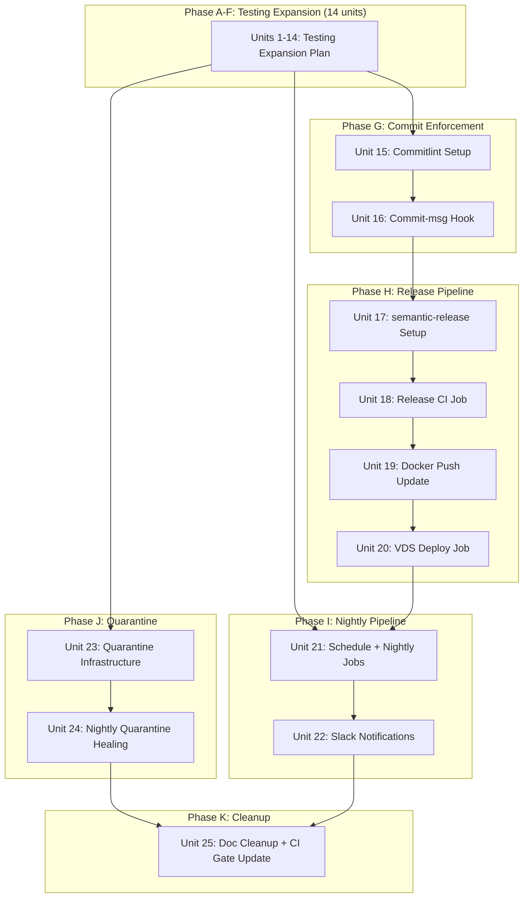

# CI/CD & Release Pipeline with Unified Testing Expansion

## Overview

Unify two finalized streams of work into a single pipeline: (1) the 14-unit testing expansion plan (integration tests, fullstack E2E, visual baselines, mutation ratchet) and (2) CI/CD architecture (commitlint, semantic-release, nightly pipeline, VDS deploy, flaky test quarantine). The testing expansion is incorporated by reference with its existing unit definitions preserved. The CI/CD layer adds 11 new units on top. Total: 25 implementation units across 8 phases.

## Problem Frame

Risoluto has a mature CI pipeline but lacks three critical capabilities (see origin: `docs/brainstorms/2026-04-02-cicd-release-pipeline-requirements.md`):

1. **No release automation** -- versioning is manual (`0.6.0` in package.json), no changelog, no semver tags. Docker images get `sha` + `latest` tags only.
2. **Integration tests are main-only** -- PR authors don't know if integration tests pass until after merge.
3. **No nightly pipeline** -- heavy tests (fullstack E2E, visual regression, full mutation, live provider smoke) have no recurring execution cadence.

Additionally, a finalized testing expansion plan (`.anvil/testing-expansion/plan.md`, 14 units, 8/10 GO with 19 review settlements) provides the test infrastructure foundation that must be implemented as part of this work.

## Requirements Trace

**Testing Infrastructure (from finalized testing expansion plan)**

- R1. Implement the 14-unit testing expansion plan per `.anvil/testing-expansion/plan.md`
- R2. Add `integration-pr` job to `ci.yml` -- runs `pnpm run test:integration` on every PR, included in `build-and-test` gate
- R3. Add `mutation-incremental` job to `ci.yml` as advisory (`continue-on-error: true`)

**Nightly Pipeline**

- R4. Change schedule trigger from weekly (`0 6 * * 1`) to nightly (`0 2 * * *`)
- R5. Add nightly-only jobs: `fullstack-e2e`, `visual-regression`, `live-provider-smoke` with schedule/dispatch gate
- R6. Upload failure artifacts with 14-day retention on all nightly jobs
- R7. Add Slack notification via GitHub Actions Slack webhook (`SLACK_WEBHOOK_URL` secret)

**Commit Enforcement**

- R8. Install `@commitlint/cli` + `@commitlint/config-conventional`
- R9. Create `commitlint.config.ts` with 18 scopes
- R10. Add `.husky/commit-msg` hook

**Release Pipeline (CD)**

- R11. Install `semantic-release` + plugins
- R12. Create `.releaserc.yml` with `[skip ci]` in commit message template
- R13. Add `release` job to `ci.yml` using `RELEASE_TOKEN` PAT
- R14. Update `docker-push` job: checkout release tag, add semver Docker tag
- R15. Add `deploy-vds` job with health check and automated rollback

**Flaky Test Quarantine**

- R16. Create `quarantine.json` tracked in repo
- R17. Create Vitest setup file that skips quarantined tests in CI
- R18. Nightly job updates `passCount`, auto-remove after 5 consecutive passes
- R19. Hard cap: 5 quarantined tests. Weekly audit creates Linear issues for entries older than 7 days

**CI Consistency**

- R20. All new CI jobs use `.github/actions/restore-build` composite action
- R21. Remove SonarCloud references from documentation
- R22. Preserve existing `paths-ignore` asymmetry
- R23. Preserve existing `knip` and `dependency-review` jobs unchanged

## Scope Boundaries

- **In scope**: All CI/CD infrastructure, testing expansion implementation, release automation, VDS deploy, quarantine system, nightly pipeline, commitlint, Slack notifications
- **Out of scope**: SonarCloud integration (dropped), self-hosted runners (future), `nightly.yml` extraction (defer unless ci.yml exceeds ~800 lines), branch protection rule setup (Omer configures manually)

## Context & Research

### Relevant Code and Patterns

**CI workflow** (`.github/workflows/ci.yml`):
- Current schedule: `cron: "0 6 * * 1"` (weekly Monday 06:00 UTC)
- Build job creates cache with key `build-${{ github.sha }}`
- `build-and-test` gate aggregates: `build, lint, test, knip, typecheck, gitleaks, semgrep, docker-build, e2e-smoke`
- `docker-push` job: main-only, after `build-and-test`, pushes to GHCR with SHA + latest tags
- `e2e-lifecycle` job: main-only, non-blocking, uses `continue-on-error: true`
- `integration` job: main-only (`if: github.ref == 'refs/heads/main'`), not in `build-and-test` gate

**Composite action** (`.github/actions/restore-build/action.yml`):
- Sets up pnpm, Node.js 24, restores cache with key `build-${{ github.sha }}`
- Cache key is SHA-based -- this creates a problem for the `docker-push` job when it checks out a release tag (different SHA)

**Husky hooks**:
- `pre-commit`: runs `lint-staged` (eslint + prettier on staged files)
- `pre-push`: fast 80/20 gate (build, test, typecheck) with `FULL_CHECK=1` opt-in for full suite
- `post-merge`: auto-formats after GitHub PR merges
- No `commit-msg` hook exists yet

**Docker compose** (`docker-compose.yml`):
- Uses `build: .` (builds from Dockerfile), no `image:` directive
- No `RISOLUTO_IMAGE` env var support -- rollback requires a different mechanism
- Has healthcheck: `fetch('http://127.0.0.1:4000/api/v1/state')`
- Existing env vars include `RISOLUTO_PORT`, all Linear/GitHub credentials

**Package.json**:
- `private: true`, version `0.6.0`
- Existing scripts: `test:integration`, `test:mutation`, `test:mutation:incremental`, `test:e2e:smoke`, `test:e2e:visual`
- No commitlint or semantic-release packages installed

**Stryker config** (`stryker.config.json`):
- 42 files in `mutate` array, `break: null` (unenforced)
- Incremental mode enabled

### Institutional Learnings

- Dynamic port allocation via `server.start(0)` is the proven pattern for parallel-safe tests
- The testing expansion plan's 19 review settlements are pre-approved and must not be re-litigated
- Webhook signing in tests requires exact byte-sequence match between signing input and request body

### External References

- **Vitest quarantine**: Use a setup file that registers a global `beforeEach` hook checking `ctx.task.name` against the quarantine map and calling `ctx.skip()`. This zero-import approach works in Vitest 2+ and requires no changes to existing test files. The `QUARANTINE_ENFORCE` env var controls whether quarantine is active (default: `true` in CI, `false` in nightly healing runs).
- **GitHub Actions cache + release tags**: When `docker-push` checks out a release tag, the `restore-build` composite action's `build-${{ github.sha }}` cache key misses because the tag commit has a different SHA. Solution: rebuild in the `docker-push` job rather than relying on cache.
- **semantic-release `[skip ci]`**: Configure via `@semantic-release/git` message template to prevent CI re-trigger on version bump commits.

## Key Technical Decisions

- **Docker-push rebuilds instead of cache restore** (affects R14, R20): When `docker-push` checks out the release tag (via `actions/checkout` with `ref: v${{ needs.release.outputs.new_release_version }}`), the tag commit's SHA differs from the push trigger's SHA because semantic-release created a new commit. The `restore-build` composite action's cache key `build-${{ github.sha }}` will miss. Rather than engineering a fragile cross-SHA cache transfer, the `docker-push` job does a full `pnpm install --frozen-lockfile && pnpm run build` after checkout. This is robust, simple, and adds ~2 minutes to a release that happens at most once per merge to main. Docker layer caching via `cache-from: type=gha` still works and covers the expensive Docker build itself.
  (resolves outstanding question 3)

- **VDS rollback via `docker compose` image override** (affects R15): The existing `docker-compose.yml` uses `build: .` with no `image:` directive. For deploy, the VDS must override the image at deploy time using `docker compose` CLI: `RISOLUTO_IMAGE=ghcr.io/omerfarukoruc/risoluto:v1.2.3 docker compose up -d`. This requires a one-time edit to the VDS `docker-compose.yml` to use `image: ${RISOLUTO_IMAGE:-ghcr.io/omerfarukoruc/risoluto:latest}` instead of `build: .`. The deploy script stores the previous image tag in a file (`/opt/risoluto/.previous-image`) before pulling, enabling rollback via `RISOLUTO_IMAGE=<previous-tag> docker compose up -d`.
  (resolves outstanding question 1)

- **Quarantine via Vitest setup file with `beforeEach` + `ctx.skip()`** (affects R17): The quarantine mechanism uses a Vitest setup file (`tests/helpers/quarantine.ts`) that reads `quarantine.json` at import time and registers a global `beforeEach` hook. The hook checks `ctx.task.name` and `ctx.task.file.name` against the quarantine map. When `QUARANTINE_ENFORCE` env var is `true` (default in CI), matching tests are skipped via `ctx.skip()`. In nightly runs, `QUARANTINE_ENFORCE=false` runs them normally to check for healing. This zero-import approach requires no changes to existing test files. The setup file is registered in `vitest.config.ts` via the `setupFiles` array.
  (resolves outstanding question 2)

- **Commitlint with 18 scopes**: `orchestrator`, `http`, `cli`, `core`, `workspace`, `linear`, `git`, `docker`, `config`, `persistence`, `dashboard`, `setup`, `secrets`, `agent`, `ci`, `frontend`, `e2e`, `deps`
  (see origin: requirements doc, R9)

- **Phase ordering preserved**: Testing foundation (Phases A-F from testing expansion) -> commit enforcement -> release pipeline -> nightly expansion -> quarantine. Dependencies flow forward; nothing can be parallelized across phases.
  (see origin: requirements doc, Key Decisions)

- **`[skip ci]` in semantic-release commit**: The `@semantic-release/git` message template includes `[skip ci]` to prevent the version bump commit from re-triggering CI.
  (see origin: requirements doc, R12)

- **Slack via GitHub Actions webhook**: New `SLACK_WEBHOOK_URL` secret, not using the codebase notification manager. Sends failure summary via `slackapi/slack-github-action`.
  (see origin: requirements doc, R7)

## Open Questions

### Resolved During Planning

- **Docker-push cache miss when checking out release tag** (Q3): The tag checkout lands on a different SHA than the push trigger. Solution: the `docker-push` job does a full rebuild (`pnpm install && pnpm run build`) after checking out the tag, bypassing the `restore-build` composite action. Docker layer caching (`cache-from: type=gha`) still accelerates the Docker build itself. This adds ~2 minutes but is reliable and simple.

- **VDS rollback mechanism** (Q1): The existing `docker-compose.yml` uses `build: .` with no `image:` directive. Solution: modify the VDS copy to use `image: ${RISOLUTO_IMAGE:-ghcr.io/omerfarukoruc/risoluto:latest}`. The deploy script saves the current image tag to `.previous-image` before deploying, enabling rollback via environment variable override.

- **Vitest quarantine skip mechanism** (Q2): Solution: a setup file reads `quarantine.json` and registers a global `beforeEach` hook that checks `ctx.task.name` and `ctx.task.file.name` against the quarantine map, calling `ctx.skip()` for matches. This works in Vitest 2+ and requires zero changes to existing test files. The `QUARANTINE_ENFORCE` env var controls whether quarantine is active (default: `true` in CI, `false` in nightly).

### Deferred to Implementation

- **Exact Zod schemas for untyped endpoints**: Shape depends on inspecting route handler return values (from testing expansion plan)
- **Actual mutation score on 42 files**: Running `pnpm run test:mutation` reveals the baseline. The 70 threshold may already be met.
- **VDS docker-compose.yml exact path**: Assumed `/opt/risoluto/docker-compose.yml` based on common conventions. Verify during deploy unit implementation.
- **Slack webhook message format**: Exact payload structure depends on which `slackapi/slack-github-action` version is pinned. Use their documented format.

## High-Level Technical Design

> *Directional guidance for review, not implementation specification.*



## Implementation Units

### Phase A-F: Testing Expansion (Units 1-14)

These 14 units are defined in full in `.anvil/testing-expansion/plan.md` (finalized 2026-04-01, 8/10 GO, 19 settlements). They are incorporated by reference into this unified plan. The testing expansion plan is the authoritative source for all unit details below -- this section provides only enough context for dependency tracking and execution sequencing.

- [ ] **Unit 1: OpenAPI Spec Sync Test**

  **Goal:** Verify runtime-generated spec matches checked-in spec exactly.
  **Requirements:** R1 (testing expansion R1)
  **Dependencies:** None
  **Files:** Create: `tests/http/openapi-sync.test.ts`
  **Full specification:** `.anvil/testing-expansion/plan.md`, Unit 1
  **Verification:** `pnpm test` includes the sync test

---

- [ ] **Unit 2: OpenAPI Schema Tightening**

  **Goal:** Replace all bare `{ type: "object" }` response schemas in `openapi-paths.ts` with proper Zod-derived schemas.
  **Requirements:** R1 (testing expansion R2)
  **Dependencies:** None (parallel with Unit 1)
  **Files:** Modify: `src/http/response-schemas.ts`, `src/http/openapi-paths.ts`, `docs-site/openapi.json`; Test: `tests/http/response-schemas.test.ts`, `tests/http/openapi-paths.test.ts`
  **Full specification:** `.anvil/testing-expansion/plan.md`, Unit 2
  **Verification:** Zero `{ type: "object" }` bare schemas remaining; `pnpm test` passes

---

- [ ] **Unit 3: Shared HTTP Server Harness**

  **Goal:** Extract a reusable test harness that starts a real `HttpServer` with temp SQLite.
  **Requirements:** R1 (testing expansion R4, R26, R27)
  **Dependencies:** None (parallel with Units 1-2)
  **Files:** Create: `tests/helpers/http-server-harness.ts`
  **Full specification:** `.anvil/testing-expansion/plan.md`, Unit 3
  **Verification:** Harness importable; `pnpm run build` succeeds

---

- [ ] **Unit 4: SQLite Integration Tests**

  **Goal:** Exercise all 8 SQLite persistence modules against real temp-file databases.
  **Requirements:** R1 (testing expansion R3, R26)
  **Dependencies:** None (parallel with Units 1-3)
  **Files:** Create: `tests/integration/sqlite-runtime.integration.test.ts`, `tests/integration/sqlite-stores.integration.test.ts`
  **Full specification:** `.anvil/testing-expansion/plan.md`, Unit 4
  **Verification:** `pnpm run test:integration` runs both files

---

- [ ] **Unit 5: AJV Response Contract Tests**

  **Goal:** Validate all spec-covered API endpoint responses against compiled OpenAPI schemas.
  **Requirements:** R1 (testing expansion R5)
  **Dependencies:** Unit 2 (schema tightening), Unit 3 (HTTP server harness)
  **Pre-execution gate:** `pnpm add -D ajv`
  **Files:** Create: `tests/http/openapi-contracts.integration.test.ts`
  **Full specification:** `.anvil/testing-expansion/plan.md`, Unit 5
  **Verification:** All spec-covered endpoints validated; `pnpm run test:integration` passes

---

- [ ] **Unit 6: SSE Contract Tests**

  **Goal:** Verify SSE event propagation through the full HttpServer stack.
  **Requirements:** R1 (testing expansion R6, R11)
  **Dependencies:** Unit 3 (HTTP server harness)
  **Files:** Create: `tests/http/sse-contracts.integration.test.ts`
  **Full specification:** `.anvil/testing-expansion/plan.md`, Unit 6
  **Verification:** All 13 SSE event types verified; `pnpm run test:integration` passes

---

- [ ] **Unit 7: Orchestrator Restart/Recovery/Idempotency Tests**

  **Goal:** Verify orchestrator handles duplicate webhooks, restart mid-run, abort races.
  **Requirements:** R1 (testing expansion R7)
  **Dependencies:** Unit 3, Unit 4
  **Files:** Create: `tests/orchestrator/restart-recovery.integration.test.ts`
  **Full specification:** `.anvil/testing-expansion/plan.md`, Unit 7
  **Verification:** All idempotency and recovery scenarios pass

---

- [ ] **Unit 8: Fullstack Playwright Project Setup**

  **Goal:** Add a `fullstack` Playwright project with real backend + built frontend.
  **Requirements:** R1 (testing expansion R8, R13)
  **Dependencies:** Unit 3
  **Files:** Create: `playwright.fullstack.config.ts`, `tests/e2e/setup/fullstack-server.ts`, `tests/e2e/fixtures/fullstack.ts`
  **Full specification:** `.anvil/testing-expansion/plan.md`, Unit 8
  **Verification:** `pnpm exec playwright test --config playwright.fullstack.config.ts` runs without error

---

- [ ] **Unit 9: Fullstack E2E Spec Files**

  **Goal:** Write 4 fullstack E2E specs covering webhook-to-UI, issue lifecycle, SSE reconnect, API errors.
  **Requirements:** R1 (testing expansion R9, R10, R11, R12)
  **Dependencies:** Unit 8
  **Files:** Create: `tests/e2e/specs/fullstack/webhook-to-ui.fullstack.spec.ts`, `tests/e2e/specs/fullstack/issue-lifecycle.fullstack.spec.ts`, `tests/e2e/specs/fullstack/sse-reconnect.fullstack.spec.ts`, `tests/e2e/specs/fullstack/api-error-handling.fullstack.spec.ts`
  **Full specification:** `.anvil/testing-expansion/plan.md`, Unit 9
  **Verification:** All 4 fullstack spec files pass

---

- [ ] **Unit 10: Live Provider Smoke Tests**

  **Goal:** Add thin live smoke tests for Linear, GitHub, Docker with credential guards.
  **Requirements:** R1 (testing expansion R14-R17)
  **Dependencies:** None (parallel with other phases)
  **Files:** Create: `tests/integration/live/linear-live.integration.test.ts`, `tests/integration/live/github-live.integration.test.ts`, `tests/integration/live/docker-live.integration.test.ts`
  **Full specification:** `.anvil/testing-expansion/plan.md`, Unit 10
  **Verification:** With credentials: live tests pass; without: graceful skip

---

- [ ] **Unit 11: Visual Baseline Expansion**

  **Goal:** Expand from 4 spec files (7 baselines) to ~9 spec files (~25 baselines).
  **Requirements:** R1 (testing expansion R18-R21)
  **Dependencies:** None (parallel with other phases)
  **Files:** Create: 9 new visual spec files in `tests/e2e/specs/visual/`
  **Full specification:** `.anvil/testing-expansion/plan.md`, Unit 11
  **Verification:** `pnpm exec playwright test --project=visual` passes with ~25 baselines

---

- [ ] **Unit 12: Mutation Target Expansion**

  **Goal:** Expand Stryker mutate array from 42 to ~65 curated src files.
  **Requirements:** R1 (testing expansion R22)
  **Dependencies:** None (benefits from Units 4-7)
  **Files:** Modify: `stryker.config.json`
  **Full specification:** `.anvil/testing-expansion/plan.md`, Unit 12
  **Verification:** `stryker.config.json` has ~65 files; `pnpm run test:mutation` runs without errors

---

- [ ] **Unit 13: Mutation Threshold Ratchet**

  **Goal:** Progressive enforcement 70 -> 80 -> 90%.
  **Requirements:** R1 (testing expansion R23-R25)
  **Dependencies:** Unit 12
  **Files:** Modify: `stryker.config.json`; Create/modify: targeted test files
  **Full specification:** `.anvil/testing-expansion/plan.md`, Unit 13
  **Verification:** `stryker.config.json` has `break: 90`; `pnpm run test:mutation` passes

---

- [ ] **Unit 14: Testing Expansion CI Pipeline and Package Scripts**

  **Goal:** Add new package.json scripts and update `vitest.integration.config.ts`.
  **Requirements:** R1 (testing expansion R28-R31), R2, R3
  **Dependencies:** Units 4-13
  **Files:** Modify: `package.json`, `vitest.integration.config.ts`
  **Full specification:** `.anvil/testing-expansion/plan.md`, Unit 14

  **Approach (extended for this unified plan):**
  The testing expansion plan's Unit 14 covers package.json scripts and vitest config. This unified plan extends it to also add the `integration-pr` and `mutation-incremental` CI jobs (R2, R3) which are deferred to Unit 25 (CI Gate Update) to keep changes atomic. The package.json scripts from the testing expansion plan are implemented here as specified.

  **Verification:** All new scripts work; `pnpm run test:integration` excludes live tests

---

### Phase G: Commit Enforcement (Units 15-16)

- [ ] **Unit 15: Commitlint Configuration**

  **Goal:** Install commitlint and create a config file with 18 scopes to enforce conventional commit messages.
  **Requirements:** R8, R9
  **Dependencies:** None (can run after or in parallel with Phase A-F, but logically sequenced here)
  **Files:**
  - Create: `commitlint.config.ts`
  - Modify: `package.json` (devDependencies)

  **Approach:**
  - `pnpm add -D @commitlint/cli @commitlint/config-conventional`
  - Create `commitlint.config.ts` at project root exporting config that extends `@commitlint/config-conventional`
  - Define `scope-enum` rule with 18 allowed scopes: `orchestrator`, `http`, `cli`, `core`, `workspace`, `linear`, `git`, `docker`, `config`, `persistence`, `dashboard`, `setup`, `secrets`, `agent`, `ci`, `frontend`, `e2e`, `deps`
  - Use TypeScript config file (`.ts`) to match project conventions. The `commitlint` CLI (v19+) supports `.ts` configs natively via `jiti` (a zero-dependency TypeScript runtime bundled by `@commitlint/load` through `cosmiconfig`). No `tsx` dependency is needed for config loading.

  **Patterns to follow:**
  - Existing `vitest.config.ts`, `playwright.config.ts` for TypeScript config file conventions
  - `@commitlint/config-conventional` defaults for type enforcement

  **Test scenarios:**
  - Happy path: `feat(http): add health endpoint` -> commitlint passes
  - Happy path: `fix(core): prevent race condition` -> commitlint passes
  - Happy path: `chore(deps): bump typescript` -> commitlint passes (using `deps` scope)
  - Error path: `added a new feature` -> commitlint rejects (no type prefix)
  - Error path: `feat(unknown): something` -> commitlint rejects (scope not in allowed list)
  - Error path: `feat: ` with empty description -> commitlint rejects
  - Edge case: `feat!: breaking change` (no scope) -> commitlint allows (scope is optional)
  - Edge case: multi-line commit with body and footer -> commitlint validates only subject line

  **Verification:**
  - `echo "feat(http): test" | pnpm exec commitlint` passes
  - `echo "bad message" | pnpm exec commitlint` fails with clear error
  - `pnpm run build` succeeds (config file type-checks)

---

- [ ] **Unit 16: Commit-msg Husky Hook**

  **Goal:** Add a `commit-msg` hook that runs commitlint on every local commit.
  **Requirements:** R10
  **Dependencies:** Unit 15 (commitlint must be installed)
  **Files:**
  - Create: `.husky/commit-msg`

  **Approach:**
  - Create `.husky/commit-msg` with: `pnpm exec commitlint --edit "$1"`
  - Include the `SKIP_HOOKS` bypass guard consistent with `pre-commit` and `pre-push`
  - Make the file executable

  **Patterns to follow:**
  - `.husky/pre-commit` for the `SKIP_HOOKS` guard pattern
  - `.husky/pre-push` for the shebang and comment style

  **Test scenarios:**
  - Happy path: `git commit -m "feat(http): add route"` -> commit succeeds
  - Error path: `git commit -m "added route"` -> commit rejected with commitlint error
  - Bypass: `SKIP_HOOKS=1 git commit -m "bad message"` -> commit succeeds (emergency escape)

  **Verification:**
  - Local commits with non-conventional messages are rejected
  - The hook is executable and follows the same pattern as other husky hooks

---

### Phase H: Release Pipeline (Units 17-20)

- [ ] **Unit 17: semantic-release Configuration**

  **Goal:** Install semantic-release and configure it for automated versioning with changelog generation and `[skip ci]` on version bump commits.
  **Requirements:** R11, R12
  **Dependencies:** Unit 16 (commitlint must be working -- semantic-release depends on conventional commits)
  **Files:**
  - Create: `.releaserc.yml`
  - Modify: `package.json` (devDependencies)

  **Approach:**
  - `pnpm add -D semantic-release @semantic-release/changelog @semantic-release/git`
  - Create `.releaserc.yml` with:
    - `branches: ["main"]`
    - `plugins` array:
      1. `@semantic-release/commit-analyzer` (default -- analyzes conventional commits)
      2. `@semantic-release/release-notes-generator` (default -- generates release notes)
      3. `@semantic-release/changelog` (writes `CHANGELOG.md`)
      4. `@semantic-release/npm` with `npmPublish: false` (package is `private: true`, but this plugin updates `package.json` version)
      5. `@semantic-release/git` with message template: `chore(release): v\${nextRelease.version} [skip ci]\n\n\${nextRelease.notes}` -- the `[skip ci]` prevents CI re-trigger
      6. `@semantic-release/github` (creates GitHub Release with tag)
  - The `[skip ci]` in the git commit message is critical: without it, the version bump commit triggers CI, which triggers another release analysis, creating a loop.
  - `npmPublish: false` because `package.json` has `"private": true`

  **Technical design:** *(directional guidance)*
  ```yaml
  # .releaserc.yml
  branches: ["main"]
  plugins:
    - "@semantic-release/commit-analyzer"
    - "@semantic-release/release-notes-generator"
    - "@semantic-release/changelog"
    - ["@semantic-release/npm", { npmPublish: false }]
    - ["@semantic-release/git", {
        message: "chore(release): v${nextRelease.version} [skip ci]\n\n${nextRelease.notes}",
        assets: ["package.json", "CHANGELOG.md"]
      }]
    - "@semantic-release/github"
  ```

  **Patterns to follow:**
  - Existing `.yml` config files in repo (YAML over JSON for readability)

  **Test scenarios:**
  - Happy path: `pnpm exec semantic-release --dry-run` with a `feat` commit -> reports correct next version
  - Happy path: version bump commit message includes `[skip ci]`
  - Edge case: no releasable commits (only `chore` without breaking) -> semantic-release reports "no release"
  - Error path: missing `RELEASE_TOKEN` -> semantic-release fails with auth error

  **Verification:**
  - `pnpm exec semantic-release --dry-run` runs without config errors
  - `.releaserc.yml` is valid YAML
  - Commit message template contains `[skip ci]`

---

- [ ] **Unit 18: Release CI Job**

  **Goal:** Add a `release` job to `ci.yml` that runs semantic-release on main push after the `build-and-test` gate.
  **Requirements:** R13
  **Dependencies:** Unit 17 (semantic-release must be configured)
  **Files:**
  - Modify: `.github/workflows/ci.yml`

  **Approach:**
  - Add `release` job:
    - `if: github.ref == 'refs/heads/main' && github.event_name == 'push' && !contains(github.event.head_commit.message, '[skip ci]')`
    - `needs: build-and-test`
    - Uses `restore-build` composite action (same SHA as the push trigger)
    - Runs `pnpm exec semantic-release`
    - Uses `RELEASE_TOKEN` secret — a **fine-grained PAT** with repository-scoped permissions: `contents: write` (push tags, create releases), `issues: write` + `pull-requests: write` (comment on issues/PRs), and "Allow specified actors to bypass required pull requests" in branch protection rules. A classic PAT with `repo` scope also works but is overly broad. Configuration steps documented in `docs/OPERATOR_GUIDE.md`.
    - Sets `permissions: contents: write, issues: write, pull-requests: write` (required by `@semantic-release/github`)
    - **Job outputs** — the release job must declare outputs and wire them from the semantic-release step:
      ```yaml
      outputs:
        new_release_published: ${{ steps.release.outputs.new_release_published }}
        new_release_version: ${{ steps.release.outputs.new_release_version }}
      ```
      The semantic-release step must have `id: release` and export outputs after execution:
      ```yaml
      - name: Semantic Release
        id: release
        run: npx semantic-release
        env:
          GITHUB_TOKEN: ${{ secrets.RELEASE_TOKEN }}
      - name: Export release outputs
        if: steps.release.outcome == 'success'
        run: |
          echo "new_release_published=true" >> "$GITHUB_OUTPUT"
          echo "new_release_version=$(jq -r .version package.json)" >> "$GITHUB_OUTPUT"
      ```
      Alternative: use `cycjimmy/semantic-release-action` which exposes these as step outputs natively.
  - The `[skip ci]` check in the `if` condition is belt-and-suspenders: even though the version bump commit has `[skip ci]` in its message, GitHub Actions should respect `[skip ci]` natively. The explicit check guards against edge cases where the native skip doesn't fire.
  - `RELEASE_TOKEN` must be a PAT (not `GITHUB_TOKEN`) because branch protection rules may require admin bypass for the version bump commit.

  **Checkout requirements:**
  - The release job checkout must use `actions/checkout@v6` with `fetch-depth: 0` (full history + tags, required for semantic-release version calculation) and `persist-credentials: false` (prevent the default `GITHUB_TOKEN` from persisting in the git credential helper). The `RELEASE_TOKEN` is passed via `env: GITHUB_TOKEN:` to the semantic-release step, not through the checkout's `token:` parameter, to keep credential handling explicit.
  - Precedent: the existing `gitleaks` job already uses `fetch-depth: 0` (ci.yml line 138).

  **Patterns to follow:**
  - Existing `docker-push` and `e2e-lifecycle` jobs for main-only job structure
  - `restore-build` composite action usage in `lint`, `knip`, `typecheck` jobs
  - Existing `gitleaks` job for `fetch-depth: 0` pattern

  **Test scenarios:**
  - Test expectation: none -- this is CI configuration. Validated by pushing a `feat` commit to main and observing the release.

  **Verification:**
  - Push a `feat(*)` commit to main -> `release` job runs, creates tag + GitHub Release
  - Push a `chore(*)` commit -> `release` job runs but reports "no release"
  - Version bump commit with `[skip ci]` does not re-trigger CI

---

- [ ] **Unit 19: Docker Push Update for Release Tags**

  **Goal:** Update `docker-push` job to checkout the release tag and add semver Docker tags.
  **Requirements:** R14, R20
  **Dependencies:** Unit 18 (release job must output version)
  **Files:**
  - Modify: `.github/workflows/ci.yml` (docker-push job)

  **Approach:**
  - Add `release` to `needs` list: `needs: [build-and-test, release]`
  - Add condition: `if: github.ref == 'refs/heads/main' && github.event_name != 'schedule' && needs.release.outputs.new_release_published == 'true'`
  - Change `actions/checkout` to checkout the release tag: `ref: v${{ needs.release.outputs.new_release_version }}`
  - **Do NOT use `restore-build` composite action** -- the tag checkout has a different SHA, so `build-${{ github.sha }}` cache key misses. Instead:
    1. `actions/checkout@v6` with `ref: v${{ needs.release.outputs.new_release_version }}`
    2. `pnpm/action-setup@v5`
    3. `actions/setup-node@v6` with `node-version: 24` and `cache: pnpm`
    4. `pnpm install --frozen-lockfile`
    5. `pnpm run build`
  - Add semver tag to `docker/metadata-action`:
    ```yaml
    tags: |
      type=semver,pattern={{version}},value=${{ needs.release.outputs.new_release_version }}
      type=semver,pattern={{major}}.{{minor}},value=${{ needs.release.outputs.new_release_version }}
      type=sha
      type=raw,value=latest
    ```
  - Docker layer caching (`cache-from: type=gha`, `cache-to: type=gha,mode=max`) is independent of the Node build cache and continues to work.

  **Patterns to follow:**
  - Existing `docker-push` job structure
  - `docker/metadata-action` tag patterns from Docker documentation

  **Test scenarios:**
  - Test expectation: none -- CI configuration. Validated by release flow.

  **Verification:**
  - After a release, GHCR has tags: `v1.2.3`, `1.2`, `sha-abc1234`, `latest`
  - Docker image's `package.json` contains the released version (not `0.6.0`)

---

- [ ] **Unit 20: VDS Deploy Job**

  **Goal:** Add a `deploy-vds` job that SSHes to the VDS, pulls the new image, restarts, health-checks, and rolls back on failure.
  **Requirements:** R15
  **Dependencies:** Unit 19 (docker-push must complete)
  **Files:**
  - Modify: `.github/workflows/ci.yml` (add deploy-vds job)

  **Approach:**
  - Add `deploy-vds` job:
    - `needs: [docker-push]`
    - `if: needs.docker-push.result == 'success'`
    - Uses `appleboy/ssh-action` pinned to SHA (not tag, for supply-chain safety)
    - Requires secrets: `VDS_HOST`, `VDS_USER`, `VDS_SSH_KEY`
    - SSH script sequence:
      1. Save current image tag (with first-deploy guard):
         ```bash
         PREV_IMAGE=""
         if docker compose ps -q risoluto 2>/dev/null | grep -q .; then
           PREV_IMAGE=$(docker inspect --format='{{.Config.Image}}' $(docker compose ps -q risoluto))
           # Verify the previous image is a pullable GHCR reference, not a local build hash
           if echo "$PREV_IMAGE" | grep -q "^ghcr.io/"; then
             echo "$PREV_IMAGE" > /opt/risoluto/.previous-image
           else
             echo "WARN: Previous image '$PREV_IMAGE' is not a GHCR reference, rollback unavailable"
             rm -f /opt/risoluto/.previous-image
           fi
         else
           echo "First deploy: no running container, rollback unavailable"
           rm -f /opt/risoluto/.previous-image
         fi
         ```
      2. Pull new image: `docker pull ghcr.io/omerfarukoruc/risoluto:v$VERSION`
      3. Deploy: `RISOLUTO_IMAGE=ghcr.io/omerfarukoruc/risoluto:v$VERSION docker compose up -d`
      4. Health check: `curl -sf http://localhost:4000/api/v1/runtime` with retry loop (5 attempts, 10s apart)
      5. On health check failure: rollback using `.previous-image` **only if the file exists**. If `.previous-image` does not exist (first deploy or non-GHCR prior image), the deploy is one-way — alert via Slack and fail the job visibly.
    - `timeout-minutes: 10`
    - `continue-on-error: false` -- deploy failures should be visible
  - The VDS `docker-compose.yml` must be pre-configured with `image: ${RISOLUTO_IMAGE:-ghcr.io/omerfarukoruc/risoluto:latest}` (one-time manual setup, documented in operator guide)

  **Patterns to follow:**
  - `appleboy/ssh-action` for SSH-based deploy
  - Existing healthcheck in `docker-compose.yml` (`/api/v1/state`) -- deploy intentionally uses `/api/v1/runtime` as a **liveness check** (confirms the process started and serves HTTP). The docker-compose healthcheck uses `/api/v1/state` as a **readiness check** (confirms orchestrator is initialized and polling). Deploy health check passing means the process is alive, not that Linear polling has started. This distinction is documented in the operator guide (Unit 25).

  **Test scenarios:**
  - Test expectation: none -- infrastructure/deploy configuration. Validated by actual deployment.

  **Verification:**
  - After release + docker push, VDS deploy job runs, health check passes
  - On health check failure, rollback to previous image tag occurs
  - Deploy job logs show image version pulled and health check result

---

### Phase I: Nightly Pipeline (Units 21-22)

- [ ] **Unit 21: Nightly Schedule and Jobs**

  **Goal:** Change CI schedule to nightly, add nightly-only jobs for fullstack E2E, visual regression, live provider smoke, and full mutation.
  **Requirements:** R4, R5, R6
  **Dependencies:** Units 8-13 (test layers must exist), Unit 20 (deploy should be in place)
  **Files:**
  - Modify: `.github/workflows/ci.yml`

  **Approach:**
  - Change `schedule` cron from `"0 6 * * 1"` (weekly Monday) to `"0 2 * * *"` (daily 02:00 UTC)
  - Add nightly-only jobs, all gated with `if: github.event_name == 'schedule' || github.event_name == 'workflow_dispatch'`:

    1. **`fullstack-e2e`**: Uses `restore-build`, installs Playwright chromium, runs `pnpm exec playwright test --config playwright.fullstack.config.ts`. Uploads test results with 14-day retention.

    2. **`visual-regression`**: Uses `restore-build`, installs Playwright chromium, runs `pnpm exec playwright test --project=visual`. Uploads visual diffs with 14-day retention. `continue-on-error: true` (visual diffs are informational in nightly).

    3. **`live-provider-smoke`**: Uses `restore-build`. Runs `pnpm run test:integration:live` with injected credentials (`LINEAR_API_KEY`, `E2E_GITHUB_TOKEN`). `continue-on-error: true` (external APIs may be flaky).

    4. **`mutation-full`** (rename existing `mutation` job for clarity): Already exists with schedule gate. Ensure it uses the 90% threshold from Unit 13.

  - All nightly jobs upload artifacts via `actions/upload-artifact@v7` with `retention-days: 14`
  - Each nightly job uses `restore-build` composite action (same SHA as the schedule trigger -- schedule runs use HEAD of default branch, so SHA matches)

  **Patterns to follow:**
  - Existing `mutation` job for schedule-gated structure
  - Existing `e2e-smoke` job for Playwright install + cache pattern

  **Test scenarios:**
  - Test expectation: none -- CI configuration.

  **Verification:**
  - `workflow_dispatch` trigger runs all nightly jobs
  - Nightly jobs do not run on PR events or push events
  - Artifacts are uploaded with 14-day retention
  - Existing mutation job is preserved/renamed

---

- [ ] **Unit 22: Slack Notifications for Nightly Failures**

  **Goal:** Send Slack notifications when nightly jobs fail.
  **Requirements:** R7
  **Dependencies:** Unit 21 (nightly jobs must exist)
  **Files:**
  - Modify: `.github/workflows/ci.yml` (add notification job)

  **Approach:**
  - Add `nightly-notify` job:
    - `needs: [fullstack-e2e, visual-regression, live-provider-smoke, mutation-full]`
    - `if: always() && (github.event_name == 'schedule' || github.event_name == 'workflow_dispatch') && (needs.fullstack-e2e.result == 'failure' || needs.visual-regression.result == 'failure' || needs.live-provider-smoke.result == 'failure' || needs.mutation-full.result == 'failure')`
    - Uses `slackapi/slack-github-action@v2` (pinned to SHA)
    - Sends a message with: which jobs failed, link to workflow run, timestamp
    - Uses `SLACK_WEBHOOK_URL` secret
  - Only fires on failure -- successful nightly runs are silent
  - The condition checks each job's result individually so partial failures are reported

  **Patterns to follow:**
  - `slackapi/slack-github-action` documentation for webhook payload format

  **Test scenarios:**
  - Test expectation: none -- CI configuration.

  **Verification:**
  - Trigger `workflow_dispatch`, intentionally fail one nightly job -> Slack message received
  - All nightly jobs pass -> no Slack message sent

---

### Phase J: Flaky Test Quarantine (Units 23-24)

> **Proportionality note**: R16-R17 (quarantine registry + skip mechanism) are high-ROI and should be implemented first. R18-R19 (healing automation + weekly Linear audit) are more complex for a solo-maintainer project with no current history of flaky tests. If implementation effort exceeds estimates, R18-R19 may be deferred to a follow-up iteration. The quarantine system works without healing — manual management via `scripts/quarantine.ts` is sufficient until flaky test volume justifies automation.

- [ ] **Unit 23: Quarantine Infrastructure**

  **Goal:** Create the quarantine system: JSON registry, Vitest setup file for skipping quarantined tests, and a helper script for quarantining/unquarantining tests.
  **Requirements:** R16, R17, R19
  **Dependencies:** Unit 14 (vitest config must be in place)
  **Files:**
  - Create: `quarantine.json`
  - Create: `tests/helpers/quarantine.ts`
  - Create: `scripts/quarantine.ts`
  - Modify: `vitest.config.ts` (add setupFiles entry)
  - Modify: `vitest.integration.config.ts` (add setupFiles entry)

  **Approach:**
  - **`quarantine.json`** -- tracked in repo, initially empty array:
    ```json
    []
    ```
    Each entry: `{ "testName": "string", "file": "relative/path.test.ts", "quarantinedAt": "ISO-8601", "passCount": 0 }`
  - **`tests/helpers/quarantine.ts`** -- Vitest setup file (zero-import-change mechanism):
    - Reads `quarantine.json` at import time
    - Builds a `Map<string, Set<string>>` keyed by file path, values are test name sets
    - Registers a global `beforeEach` hook that checks `ctx.task.name` and `ctx.task.file.name` against the quarantine map. When `QUARANTINE_ENFORCE` env var is `true` (default in CI) and the test matches a quarantined entry, calls `ctx.skip()`. This works in Vitest 2+ and requires zero changes to existing test files — no import changes, no wrapper functions.
    - In nightly runs, `QUARANTINE_ENFORCE=false` runs quarantined tests normally to check for healing.
    - This approach was chosen over a `qtest` wrapper to avoid adoption friction — existing 232+ test files all import `test` from vitest and would need refactoring under the wrapper approach.
  - **`scripts/quarantine.ts`** -- CLI helper for managing quarantine:
    - `npx tsx scripts/quarantine.ts add --test "test name" --file "path/to/test.ts"` -- adds entry
    - `npx tsx scripts/quarantine.ts remove --test "test name"` -- removes entry
    - `npx tsx scripts/quarantine.ts list` -- shows current entries
    - Enforces hard cap of 5 quarantined tests (R19)
    - Validates test name and file path exist before adding
  - Register `tests/helpers/quarantine.ts` in `vitest.config.ts` `setupFiles` array
  - Register in `vitest.integration.config.ts` `setupFiles` as well

  **Patterns to follow:**
  - Existing `tests/helpers/` directory (created by Unit 3)
  - Existing `scripts/` directory for CLI tools

  **Test scenarios:**
  - Happy path: add test to quarantine -> `quarantine.json` updated, test skipped in next run with `QUARANTINE_ENFORCE=true`
  - Happy path: quarantined test runs normally when `QUARANTINE_ENFORCE=false`
  - Edge case: quarantine at capacity (5 tests) -> add attempt rejected with error
  - Edge case: quarantine empty -> no tests skipped, setup file is a no-op
  - Error path: add test with non-existent file path -> rejected with error
  - Error path: add duplicate test name -> rejected (already quarantined)

  **Verification:**
  - `quarantine.json` is valid JSON, committed to repo
  - Adding a test to quarantine causes it to skip in CI but run in nightly
  - Hard cap of 5 enforced by the helper script

---

- [ ] **Unit 24: Nightly Quarantine Healing**

  **Goal:** Add nightly logic to track quarantined test pass counts and auto-remove healed tests.
  **Requirements:** R18, R19
  **Dependencies:** Unit 23 (quarantine infrastructure), Unit 21 (nightly pipeline)
  **Files:**
  - Create: `scripts/quarantine-heal.ts`
  - Modify: `.github/workflows/ci.yml` (add quarantine healing step to nightly)

  **Approach:**
  - **`scripts/quarantine-heal.ts`**:
    - Runs after nightly test suite completes
    - Parses Vitest JSON output to find quarantined tests that passed
    - Increments `passCount` for each passing quarantined test
    - Auto-removes tests with `passCount >= 5` (5 consecutive passes)
    - Writes updated `quarantine.json`
    - Reports: which tests healed, which tests still quarantined, which tests failed (reset passCount to 0)
  - **CI integration**:
    - Add a `quarantine-heal` job to the nightly pipeline that:
      1. Runs the main Vitest suite with quarantine disabled and JSON output: `QUARANTINE_ENFORCE=false pnpm test -- --reporter=json --outputFile=reports/vitest-results.json`. This step is the source data for healing — without it, quarantined unit tests never accumulate healing passes.
      2. Runs `npx tsx scripts/quarantine-heal.ts --results reports/vitest-results.json` to parse the JSON output and update pass counts
      3. If `quarantine.json` changed, commits and pushes using a **separate `QUARANTINE_TOKEN`** (fine-grained PAT with `contents:write` only, no admin bypass). The `RELEASE_TOKEN` must not be shared with quarantine healing — it has admin bypass permissions needed only for semantic-release version bump commits. Quarantine healing does not need branch protection bypass; if branch protection blocks the push, the healing script should open a PR instead.
    - Weekly audit (separate scheduled job or cron in nightly): for entries older than 7 days, create Linear issues via the Linear API
  - The healing script must handle the case where a quarantined test file no longer exists (auto-remove it)

  **Patterns to follow:**
  - Existing `scripts/` directory
  - `e2e-lifecycle` job for non-blocking post-test steps

  **Test scenarios:**
  - Happy path: quarantined test passes 5 times in nightly -> auto-removed from `quarantine.json`
  - Happy path: quarantined test fails in nightly -> `passCount` reset to 0
  - Edge case: quarantined test file deleted -> entry auto-removed
  - Edge case: `quarantine.json` empty -> healing script is a no-op
  - Error path: Linear API unavailable for weekly audit -> graceful failure, no crash

  **Verification:**
  - After 5 consecutive passing nightly runs, a quarantined test is automatically removed
  - `quarantine.json` changes are committed and pushed by CI
  - Entries older than 7 days trigger Linear issue creation (weekly)

---

### Phase K: Cleanup and Gate Update (Unit 25)

- [ ] **Unit 25: CI Gate Update and Documentation Cleanup**

  **Goal:** Add `integration-pr` and `mutation-incremental` jobs to the PR gate, update `build-and-test` aggregator, remove SonarCloud references from docs, and update operator documentation.
  **Requirements:** R2, R3, R20, R21, R22, R23
  **Dependencies:** All previous units (this is the final integration unit)
  **Files:**
  - Modify: `.github/workflows/ci.yml` (add `integration-pr`, `mutation-incremental` jobs; update `build-and-test` needs)
  - Modify: `docs/OPERATOR_GUIDE.md` (add release pipeline, nightly, quarantine sections)
  - Modify: `docs/ROADMAP_AND_STATUS.md` (mark CI/CD items as shipped)
  - Modify: `EXECPLAN.md` (update implementation log)

  **Approach:**
  - **`integration-pr` job**:
    - Runs on all PRs (no `if` filter -- matches existing jobs like `lint`, `test`)
    - `needs: build`
    - Uses `restore-build` composite action
    - Runs `pnpm run test:integration`
    - **No credentials injected** — the `env:` section must NOT include `LINEAR_API_KEY` or any other secrets. All integration tests included in `vitest.integration.config.ts` must gracefully skip (not fail) when credentials are absent. This is a security boundary: GitHub does not pass secrets to fork PR workflows, and first-party PRs must behave identically.
    - Added to `build-and-test` needs array
  - **`mutation-incremental` job**:
    - Runs on all PRs
    - `needs: build`
    - Uses `restore-build` composite action, also needs `pnpm install --frozen-lockfile` for symlinks (like existing mutation job)
    - **Does NOT use the package.json `test:mutation:incremental` script** — that script diffs only `HEAD~1..HEAD`, which misses earlier commits in multi-commit PRs. Instead, the CI job overrides the diff range to `origin/main...HEAD` (full PR diff):
      ```yaml
      - uses: actions/checkout@v6
        with:
          fetch-depth: 0  # needed for origin/main...HEAD diff
      - run: |
          CHANGED=$(git diff --name-only origin/main...HEAD | grep -E '^src/' | paste -sd,)
          [ -n "$CHANGED" ] && pnpm exec stryker run --mutate "$CHANGED" || echo "No src files changed"
      ```
      The local `HEAD~1` script remains unchanged for fast local feedback via pre-push hook.
    - `continue-on-error: true` (advisory, per R3)
    - NOT added to `build-and-test` needs (advisory only -- does not block merge)
  - **`build-and-test` update**: Add `integration-pr` to the needs array. Add handling for skipped state (same pattern as `docker-build` and `e2e-smoke`). Note: the existing main-only `integration` job (with `LINEAR_API_KEY`) is preserved and remains outside the `build-and-test` gate — this matches current behavior. The `release` job gates on `build-and-test` (which includes `integration-pr`), not on the credential-backed `integration` suite. This is by design: `integration-pr` validates credentialless integration tests on every PR, while the full credential-backed suite runs on main only.
  - **Documentation cleanup**:
    - Search operator-facing docs (`README.md`, `docs/OPERATOR_GUIDE.md`, `docs/ROADMAP_AND_STATUS.md`, `docs/CONFORMANCE_AUDIT.md`, `docs/RELEASING.md`, `docs/TRUST_AND_AUTH.md`, `CLAUDE.md`) for SonarCloud references and remove them (R21). Historical plan/brainstorm archives in `docs/plans/` and `docs/brainstorms/` are not edited — they reflect what was true at the time.
    - Add release pipeline section to `docs/OPERATOR_GUIDE.md`
    - Add nightly pipeline section to `docs/OPERATOR_GUIDE.md`
    - Add quarantine system section to `docs/OPERATOR_GUIDE.md`
    - Update `docs/ROADMAP_AND_STATUS.md` to mark CI/CD items as shipped
  - **Preserve unchanged**: `knip` and `dependency-review` jobs remain unchanged (R23). `paths-ignore` asymmetry preserved (R22).
  - **File size gate**: After all jobs are added, measure `ci.yml` line count. If it exceeds ~800 lines, extract nightly-gated jobs (`fullstack-e2e`, `visual-regression`, `live-provider-smoke`, `mutation-full`, `nightly-notify`, `quarantine-heal`) into a separate `nightly.yml` workflow with shared `build` job. This is a threshold-based decision at implementation time, not a prerequisite.

  **Patterns to follow:**
  - Existing `build-and-test` gate structure for adding new required jobs
  - Existing `mutation` job for mutation testing CI pattern

  **Test scenarios:**
  - Test expectation: none -- CI and documentation.

  **Verification:**
  - PR CI runs `integration-pr` and `mutation-incremental` jobs
  - `integration-pr` is required in `build-and-test` gate
  - `mutation-incremental` is advisory (does not block merge)
  - No SonarCloud references remain in `docs/` directory
  - Operator guide documents the release pipeline, nightly, and quarantine workflows

---

## System-Wide Impact

- **Interaction graph:** The shared HTTP server harness (Unit 3) is the primary integration point for testing -- used by Units 5, 6, 7, 8. The `release` CI job (Unit 18) feeds `docker-push` (Unit 19), which feeds `deploy-vds` (Unit 20). The `build-and-test` gate (Unit 25) aggregates the new `integration-pr` job. Nightly jobs (Unit 21) depend on all test layers existing.
- **Error propagation:** Release pipeline failures (semantic-release can't push tag, Docker push fails, VDS health check fails) are surfaced as CI job failures. VDS deploy has automated rollback. Nightly failures trigger Slack notifications.
- **State lifecycle risks:** The quarantine `passCount` accumulates across nightly runs via committed JSON. If the healing script crashes mid-write, `quarantine.json` could be corrupted. Mitigate by writing to a temp file and atomically renaming.
- **API surface parity:** semantic-release changes the `version` field in `package.json` on every release. Docker images gain semver tags. No API contract changes.
- **Integration coverage:** The webhook-to-SSE-to-browser flow is tested by Units 6, 7, 9. The release-to-deploy flow is tested by Units 18-20 (CI-level integration).
- **Unchanged invariants:** Existing unit tests, smoke E2E tests, and visual baselines remain unchanged. Existing CI jobs (`lint`, `test`, `knip`, `typecheck`, `gitleaks`, `semgrep`, `docker-build`, `e2e-smoke`, `dependency-review`) are not modified except for the `build-and-test` gate expansion and `docker-push` update. `paths-ignore` asymmetry preserved.

## Risks & Dependencies

| Risk | Likelihood | Impact | Mitigation | Rollback |
|------|-----------|--------|------------|----------|
| semantic-release PAT permissions insufficient | Med | High | Document exact PAT scopes needed. Test with `--dry-run` before first real release. | Use manual release until PAT is configured correctly. |
| VDS deploy health check flaky | Med | Med | 5 retries with 10s backoff. Automated rollback to previous image. | Disable deploy job, deploy manually via SSH. |
| Docker-push rebuild adds 2 min to release | Low | Low | Acceptable tradeoff for reliability. Docker layer cache still works. | N/A -- this is the chosen approach. |
| Commitlint rejects valid commit messages | Low | Med | 18 scopes cover all directories. `SKIP_HOOKS=1` escape hatch. | Remove `commit-msg` hook temporarily. |
| Quarantine healing commits conflict | Low | Low | Uses separate `QUARANTINE_TOKEN` (contents:write only, no admin bypass). Runs on schedule, unlikely to conflict. If branch protection blocks direct push, healing script opens a PR instead. | Disable healing, manage quarantine manually. |
| Nightly Slack spam on transient failures | Med | Low | Only fires on failure, not success. `continue-on-error` on external API jobs. | Mute Slack channel or remove webhook. |
| Schema tightening breaks existing API consumers | Low | Med | Schemas describe existing behavior. Verified by existing server.test.ts. | Revert schema changes. |
| Integration tests flaky in PR gate | Med | Med | Dynamic ports, `retry: 2`, temp dirs. | Move to advisory (`continue-on-error: true`). |

## Risks from Testing Expansion (inherited)

See `.anvil/testing-expansion/plan.md`, Risks & Dependencies section for the full inherited risk table (schema tightening, port/timing flakes, Stryker timeouts, fullstack E2E flakiness, live provider rate limits, Playwright config conflicts).

## Documentation / Operational Notes

- `RELEASE_TOKEN` secret must be created as a **fine-grained PAT** with repository-scoped permissions: `contents: write`, `issues: write`, `pull-requests: write`, and "Allow specified actors to bypass required pull requests" in branch protection. Classic PAT with `repo` scope also works but is overly broad. Document configuration steps in `docs/OPERATOR_GUIDE.md`.
- `QUARANTINE_TOKEN` secret must be created as a separate fine-grained PAT with `contents: write` only (no admin bypass). Used by quarantine healing in Unit 24. If branch protection blocks direct pushes, the healing script opens a PR instead.
- `SLACK_WEBHOOK_URL` secret must be configured with a Slack incoming webhook URL. Document in `docs/OPERATOR_GUIDE.md`.
- `VDS_HOST`, `VDS_USER`, `VDS_SSH_KEY` secrets must be configured before Phase H Unit 20 can work. Document in `docs/OPERATOR_GUIDE.md`.
- VDS `docker-compose.yml` must be manually updated (one-time) to use `image: ${RISOLUTO_IMAGE:-ghcr.io/omerfarukoruc/risoluto:latest}` instead of `build: .`.
- After first release, verify that `package.json` version was bumped, `CHANGELOG.md` was created, GitHub Release was created, and Docker image has semver tags.

## Phased Delivery

The 25 units are ordered by dependency and can be delivered in PRs following the testing expansion's landing strategy:

- **PR batch 1** (Foundation): Units 1-4 (testing expansion foundation -- can be 1-2 PRs)
- **PR batch 2** (Dependent tests): Units 5-9 (contract tests, SSE, recovery, fullstack E2E)
- **PR batch 3** (Parallel test layers): Units 10-13 (live smoke, visual, mutation -- independent)
- **PR batch 4** (Testing CI): Unit 14 (package scripts, vitest config)
- **PR batch 5** (Commit enforcement): Units 15-16 (commitlint + hook)
- **PR batch 6** (Release pipeline): Units 17-20 (semantic-release, release job, docker-push, VDS deploy)
- **PR batch 7** (Nightly + quarantine): Units 21-24 (nightly jobs, Slack, quarantine)
- **PR batch 8** (Final gate): Unit 25 (CI gate update, doc cleanup)

## Sources & References

- **Origin document:** `docs/brainstorms/2026-04-02-cicd-release-pipeline-requirements.md`
- **Testing expansion plan:** `.anvil/testing-expansion/plan.md` (finalized 2026-04-01, 8/10 GO)
- **Testing expansion requirements:** `docs/brainstorms/2026-04-01-testing-expansion-requirements.md`
- Related code: `.github/workflows/ci.yml`, `.github/actions/restore-build/action.yml`, `docker-compose.yml`, `.husky/*`, `package.json`, `stryker.config.json`, `vitest.config.ts`, `vitest.integration.config.ts`
- External: [semantic-release docs](https://semantic-release.gitbook.io/), [commitlint docs](https://commitlint.js.org/), [slackapi/slack-github-action](https://github.com/slackapi/slack-github-action)
