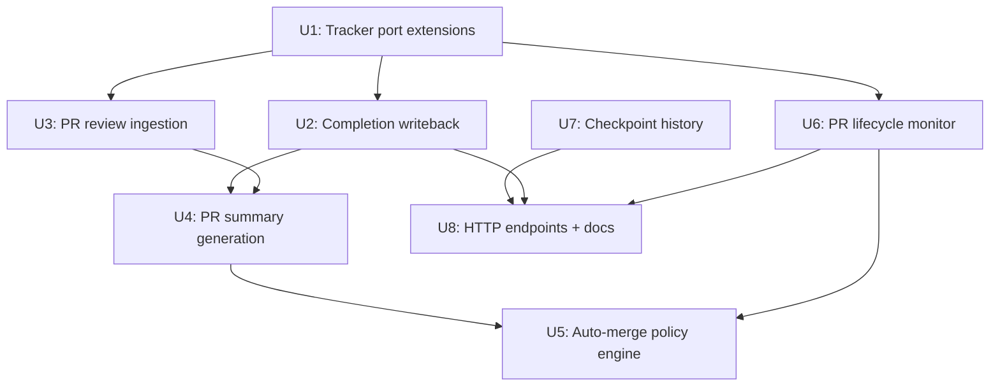

# feat: PR/CI Automation Pipeline Bundle

## Overview

Six coordinated features that close the loop between agent work completion and the full PR review-and-merge lifecycle. Today, agents complete work, create PRs, and walk away — Linear issues stay open, operators must manually check GitHub, review feedback goes unacted on, and workspaces linger indefinitely. This bundle adds completion writeback to the tracker, agent-authored PR summaries, review feedback ingestion for retries, an auto-merge policy engine, a PR lifecycle monitor, and a checkpoint history table. Together they turn Risoluto from a PR-creator into a self-documenting, feedback-aware, lifecycle-complete pipeline.

**Issues:** #275, #335, #333, #258, #307, #375

## Problem Frame

The gap is well-defined in the requirements doc: between "PR created" and "merged or abandoned" the system is dark. Operators can see agent activity in the dashboard, but they cannot see it in Linear, PRs carry no description of what actually changed, reviewer comments require manual relaying back to the agent, there is no automatic trust-qualified merge path, no persistent view of PR state across restarts, and no durable record of exactly where an attempt stood at each meaningful boundary. Each of these six features addresses one hole in that loop. (see origin: `docs/brainstorms/2026-04-03-pr-ci-automation-pipeline-bundle-requirements.md`)

## Requirements Trace

- **R1.** On success: post structured comment with turns, duration, input/output/total tokens, cost.
- **R2.** On failure (retries exhausted): post failure comment with error reason, attempt count, elapsed time.
- **R3.** On success: transition issue to configured terminal-success state (default: "Done").
- **R4.** Comment post and state transition are independent — failure of one must not block the other.
- **R5.** All writeback failures are logged at warn and must not affect orchestrator internal state.
- **R6.** After agent completion, run `git diff main...HEAD`, produce 3–8 bullet markdown summary.
- **R7.** Inject summary into PR body under a "Changes" heading.
- **R8.** Store summary in attempt record.
- **R9.** Clean up the summary file artifact — do not commit it.
- **R10.** Graceful degradation: PR created without summary section if generation fails.
- **R11.** On retry with existing open PR: fetch all review bodies and PR-level comments from GitHub.
- **R12.** Inject feedback into agent prompt under "Previous PR Review Feedback" section.
- **R13.** Force-push with `--force-with-lease` on re-run to update existing PR.
- **R14.** "Fresh" mode option closes the existing PR and starts from a new branch.
- **R15.** `auto_retry_on_review_feedback` setting (default: off); when enabled, detecting "changes requested" automatically queues a re-run.
- **R16.** Inline line-level review comments included alongside general PR-level comments.
- **R17.** `MergePolicy` type and `evaluateMergePolicy()` function gate auto-merge.
- **R18.** Policy evaluates: allowed path prefixes, max changed files, max diff lines, required labels, excluded labels.
- **R19.** Auto-merge disabled by default; operator opt-in via settings.
- **R20.** Auto-merge requested via GitHub API only when policy passes AND required CI checks pass.
- **R21.** Failed-policy PRs log specific blocking reason.
- **R22.** Policy loaded from `auto_merge` block in settings (not WORKFLOW.md).
- **R23.** `PrMonitorService` polls all open PRs every 60 seconds (configurable).
- **R24.** On state change (merged/closed): persist state, emit SSE event.
- **R25.** On PR merge, if configured, archive associated attempt + transition Linear issue.
- **R26.** Workspace cleanup triggered after PR merge when auto-archive enabled.
- **R27.** Environmental errors (no `gh` CLI, no auth, no git repo) logged as warnings, not fatal.
- **R28.** `GET /api/v1/prs` endpoint returns PR status overview.
- **R29.** `attempt_checkpoints` table: per-attempt ascending ordinals + nullable event cursor.
- **R30.** Checkpoints written at: attempt creation, turn/thread cursor advance, status transitions, terminal completion (including archive-on-merge).
- **R31.** No-op writes suppressed — identical cursor → no new row.
- **R32.** `GET /api/v1/attempts/:attempt_id/checkpoints` returns ordered history, 404 for unknown.
- **R33.** Existing attempt detail routes remain backward-compatible.

## Scope Boundaries

- No WORKFLOW.md config surface — all operator settings in the existing settings config (Zod schemas under `src/config/schemas/`).
- No rewind/fork/resume-from-checkpoint logic — #375 lands substrate only (append + list + GET).
- No webhook-based PR monitoring — polling only; webhook support is a future enhancement.
- No adaptive polling interval — 60s with operator override, not load-adaptive.
- No dashboard UI changes — all six features are backend/orchestrator. Existing dashboard surfaces are unaffected except for SSE events already exposed.
- #333 does not add a new "awaiting-review" state to the state machine unless #344 ships first.

## Context & Research

### Relevant Code and Patterns

- **`src/orchestrator/worker-outcome/completion-writeback.ts`** — already implements comment + state transition for success. The function `writeCompletionWriteback()` accepts `CompletionWritebackContext` (tracker + logger) and `CompletionWritebackInput` (issue, entry, attempt, stopSignal, pullRequestUrl). Currently the `tracker.createComment()` call at line 67 fires for ALL stop signals — both `"done"` and `"blocked"`. U2 must replace this unified call with a branched success/failure call (see U2 approach for details). The tracker `createComment()` and `updateIssueState()` already exist in `TrackerPort`.
- **`src/tracker/port.ts`** — `TrackerPort` interface already has `createComment()`, `updateIssueState()`, `resolveStateId()`, and `transitionIssue()`. No new methods needed for R1–R5; the interface is complete for tracker writeback.
- **`src/orchestrator/worker-outcome/stop-signal.ts`** — `handleStopSignal()` invokes `writeCompletionWriteback` after persisting stop signal. The `"blocked"` path already reaches writeback — the failure comment for R2 hooks into the `stopSignal === "blocked"` branch inside the replaced branched call.
- **`src/orchestrator/worker-outcome/terminal-paths.ts`** — `handleCancelledOrHardFailure()` handles exhausted retries. This is the second site for R2 failure comments — distinct from the "blocked" stop signal (which can still retry), this is the true retry-exhausted terminal path. `handleContinuationExhausted` in the same file is already async with await call sites — `handleCancelledOrHardFailure` must be made async to match.
- **`src/orchestrator/worker-outcome/retry-paths.ts`** — `handleContinuationExhausted()` handles max-continuations terminal failure. Also a target for R2 failure comment.
- **`src/orchestrator/runtime-types.ts`** — `RunningEntry` has `tokenUsage: TokenUsageSnapshot | null` and `startedAtMs: number`. No `turnsCompleted` field — it maps from `RunOutcome.turnCount` stored to `AttemptRecord.turnCount`. The success comment must read `turnCount` from the attempt record or pass it through `CompletionWritebackInput`.
- **`src/orchestrator/git-post-run.ts`** — `executeGitPostRun()` calls `commitAndPush()` then `createPullRequest()`. PR summary generation (R6) slots in between these steps: after commit, before PR creation, inject summary into PR body.
- **`src/git/github-pr-client.ts`** — `createPullRequest()` currently hardcodes a basic body (`Source issue: ${issue.url}`). R7 requires the PR body builder to accept an optional `summary?: string` parameter. `GitHubPrClient` already has `getPrStatus()` as a stub (returns `unknown`) and `addPrComment()` — the monitor and policy engine will extend this class. GraphQL method for auto-merge needs to be added.
- **`src/git/port.ts`** — `GitPostRunPort` defines `commitAndPush()`. `forcePushIfBranchExists` is a real gap in this interface — U3 must extend `commitAndPush()` to accept a `forcePushIfBranchExists?: boolean` option and use `--force-with-lease` when set.
- **`src/persistence/sqlite/schema.ts`** — Drizzle ORM schema. Existing tables: `attempts`, `attemptEvents`, `issueIndex`, `config`, `encryptedSecrets`, `promptTemplates`, `issueConfig`, `configHistory`, `webhookInbox`. New tables: `pullRequests` (#307) and `attemptCheckpoints` (#375).
- **`src/persistence/sqlite/attempt-store-sqlite.ts`** — `SqliteAttemptStore` implements `AttemptStorePort`. Pattern: synchronous reads (`getDb().select()...all()`), async writes (`getDb().insert()...run()`). New checkpoint and PR CRUD methods extend this class.
- **`src/core/attempt-store-port.ts`** — `AttemptStorePort` interface. New methods `appendCheckpoint()`, `listCheckpoints()`, `upsertPrRecord()`, `getOpenPrs()`, `getAllPrs()`, `updatePrRecord()` must be added here before implementation.
- **`src/core/types.ts`** — `AttemptRecord` is the primary domain type. Needs `summary?: string | null` field for R8. `AttemptCheckpointRecord` and `PrRecord` types must be added here. `TokenUsageSnapshot` is already defined. `AgentConfig` interface must be replaced with `export type AgentConfig = z.infer<typeof agentConfigSchema>` (see U1). `RetryEntry` type must be updated to carry `previousPrFeedback?: string | null` (see U3).
- **`src/config/schemas/`** — Agent config lives in `agentConfigSchema` (Zod). New `auto_merge` block → new Zod schema in `src/config/schemas/agent.ts` or a new `src/config/schemas/pr-policy.ts`. The `agentConfigSchema` is the natural home given the pattern. `auto_retry_on_review_feedback` also goes here.
- **`src/config/builders.ts`** — `deriveAgentConfig()` hardcodes the return object field-by-field. New schema fields have zero runtime effect until the builder maps them. Must be updated in U1 to add all three new fields to the return object using explicit field-by-field mapping.
- **`src/core/risoluto-events.ts`** — `RisolutoEventMap` defines typed event channels. New events: `"pr.merged"`, `"pr.closed"`, `"pr.review_requested"` extend this map.
- **`src/http/routes.ts`** — `registerHttpRoutes()` delegates to sub-registration functions. `HttpRouteDeps` is the injected dependencies object. New endpoints for `/api/v1/prs` and `/api/v1/attempts/:attempt_id/checkpoints` follow the pattern of `registerIssueRoutes()` and existing attempt handler.
- **`src/orchestrator/lifecycle.ts`** — Lifecycle reconciliation logic. The orchestrator's `start()` call (in `src/orchestrator/orchestrator.ts`) is the mount point for `PrMonitorService.start()`.
- **`src/orchestrator/worker-launcher.ts`** — `launchWorker()` calls `persistInitialAttempt()` — checkpoint write for attempt creation (R30) goes in this function. Turn cursor advances come from `buildOnEventHandler()` which calls `updateAttempt` on usage events.
- **`src/orchestrator/retry-manager.ts`** — `queueRetry()` interface must be updated to carry `previousPrFeedback` in retry metadata. File is in U3's scope.
- **`src/dispatch/types.ts`** — `DispatchRequest` needs `previousPrFeedback?: string | null` for remote dispatch mode to forward the feedback to the data plane. Also add `previousThreadId` if not already present.

### Confirmed Field Availability

- `RunningEntry.tokenUsage` → `TokenUsageSnapshot | null` with `.inputTokens`, `.outputTokens`, `.totalTokens`
- `AttemptRecord.turnCount` → persisted turn count (populated by `prepareWorkerOutcome`)
- `RunningEntry.startedAtMs` → epoch ms, compute duration as `Date.now() - entry.startedAtMs`
- No `.costUsd` field exists in the codebase — cost is computed at read time by `lookupModelPrice()` in `SqliteAttemptStore.sumCostUsd()`. R1 cost field in comment must call the same pricing utility or omit cost if pricing is unavailable.
- `RunOutcome.turnCount` flows into `AttemptRecord.turnCount` via `prepareWorkerOutcome()`; R2 failure comment can read from `entry.turnCount ?? outcome.turnCount`.

### Institutional Learnings

- Config always in Zod schemas under `src/config/schemas/` — never WORKFLOW.md (removed).
- Worker outcome handling splits into discrete files under `src/orchestrator/worker-outcome/` — each concern gets its own file.
- Non-fatal errors in orchestrator outcome handlers are always wrapped in try/catch with `ctx.deps.logger.warn()` and `toErrorString()`.
- `AttemptStorePort` is the interface; `SqliteAttemptStore` is the implementation. Both must be updated together.
- SSE events flow through the existing event bus (`TypedEventBus<RisolutoEventMap>`), not direct SSE writes.
- Drizzle ORM conventions: `sqliteTable()`, snake_case column names, camelCase TypeScript names.
- `PrMonitorService.updateAttempt()` on merge must ONLY update the DB record. It must NOT touch orchestrator runtime state (`runningByIssue` map). That state is managed exclusively by the orchestrator's `handleStopSignal`/`handleCancelledOrHardFailure` paths. Document this constraint at the PR monitor implementation site.

### External References

- GitHub REST API: `GET /repos/{owner}/{repo}/pulls/{pull_number}/reviews` for review bodies.
- GitHub REST API: `GET /repos/{owner}/{repo}/pulls/{pull_number}/comments` for line-level comments.
- GitHub GraphQL API: `enablePullRequestAutoMerge` mutation (requires `pull_requests: write` scope and the repo must have merge queues or auto-merge enabled at the repo level).
- Mog prior art (issue #335, #333): summary prompt pattern, re-mog feedback injection, force-push logic.
- Vibe Kanban prior art (issue #307): `PrMonitorService` polling pattern, auto-archive logic.
- ThePopeBot prior art (issue #258): `ALLOWED_PATHS` path-prefix gating logic.
- Fabro prior art (issue #375): append-only checkpoint table with ordinal and latest-checkpoint split.
- `codex-session-runner.ts` pattern (`.claude/skills/gstack/test/helpers/codex-session-runner.ts`): established project infrastructure for spawning `codex exec --json -s read-only`, piping stdout, collecting JSONL lines, and extracting final assistant text from `item.completed` events where `item.type === 'agent_message'`.

## Key Technical Decisions

- **Failure comments via branched call in `writeCompletionWriteback`, not additive**: The existing unified `tracker.createComment()` call fires for ALL stop signals. U2 replaces it with a branched call: `stopSignal === "done"` → success comment; all failure signals → failure comment. This prevents double-commenting on blocked runs. The branched approach is applied in `writeCompletionWriteback` itself; `handleCancelledOrHardFailure()` and `handleContinuationExhausted()` each call a new `writeFailureWriteback()` helper for the retry-exhausted terminal path.

- **`handleCancelledOrHardFailure` made async**: `handleContinuationExhausted` in the same file is already async with await call sites. `handleCancelledOrHardFailure` must be made async to match — update the function signature and its 2 call sites.

- **Turns field sourced from attempt record, not runtime entry**: `RunningEntry` tracks `tokenUsage` but not `turnCount` directly. `writeCompletionWriteback` must either accept `turnCount` explicitly in `CompletionWritebackInput` or read it from the persisted attempt record via `attemptStore.getAttempt()`. The cleaner path: add `turnCount: number | null` to `CompletionWritebackInput` — passed from `handleStopSignal` which has `entry` (and the just-updated attempt record has the count via `prepareWorkerOutcome`).

- **Cost computation via existing model pricer**: `lookupModelPrice()` in `src/core/model-pricing.ts` computes cost from model name + token counts. R1 comment includes cost only when the model price is known; omit silently when not.

- **PR summary via `codex exec --json` subprocess**: Summary generation for R6 uses `codex exec {prompt} --json -s read-only` as a child process with piped stdout, following the JSONL pattern in `.claude/skills/gstack/test/helpers/codex-session-runner.ts`. Collect JSONL lines from stdout; extract final assistant text from `item.completed` events where `item.type === 'agent_message'`. No `-o` flag (avoids output mixing). No `apiKey` parameter. No Claude SDK import. The function signature is `generatePrSummary(workspaceDir: string, defaultBranch: string): Promise<string | null>`. This is a separate agent invocation capped at 1 turn — it does not couple to the main worker run lifecycle.

- **Summary stored in `AttemptRecord.summary` column**: Adds `summary: string | null` to `AttemptRecord` type and `attempts` table. The attempt record is the right place — it's already the durable representation of a run's outputs. Stored after generation, before PR creation.

- **Schema migration uses try/catch, not `IF NOT EXISTS`**: `ALTER TABLE ... ADD COLUMN IF NOT EXISTS` is NOT valid SQLite syntax — it throws `near "EXISTS": syntax error` on any SQLite version. The correct idempotent pattern is a v4 migration block using try/catch on the `"already has a column named summary"` error (see U1 approach for the exact code block). Migration infrastructure is otherwise absent from `database.ts` — only a version-row seed exists. Audit all columns currently in `CREATE_TABLES_SQL` that postdate the v1 schema before implementing.

- **PR review feedback fetched in `executeGitPostRun` / force-push path**: R11–R16 require knowing whether a PR already exists for the branch before committing. The right hook is in `git-post-run.ts` (or the new `src/git/pr-review-ingester.ts`) — check for existing PR, fetch reviews, inject into prompt context. The `previousPrFeedback` flows back to the caller and into the agent prompt via a mechanism parallel to how `previousThreadId` is passed to `launchWorker`.

- **`auto_retry_on_review_feedback` and `auto_merge` live in `agentConfigSchema`**: The Zod agent config schema already holds `successState`, `stallTimeoutMs`, etc. New optional fields fit naturally. Alternative: a new `prPolicyConfigSchema`. Decision: keep in `agentConfigSchema` for `auto_retry_on_review_feedback`; create a new `mergePolicyConfigSchema` (nested object) for the richer `auto_merge` block given its multiple sub-fields. Both merge into `ServiceConfig.agent`.

- **`PrMonitorService` started in `orchestrator.ts` start path**: The orchestrator already holds all the necessary deps (attempt store, tracker, logger, event bus). `PrMonitorService` receives a slice of these deps and a `getConfig()` accessor. It runs a `setInterval` loop and exposes a `stop()` method for graceful shutdown. The `Orchestrator.start()` method mounts it; `Orchestrator.stop()` calls `stop()`.

- **Archive-on-merge trigger is config-level only**: The trigger condition for archive-on-merge is `config.agent.autoMerge.enabled === true`. There is no per-issue `auto_archive` override — a per-issue mechanism has no schema definition in this bundle and is out of scope. If per-issue override is desired, add `autoArchiveOnMerge` to `IssueConfig` in a separate issue.

- **`pull_requests` table is NOT a FK-constrained extension of `attempts`**: A PR can exist for an attempt that is already archived or unknown. The `pull_requests` table uses `attempt_id` as a loose text reference, not a foreign key, consistent with how `attempt_events.attempt_id` references `attempts.attempt_id` (which does use FK). PRs are identified by `(owner, repo, pull_number)` as the stable key.

- **`event_cursor` in `attempt_checkpoints` is a loose integer high-water mark**: The `attempt_events` table uses auto-increment integer PK (`id`). The checkpoint `event_cursor` stores the highest `attempt_events.id` value at the time of the checkpoint — a numeric high-water mark, not a FK. This matches the Fabro pattern and avoids cascade-delete complexity.

- **No-op dedup for checkpoints by cursor equality**: Before inserting a checkpoint, read the latest checkpoint for the attempt. If `event_cursor` and `status` are identical, skip the write. This is a synchronous read before the insert — acceptable given the low frequency of checkpoint writes.

- **`AgentConfig` type derived from Zod schema**: Replace `export interface AgentConfig` with `export type AgentConfig = z.infer<typeof agentConfigSchema>` in `src/core/types.ts`. The `agentConfigSchema` already has `preflightCommands` that the old `AgentConfig` interface lacks — drift is confirmed. The type fix alone does not populate runtime values: `deriveAgentConfig()` in `src/config/builders.ts` must also be updated with explicit field-by-field mappings for all three new fields.

- **`PrStatusResponse` type guard in U3**: `getPrStatus()` and all new `GitHubPrClient` methods return `Promise<unknown>`. U3 must define: `PrStatusResponse` interface (`state: "open"|"closed"`, `merged: boolean`, `number: number`, `html_url: string`, `merge_commit_sha: string|null`) and `isPrStatusResponse()` type guard. U6's `poll()` must use the guard before accessing `.state` and `.merged`.

## Open Questions

### Resolved During Planning

- **Are `createComment()` and `updateIssueState()` in `TrackerPort`?** Yes — confirmed in `src/tracker/port.ts`. No interface change needed for #275.
- **What fields are available in `RunningEntry` for the success comment?** `tokenUsage` (input/output/total), `startedAtMs` (for duration). `turnCount` must be passed explicitly. Cost computed via `lookupModelPrice()`.
- **Where does `PrMonitorService` start?** In `Orchestrator.start()` alongside the existing polling loop, receiving a shared deps slice.
- **Is `event_cursor` a FK or loose high-water mark?** Loose integer high-water mark — no FK constraint.
- **Does summary generation use the main agent runner?** No — a separate lightweight invocation: `git diff` via `child_process.execFile()`, summary via `codex exec --json -s read-only` subprocess with JSONL parsing (no Claude SDK).
- **Where does `auto_merge` config live?** New nested `mergePolicyConfigSchema` inside `agentConfigSchema`. `auto_retry_on_review_feedback` is a flat boolean in the same schema.
- **Is `handleCancelledOrHardFailure` sync or async?** Must be async — `handleContinuationExhausted` in the same file is already async, and the completion writeback path requires awaiting tracker calls.
- **What is the correct SQLite migration pattern for adding a column?** try/catch on `ALTER TABLE attempts ADD COLUMN summary TEXT`, suppress `"already has a column named summary"` error. `IF NOT EXISTS` is NOT valid SQLite syntax and must not be used.
- **Is `auto_archive` a per-issue or config-level flag?** Config-level only (`config.agent.autoMerge.enabled`). No per-issue override exists in this bundle.
- **Does `PrMonitorService` manage orchestrator runtime state on merge?** No — it only updates the DB record. The `runningByIssue` map is managed exclusively by the orchestrator's `handleStopSignal`/`handleCancelledOrHardFailure` paths.

### Deferred to Implementation

- **Exact auto-merge GraphQL mutation availability**: The GitHub `enablePullRequestAutoMerge` mutation is available on GitHub.com repositories with auto-merge enabled at the repository level. If the repo doesn't have it enabled, the mutation returns an error — the implementation should treat this as a non-fatal warning and log it.
- **Force-push `--force-with-lease` failure semantics**: If the remote branch advanced between fetch and force-push, `--force-with-lease` fails. Recommended: abort with a user-visible warning; do not retry with a fresh fetch.
- **Migration audit scope**: Before implementing the `summary` column migration, audit the existing `attempts` table columns against the v1 schema (which was `attempt_id, issue_id, issue_identifier, title, status, started_at, model, thread_id, turn_id, turn_count, error_code, error_message, input_tokens, output_tokens, total_tokens`). Any column in the current `CREATE_TABLES_SQL` not in v1 requires an `ALTER TABLE` migration guard for existing databases. The `summary` column is a known gap; other post-v1 columns may also be gaps.
- **Summary generation error handling granularity**: Whether to log summary failures at `info` vs `warn` level is a judgment call at implementation time; treat consistently with other non-fatal post-run steps.
- **PR monitor rate limit impact at high concurrency**: At `maxConcurrentAgents: 10`, 60s polling consumes ~600 GitHub API calls/hour for PR monitoring alone. At higher concurrency (50 agents), this approaches ~3000 calls/hour. Operators configuring high concurrency should monitor GitHub API rate limit consumption and increase `prMonitorIntervalMs` accordingly.

## High-Level Technical Design

> *Directional guidance for review, not implementation specification.*

### Lifecycle Integration Points

```
Agent completes work (stop-signal "done")
 │
 ├─ [U2] writeCompletionWriteback()        ← branched success/failure call by stop signal
 │
 ├─ [U3] fetchPrReviewFeedback()           ← on retry: inject "Previous PR Review
 │                                           Feedback" into next prompt
 │
 ├─ [U4] generatePrSummary()              ← git diff → codex exec --json → bullets → store
 │         │
 │         └─ PR body includes "Changes" heading
 │
 ├─ executeGitPostRun()  (existing)
 │         │
 │         └─ [U5] evaluateMergePolicy()  ← check policy → requestAutoMerge()
 │
 │  [U6] PrMonitorService (background, 60s poll)
 │         │
 │         ├─ detect merge/close → persist + emit SSE
 │         └─ on merge: archive attempt + trigger workspace cleanup
 │                      (DB update only — does NOT touch orchestrator runningByIssue)
 │
 └─ [U7] Checkpoint writes at each boundary
```

### Module Dependency Graph



> Note: U7 does NOT depend on U6. U6 calls `appendCheckpoint()` from U7. U7 provides
> schema/port/store; U6 consumes it. The original plan incorrectly listed U6 as a U7
> dependency — corrected here.

## Implementation Units

- [ ] **Unit 1: Config schema extensions for PR policy settings**

**Goal:** Add `auto_retry_on_review_feedback`, `pr_monitor_interval_ms`, and the nested `auto_merge` block to the agent config schema. Replace `AgentConfig` interface with a type derived from `agentConfigSchema`. Add `summary` field to `AttemptRecord` and the SQLite `attempts` table. Add `PrRecord`, `AttemptCheckpointRecord`, and `RetryEntry` (with `previousPrFeedback`) type updates in `src/core/types.ts`. Apply the v4 schema migration.

**Requirements:** R8, R15, R19, R22, R23

**Dependencies:** None

**Files:**
- Modify: `src/config/schemas/agent.ts`
- Create: `src/config/schemas/pr-policy.ts` (merge policy Zod schema)
- Modify: `src/config/schemas/index.ts` (export new schema)
- Modify: `src/core/types.ts` (replace `AgentConfig` interface with `z.infer<>` type; add `summary?: string | null` to `AttemptRecord`; add `PrRecord` type; add `AttemptCheckpointRecord` type; add `MergePolicy` interface stub; update `RetryEntry` to carry `previousPrFeedback?: string | null`)
- Modify: `src/config/builders.ts` (add `autoRetryOnReviewFeedback`, `prMonitorIntervalMs`, `autoMerge` to `deriveAgentConfig()` return object)
- Modify: `src/persistence/sqlite/schema.ts` (add `summary` column to `attempts` table)
- Modify: `src/persistence/sqlite/mappers.ts` (map `summary` column)
- Modify: `src/persistence/sqlite/database.ts` (add v4 migration block using try/catch)
- Test: `tests/config/pr-policy-schema.test.ts`

**Approach:**
- `mergePolicyConfigSchema` is a Zod object with: `enabled` (boolean, default false), `allowedPaths` (string array, default []), `maxChangedFiles` (number nullable, default null), `maxDiffLines` (number nullable, default null), `requireLabels` (string array, default []), `excludeLabels` (string array, default []).
- `agentConfigSchema` gains two new fields: `autoRetryOnReviewFeedback: boolean` (default false), `prMonitorIntervalMs: number` (default 60000), and `autoMerge: mergePolicyConfigSchema`.
- Replace `export interface AgentConfig { ... }` with `export type AgentConfig = z.infer<typeof agentConfigSchema>` in `src/core/types.ts`. The `agentConfigSchema` already has `preflightCommands` that the old interface lacks — drift is confirmed and the type change closes it.
- Update `deriveAgentConfig()` in `src/config/builders.ts` with explicit field-by-field mappings following the existing `asBoolean`/`asNumber`/`asRecord` pattern:
  ```typescript
  autoRetryOnReviewFeedback: asBoolean(agent.auto_retry_on_review_feedback, false),
  prMonitorIntervalMs: asNumber(agent.pr_monitor_interval_ms, 60000),
  autoMerge: deriveMergePolicyConfig(asRecord(agent.auto_merge)),
  ```
  Do NOT replace the builder with `agentConfigSchema.parse()` — that bypasses secret resolution and the `asRecord`/`asNumber` tolerance layer.
- `AttemptRecord` gains `summary?: string | null`. The Drizzle schema adds `summary: text("summary")` (nullable). Mapper adds the mapping in both directions.
- `PrRecord` type: `{ prId: string; attemptId: string; issueId: string; owner: string; repo: string; pullNumber: number; url: string; status: "open" | "merged" | "closed"; mergedAt: string | null; mergeCommitSha: string | null; createdAt: string; updatedAt: string }`.
- `AttemptCheckpointRecord` type: `{ checkpointId: number; attemptId: string; ordinal: number; trigger: CheckpointTrigger; eventCursor: number | null; status: AttemptRecord["status"]; threadId: string | null; turnId: string | null; turnCount: number; tokenUsage: TokenUsageSnapshot | null; metadata: Record<string, unknown> | null; createdAt: string }`.
- `CheckpointTrigger` union: `"attempt_created" | "cursor_advanced" | "status_transition" | "terminal_completion" | "pr_merged"`.
- Schema migration: add a v4 migration block in `openDatabase()`:
  ```typescript
  if (!versionRow || versionRow.version < 4) {
    try { sqlite.exec("ALTER TABLE attempts ADD COLUMN summary TEXT"); }
    catch (err: unknown) {
      const msg = err instanceof Error ? err.message : String(err);
      if (!msg.includes("already has a column named summary")) throw err;
    }
    sqlite.prepare("INSERT OR REPLACE INTO schema_version (version, applied_at) VALUES (?, ?)")
      .run(4, new Date().toISOString());
  }
  ```
  Do NOT use `IF NOT EXISTS` — it is not valid SQLite syntax. Before finalizing the migration, audit columns in `CREATE_TABLES_SQL` against the v1 baseline schema (`attempt_id, issue_id, issue_identifier, title, status, started_at, model, thread_id, turn_id, turn_count, error_code, error_message, input_tokens, output_tokens, total_tokens`) to identify any other post-v1 columns missing a migration guard.
- Add a migration idempotence test: run the v4 migration twice on the same DB and confirm no error on the second run.

**Patterns to follow:**
- `src/config/schemas/workspace.ts` — schema structure pattern
- `src/core/types.ts` — existing interface addition patterns
- `src/config/builders.ts` — existing `asBoolean`/`asNumber`/`asRecord` field-by-field mapping pattern

**Test scenarios:**
- Happy path: `mergePolicyConfigSchema` parses full object with all fields set.
- Edge case: `mergePolicyConfigSchema` accepts missing optional fields and applies defaults.
- Edge case: `enabled: false` in the schema still parses without error.
- Happy path: `AttemptRecord` with `summary: "- bullet"` round-trips through Drizzle mapper.
- Edge case: `summary: null` maps to null without error.
- Happy path: `agentConfigSchema.parse({})` includes `autoMerge.enabled === false`, `autoRetryOnReviewFeedback === false`, `prMonitorIntervalMs === 60000`.
- Migration idempotence: v4 migration runs twice on same DB → no error on second run.
- Migration fresh-install: fresh DB has no `summary` column before migration, has it after.

**Verification:**
- `pnpm run build` passes with no new TypeScript errors.
- `agentConfigSchema.parse({})` includes `autoMerge.enabled === false` in the output.
- `AgentConfig` type now derived from schema — TypeScript error if `deriveAgentConfig()` is missing a new field.
- `AttemptRecord` type now carries `summary` field without breaking existing callers.

---

- [ ] **Unit 2: Completion writeback — success turns/cost + failure comment**

**Goal:** Extend `writeCompletionWriteback` to include turns and computed cost in the success comment (R1), and add a failure comment path for `"blocked"` stop signal (R2) and terminal failure paths (R2). Issue state transition on success remains, failure does not transition state (R3, R4). Replace the unified comment call with a branched success/failure call to prevent double-commenting.

**Requirements:** R1, R2, R3, R4, R5

**Dependencies:** Unit 1 (for `turnCount` field availability in input type)

**Files:**
- Modify: `src/orchestrator/worker-outcome/completion-writeback.ts`
- Modify: `src/orchestrator/worker-outcome/terminal-paths.ts` (`handleCancelledOrHardFailure` → made async; `handleContinuationExhausted` in retry-paths)
- Modify: `src/orchestrator/worker-outcome/retry-paths.ts` (`handleContinuationExhausted`)
- Modify: `src/orchestrator/worker-outcome/stop-signal.ts` (pass `turnCount` into input; update `handleCancelledOrHardFailure` call sites for async)
- Test: `tests/orchestrator/worker-outcome-completion-writeback.test.ts` (extend existing)

**Approach:**
- Add `turnCount: number | null` to `CompletionWritebackInput`.
- The existing `tracker.createComment()` call fires for ALL stop signals. Replace it with a branched call:
  - When `stopSignal === "done"` (success): construct the success comment body and call `tracker.createComment()` + `tracker.updateIssueState()`.
  - When `stopSignal !== "done"` (failure/blocked): construct the failure comment body and call `tracker.createComment()` only — do NOT call `updateIssueState()`.
  This prevents two comments being posted on blocked runs when `handleCancelledOrHardFailure` also fires.
- In the success branch: extend the comment lines array to include `- **Turns:** N` and `- **Cost:** $X.XXXX` (using `lookupModelPrice()` from `src/core/model-pricing.ts`). Emit cost line only when the model price is known (non-null result from `lookupModelPrice()`).
- In the failure branch: construct a failure comment body: `"**Risoluto agent blocked** ✗\n- **Reason:** ${errorMessage or 'retries exhausted'}\n- **Attempts:** N\n- **Duration:** Xs"`. Call `tracker.createComment()` wrapped in try/catch (R5).
- `handleCancelledOrHardFailure()` in `terminal-paths.ts`: make the function `async` (2 call sites in `stop-signal.ts` must be updated to `await`). After persisting failure, call a new `writeFailureWriteback()` helper. Accept `tracker`, `issue`, `attempt`, `errorMessage`, `durationMs` as parameters. Wrap in try/catch.
- `handleContinuationExhausted()` in `retry-paths.ts`: same `writeFailureWriteback()` call — already async, just add the call.
- The `handleStopSignal()` caller already reads `entry.tokenUsage` — pass `entry.turnCount ?? null` (sourced from the persisted record or from the outcome) into the updated input.

**Patterns to follow:**
- Existing `writeCompletionWriteback` try/catch structure
- `toErrorString()` for error serialization
- `tests/orchestrator/worker-outcome-completion-writeback.test.ts` mock pattern (vi.fn())

**Test scenarios:**
- Happy path (success): comment body includes turns, duration, tokens, cost when all fields present.
- Happy path (success): state transition called with resolved state ID.
- Edge case (success): cost line omitted when model not in price list.
- Edge case (success): turns line present even when `tokenUsage` is null.
- Happy path (failure/blocked): failure comment posted with error reason, attempt count, duration.
- Error path (failure): state transition NOT called in blocked/failure branch.
- Error path: `tracker.createComment()` throws → logged at warn, function returns without throwing (R5).
- Error path: `tracker.updateIssueState()` throws → failure comment still attempted (R4).
- No double-comment: `stopSignal === "blocked"` results in exactly ONE comment posted (the failure comment from the branched call, not a second from `handleCancelledOrHardFailure`).
- Integration: `handleStopSignal` with `stopSignal === "blocked"` results in failure comment posted.

**Verification:**
- Existing 9.1K test file passes with all new cases added.
- A manual staging run shows the Linear issue comment includes turns and cost.

---

- [ ] **Unit 3: PR review feedback ingestion**

**Goal:** Create `src/git/pr-review-ingester.ts` to fetch review bodies, PR-level comments, and line-level comments for an existing open PR. Define `PrStatusResponse` interface and `isPrStatusResponse()` type guard. Integrate into the retry path so the fetched feedback is injected into the agent prompt on re-run. Extend `GitPostRunPort.commitAndPush()` for force-push support.

**Requirements:** R11, R12, R13, R14, R15, R16

**Dependencies:** Unit 1 (for `autoRetryOnReviewFeedback` setting shape, `RetryEntry.previousPrFeedback`)

**Files:**
- Create: `src/git/pr-review-ingester.ts`
- Modify: `src/git/github-pr-client.ts` (add `getPrReviews()`, `getPrLineComments()`, `closePr()`, `getPrStatus()` → returns typed `PrStatusResponse`)
- Modify: `src/git/port.ts` (extend `GitPostRunPort.commitAndPush()` to accept `forcePushIfBranchExists?: boolean`)
- Modify: `src/core/types.ts` (update `RetryEntry` to carry `previousPrFeedback?: string | null`)
- Modify: `src/orchestrator/retry-manager.ts` (update `queueRetry()` to accept and forward `previousPrFeedback`)
- Modify: `src/dispatch/types.ts` (add `previousPrFeedback?: string | null` to `DispatchRequest`)
- Modify: `src/orchestrator/worker-outcome/stop-signal.ts` (pass review feedback to retry queue on re-run)
- Modify: `src/orchestrator/worker-launcher.ts` (accept and inject `previousPrFeedback` into prompt, similar to `previousThreadId`)
- Modify: `src/agent-runner/contracts.ts` (add `previousPrFeedback?: string | null` to `RunAttemptOptions`)
- Modify: `src/orchestrator/context.ts` (add `previousPrFeedback?: string | null` to retry metadata)
- Test: `tests/git/pr-review-ingester.test.ts`

**Approach:**
- Define in `src/git/github-pr-client.ts`:
  ```typescript
  interface PrStatusResponse {
    state: "open" | "closed";
    merged: boolean;
    number: number;
    html_url: string;
    merge_commit_sha: string | null;
  }
  function isPrStatusResponse(value: unknown): value is PrStatusResponse { ... }
  ```
  Update `getPrStatus()` to return `Promise<PrStatusResponse>` and validate with `isPrStatusResponse()`. All callers (including U6's `poll()`) must use the type guard before accessing `.state` or `.merged`.
- `fetchPrReviewFeedback(client, owner, repo, pullNumber, tokenEnvName)`: calls `GET /pulls/{number}/reviews` and `GET /pulls/{number}/comments` (line-level). Filters reviews to those with non-empty body. Formats as: `**@author** (STATE):\nbody`. Line comments include file path and line number as context: `**@author** on \`file:line\`:\nbody`. Returns concatenated markdown string or `null` if empty.
- A "fresh" mode flag is passed in from the operator (via issue label or settings override); when true, calls `closePr()` before returning null feedback (no feedback injection, new branch on next run).
- Force-push with `--force-with-lease` happens in `git-post-run.ts` / `executeGitPostRun` when the branch already exists remotely. Extend `GitPostRunPort.commitAndPush()` to accept `forcePushIfBranchExists?: boolean`; when set, use `git push --force-with-lease`. If `--force-with-lease` fails (remote branch advanced), abort the re-run with a user-visible warning — do not retry with a fresh fetch.
- On retry: `queueRetry()` accepts a `previousPrFeedback` field in its metadata; `launchWorker()` reads it and passes it to the agent runner prompt builder.
- The prompt builder prepends a "Previous PR Review Feedback" section when `previousPrFeedback` is non-null (before the issue description, after the "Re-attempt Notice").
- R15 auto-retry: when `autoRetryOnReviewFeedback === true` and a "CHANGES_REQUESTED" review is detected, the PR monitor (Unit 6) or a post-completion check calls `queueRetry()` with the feedback. This does NOT modify the state machine.

**Patterns to follow:**
- `GitHubPrClient.githubRequest()` private method for REST calls
- `src/orchestrator/worker-outcome/retry-paths.ts` — `queueRetryWithLog()` for retry queuing with metadata
- `previousThreadId` as analogy for `previousPrFeedback` injection into the run

**Test scenarios:**
- Happy path: `fetchPrReviewFeedback` returns formatted markdown from mocked review + line-comment responses.
- Edge case: no reviews → returns `null`.
- Edge case: reviews with empty bodies are filtered out.
- Happy path: line-level comments include file path in output.
- Error path: GitHub API returns 404 → returns `null`, does not throw.
- Error path: GitHub token missing → returns `null`, logs warn.
- Integration: agent prompt contains "Previous PR Review Feedback" section when feedback is non-null.
- Type guard: `isPrStatusResponse()` returns true for valid shape, false for `unknown` / missing fields.

**Verification:**
- `fetchPrReviewFeedback` unit tests pass.
- A retry run with an open PR fetches review comments and injects them into the agent prompt (verified via logged prompt content).

---

- [ ] **Unit 4: PR summary generation**

**Goal:** After agent completion and before PR creation, run a lightweight summary generation step that produces a 3–8 bullet markdown summary of all changes. Store the summary in the attempt record and inject it into the PR body. Uses `codex exec --json` subprocess pattern — no Claude SDK, no `apiKey` parameter.

**Requirements:** R6, R7, R8, R9, R10

**Dependencies:** Unit 1 (for `summary` column in `AttemptRecord`), Unit 3 (understanding of git-post-run flow)

**Files:**
- Create: `src/git/pr-summary-generator.ts`
- Modify: `src/orchestrator/git-post-run.ts` (invoke summary generator between commit and PR creation)
- Modify: `src/git/github-pr-client.ts` (accept `summary?: string` in `createPullRequest()`, inject under "Changes" heading)
- Modify: `src/core/attempt-store-port.ts` (ensure `updateAttempt` supports `summary` patch)
- Modify: `src/orchestrator/worker-outcome/stop-signal.ts` (persist summary to attempt record after git-post-run)
- Test: `tests/git/pr-summary-generator.test.ts`

**Approach:**
- `generatePrSummary(workspaceDir: string, defaultBranch: string): Promise<string | null>`:
  - Run `git diff {defaultBranch}...HEAD` via `child_process.execFile()` to get the diff.
  - Spawn `codex exec {prompt} --json -s read-only` as a child process with piped stdout, following the JSONL pattern in `.claude/skills/gstack/test/helpers/codex-session-runner.ts`.
  - Collect JSONL lines from stdout. Extract final assistant text from `item.completed` events where `item.type === 'agent_message'`. Do NOT use the `-o` flag.
  - The prompt instructs: produce a flat bullet list, 3–8 bullets, no intro text, no headings, no sub-sections, no closing remarks.
  - Returns the assistant message text as the summary string, or `null` on any error (empty diff, subprocess failure, no `agent_message` in output).
  - Cap diff input at first 100KB before passing to the prompt.
  - No `apiKey` parameter. No Claude SDK import. No file artifact written to disk (R9 is satisfied naturally).
- In `executeGitPostRun()`: after `commitAndPush()` succeeds and before `createPullRequest()`, call `generatePrSummary(workspaceDir, defaultBranch)` wrapped in try/catch. Pass `summary` to `createPullRequest()`. Store `summary` in the attempt record via `attemptStore.updateAttempt()`.
- In `createPullRequest()`: build the PR body as follows:
  ```
  Source issue: ${issue.url}

  ## Changes

  ${summary}
  ```
  When `summary` is null or undefined, the body is just `Source issue: ${issue.url}` (omit the "## Changes" section entirely — R10).
- `generatePrSummary()` failure is non-fatal — log at warn, return null, PR creation proceeds (R10).
- Test mocks: mock the `codex exec` subprocess by capturing the spawned args and returning fixture JSONL lines. Do not mock a Claude SDK response.

**Patterns to follow:**
- `.claude/skills/gstack/test/helpers/codex-session-runner.ts` — JSONL parsing pattern (`item.completed` events, `item.type === 'agent_message'`, `item.text`)
- `src/orchestrator/git-post-run.ts` — existing post-run pipeline pattern
- Non-fatal try/catch pattern from completion-writeback

**Test scenarios:**
- Happy path: `generatePrSummary` returns 3–8 bullet string from mocked JSONL output containing `agent_message` event.
- Edge case: empty diff → returns `null` (no meaningful change to summarize).
- Error path: `git diff` subprocess fails → returns `null`, does not throw.
- Error path: `codex exec` subprocess exits non-zero → returns `null`, does not throw.
- Error path: JSONL output contains no `agent_message` events → returns `null`, does not throw.
- Happy path: PR body includes `"## Changes\n\n${summary}"` section when summary is present.
- Edge case: PR body omits "Changes" section when summary is null (R10).
- Happy path: attempt record updated with `summary` field after successful generation.
- Integration: `executeGitPostRun` with mocked summary generator produces PR with summary body.

**Verification:**
- New test file passes.
- `executeGitPostRun` integration path produces PR body with "Changes" heading when summary generation mock returns content.
- `AttemptRecord.summary` is populated in the SQLite row after a run that generated a summary.
- No `apiKey`, `ANTHROPIC_API_KEY`, or `@anthropic-ai/sdk` references in `pr-summary-generator.ts`.

---

- [ ] **Unit 5: Auto-merge policy engine**

**Goal:** Create `src/git/merge-policy.ts` with `MergePolicy` type and `evaluateMergePolicy()` function. Extend `GitHubPrClient` with a `requestAutoMerge()` method using the GitHub GraphQL mutation. Hook evaluation and request into `executeGitPostRun()`.

**Requirements:** R17, R18, R19, R20, R21, R22

**Dependencies:** Unit 1 (for `MergePolicy` type and config schema), Unit 4 (PR must exist before auto-merge can be requested)

**Files:**
- Create: `src/git/merge-policy.ts`
- Modify: `src/git/github-pr-client.ts` (add `requestAutoMerge()` GraphQL method, add `getPrChecksStatus()` for CI check gate)
- Modify: `src/orchestrator/git-post-run.ts` (call `evaluateMergePolicy()` + `requestAutoMerge()` after PR creation)
- Test: `tests/git/merge-policy.test.ts`

**Approach:**
- `evaluateMergePolicy(policy, changedFiles, diffStats, labels)` is a pure function. Checks in order: (1) `enabled` flag, (2) `excludeLabels` — if any present, block, (3) `requireLabels` — if any missing, block, (4) `maxChangedFiles` — count check, (5) `maxDiffLines` — additions + deletions check, (6) `allowedPaths` — if non-empty, all files must match at least one prefix. Returns `{ allowed: boolean; reason: string | null; blockedFiles: string[] }`.
- `GitHubPrClient.requestAutoMerge(owner, repo, pullNumber, mergeMethod, tokenEnvName)`: calls the GitHub GraphQL `enablePullRequestAutoMerge` mutation. Treats 422/mutation-error as non-fatal (repo may not support auto-merge) — logs warn, returns `{ success: false, reason }`.
- `GitHubPrClient.getPrChecksStatus(owner, repo, pullNumber, tokenEnvName)`: calls `GET /repos/{owner}/{repo}/commits/{ref}/check-runs` (or `GET /repos/{owner}/{repo}/statuses/{sha}`) to determine if all required checks pass. Returns `"passing" | "failing" | "pending" | "unknown"`.
- In `executeGitPostRun()`: after PR created and URL known, load config, call `evaluateMergePolicy()` with the diff stats and issue labels. If `allowed`, call `getPrChecksStatus()` — if passing, call `requestAutoMerge()`. If checks are pending, do not request auto-merge now (the PR monitor in Unit 6 can re-evaluate on next poll if `auto_merge.enabled`). Log the blocking reason at info level when policy fails (R21).
- Diff stats for policy evaluation: run `git diff --shortstat {defaultBranch}...HEAD` in the workspace — parse additions/deletions. Changed files: `git diff --name-only {defaultBranch}...HEAD`.

**Patterns to follow:**
- `evaluateMergePolicy` as a pure function, no I/O — easy to test
- `GitHubApiError` pattern for error wrapping
- Non-fatal try/catch wrapper in `executeGitPostRun()`

**Test scenarios:**
- Happy path: all files in allowed paths, labels OK, size OK → `allowed: true`.
- Edge case: `enabled: false` → `allowed: false`, reason is "auto_merge disabled".
- Edge case: `allowedPaths: []` (empty) → no path restriction, all files allowed.
- Error path: excluded label present → `allowed: false`, reason includes label name.
- Error path: required label missing → `allowed: false`.
- Error path: changed file count exceeds `maxChangedFiles` → `allowed: false`, reason includes count.
- Error path: diff lines exceed `maxDiffLines` → `allowed: false`.
- Error path: one file outside allowed paths → `allowed: false`, `blockedFiles` lists it.
- Integration: `executeGitPostRun` with policy enabled and passing calls `requestAutoMerge()`.
- Integration: `executeGitPostRun` with policy enabled but checks pending does NOT call `requestAutoMerge()`.

**Verification:**
- All policy test cases pass.
- `requestAutoMerge()` method on `GitHubPrClient` is callable with a mocked fetch.
- A run where all policy conditions pass results in `requestAutoMerge()` being called.

---

- [ ] **Unit 6: PR lifecycle monitor + `pull_requests` table**

**Goal:** Add the `pull_requests` SQLite table, implement `PrMonitorService`, extend `AttemptStorePort` with PR CRUD operations, wire the service into the orchestrator lifecycle, and add SSE events for PR state changes.

**Requirements:** R23, R24, R25, R26, R27, R28

**Dependencies:** Unit 1 (for `PrRecord` type and `prMonitorIntervalMs` config), Unit 5 (for auto-merge re-evaluation path)

> Note: U7 does NOT depend on U6. U6 calls `appendCheckpoint()` which is defined by U7.
> U7 must be implemented before U6, or both in the same pass. Remove U6 from U7's dependency list.

**Files:**
- Create: `src/git/pr-monitor.ts` (`PrMonitorService` class)
- Modify: `src/persistence/sqlite/schema.ts` (add `pullRequests` table)
- Modify: `src/persistence/sqlite/mappers.ts` (add PR record mapper)
- Modify: `src/persistence/sqlite/attempt-store-sqlite.ts` (add `upsertPrRecord`, `getOpenPrs`, `getAllPrs`, `updatePrRecord`, `getPrByNumber`)
- Modify: `src/core/attempt-store-port.ts` (add PR CRUD methods including `getAllPrs()` to interface)
- Modify: `src/core/risoluto-events.ts` (add `"pr.merged"`, `"pr.closed"`, `"pr.review_requested"` to `RisolutoEventMap`)
- Modify: `src/orchestrator/orchestrator.ts` (mount `PrMonitorService` in `start()` / `stop()`)
- Modify: `src/orchestrator/worker-outcome/stop-signal.ts` (register PR record on `"done"` stop signal)
- Modify: `src/http/routes.ts` (register `/api/v1/prs` route)
- Test: `tests/git/pr-monitor.test.ts`

**Approach:**
- `pull_requests` table columns: `pr_id` (text, PK, generated as `${owner}/${repo}#${pullNumber}`), `attempt_id` (text, nullable), `issue_id` (text, notNull), `owner` (text, notNull), `repo` (text, notNull), `pull_number` (integer, notNull), `url` (text, notNull), `status` (text enum "open"|"merged"|"closed", notNull), `merged_at` (text, nullable), `merge_commit_sha` (text, nullable), `created_at` (text, notNull), `updated_at` (text, notNull).
- `PrMonitorService` constructor accepts `{ db: AttemptStorePort, ghClient: GitHubPrClient, eventBus, tracker, workspaceManager, logger, getConfig, attemptStore }`. The `start()` method calls `setInterval(this.poll.bind(this), intervalMs)`. `stop()` calls `clearInterval`.
- `poll()`: calls `getOpenPrs()` to get all `status === "open"` rows. For each, calls `getPrStatus()` on `GitHubPrClient` (using `isPrStatusResponse()` type guard before accessing `.state` or `.merged`). If status changed: calls `updatePrRecord()`, emits the appropriate event on the event bus. On merge: if `config.agent.autoMerge.enabled === true`, check `attemptStore.getAttempt(attemptId).status !== "running"` before triggering archive. If the attempt is still running, skip auto-archive until next poll cycle. If not running, call `attemptStore.updateAttempt(attemptId, { status: "completed" })` and `workspaceManager.removeWorkspace()` — wrapped in try/catch (R26).
  - IMPORTANT: `poll()` must NOT touch the orchestrator's `runningByIssue` map. DB record update only. Orchestrator runtime state is managed exclusively by `handleStopSignal`/`handleCancelledOrHardFailure`. Also calls `tracker.createComment()` if Linear issue is still open (R25).
  - The auto-archive trigger is `config.agent.autoMerge.enabled === true`. There is no per-issue `auto_archive` flag — that concept is out of scope for this bundle.
- Environmental error handling: if `GitHubPrClient.getPrStatus()` throws with network/auth errors, catch and log at warn — do not crash the poll loop (R27).
- PR records are created in `handleStopSignal` (stop-signal.ts) when a `pullRequestUrl` is known — parse owner/repo/number from the URL and call `upsertPrRecord()`.
- SSE: the existing SSE handler subscribes to the event bus; adding events to `RisolutoEventMap` automatically makes them available to SSE subscribers.

**Patterns to follow:**
- `src/orchestrator/stall-detector.ts` — background service with `start()`/`stop()` and `setInterval` pattern
- `SqliteAttemptStore` CRUD patterns for new table
- `src/orchestrator/worker-outcome/terminal-paths.ts` — workspace cleanup call pattern

**Test scenarios:**
- Happy path: poll detects `merged` status → calls `updatePrRecord()`, emits `"pr.merged"` event.
- Happy path: poll detects `closed` status → calls `updatePrRecord()`, emits `"pr.closed"` event.
- Edge case: no open PRs → poll completes without side effects.
- Error path: `getPrStatus()` throws → error caught, logged at warn, next PR still checked.
- Error path: no GitHub token → all `getPrStatus()` calls fail, each logged at warn (R27).
- Race guard: attempt with `status === "running"` on merge → auto-archive skipped until next poll.
- Runtime state isolation: `poll()` on merge updates DB record only — does NOT call any orchestrator method that modifies `runningByIssue`.
- Integration: on merge with `autoMerge.enabled === true` and attempt not running, `removeWorkspace()` is called.
- Integration: `GET /api/v1/prs` returns all tracked PR records.
- Integration: PR record created when stop-signal "done" results in a PR URL.

**Verification:**
- `PrMonitorService.start()` and `stop()` manage the interval correctly.
- Poll cycle is idempotent — running twice with no changes produces no new events or DB writes.
- `/api/v1/prs` endpoint returns a JSON array of PR records.

---

- [ ] **Unit 7: Attempt checkpoint history**

**Goal:** Add the `attempt_checkpoints` table, extend `AttemptStorePort` with `appendCheckpoint()` and `listCheckpoints()`, implement write points throughout the attempt lifecycle, and suppress no-op writes.

**Requirements:** R29, R30, R31, R33

**Dependencies:** Unit 1 (for `AttemptCheckpointRecord` and `CheckpointTrigger` types)

> Note: U7 does NOT depend on U6. U6 depends on U7 (U6 calls `appendCheckpoint()` which
> U7 provides). Implement U7 before or alongside U6.

**Files:**
- Modify: `src/persistence/sqlite/schema.ts` (add `attemptCheckpoints` table)
- Modify: `src/persistence/sqlite/mappers.ts` (add checkpoint mapper)
- Modify: `src/persistence/sqlite/attempt-store-sqlite.ts` (implement `appendCheckpoint`, `listCheckpoints`, `getLatestCheckpoint`)
- Modify: `src/core/attempt-store-port.ts` (add `appendCheckpoint`, `listCheckpoints` to interface)
- Modify: `src/orchestrator/worker-launcher.ts` (write "attempt_created" checkpoint in `persistInitialAttempt()`)
- Modify: `src/orchestrator/worker-launcher.ts` `buildOnEventHandler()` (write "cursor_advanced" checkpoint when turn/thread cursor changes)
- Modify: `src/orchestrator/worker-outcome/prepare.ts` (write "status_transition" checkpoint after `updateAttempt()`)
- Modify: `src/orchestrator/worker-outcome/stop-signal.ts` (write "terminal_completion" checkpoint)
- Modify: `src/git/pr-monitor.ts` (write "pr_merged" checkpoint on merge event)
- Test: `tests/persistence/attempt-checkpoints.test.ts`

**Approach:**
- `attempt_checkpoints` table: `checkpoint_id` (integer PK autoincrement), `attempt_id` (text FK → attempts.attempt_id), `ordinal` (integer notNull), `trigger` (text notNull), `event_cursor` (integer nullable — latest `attempt_events.id` at checkpoint time), `status` (text notNull), `thread_id` (text nullable), `turn_id` (text nullable), `turn_count` (integer notNull), `input_tokens` (integer nullable), `output_tokens` (integer nullable), `total_tokens` (integer nullable), `metadata` (text nullable — JSON), `created_at` (text notNull).
- `ordinal` is auto-assigned as `(count of existing checkpoints for this attempt) + 1` — computed in the insert transaction.
- No-op dedup (R31): before inserting, read the latest checkpoint for the attempt via `getLatestCheckpoint(attemptId)`. If `eventCursor` matches and `status` matches, skip the insert.
- `appendCheckpoint` is synchronous-safe (wrapped in the same `queuePersistence` mechanism as `appendEvent` in worker-launcher) to avoid write races.
- Write points:
  - `persistInitialAttempt()` → trigger `"attempt_created"`, status `"running"`, cursor `null`, turns `0`.
  - `buildOnEventHandler()` → on `usage` event where `turnId` or `threadId` changes → trigger `"cursor_advanced"`.
  - `prepareWorkerOutcome()` after `updateAttempt()` → trigger `"status_transition"`.
  - `handleStopSignal()` after update → trigger `"terminal_completion"`.
  - `PrMonitorService` on merge → trigger `"pr_merged"`.

**Patterns to follow:**
- `appendEvent` call pattern in `worker-launcher.ts` `buildOnEventHandler()`
- `queuePersistence` mechanism for async write ordering

**Test scenarios:**
- Happy path: `appendCheckpoint` inserts a row with ordinal 1 for a new attempt.
- Happy path: second checkpoint for same attempt gets ordinal 2.
- Edge case (R31): identical `eventCursor` + `status` → no new row inserted, returns silently.
- Edge case: `eventCursor: null` never matches another `null` for dedup purposes (null != null in SQL) — dedup must use explicit IS NULL check in the read query.
- Happy path: `listCheckpoints(attemptId)` returns rows in ascending ordinal order.
- Edge case: `listCheckpoints` for unknown `attemptId` → returns empty array.
- Happy path: `getLatestCheckpoint(attemptId)` returns the highest ordinal row.
- Integration: `persistInitialAttempt()` followed by `listCheckpoints()` shows one `"attempt_created"` checkpoint.
- Integration: status-change sequence produces correct trigger types in order.

**Verification:**
- All checkpoint dedup scenarios pass (no-op write truly produces no DB row).
- `listCheckpoints` returns ascending ordinals for a multi-step attempt.
- Worker launch → completion produces at least 2 checkpoints: `"attempt_created"` and `"terminal_completion"`.

---

- [ ] **Unit 8: HTTP endpoints + OpenAPI + documentation update**

**Goal:** Register `GET /api/v1/prs` and `GET /api/v1/attempts/:attempt_id/checkpoints` routes. Update OpenAPI spec. Confirm `HttpRouteDeps` includes the new store methods. Backward-compatibility: no changes to existing attempt detail routes (R33).

**Requirements:** R28, R32, R33

**Dependencies:** Unit 6 (PR records in DB), Unit 7 (checkpoint records in DB)

**Files:**
- Create: `src/http/pr-handler.ts`
- Create: `src/http/checkpoint-handler.ts`
- Modify: `src/http/routes.ts` (register new routes, extend `HttpRouteDeps` with `attemptCheckpointStore?: AttemptStorePort`)
- Modify: `src/http/openapi-paths.ts` (document new paths)
- Modify: `src/http/response-schemas.ts` (add `PrRecordResponse` and `CheckpointRecordResponse` schemas)
- Test: `tests/http/pr-handler.test.ts`
- Test: `tests/http/checkpoint-handler.test.ts`

**Approach:**
- `GET /api/v1/prs`: calls `deps.attemptStore.getAllPrs()` (returns all PRs) and supports optional `?status=open|merged|closed` filter query param. Returns an array of `PrRecordResponse`. The `getAllPrs()` method was added to `AttemptStorePort` in U6.
- `GET /api/v1/attempts/:attempt_id/checkpoints`: calls `deps.attemptStore.listCheckpoints(attemptId)`. If the attempt does not exist (verify via `getAttempt()`), returns 404 with standard error shape. If attempt exists but no checkpoints, returns empty array (not 404). Returns ordered checkpoint array.
- Both handlers follow the existing `handleAttemptDetail` pattern: get from store, check null, return 404 or JSON.
- Response schemas: `PrRecordResponse` mirrors `PrRecord` with camelCase keys. `CheckpointRecordResponse` mirrors `AttemptCheckpointRecord`. Both added to `src/http/response-schemas.ts` as Zod schemas for OpenAPI doc generation.
- OpenAPI: add path docs in `src/http/openapi-paths.ts` following existing `attempt-detail` path format.
- No changes to existing `GET /api/v1/attempts/:attempt_id` route shape (R33).

**Patterns to follow:**
- `src/http/attempt-handler.ts` — handler structure
- `src/http/response-schemas.ts` — schema definition pattern
- `src/http/openapi-paths.ts` — OpenAPI path documentation pattern

**Test scenarios:**
- Happy path: `GET /api/v1/prs` returns array of PR records from mocked store.
- Happy path: `GET /api/v1/prs?status=open` filters to open PRs only.
- Edge case: no PRs in store → returns `[]` with HTTP 200.
- Happy path: `GET /api/v1/attempts/:id/checkpoints` returns ordered checkpoint array.
- Edge case: attempt exists, no checkpoints → returns `[]` with HTTP 200.
- Error path: `GET /api/v1/attempts/nonexistent/checkpoints` → returns HTTP 404 with standard error body.
- Integration: existing `GET /api/v1/attempts/:id` route is unchanged (R33).

**Verification:**
- Both new routes return correct JSON shapes in tests.
- OpenAPI spec includes both new paths with correct schema references.
- `pnpm test` passes with no regressions on existing HTTP tests.

---

## System-Wide Impact

- **Interaction graph:** `PrMonitorService` is a new background task touching the attempt store, tracker, workspace manager, event bus, and GitHub client. It runs concurrently with the orchestrator polling loop and must be safe to run with no open PRs.
- **Error propagation:** All new I/O paths (GitHub API calls, checkpoint writes, PR monitor polls) are wrapped in try/catch with warn-level logging. None propagate to the orchestrator main loop. Failure of the PR monitor loop does not stop the orchestrator.
- **State lifecycle risks:** The PR monitor's auto-archive path calls `removeWorkspace()` and `updateAttempt()` — these must not race with an active worker. Guard: check `getAttempt(attemptId).status !== "running"` before triggering archive. If the attempt is still running, skip auto-archive until next poll cycle. `PrMonitorService` must NEVER touch `runningByIssue` or any other orchestrator-internal state — DB record updates only.
- **API surface parity:** `AttemptStorePort` additions (`appendCheckpoint`, `listCheckpoints`, `upsertPrRecord`, `getAllPrs`, etc.) must be implemented by both `SqliteAttemptStore` and any in-memory/test mock implementations. Check `tests/helpers/` for mock stores that may need stub implementations. JSONL-mode stubs should throw `Error("not supported in JSONL mode")` rather than silently no-op.
- **Integration coverage:** The `PrMonitorService` start/stop lifecycle and the checkpoint write chain (launcher → outcome → PR monitor) are scenarios that unit tests alone cannot fully prove — the integration test harness in `tests/helpers/http-server-harness.ts` is the appropriate venue for end-to-end checkpoint history verification.
- **Unchanged invariants:** Existing `GET /api/v1/attempts/:id` shape is unchanged. `AttemptRecord` fields other than `summary` are unchanged. The orchestrator dispatch and retry logic is not touched by any of these units. `TrackerPort` interface is not extended — `createComment()` and `updateIssueState()` already exist.
- **`getAllPrs()` method**: must be added to `AttemptStorePort` and implemented in `SqliteAttemptStore` in U6; used by U8's `/api/v1/prs` handler.

## Risks & Dependencies

| Risk | Likelihood | Impact | Mitigation | Rollback |
|------|-----------|--------|------------|----------|
| GitHub GraphQL `enablePullRequestAutoMerge` not available on target repo | Medium | Low | Treat mutation error as non-fatal warn; log reason; PR stays open | Remove GraphQL call; auto-merge silently no-ops |
| Force-push with `--force-with-lease` fails due to concurrent branch updates | Low | Medium | Abort re-run with user-visible warning in completion comment | Skip force-push; create new branch (fresh mode) |
| `PrMonitorService` poll loop leaks or causes memory growth under long uptime | Low | Medium | Use `clearInterval` in `stop()`; limit open PR list query size; add test for start/stop lifecycle | Feature-flag `prMonitorIntervalMs: 0` to disable polling |
| SQLite migration required for new columns/tables | High | Medium | v4 migration with try/catch idempotence; migration audit for all post-v1 columns; test on fresh and existing DB | Schema is additive; rollback drops new tables/columns |
| PR monitor racing with active worker on auto-archive | Low | High | Guard: skip auto-archive if attempt status is "running"; do NOT touch orchestrator runtime state | Disable `auto_merge.enabled` in config |
| Summary generation adds latency to PR creation path | Medium | Low | Cap diff size input (first 100KB); `codex exec` with `-s read-only` and 1-turn prompt; 30s timeout | Set `summary: null` on timeout, proceed without summary |
| GitHub API rate limit at high concurrency | Medium | Medium | 60s default is safe at default concurrency (10 agents); operators at higher concurrency should increase `prMonitorIntervalMs` | Increase `prMonitorIntervalMs` in operator config |
| `ALTER TABLE IF NOT EXISTS` silently accepted by linters/type-checkers | High | High | Migration uses try/catch only — no `IF NOT EXISTS` syntax anywhere in migration code | Catch the syntax error in test against real SQLite before merge |

## Documentation / Operational Notes

- Operators must opt in to auto-merge via settings (`auto_merge.enabled: true`). The GitHub token must have `pull_requests: write` scope and the target repository must have "Allow auto-merge" enabled in its settings.
- `auto_retry_on_review_feedback: true` enables autonomous re-runs when the PR monitor detects "CHANGES_REQUESTED" reviews. Operators should test this in a non-production workspace first — it can create rapid re-run loops if reviewer feedback is incomplete.
- The `attempt_checkpoints` table grows with every attempt. Consider periodic cleanup of old checkpoint rows alongside any existing attempt archival strategy.
- The `pull_requests` table is append-only in this bundle. No purge mechanism is implemented; operators with high PR volume should monitor table size.
- After deployment, run `pnpm run build && pnpm test` and verify the new `/api/v1/prs` and `/api/v1/attempts/:id/checkpoints` endpoints return valid JSON on a fresh DB.
- The v4 schema migration adds the `summary` column to `attempts`. On first startup after upgrade, the migration runs once and is idempotent. If any pre-v4 columns are found to be missing from existing databases during the migration audit, additional `ALTER TABLE` migration blocks must be added using the same try/catch pattern.

## Sources & References

- **Origin document:** `docs/brainstorms/2026-04-03-pr-ci-automation-pipeline-bundle-requirements.md`
- Prior art (issue #275): Hatice `src/orchestrator.ts` — completion comment and state transition pattern
- Prior art (issue #307): Vibe Kanban `crates/services/src/services/pr_monitor.rs` — `PrMonitorService` polling pattern
- Prior art (issue #258): ThePopeBot `docs/AUTO_MERGE.md` — path-prefix gating logic
- Prior art (issue #333, #335): Mog `src/index.ts`, `src/github.ts`, `src/sandbox.ts` — summary prompt, force-push, feedback injection
- Prior art (issue #375): Fabro `lib/crates/fabro-store/src/lib.rs` — append-only checkpoint timeline
- Established project pattern: `.claude/skills/gstack/test/helpers/codex-session-runner.ts` — `codex exec --json` subprocess + JSONL parsing (`item.completed`, `agent_message`, `turn.completed`)
- Related code: `src/orchestrator/worker-outcome/completion-writeback.ts`
- Related code: `src/git/github-pr-client.ts`
- Related code: `src/persistence/sqlite/schema.ts`, `src/persistence/sqlite/attempt-store-sqlite.ts`
- Related code: `src/core/attempt-store-port.ts`, `src/core/types.ts`
- Related code: `src/config/builders.ts`, `src/config/schemas/agent.ts`
- Related code: `src/orchestrator/lifecycle.ts`, `src/orchestrator/worker-launcher.ts`
- Related issues: #275, #335, #333, #258, #307, #375, #354 (epic)
- External: GitHub REST API — PR reviews: `GET /repos/{owner}/{repo}/pulls/{number}/reviews`
- External: GitHub GraphQL API — `enablePullRequestAutoMerge` mutation
