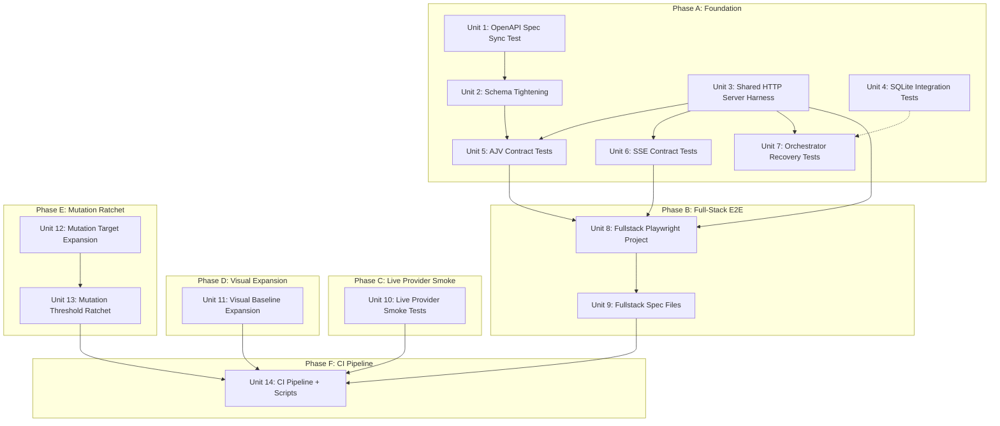

# Testing Expansion Plan

## Overview

Push Risoluto's test posture from "strong unit + mocked E2E" to production-grade coverage by adding real integration tests across SQLite persistence, OpenAPI contract validation, SSE event propagation, orchestrator recovery, full-stack browser E2E with real SSE, live provider smoke tests, expanded visual baselines, and an enforced mutation ratchet. This is the testing foundation required before v1 ship.

## Problem Frame

Risoluto has 244 test files and 21 mocked E2E specs, but critical integration seams remain untested (see origin: `docs/brainstorms/2026-04-01-testing-expansion-requirements.md`):

- 8 SQLite modules have unit tests but zero integration coverage against real databases
- The OpenAPI spec covers 20 paths / 23 operations; the runtime surface is 55 method/path combinations. Contract tests target the spec-covered surface (see Scope Note below).
- SSE event propagation (webhook to browser) is completely untested end-to-end
- Orchestrator restart/recovery/idempotency has no integration coverage
- Mutation testing covers 42 files with no enforced break threshold
- Visual regression covers only 4 spec files (7 baselines) out of many operator-critical routes

**Scope Note — API surface:** The current OpenAPI spec (`docs-site/openapi.json`) describes 20 paths / 23 operations. The runtime registers 55 method/path combinations across `routes.ts`, `config/api.ts`, `secrets/api.ts`, `setup/api.ts`, `prompt/api.ts`, and `audit/api.ts`. Contract tests (Unit 5) validate the **spec-covered surface only**. Routes not in the OpenAPI spec (setup wizard, template CRUD, audit) are runtime-only and are not covered by contract tests until the spec is expanded to include them.

## Requirements Trace

**Foundation (Phase A)**
- R1. OpenAPI spec sync test: runtime `getOpenApiSpec()` must match `docs-site/openapi.json`
- R2. OpenAPI schema tightening: fix untyped `type: object` response schemas before contract tests
- R3. SQLite shared-runtime integration tests with real temp-file databases
- R4. Shared HTTP server harness (`tests/helpers/http-server-harness.ts`)
- R5. AJV response contract tests for all spec-covered API endpoints (20 paths / 23 operations)
- R6. SSE contract tests: connect, initial event, state-change propagation, reconnect
- R7. Orchestrator restart/recovery/idempotency tests

**Full-Stack E2E (Phase B)**
- R8. New `fullstack` Playwright project using real backend serving built frontend, with a separate `playwright.fullstack.config.ts` to avoid `webServer` conflict
- R9. Webhook-to-UI test: POST signed webhook directly to `/webhooks/linear`
- R10. Issue lifecycle test: pickup to completion via real SSE
- R11. SSE reconnect test: server-level restart tested in Unit 6 (Vitest); fullstack tests browser-side reconnect via middleware-level simulation
- R12. API error handling test: 404 and abort error states in UI
- R13. Full-stack E2E runs in nightly CI (not PR gate)

**Live Provider Smoke (Phase C)**
- R14. Linear live smoke (credential-gated)
- R15. GitHub live smoke (credential-gated)
- R16. Docker live smoke (credential-gated)
- R17. All three run nightly with graceful skip on PR builds; isolated from the default `test:integration` lane

**Visual Baseline Expansion (Phase D)**
- R18. Expand from 7 to ~25 baselines covering operator-critical routes and empty/error states
- R19. All visual tests use `freezeClock(page)` + `screenshotCss` for determinism
- R20. Deliberately excluded: `/logs/:id`, responsive breakpoints, dark mode
- R21. Visual tests run in nightly CI

**Mutation Ratchet (Phase E)**
- R22. Expand Stryker mutate array from 42 to ~65 curated src files
- R23. Progressive break thresholds: 70 -> 80 -> 90 (final ceiling 90%)
- R24. Incremental mutation on every PR; full pass nightly
- R25. After each raise, read report and add targeted tests for meaningful survivors

**Infrastructure**
- R26. Test isolation: temp dirs with unique suffixes, cleanup in `afterEach`
- R27. Flake prevention: isolation AND Vitest `retry: 2` for integration tests
- R28. New package.json scripts: `test:integration:sqlite`, `test:integration:contracts`, `test:integration:live`, `test:e2e:fullstack`, `test:all`

**CI Pipeline**
- R29. PR gate adds: `test:integration` + `test:mutation:incremental`
- R30. Nightly adds: fullstack Playwright, visual Playwright, full mutation, live provider smoke. CI uses `.github/workflows/ci.yml` with schedule trigger (no separate `nightly.yml`).
- R31. Manual/release: existing `./scripts/run-e2e.sh` unchanged

**Success Criteria**
- SC1. 0 -> ~50 true integration test cases
- SC2. 0 -> 4 full-stack E2E spec files (~15 test cases)
- SC3. 0 -> 3 live provider smoke files (~20 test cases)
- SC4. 7 -> ~25 visual baselines
- SC5. All spec-covered API endpoints (23 operations across 20 paths) validated against OpenAPI schema
- SC6. Mutation break threshold enforced at 90% on curated targets
- SC7. All integration tests pass in PR gate without external credentials
- SC8. Nightly CI runs full-stack E2E, visual, full mutation, live provider smoke

## Scope Boundaries

- **In scope**: integration tests, full-stack E2E, live provider smoke, visual expansion, mutation ratchet, CI pipeline updates, shared test harness, OpenAPI schema tightening
- **Out of scope**: responsive breakpoint visual tests, dark mode visual tests, log stream visual tests, Playwright mobile viewport tests, new unit tests (existing coverage is strong), CI runtime optimization beyond parallelization

## Context & Research

### Relevant Code and Patterns

**SQLite test pattern** (`tests/persistence/sqlite/database.test.ts`):
- Uses `mkdtemp(path.join(os.tmpdir(), "risoluto-sqlite-test-"))` for temp dirs
- Tracks temp dirs in array, cleans up in `afterEach` with `rm(dir, { recursive: true, force: true })`
- Opens real file-backed databases with `openDatabase(dbPath)`
- Uses `closeDatabase(db)` in `finally` blocks
- This pattern is the template for all new integration tests (R3, R26)

**HTTP server test pattern** (`tests/http/server.test.ts`):
- Creates `HttpServer` with a mock orchestrator (typed as `unknown as Orchestrator`)
- Uses `server.start(0)` to get a dynamic port (avoids port collisions)
- Uses `server.stop()` in `afterEach`
- Sends real HTTP requests with `fetch()` and asserts status/body
- This pattern directly informs the shared harness design (R4)

**SSE test pattern** (`tests/http/sse.test.ts`):
- Creates standalone Express app with `createSSEHandler(eventBus)`
- Uses `app.listen(0)` for dynamic port
- Reads SSE stream with `fetch()` + `ReadableStream` reader
- Has `collectDataLines()` helper for reading N SSE frames
- Tests connected event, bus forwarding, disconnect cleanup, keep-alive
- This is the existing SSE unit test; R6 integration tests will use the full HttpServer harness

**Visual test pattern** (`tests/e2e/specs/visual/overview.visual.spec.ts`):
- Imports `test, expect` from `../../fixtures/test`
- Calls `freezeClock(page)` before `goto()` (required for determinism)
- Uses `apiMock.scenario().withSetupConfigured().build()` for mock data
- Adds `screenshotCss` via `page.addStyleTag()` to suppress animations
- Calls `toHaveScreenshot("name.png", { fullPage: true })`

**Playwright config** (`playwright.config.ts`):
- Port 5173 for Vite dev server (smoke/visual projects)
- Two existing projects: `smoke` and `visual`
- Visual project uses fixed viewport 1280x720
- `webServer` config starts Vite dev server unconditionally for all projects
- Fullstack project requires a **separate config file** (`playwright.fullstack.config.ts`) because the top-level `webServer` is unconditional and cannot be disabled per-project (R8)

**Webhook handler** (`src/http/webhook-handler.ts`):
- HMAC-SHA256 verification: `createHmac("sha256", secret).update(rawBody).digest("hex")`
- Needs `Linear-Signature` header (hex digest)
- Needs `rawBody` captured by express.json `verify` callback
- Validates `webhookTimestamp` within 60s replay window
- Deduplicates by `Linear-Delivery` header via `webhookInbox.insertVerified()`
- Tests must sign the **exact serialized request body bytes** with `createHmac("sha256", secret)` and set proper headers. The signing input and the request body must be the same byte sequence.

**OpenAPI paths with untyped schemas** (`src/http/openapi-paths.ts`):
- Endpoints returning bare `{ type: "object" }` (need tightening for R2):
  1. `GET /api/v1/state` (line 64) — should use a `stateResponseSchema`
  2. `GET /api/v1/transitions` (line 90) — should use a `transitionsResponseSchema`
  3. `GET /api/v1/{issue_identifier}` (line 122) — should use an `issueDetailResponseSchema`
  4. `POST /api/v1/{issue_identifier}/model` (line 157) — should use a `modelUpdateResponseSchema`
  5. `GET /api/v1/attempts/{attempt_id}` (line 192) — should use an `attemptDetailResponseSchema`
  6. `GET /api/v1/workspaces` (line 219) — should use a `workspaceListResponseSchema`
  7. `GET /api/v1/git/context` (line 244) — should use a `gitContextResponseSchema`
  8. `GET /api/v1/config` (line 260) — should use a `configResponseSchema`
  9. `GET /api/v1/config/schema` (line 269) — should use a `configSchemaResponseSchema`
  10. `GET /api/v1/config/overlay` (line 279) — should use a `configOverlayResponseSchema`
  11. `PUT /api/v1/config/overlay` (line 289 response + request body) — needs schemas
  12. `PATCH /api/v1/config/overlay/{path}` (line 305 response) — needs response schema
  13. `GET /api/v1/secrets` (line 339) — has partial schema (`{ keys: string[] }`)
- **Total: 12-13 endpoints need response schema tightening**
- Existing typed schemas: `runtimeResponseSchema`, `refreshResponseSchema`, `abortResponseSchema`, `transitionResponseSchema`, `attemptsListResponseSchema`, `errorResponseSchema`, `validationErrorSchema` in `src/http/response-schemas.ts`

**Stryker config** (`stryker.config.json`):
- Currently: 42 files in `mutate` array
- `break: null` (no enforced threshold)
- `high: 80`, `low: 60`
- Incremental mode enabled with `reports/stryker-incremental.json`
- `concurrency: 4`, `timeoutMS: 60000`

**Vitest integration config** (`vitest.integration.config.ts`):
- Include pattern: `tests/**/*.integration.test.ts` and `tests/integration/**/*.test.ts`
- Environment: `node`
- No retry config currently — R27 needs `retry: 2` added
- **Live test isolation**: Live provider test files must be excluded from this glob (see R17). Use a separate directory (`tests/integration/live/`) that is not matched by the default patterns, or add an `exclude` pattern. The `test:integration:live` script targets them explicitly.

**Webhook inbox** (`src/persistence/sqlite/webhook-inbox.ts`):
- `SqliteWebhookInbox` class with full status lifecycle: received -> processing -> applied/ignored/retry/dead_letter
- `insertVerified()` returns `{ isNew: boolean }` — deduplicates by UNIQUE constraint on delivery_id
- Has retry queue (`fetchDueForRetry`), DLQ (`markDeadLetter`), stats, recent deliveries

**Event bus** (`src/core/risoluto-events.ts`):
- 13 event channels: `issue.started`, `issue.completed`, `issue.stalled`, `issue.queued`, `worker.failed`, `model.updated`, `workspace.event`, `agent.event`, `poll.complete`, `system.error`, `audit.mutation`, `webhook.received`, `webhook.health_changed`
- SSE handler uses `eventBus.onAny()` to forward all events as `{ type: channel, payload }` frames

### Institutional Learnings

- No `docs/solutions/` directory exists yet
- The server.test.ts pattern of `server.start(0)` for dynamic port allocation is the correct approach for parallel-safe tests (resolves the port collision question from the requirements doc)

## Key Technical Decisions

- **Dynamic port allocation via `server.start(0)`**: Both `HttpServer.start(0)` and `app.listen(0)` are already used throughout the test suite. This eliminates port collision risk when integration tests run in parallel. No atomic port counter needed. For SSE reconnect tests that need server restart, use **dynamic port allocation on restart** (`server.start(0)`) instead of reusing the captured port, to avoid `EADDRINUSE` / `TIME_WAIT` flakes. The reconnect test must update the client URL to the new port.
  (see origin: `docs/brainstorms/2026-04-01-testing-expansion-requirements.md`, deferred question 1; amended per C7 settlement)

- **Direct webhook injection over mock Linear server**: Tests POST signed webhooks directly to `/webhooks/linear`. Test must: (1) serialize the payload to a string, (2) compute HMAC-SHA256 on that exact string, (3) use the same bytes as the request body / rawBody, (4) set the hex digest as the `Linear-Signature` header. The existing `webhook-handler.test.ts` test pattern is the reference implementation. Getting the signing bytes wrong means 401s on every webhook test.
  (see origin: requirements doc, Key Decisions; amended per C1 settlement)

- **Schema tightening as explicit prerequisite**: 12-13 endpoints currently return bare `{ type: "object" }` in OpenAPI paths. These must have Zod response schemas before AJV contract tests add value. This is separate from the contract test unit because it changes production code.
  (see origin: requirements doc, R2)

- **90% mutation ceiling**: Deliberately above the 85% recommendation in the original plan. Accept test contortion cost for v1 ship confidence. Acceptable survivors: logging-only paths, metrics increments, retry jitter, defensive impossible branches, error message wording.
  (see origin: requirements doc, Key Decisions)

- **Separate Playwright config for fullstack**: The fullstack E2E project uses `playwright.fullstack.config.ts` (new file) rather than adding a project to the existing `playwright.config.ts`. This is required because the top-level `webServer` in `playwright.config.ts` unconditionally starts a Vite dev server for all projects — there is no per-project override. The fullstack config has no `webServer` and relies on global setup to build the frontend (`pnpm run build`) and start the real backend. The test command is `pnpm exec playwright test --config playwright.fullstack.config.ts`.
  (see origin: requirements doc, deferred question 2; amended per C9, N1 settlement)

- **Belt-and-suspenders flake prevention**: Test isolation (temp DBs, unique suffixes, cleanup) AND Vitest `retry: 2` for integration tests. Both are needed — isolation prevents root causes, retry handles transient OS-level flakes.
  (see origin: requirements doc, Key Decisions)

- **`openDatabase()` is schema bootstrap, not SQL migration**: `openDatabase()` runs `CREATE TABLE IF NOT EXISTS` SQL (idempotent schema creation), not a migration runner. Integration tests for "migration" behavior should test bootstrap idempotence (open DB twice, schema unchanged) and JSONL import via `migrateFromJsonl()`, not sequential version migrations.
  (see origin: amended per C18 settlement)

- **No CI time ceiling**: Gate on test value, not runtime. Parallelize in CI as needed.
  (see origin: requirements doc, Key Decisions)

## Open Questions

### Resolved During Planning

- **Port allocation strategy** (affects R4): Use `server.start(0)` / `app.listen(0)` for dynamic port. Already proven in `tests/http/server.test.ts` and `tests/http/sse.test.ts`. No custom allocator needed. For SSE reconnect server restart, use `server.start(0)` again (fresh dynamic port) to avoid `EADDRINUSE` flakes — do NOT reuse the captured port from the first start.

- **Which endpoints have untyped schemas** (affects R2/R5): 12-13 endpoints in `src/http/openapi-paths.ts` return bare `{ type: "object" }`. Full list documented in Context & Research above. 7 response schemas already exist in `src/http/response-schemas.ts`.

- **Webhook signature validation in tests** (affects R9): Tests must: (1) serialize the payload to a deterministic string, (2) compute `createHmac("sha256", secret).update(serializedBody).digest("hex")`, (3) use that exact serialized string as the request body, (4) set `Linear-Signature` header with the hex digest, (5) set `Linear-Delivery` header with a unique UUID, (6) ensure `webhookTimestamp` is within 60s of `Date.now()`. The key invariant is that the signing input and the request body must be the same byte sequence.

- **Current mutation score/baseline** (affects R22): 42 files in `mutate` array, `break: null` (unenforced). The 70 -> 80 -> 90 ratchet starts from whatever the current score is on these 42 files. [Assumed: current score is likely 65-75% based on typical results for curated code with strong unit tests]

- **Fullstack Playwright server lifecycle** (affects R8): Global setup builds frontend and backend (`pnpm run build`), starts real HttpServer with temp SQLite, configures webhook secret. Global teardown stops server and cleans up temp DB. Uses a separate `playwright.fullstack.config.ts` that does NOT include a `webServer` block.

- **SSE reconnect simulation** (affects R11): Server-level stop/restart reconnect testing belongs in Unit 6 (Vitest integration) where tests have direct `HttpServer` control. On restart, use `server.start(0)` for a fresh dynamic port to avoid `EADDRINUSE`. The fullstack Playwright reconnect spec (Unit 9) tests browser-side EventSource reconnect behavior using middleware-level simulation (e.g., temporarily returning 503 on `/api/v1/events` then re-enabling).

- **CI workflow structure** (affects R30): The repo uses `.github/workflows/ci.yml` with a schedule trigger (`cron: "0 6 * * 1"`) — there is no separate `nightly.yml`. Nightly/weekly CI jobs are added to the existing `ci.yml` schedule block, not to a new file. The plan references "nightly CI" to mean the scheduled lane in `ci.yml`.

- **`test:integration` umbrella scope** (affects R28/R29): `test:integration` already exists in `package.json` and runs `vitest run --config vitest.integration.config.ts`. New subset scripts (`test:integration:sqlite`, `test:integration:contracts`) are convenience wrappers that target subsets of the same integration config. The umbrella `test:integration` runs ALL non-credential-gated integration tests. Live provider tests are isolated via file placement or exclude pattern so they do NOT run under the default `test:integration` umbrella (see R17).

### Deferred to Implementation

- **Exact Zod schemas for the 12-13 untyped endpoints**: The specific schema shapes depend on inspecting what each route handler actually returns. This is implementation-time discovery.
- **Full mutation score on 42 existing files**: Running `pnpm run test:mutation` reveals the actual baseline. The 70 threshold may already be met on existing files.
- **Vitest retry config placement**: Whether `retry: 2` goes in `vitest.integration.config.ts` globally or per-file via `describe.configure()`. Depends on how many tests flake during implementation.

## High-Level Technical Design

> *Directional guidance for review, not implementation specification.*



## Landing Strategy

Unit 2 (schema tightening) changes production code (`openapi-paths.ts`, `response-schemas.ts`) and becomes a dependency for Units 5-9. If Unit 2 needs to be reverted, all dependent units break. Recommend a minimum two-PR split:

- **PR 1 — Foundation (Units 1-4):** Spec sync test, schema tightening, shared harness, SQLite integration. This PR changes production code (schemas) and creates shared test infrastructure.
- **PR 2+ — Dependent work (Units 5-14):** Contract tests, SSE tests, recovery tests, fullstack E2E, visual expansion, mutation ratchet, CI pipeline. These build on the foundation PR.

Atomic commit groupings within each PR: one commit per unit is a reasonable default. Units 12-13 (mutation ratchet) may be 2-3 commits each (expand targets, then raise thresholds iteratively).

## Implementation Units

- [ ] **Unit 1: OpenAPI Spec Sync Test**

  **Goal:** Verify runtime-generated spec matches checked-in spec exactly, preventing silent drift. This test validates spec **consistency** (runtime matches checked-in file), NOT spec **completeness** (all runtime routes are in the spec). Runtime routes not in the OpenAPI spec are not covered by this test.
  **Requirements:** R1
  **Dependencies:** None
  **Files:**
  - Create: `tests/http/openapi-sync.test.ts`

  **Approach:**
  - Import `getOpenApiSpec()` from `src/http/openapi.js` and the checked-in `docs-site/openapi.json`
  - Deep-equal comparison. Any difference fails the test.
  - Version mismatch is already known: package at `0.6.0`, spec at `0.4.0` — this test will surface it

  **Patterns to follow:**
  - `tests/http/openapi.test.ts` for import style and Vitest conventions

  **Test scenarios:**
  - Happy path: runtime spec matches checked-in spec -> test passes
  - Drift detection: if someone modifies a route handler's response shape but forgets to update `docs-site/openapi.json` -> test fails with a clear diff
  - Version drift: spec `info.version` diverges from package.json version -> test catches the discrepancy

  **Verification:**
  - `pnpm test` runs the sync test as part of the unit test suite
  - Any API surface change requires updating `docs-site/openapi.json` to keep tests green

---

- [ ] **Unit 2: OpenAPI Schema Tightening**

  **Goal:** Replace all bare `{ type: "object" }` response schemas in `openapi-paths.ts` with proper Zod-derived schemas so contract tests validate meaningful shapes.
  **Requirements:** R2
  **Dependencies:** None (parallel with Unit 1)
  **Files:**
  - Modify: `src/http/response-schemas.ts` (add ~10 new Zod schemas)
  - Modify: `src/http/openapi-paths.ts` (replace `{ type: "object" }` with `toSchema(...)` calls)
  - Modify: `tests/http/openapi-paths.test.ts` (update expectations if needed)
  - Modify: `tests/http/response-schemas.test.ts` (add tests for new schemas)
  - Modify: `docs-site/openapi.json` (regenerate to stay in sync with Unit 1)

  **Approach:**
  - For each of the 12-13 untyped endpoints, inspect the corresponding route handler to determine the actual response shape
  - Define Zod schemas in `response-schemas.ts` following the existing pattern (`refreshResponseSchema`, `runtimeResponseSchema`, etc.)
  - Replace `{ type: "object" }` in `openapi-paths.ts` with `toSchema(newSchema)` calls
  - Regenerate `docs-site/openapi.json` to match

  **Patterns to follow:**
  - Existing schemas in `src/http/response-schemas.ts` (Zod object schemas with snake_case field names)
  - `toSchema()` helper in `openapi-paths.ts` that calls `z.toJSONSchema()`

  **Test scenarios:**
  - Happy path: each new schema validates against a representative response object -> passes
  - Edge case: nullable fields (many responses have optional fields) -> schema correctly marks them as `.nullable()` or `.optional()`
  - Error path: schema rejects response missing required fields -> validation fails
  - Regression: `openapi-sync.test.ts` (Unit 1) still passes after tightening -> schemas and checked-in spec are aligned

  **Verification:**
  - Zero `{ type: "object" }` bare schemas remaining in `openapi-paths.ts` (grep confirms)
  - `pnpm test` passes including the sync test from Unit 1
  - `pnpm run build` succeeds (schemas type-check)

---

- [ ] **Unit 3: Shared HTTP Server Harness**

  **Goal:** Extract a reusable test harness that starts a real `HttpServer` with a temp SQLite DB, used by contract tests, SSE tests, recovery tests, and fullstack E2E.
  **Requirements:** R4, R26, R27
  **Dependencies:** None (parallel with Units 1-2)
  **Files:**
  - Create: `tests/helpers/http-server-harness.ts`

  **Approach:**
  - Create `tests/helpers/` directory (does not exist yet)
  - Harness creates a temp directory via `mkdtemp()`, opens a real SQLite DB with `openDatabase()`, constructs a minimal `HttpServer` with the DB-backed orchestrator dependencies
  - Uses `server.start(0)` for dynamic port allocation
  - Returns `{ server, baseUrl, dataDir, db, eventBus, teardown }` — teardown stops server, closes DB, removes temp dir
  - The harness accepts optional overrides (webhook secret, orchestrator mock, config store, etc.) so each test suite can customize
  - Follow the temp-dir cleanup pattern from `tests/persistence/sqlite/database.test.ts`

  **Harness Tiers (two-tier design):**

  - **Tier 1 — Default (thin stubs):** All `OrchestratorPort` methods return empty/null stubs (similar to `{} as unknown as Orchestrator` in `server.test.ts`). No webhook handler deps. No event bus wiring. Suitable for contract tests (Unit 5) and basic HTTP route validation.

  - **Tier 2 — Opt-in layers:** Each layer is independently composable via override options:
    - **Webhook layer:** Adds `WebhookHandlerDeps` with a configurable webhook secret, real or stubbed `webhookInbox`, and no-op stubs for `requestRefresh`, `requestTargetedRefresh`, `stopWorkerForIssue`, `recordVerifiedDelivery`. Needed by Units 7 and 9.
    - **Event bus layer:** Adds a real `TypedEventBus` instance returned in the harness result. Needed by Unit 6 (SSE tests).
    - **Real SQLite layer:** Wires `SqliteAttemptStore`, `SqliteWebhookInbox`, etc. to the real temp DB. Needed by Unit 7 (recovery tests).

  The exact stub implementations are left to the implementer. The existing `makeDeps()` in `webhook-handler.test.ts` (~10 lines of `vi.fn()` stubs) is the reference pattern for webhook deps.

  **Technical design:** *(directional guidance)*
  ```
  startTestServer(overrides?) -> {
    dataDir = mkdtemp("risoluto-integration-test-")
    db = openDatabase(join(dataDir, "test.db"))
    eventBus = overrides.eventBus ?? new TypedEventBus()  // Tier 2: event bus
    orchestrator = overrides.orchestrator ?? buildStubOrchestrator()  // Tier 1: all no-ops
    webhookSecret = overrides.webhookSecret ?? "test-webhook-secret"
    webhookDeps = overrides.webhookDeps ?? undefined  // Tier 2: webhook layer
    server = new HttpServer({ orchestrator, logger, eventBus, webhookHandlerDeps, ... })
    { port } = await server.start(0)
    return { server, baseUrl: "http://127.0.0.1:${port}", dataDir, db, eventBus, teardown }
  }
  ```

  **Patterns to follow:**
  - `tests/http/server.test.ts` for HttpServer construction with mock orchestrator and `server.start(0)`
  - `tests/persistence/sqlite/database.test.ts` for temp dir creation and cleanup
  - `tests/http/webhook-handler.test.ts` `makeDeps()` for WebhookHandlerDeps construction

  **Test scenarios:**
  - Test expectation: none — this is shared infrastructure. Validated transitively by Units 5, 6, 7, 8.

  **Verification:**
  - Harness can be imported and used by at least one integration test file
  - `pnpm run build` succeeds (types check)

---

- [ ] **Unit 4: SQLite Integration Tests**

  **Goal:** Exercise all 8 SQLite persistence modules against real temp-file databases, covering bootstrap idempotence, WAL behavior, restart persistence, concurrent access, and cross-module workflows.
  **Requirements:** R3, R26
  **Dependencies:** None (parallel with Units 1-3)
  **Files:**
  - Create: `tests/integration/sqlite-runtime.integration.test.ts`
  - Create: `tests/integration/sqlite-stores.integration.test.ts`

  **Approach:**
  - Two test files: runtime-level tests (bootstrap, idempotence, WAL, restart) and store-level tests (all store module operations end-to-end)
  - Use real temp-file databases (not `:memory:`) per the requirements doc — `openDatabase()` configures WAL and PRAGMAs that `:memory:` misses
  - Each test gets its own temp directory with unique suffix
  - Tests exercise the full lifecycle: create, read, update, query, close, reopen

  **Note on bootstrap vs. migration:** `openDatabase()` runs `CREATE TABLE IF NOT EXISTS` SQL (idempotent schema creation), not a SQL migration runner. Tests for "migration" should verify bootstrap idempotence (call `openDatabase()` twice on the same DB file — schema unchanged, data preserved) and JSONL import via `migrateFromJsonl()` for data migration paths.

  **Execution note:** characterization-first — existing database.test.ts covers basic operations, these tests exercise cross-module integration paths

  **Patterns to follow:**
  - `tests/persistence/sqlite/database.test.ts` for temp dir management, DB open/close, cleanup
  - `openDatabase()` / `closeDatabase()` from `src/persistence/sqlite/database.js`
  - Drizzle ORM query patterns from existing tests

  **Test scenarios:**

  *sqlite-runtime.integration.test.ts:*
  - Happy path: fresh DB bootstrap -> all tables created, WAL enabled, foreign keys on
  - Happy path: bootstrap idempotence -> open DB twice with `openDatabase()`, schema unchanged, no errors
  - Happy path: already-bootstrapped DB -> idempotent open, no errors
  - Restart persistence: insert attempt -> close DB -> reopen -> data survives
  - Edge case: concurrent open of same DB file -> second open works (WAL supports concurrent readers)
  - Error path: write after close -> clean error thrown
  - Error path: open with invalid path (e.g., read-only directory) -> meaningful error

  *sqlite-stores.integration.test.ts:*
  - Happy path: `SqliteWebhookInbox.insertVerified()` -> new delivery persists, status is "received"
  - Dedup: insert same `deliveryId` twice -> second returns `{ isNew: false }`
  - Lifecycle: insert -> markProcessing -> markApplied -> verify final status
  - DLQ: insert -> markDeadLetter -> fetchDueForRetry returns empty, getStats shows dlqCount=1
  - Retry: insert -> markForRetry with future timestamp -> not in fetchDueForRetry; advance time -> appears
  - Happy path: attempt-store create, get, update, list, filter by status
  - Happy path: issue-config-store set/get/delete per-issue config
  - Edge case: issue-config-store get non-existent key -> returns null/default
  - Cross-module: insert attempt -> insert events for attempt -> query events by attemptId -> all linked correctly

  **Verification:**
  - `pnpm run test:integration` runs both files and all pass
  - No `:memory:` usage in these test files

---

- [ ] **Unit 5: AJV Response Contract Tests**

  **Goal:** Validate all spec-covered API endpoint responses (23 operations across 20 paths) against compiled OpenAPI response schemas using real HTTP requests.
  **Requirements:** R5
  **Dependencies:** Unit 2 (schema tightening), Unit 3 (HTTP server harness)
  **Pre-execution gate:** `pnpm add -D ajv` — AJV is not currently in `package.json` and must be added as a devDependency.
  **Files:**
  - Create: `tests/http/openapi-contracts.integration.test.ts`

  **Scope note:** Contract tests cover the **OpenAPI-spec-covered surface** (20 paths / 23 operations). Routes registered at runtime but absent from the OpenAPI spec (setup wizard, template CRUD, audit, `/api/v1/models`, `/api/v1/events`, webhook routes) are NOT validated by contract tests. When the OpenAPI spec is expanded to include these routes, contract tests should be expanded accordingly.

  **Approach:**
  - Start real server via shared harness (Unit 3)
  - Import `getOpenApiSpec()` at test time and compile response schemas with AJV
  - Send real HTTP requests to each endpoint
  - Assert: status code, Content-Type, JSON body validates against compiled schema
  - Include error response validation (400, 404, 422) — verify error envelope matches `errorResponseSchema`
  - Group tests by route category (state/metrics, issues, workspaces, config, secrets)

  **Patterns to follow:**
  - `tests/http/server.test.ts` for the real HTTP request pattern with `fetch()`
  - AJV usage: `new Ajv({ allErrors: true }).compile(schema)` then `validate(responseBody)`

  **Test scenarios:**
  - Happy path: `GET /api/v1/state` -> 200, body matches state response schema
  - Happy path: `GET /api/v1/runtime` -> 200, body matches `runtimeResponseSchema`
  - Happy path: `POST /api/v1/refresh` -> 202, body matches `refreshResponseSchema`
  - Happy path: `GET /api/v1/transitions` -> 200, body matches transitions schema
  - Happy path: `GET /api/v1/openapi.json` -> 200, body is valid OpenAPI 3.1 object
  - Happy path: `GET /api/docs` -> 200, Content-Type text/html
  - Happy path: `GET /metrics` -> 200, Content-Type text/plain (not JSON-validated)
  - Happy path: `GET /api/v1/{issue_identifier}` -> 200 or 404 depending on seeded data
  - Happy path: `POST /api/v1/{id}/abort` -> response matches abort schema
  - Happy path: `POST /api/v1/{id}/model` with valid body -> response matches model update schema
  - Happy path: `GET /api/v1/{id}/attempts` -> response matches attempts list schema
  - Happy path: `GET /api/v1/attempts/{attempt_id}` -> response matches attempt detail schema
  - Happy path: `GET /api/v1/workspaces` -> response matches workspace list schema
  - Happy path: `GET /api/v1/git/context` -> response matches git context schema
  - Happy path: `GET /api/v1/config` -> response matches config schema
  - Happy path: `GET /api/v1/config/schema` -> response is valid JSON Schema
  - Happy path: `GET /api/v1/config/overlay` -> response matches overlay schema
  - Happy path: `GET /api/v1/secrets` -> response matches `{ keys: string[] }`
  - Error path: `POST /api/v1/{id}/model` with invalid body -> 400, matches `validationErrorSchema`
  - Error path: `GET /api/v1/nonexistent-issue` -> 404, matches `errorResponseSchema`
  - Error path: `POST /api/v1/{id}/transition` with invalid transition -> 400/422, matches error schema
  - Edge case: `DELETE /api/v1/workspaces/{key}` for non-existent key -> 404
  - Edge case: `DELETE /api/v1/config/overlay/{path}` for non-existent path -> 404
  - Edge case: `DELETE /api/v1/secrets/{key}` for non-existent key -> 404

  **Verification:**
  - All spec-covered endpoints covered (count assertions in test output)
  - Error responses also validated against error schemas
  - `pnpm run test:integration` passes

---

- [ ] **Unit 6: SSE Contract Tests**

  **Goal:** Verify SSE event propagation through the full HttpServer stack: connection, initial event, state-change events, disconnect/reconnect recovery, and server restart reconnect.
  **Requirements:** R6, R11 (server-level reconnect)
  **Dependencies:** Unit 3 (HTTP server harness)
  **Files:**
  - Create: `tests/http/sse-contracts.integration.test.ts`

  **Approach:**
  - Start real server via shared harness (Unit 3) with Tier 2 event bus layer, which provides the `eventBus` handle
  - Connect to `/api/v1/events` with `fetch()` and read the SSE stream
  - Verify initial `{ type: "connected" }` event
  - Emit events on the `eventBus` (e.g., `issue.started`) and verify they arrive as SSE frames with correct envelope: `{ type: "issue.started", payload: { ... } }`
  - Test disconnect and reconnect: abort the first connection, create a new one, verify initial event arrives again
  - **Server restart reconnect** (moved from Unit 9 per N3 settlement): stop server via `server.stop()`, start new server via `server.start(0)` (fresh dynamic port — NOT the same port, to avoid `EADDRINUSE`), connect new SSE client to the new port, verify events arrive. This tests server-level lifecycle, which requires direct `HttpServer` control that the fullstack Playwright fixture does not provide.
  - Verify event envelope matches the shape the frontend's `event-source.ts` expects

  **Patterns to follow:**
  - `tests/http/sse.test.ts` for the `collectDataLines()` helper and SSE stream reading pattern
  - The existing SSE unit test covers the standalone handler; these tests exercise the full server stack

  **Test scenarios:**
  - Happy path: connect -> receive `{ type: "connected" }` initial event
  - Happy path: emit `issue.started` on bus -> SSE frame arrives with `{ type: "issue.started", payload: { issueId, identifier, attempt } }`
  - Happy path: emit multiple different event types -> all arrive in order with correct envelopes
  - Edge case: emit event before any client connects -> no error, event is silently dropped
  - Reconnect: disconnect client -> reconnect -> receive new `{ type: "connected" }` event
  - **Server restart reconnect**: stop server -> start new server on fresh port -> connect new client -> emit event -> event arrives
  - Integration: trigger state change via API (`POST /api/v1/refresh`) -> verify corresponding event arrives on SSE stream (if the orchestrator emits one)
  - Edge case: two concurrent SSE clients -> both receive the same events

  **Verification:**
  - All 13 SSE event types from `RisolutoEventMap` can be emitted and received through the full server stack
  - `pnpm run test:integration` passes

---

- [ ] **Unit 7: Orchestrator Restart/Recovery/Idempotency Tests**

  **Goal:** Verify the orchestrator handles duplicate webhooks, restart mid-run, abort races, and repeated refresh correctly.
  **Requirements:** R7
  **Dependencies:** Unit 3 (HTTP server harness with Tier 2 webhook + SQLite layers), Unit 4 (SQLite integration proves DB layer works)
  **Files:**
  - Create: `tests/orchestrator/restart-recovery.integration.test.ts`

  **Approach:**
  - Start real server via shared harness with webhook secret configured and real SQLite-backed webhook inbox
  - POST signed webhooks to `/webhooks/linear` to trigger orchestrator behavior
  - Use the webhook inbox (backed by real SQLite) to verify dedup and state
  - For restart tests: stop server, reopen DB, start new server instance (fresh dynamic port), verify state continuity
  - Webhook signing: serialize payload to string, compute HMAC on that exact string, use same bytes as request body

  **Patterns to follow:**
  - `tests/http/webhook-handler.test.ts` for webhook payload construction and the `sign()` / `makeRequest()` helpers
  - `src/http/webhook-handler.ts` for the signing algorithm (`createHmac("sha256", secret).update(rawBody).digest("hex")`)

  **Test scenarios:**
  - Dedup: POST same webhook (same `Linear-Delivery` header) twice -> `webhookInbox` shows only one entry, second POST still returns 200
  - Dedup: POST two different webhooks (different delivery IDs) -> both stored, both processed
  - Restart persistence: POST webhook -> stop server -> start new server with same DB -> webhook inbox still has the delivery record
  - Repeated refresh: call `POST /api/v1/refresh` rapidly 5 times -> coalescing kicks in, not all result in separate poll cycles
  - Replay rejection: POST webhook with `webhookTimestamp` older than 60s -> 401 response
  - Error path: POST webhook without `Linear-Signature` header -> 401
  - Error path: POST webhook with wrong signature -> 401
  - Error path: POST webhook when secret not configured -> 503 with Retry-After header

  **Verification:**
  - All idempotency and recovery scenarios pass
  - `pnpm run test:integration` includes this file

---

- [ ] **Unit 8: Fullstack Playwright Project Setup**

  **Goal:** Add a `fullstack` Playwright project that uses a real Risoluto backend serving the built frontend, with global setup/teardown managing server lifecycle. Uses a **separate config file** to avoid the top-level `webServer` conflict.
  **Requirements:** R8, R13
  **Dependencies:** Unit 3 (shared HTTP server harness provides the pattern)
  **Files:**
  - Create: `playwright.fullstack.config.ts` (separate config — no `webServer` block)
  - Create: `tests/e2e/setup/fullstack-server.ts` (global setup/teardown)
  - Create: `tests/e2e/fixtures/fullstack.ts` (fullstack-specific fixture)

  **Approach:**
  - Create a new `playwright.fullstack.config.ts` at project root:
    - `testMatch: ["**/*.fullstack.spec.ts"]`
    - Uses `devices["Desktop Chrome"]`
    - **No `webServer`** — uses global setup instead (this is why a separate config is needed; the main `playwright.config.ts` has an unconditional top-level `webServer` that starts Vite)
    - Global setup runs `pnpm run build` (compiles both backend TypeScript and frontend Vite build), starts real HttpServer with temp SQLite, configures webhook secret
    - Global teardown stops server, cleans up temp DB
  - The global setup stores `baseUrl` and `webhookSecret` in environment/storage for tests to use
  - Fullstack fixture provides helpers for signing and posting webhooks
  - The fullstack fixture exposes `server` stop/start handles for reconnect tests (or delegates reconnect simulation to middleware — see Unit 9)
  - Test command: `pnpm exec playwright test --config playwright.fullstack.config.ts`

  **Patterns to follow:**
  - Existing `playwright.config.ts` project structure (smoke, visual) for project options
  - `tests/e2e/fixtures/test.ts` for fixture extension pattern
  - `tests/helpers/http-server-harness.ts` (Unit 3) for server construction

  **Test scenarios:**
  - Test expectation: none — this is infrastructure. Validated transitively by Unit 9.

  **Verification:**
  - `pnpm exec playwright test --config playwright.fullstack.config.ts` runs without error (even with zero spec files initially)
  - Server starts, serves frontend at `/`, responds to API requests

---

- [ ] **Unit 9: Fullstack E2E Spec Files**

  **Goal:** Write the 4 fullstack E2E specs covering webhook-to-UI, issue lifecycle, SSE reconnect (browser-side), and API error handling.
  **Requirements:** R9, R10, R11 (browser-side reconnect), R12
  **Dependencies:** Unit 8 (fullstack project setup)
  **Files:**
  - Create: `tests/e2e/specs/fullstack/webhook-to-ui.fullstack.spec.ts`
  - Create: `tests/e2e/specs/fullstack/issue-lifecycle.fullstack.spec.ts`
  - Create: `tests/e2e/specs/fullstack/sse-reconnect.fullstack.spec.ts`
  - Create: `tests/e2e/specs/fullstack/api-error-handling.fullstack.spec.ts`

  **Approach:**
  - Each spec uses the fullstack fixture from Unit 8 to get `baseUrl` and webhook signing helpers
  - Webhook-to-UI: browser opens overview page, POST signed Issue webhook, assert page reflects state change within 3 seconds via SSE (no page reload)
  - Issue lifecycle: POST webhook for agent pickup -> UI shows "Running" -> POST completion webhook -> UI shows "Done" with attempt count incremented
  - SSE reconnect: **browser-side reconnect via middleware-level simulation** — temporarily return 503 on `/api/v1/events` to trigger EventSource reconnect, then re-enable the endpoint and POST a webhook to verify the browser receives the update. This avoids the need for server stop/restart (which is tested at the protocol level in Unit 6).
  - API error: navigate to non-existent issue -> 404 error state rendered; abort non-running issue -> error message shown

  **Patterns to follow:**
  - Existing smoke specs in `tests/e2e/specs/smoke/` for Playwright test structure
  - `page.waitForFunction()` for asserting DOM state after SSE updates
  - `page.waitForTimeout()` only as a last resort — prefer explicit waiters

  **Test scenarios:**

  *webhook-to-ui.fullstack.spec.ts:*
  - Happy path: POST signed Issue:update webhook -> browser overview reflects state change within 3s without reload
  - Edge case: POST webhook for issue not in UI -> page does not crash, gracefully handles unknown issue

  *issue-lifecycle.fullstack.spec.ts:*
  - Happy path: POST agent-pickup webhook -> UI shows "Running" state
  - Happy path: POST completion webhook -> UI shows "Done", attempt count incremented
  - Integration: full cycle (pickup -> running -> done) via sequential webhooks -> all state transitions visible

  *sse-reconnect.fullstack.spec.ts:*
  - Happy path: connect, simulate outage via middleware (503 on `/api/v1/events`), re-enable -> EventSource reconnects
  - Integration: reconnect -> POST webhook -> browser receives update (no missed events after reconnect)

  *api-error-handling.fullstack.spec.ts:*
  - Error path: navigate to `/issues/NONEXISTENT-999` -> 404 error state rendered in UI
  - Error path: attempt to abort a non-running issue -> correct error message displayed

  **Verification:**
  - `pnpm exec playwright test --config playwright.fullstack.config.ts` passes all 4 spec files
  - Tests run against real backend with real SSE, no mocks

---

- [ ] **Unit 10: Live Provider Smoke Tests**

  **Goal:** Add thin live smoke tests for Linear, GitHub, and Docker that run when credentials are available and skip gracefully when absent.
  **Requirements:** R14, R15, R16, R17
  **Dependencies:** None (parallel with other phases)
  **Files:**
  - Create: `tests/integration/live/linear-live.integration.test.ts`
  - Create: `tests/integration/live/github-live.integration.test.ts`
  - Create: `tests/integration/live/docker-live.integration.test.ts`

  **Live test isolation:** These files are placed in `tests/integration/live/` which is NOT matched by the default `vitest.integration.config.ts` glob patterns (`tests/**/*.integration.test.ts` matches `tests/integration/live/*.integration.test.ts` — so alternatively, add an `exclude` pattern for `tests/integration/live/**` to `vitest.integration.config.ts`). This ensures `pnpm run test:integration` does NOT load or run live tests. The `test:integration:live` script targets them explicitly with its own include pattern.

  **Approach:**
  - Each file guards on environment variables at the top: `describe.skipIf(!process.env.LINEAR_API_KEY)(...)` or equivalent
  - Tests exercise the real provider client APIs (not mocked)
  - Full cleanup after each test (delete created issues, close PRs, remove containers)
  - Tests validate response shapes match what the application code expects
  - Top-level imports must not eagerly validate env vars or throw when credentials are absent (the `describe.skipIf` guard must execute before any credential-dependent import)

  **Patterns to follow:**
  - `tests/integration/live.integration.test.ts` (existing live integration test with credential guard)
  - `tests/integration/docker-lifecycle.test.ts` (existing Docker test)

  **Test scenarios:**

  *linear-live.integration.test.ts:*
  - Happy path: auth check -> verify API key is valid, fetch viewer identity
  - Happy path: query issues from test team -> response has expected shape
  - Lifecycle: create issue -> transition state -> add comment -> verify comment exists -> delete issue (cleanup)
  - Edge case: pagination -> request page 2, verify cursor behavior

  *github-live.integration.test.ts:*
  - Happy path: auth check -> fetch authenticated user
  - Lifecycle: create draft PR -> verify created -> add comment -> fetch status -> close PR + delete branch (cleanup)
  - Edge case: create duplicate PR (same branch) -> assert dedup logic or error handling

  *docker-live.integration.test.ts:*
  - Happy path: spawn `alpine:latest echo hello` -> assert stdout capture, exit code 0
  - Cleanup: verify container removed after run
  - Mount: workspace dir mounted, file written by container is accessible on host
  - Edge case: container that exits with non-zero code -> error captured correctly

  **Verification:**
  - With credentials: `pnpm run test:integration:live` passes all three
  - Without credentials: all tests skip gracefully, zero failures
  - `pnpm run test:integration` does NOT attempt to load or run live test files

---

- [ ] **Unit 11: Visual Baseline Expansion**

  **Goal:** Expand visual regression from 4 spec files (7 baselines) to ~9 spec files (~25 baselines) covering operator-critical routes and empty/error states.
  **Requirements:** R18, R19, R20, R21
  **Dependencies:** None (parallel with other phases)
  **Files:**
  - Create: `tests/e2e/specs/visual/issue-detail.visual.spec.ts` (2 baselines: running, completed)
  - Create: `tests/e2e/specs/visual/attempt-detail.visual.spec.ts` (2 baselines: success, failed)
  - Create: `tests/e2e/specs/visual/empty-states.visual.spec.ts` (3 baselines: overview empty, queue empty, one more)
  - Create: `tests/e2e/specs/visual/error-states.visual.spec.ts` (3 baselines: 404, API error, timeout)
  - Create: `tests/e2e/specs/visual/observability.visual.spec.ts` (2 baselines)
  - Create: `tests/e2e/specs/visual/workspaces.visual.spec.ts` (2 baselines)
  - Create: `tests/e2e/specs/visual/templates.visual.spec.ts` (2 baselines)
  - Create: `tests/e2e/specs/visual/audit.visual.spec.ts` (2 baselines)
  - Create: `tests/e2e/specs/visual/settings-tabs.visual.spec.ts` (3 baselines)

  **Approach:**
  - All specs follow the exact pattern from `overview.visual.spec.ts`:
    1. `freezeClock(page)` before `goto()`
    2. `apiMock.scenario().withSetupConfigured().build()` with appropriate scenario overrides
    3. `page.addStyleTag({ content: screenshotCss })` to suppress animations
    4. `expect(page).toHaveScreenshot("name.png", { fullPage: true })`
  - Use `ScenarioBuilder` to construct mock data for each visual state
  - Generate initial baselines with `--update-snapshots`

  **Patterns to follow:**
  - `tests/e2e/specs/visual/overview.visual.spec.ts` (exact pattern to replicate)
  - `tests/e2e/support/clock.ts` for `freezeClock()`
  - `tests/e2e/support/screenshot-css.ts` for animation suppression

  **Test scenarios:**
  - Each baseline is a visual snapshot: no behavioral assertions, just `toHaveScreenshot()` comparison
  - Issue detail: running state with active attempt, completed state with attempt history
  - Attempt detail: successful attempt with events, failed attempt with error details
  - Empty states: overview with zero issues, queue with no items
  - Error states: 404 page, API error rendering, connection timeout state
  - Priority ordering: issue-detail and empty-states are highest priority (operator-critical paths)

  **Verification:**
  - `pnpm exec playwright test --project=visual` passes (after initial baseline generation)
  - Total baseline count is ~25 (7 existing + ~18 new)
  - All new specs use `freezeClock` and `screenshotCss`

---

- [ ] **Unit 12: Mutation Target Expansion**

  **Goal:** Expand the Stryker mutate array from 42 to ~65 curated src files, covering HTTP, persistence, external clients, secrets, and setup layers.
  **Requirements:** R22
  **Dependencies:** None (parallel with other phases, but benefits from Units 4-7 existing to kill mutants)
  **Files:**
  - Modify: `stryker.config.json`

  **Approach:**
  - Add the following file groups to the `mutate` array:
    - HTTP layer: `routes.ts`, `webhook-handler.ts`, `sse.ts`, `validation.ts`, `transitions-api.ts`, `attempt-handler.ts`, `workspace-inventory.ts`
    - Persistence: `attempt-store-sqlite.ts`, `issue-config-store.ts`, `webhook-inbox.ts`, `migrator.ts`
    - External clients: `linear/client.ts`, `linear/issue-pagination.ts`, `src/git/github-pr-client.ts`
    - Secrets/notification: `secrets/db-store.ts`, `notification/manager.ts`
    - Setup: `setup/setup-status.ts`, `setup/detect-default-branch.ts`
  - **Verify each file path exists before adding** — do not add nonexistent files
  - Do NOT add: CLI entry points, type-only files, Docker subprocess glue

  **Patterns to follow:**
  - Existing `stryker.config.json` structure with grouped comments

  **Test scenarios:**
  - Test expectation: none — this is configuration. Validated by running `pnpm run test:mutation`.

  **Verification:**
  - `stryker.config.json` has ~65 files in `mutate` array
  - `pnpm run test:mutation` runs without errors on the expanded target set

---

- [ ] **Unit 13: Mutation Threshold Ratchet**

  **Goal:** Progressively enforce mutation break thresholds from 70 -> 80 -> 90, adding targeted tests for meaningful survivors after each raise.
  **Requirements:** R23, R24, R25
  **Dependencies:** Unit 12 (expanded targets)
  **Files:**
  - Modify: `stryker.config.json` (update `thresholds.break`)
  - Create/modify: various test files (targeted tests for surviving mutants)

  **Approach:**
  - Step 1: Set `break: 70`, run full mutation pass, read `reports/stryker-report.html`
  - Step 2: Add targeted tests for meaningful survivors that block the 80 threshold
  - Step 3: Set `break: 80`, verify pass
  - Step 4: Add targeted tests for survivors that block 90
  - Step 5: Set `break: 90` (final ceiling)
  - Leave acceptable survivors: logging-only paths, metrics increments, retry jitter constants, defensive impossible branches, error message wording

  **Patterns to follow:**
  - Existing unit tests in `tests/` for the style of targeted mutation-killing tests

  **Test scenarios:**
  - Each step is validated by running `pnpm run test:mutation` and confirming the score meets the threshold
  - Meaningful survivors: identify from Stryker report, write targeted test for each
  - Acceptable survivors: document why they are acceptable (e.g., "logging-only branch — mutating log message has no behavioral impact")

  **Verification:**
  - `stryker.config.json` has `break: 90`
  - `pnpm run test:mutation` passes at 90% threshold
  - `pnpm run test:mutation:incremental` works correctly on changed files

---

- [ ] **Unit 14: CI Pipeline and Package Scripts**

  **Goal:** Update CI workflows and package.json scripts to integrate all new test layers into PR gate and nightly pipelines.
  **Requirements:** R28, R29, R30, R31
  **Dependencies:** Units 4-13 (all test layers must exist)
  **Files:**
  - Modify: `package.json` (add new scripts)
  - Modify: `vitest.integration.config.ts` (add `retry: 2` for flake prevention; add `exclude` pattern for `tests/integration/live/**`)
  - Modify: `.github/workflows/ci.yml` (add `test:integration` to PR gate; add nightly jobs to schedule block)

  **Approach:**
  - Add package.json scripts:
    - `test:integration:sqlite`: `vitest run --config vitest.integration.config.ts --include 'tests/integration/sqlite-*.integration.test.ts'`
    - `test:integration:contracts`: `vitest run --config vitest.integration.config.ts --include 'tests/http/*-contracts.integration.test.ts'`
    - `test:integration:live`: `vitest run --config vitest.integration.config.ts --include 'tests/integration/live/*.integration.test.ts'`
    - `test:e2e:fullstack`: `playwright test --config playwright.fullstack.config.ts`
    - `test:all`: `pnpm test && pnpm run test:integration && pnpm exec playwright test --project=smoke`
  - Update `vitest.integration.config.ts`:
    - Add `retry: 2` (R27)
    - Add `exclude: ["tests/integration/live/**"]` to keep live tests out of the default `test:integration` lane
  - Update `.github/workflows/ci.yml`:
    - PR gate adds: `pnpm run test:integration` + `pnpm run test:mutation:incremental`
    - Schedule block adds: fullstack E2E, visual Playwright, full mutation, live provider smoke with injected credentials
    - No separate `nightly.yml` — all scheduled jobs go in the existing `ci.yml`
  - Script paths use **glob patterns** (not hardcoded file lists) to be resilient to renames

  **Patterns to follow:**
  - Existing `package.json` script structure
  - Existing `.husky/pre-push` gate structure
  - Existing `.github/workflows/ci.yml` job structure

  **Test scenarios:**
  - Test expectation: none — this is CI configuration.

  **Verification:**
  - `pnpm run test:integration` runs SQLite + contracts + SSE + recovery tests (no credentials needed, no live tests loaded)
  - `pnpm run test:integration:live` runs live tests (skips gracefully without credentials)
  - `pnpm run test:e2e:fullstack` runs fullstack E2E specs
  - `pnpm run test:all` runs the full deterministic test suite

## System-Wide Impact

- **Interaction graph:** The shared HTTP server harness (Unit 3) is the primary integration point — used by Units 5, 6, 7, 8. Changes to `HttpServer` constructor signature will affect the harness. Changes to `OrchestratorPort` interface will affect the stub orchestrator in the harness.
- **Error propagation:** Integration tests exercise real error paths (webhook signature failures, DB constraint violations, SSE disconnects). These tests will surface error handling issues that unit tests miss.
- **State lifecycle risks:** Temp DB cleanup is critical — if `afterEach` cleanup fails, disk space leaks. The harness's `teardown()` function must be robust to partial initialization failures.
- **API surface parity:** OpenAPI schema tightening (Unit 2) changes the published API contract. The checked-in `docs-site/openapi.json` must be regenerated to match. Contract tests validate spec-covered routes only; runtime-only routes are out of scope until the spec is expanded.
- **Integration coverage:** The webhook-to-SSE flow (webhook handler -> orchestrator -> event bus -> SSE handler -> browser) is the primary cross-layer scenario that unit tests alone cannot prove. Units 6, 7, 9 cover this.
- **Unchanged invariants:** Existing unit tests, smoke E2E tests, and visual baselines remain unchanged. The fullstack project is additive. Existing Playwright projects (`smoke`, `visual`) are not modified.

## Risks & Dependencies

| Risk | Likelihood | Impact | Mitigation | Rollback |
|------|-----------|--------|------------|----------|
| Schema tightening breaks existing API consumers | Low | Med | Schemas describe existing behavior, not change it. Verify with existing server.test.ts | Revert schema changes, keep `type: object` |
| Integration tests flaky due to port/timing | Med | Med | Dynamic ports via `start(0)`, Vitest `retry: 2`, deterministic temp dirs. SSE reconnect uses fresh dynamic port on restart (no port reuse). | Isolate flaky tests to separate config |
| Stryker timeout on expanded targets | Med | Low | `timeoutMS: 60000` already configured, `concurrency: 4`. Monitor whether expanded target set requires higher timeout for nightly runs. | Reduce mutate array to passing subset |
| Fullstack E2E slow/flaky in nightly CI | Med | Low | Global setup amortizes server cost; nightly lane tolerates longer runs | Move to manual-only if flake rate is high |
| Live provider tests fail due to rate limits | Low | Low | Each provider test does minimal operations; cleanup prevents resource leaks | Skip in CI, run manually |
| Playwright config conflict (webServer) | Med | Med | Separate `playwright.fullstack.config.ts` avoids top-level `webServer` interaction entirely | N/A — separate config eliminates the risk |

## Documentation / Operational Notes

- Update `CLAUDE.md` testing commands section to document new scripts (`test:integration:*`, `test:e2e:fullstack`, `test:all`)
- Update `.husky/pre-push` to include `pnpm run test:integration` in the gate (if desired — currently only runs `pnpm test`)
