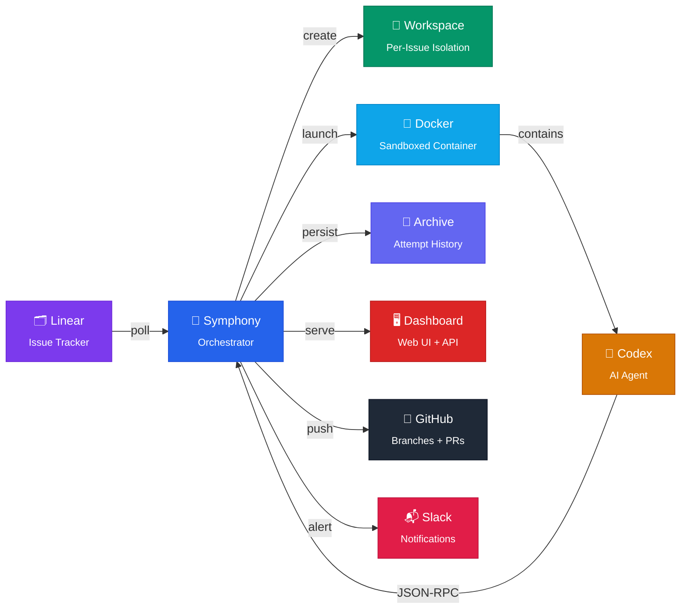
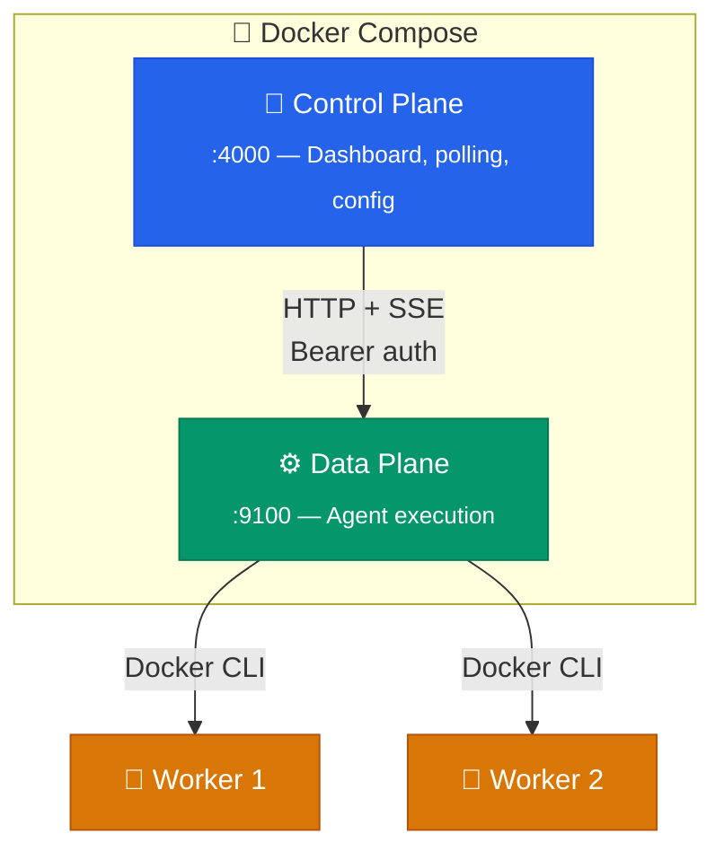
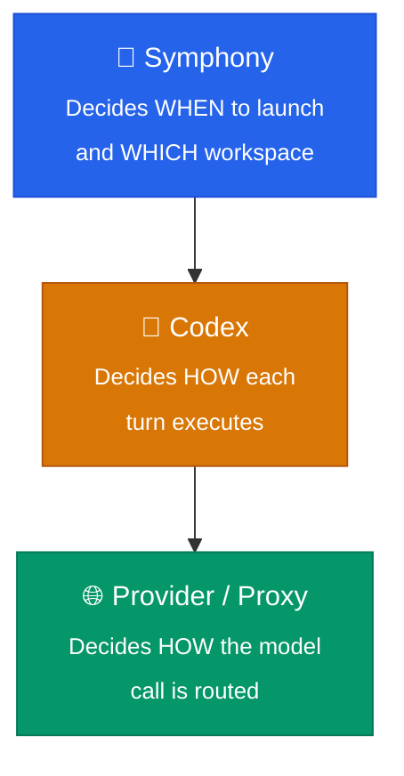

<p align="center">
  <h1 align="center">🎵 Symphony Orchestrator</h1>
  <p align="center">
    <strong>Turn your issue tracker into an autonomous coding pipeline.</strong><br/>
    <em>Linear issues in → sandboxed AI agents out → PRs delivered.</em>
  </p>
</p>

<p align="center">
  <a href="https://github.com/OmerFarukOruc/symphony-orchestrator/releases"></a>
  <a href="https://github.com/OmerFarukOruc/symphony-orchestrator/blob/main/LICENSE"></a>
  
  
  
  
</p>

---

## 🌊 What is Symphony?

Symphony is a **local orchestration engine** that watches your project tracker for actionable issues, spins up sandboxed AI coding agents to work on each one, and delivers the results — all without you supervising a single prompt.

```
You create an issue  →  Symphony picks it up  →  AI agent writes code  →  PR lands on GitHub
```

**No cloud service. No SaaS. No data leaves your machine.** Symphony runs entirely on your local machine or a VDS you control, connecting your existing Linear project to AI-powered Codex agents running inside isolated Docker containers.

---

## ⚡ How It Works



---

## 🚀 Quick Start — Docker (Recommended)

The fastest way to get running. **No environment variables needed upfront** — the web-based setup wizard handles everything.

**1. Clone and launch**

```bash
git clone https://github.com/OmerFarukOruc/symphony-orchestrator.git
cd symphony-orchestrator
docker compose up --build
```

**2. Open the dashboard**

Navigate to **http://localhost:4000** — the setup wizard starts automatically.

**3. Complete the wizard** (3–5 min)

| Step | What you'll do |
| ---- | -------------- |
| 🔐 **Protect secrets** | Generates an encryption master key for credentials |
| 🗂️ **Connect Linear** | Paste your API key and select a project |
| 🤖 **Add OpenAI** | Paste an API key or use Codex Login |
| 🐙 **Add GitHub** | Paste a GitHub PAT *(optional)* |

**4. Create an issue and watch it run**

Set a Linear issue to "In Progress". Within one poll cycle (~30s), Symphony picks it up, launches a sandboxed agent, and shows progress on the dashboard.

> [!TIP]
> All credentials and configuration are stored in encrypted Docker volumes — nothing is saved to your source tree.

<details>
<summary>📦 <strong>Development Setup</strong> — without Docker</summary>

```bash
npm install && npm run build && bash bin/build-sandbox.sh
export LINEAR_API_KEY="lin_api_..."
export LINEAR_PROJECT_SLUG="your-linear-project-slug"
node dist/cli.js ./WORKFLOW.example.md --port 4000
```

Open http://127.0.0.1:4000 and the setup wizard guides you through the rest.

Set your Codex auth:

```bash
export OPENAI_API_KEY="sk-..."   # API key path
# — or —
codex login                       # ChatGPT/Codex subscription path
```

</details>

---

## ✨ What Ships Today (v0.2.0)

<table>
<tr>
<td width="50%" valign="top">

### 🏗️ Core Engine
- **📋 Linear polling** — Automatic issue discovery with priority sorting
- **🐳 Docker sandbox** — `node:22` containers with resource limits, OOM detection, security hardening
- **📁 Workspace isolation** — One directory per issue with lifecycle hooks
- **🔄 Retry & stall handling** — Configurable backoff, turn/stall timeouts
- **🎯 Model overrides** — Per-issue model selection from the dashboard

</td>
<td width="50%" valign="top">

### 🖥️ Dashboard & API
- **📊 Real-time dashboard** — Board and overview views at `localhost:4000`
- **📡 Full JSON API** — 30+ endpoints under `/api/v1/*`
- **📈 Prometheus metrics** — `GET /metrics` for scrape-friendly monitoring
- **⚙️ Setup wizard** — Guided credential setup via web UI
- **🔧 Config overlay** — Persistent operator config with encrypted secrets

</td>
</tr>
<tr>
<td width="50%" valign="top">

### 🔗 Integrations
- **🐙 Git automation** — Clone, commit, push, and PR creation on completion
- **📬 Slack notifications** — Lifecycle alerts with verbosity controls
- **🤖 Codex integration** — `codex app-server` via JSON-RPC with dynamic tool handling

</td>
<td width="50%" valign="top">

### 🛡️ Operations
- **💾 Archived attempts** — Durable event timelines under `.symphony/`
- **🔎 `symphony-logs` CLI** — Archive-first issue and attempt inspection
- **🔐 Encrypted secrets** — AES-encrypted credential storage
- **✅ Strict TypeScript** — Full type safety with deterministic Vitest coverage

</td>
</tr>
</table>

---

## 🔮 Where It's Heading

Symphony's roadmap ([#9 — Feature Roadmap](https://github.com/OmerFarukOruc/symphony-orchestrator/issues/9)) tracks **89 features** across 4 tiers, with research drawn from 10+ open-source orchestrators.

### 🎯 Tier 1 — Shipping Next

| Feature | What it unlocks |
| ------- | --------------- |
| [**⚡ Reactions System**](https://github.com/OmerFarukOruc/symphony-orchestrator/issues/10) | CI/review/approval events trigger automatic agent actions |
| [**🐙 GitHub Issues Adapter**](https://github.com/OmerFarukOruc/symphony-orchestrator/issues/11) | Use GitHub Issues instead of (or alongside) Linear |
| [**📱 Mobile Dashboard**](https://github.com/OmerFarukOruc/symphony-orchestrator/issues/12) | Fully responsive UI for monitoring on any device |
| [**💰 Cost Tracking**](https://github.com/OmerFarukOruc/symphony-orchestrator/issues/14) | Per-issue and per-model dollar cost with budget enforcement |
| [**📡 Live Agent Feed**](https://github.com/OmerFarukOruc/symphony-orchestrator/issues/15) | Real-time SSE streaming with subagent drill-down |
| [**🧹 Auto-squash Commits**](https://github.com/OmerFarukOruc/symphony-orchestrator/issues/59) | Conventional commit formatting with execution metrics in PRs |

### 🏗️ Tier 2 — High Impact

Multi-agent role pipelines • Agent-agnostic runner (10+ agent backends) • Kanban board with drag-and-drop • Inline diff review with agent feedback loop • Command bar (Cmd+K) • MCP server for orchestrator tools • `npx` zero-install distribution • GitLab adapter • Prompt templates • Chat integrations (Slack/Discord/Telegram) • and [43 more →](https://github.com/OmerFarukOruc/symphony-orchestrator/issues/9)

### 🔭 Tier 3–4 — Long Horizon

Multi-host SSH workers • Autonomous issue decomposition • Self-healing pipelines • Cross-repo orchestration • Vector memory for agents • Continuous codebase improvement

> [!NOTE]
> For the full dependency graph, shipped extensions, and spec conformance details, see the [Roadmap](docs/ROADMAP_AND_STATUS.md) and [Conformance Audit](docs/CONFORMANCE_AUDIT.md).

---

## 🐳 Docker Architecture

Symphony runs in Docker with a zero-configuration start — or scales to a control/data plane split for advanced deployments.

### Standard Mode — Single Container

```bash
docker compose up --build
```

All data persists in named Docker volumes:

| Volume | Purpose |
| ------ | ------- |
| `symphony-archives` | Encrypted secrets, config overlay, run archives |
| `symphony-workspaces` | Cloned repositories for each issue |
| `codex-auth` | OpenAI Codex login tokens |

### Advanced — Control / Data Plane Split

For hot upgrades, multi-host workers, or scale-out scenarios:



Enable with `DISPATCH_MODE=remote` in your `.env`. See the [Operator Guide](docs/OPERATOR_GUIDE.md#control-data-plane-architecture-remote-dispatch-mode) for details.

---

## 📡 API at a Glance

Symphony exposes a full JSON API at `http://localhost:4000/api/v1/`. Here are the key endpoints:

| Endpoint | What it does |
| -------- | ------------ |
| `GET /api/v1/state` | Runtime snapshot — queued, running, retrying, completed issues |
| `GET /api/v1/runtime` | Version, workflow path, feature flags |
| `POST /api/v1/refresh` | Trigger immediate orchestration pass |
| `GET /api/v1/:issue/attempts` | Archived attempts + current live attempt |
| `POST /api/v1/:issue/model` | Save per-issue model override |
| `GET /metrics` | Prometheus-format service metrics |

<details>
<summary>📋 <strong>Full API reference</strong> — 30+ endpoints</summary>

### Core Endpoints

| Method | Endpoint | Description |
| ------ | -------- | ----------- |
| `GET` | `/` | Local operator dashboard |
| `GET` | `/metrics` | Prometheus metrics |
| `GET` | `/api/v1/runtime` | Runtime info — version, workflow path, feature flags |
| `GET` | `/api/v1/state` | Runtime snapshot — queued, running, retrying, completed, workflow columns, and token totals |
| `POST` | `/api/v1/refresh` | Trigger immediate orchestration refresh |
| `GET` | `/api/v1/transitions` | List available Linear workflow transitions |
| `GET` | `/api/v1/:issue_identifier` | Issue detail, recent events, archived attempts |
| `GET` | `/api/v1/:issue_identifier/attempts` | Archived attempts + current live attempt id |
| `GET` | `/api/v1/attempts/:attempt_id` | Archived event stream for a specific attempt |
| `POST` | `/api/v1/:issue_identifier/model` | Save per-issue model override |
| `POST` | `/api/v1/:issue_identifier/transition` | Transition a Linear issue to a new state |

### Config & Secrets Endpoints

| Method | Endpoint | Description |
| ------ | -------- | ----------- |
| `GET` | `/api/v1/config` | Effective merged operator config |
| `GET` | `/api/v1/config/overlay` | Persistent overlay values only |
| `PUT` | `/api/v1/config/overlay` | Update overlay values |
| `DELETE` | `/api/v1/config/overlay/:path` | Remove one overlay path |
| `GET` | `/api/v1/secrets` | List configured secret keys |
| `POST` | `/api/v1/secrets/:key` | Store one secret |
| `DELETE` | `/api/v1/secrets/:key` | Delete one secret |

### Setup Wizard Endpoints

| Method | Endpoint | Description |
| ------ | -------- | ----------- |
| `GET` | `/api/v1/setup/status` | Setup wizard progress and step completion |
| `POST` | `/api/v1/setup/reset` | Reset all configuration |
| `POST` | `/api/v1/setup/master-key` | Initialize encryption master key |
| `GET` | `/api/v1/setup/linear-projects` | List available Linear projects |
| `POST` | `/api/v1/setup/linear-project` | Select a Linear project |
| `POST` | `/api/v1/setup/openai-key` | Validate and store OpenAI API key |
| `POST` | `/api/v1/setup/codex-auth` | Store Codex auth.json |
| `POST` | `/api/v1/setup/device-auth/start` | Start OAuth device flow |
| `POST` | `/api/v1/setup/device-auth/poll` | Poll for OAuth tokens |
| `POST` | `/api/v1/setup/github-token` | Validate and store GitHub token |

</details>

---

## 📄 Workflow Files

| File | Purpose |
| ---- | ------- |
| `WORKFLOW.example.md` | Portable example for normal local setup |
| `WORKFLOW.md` | Checked-in live smoke workflow for this repo |

> [!TIP]
> Both workflows resolve `tracker.project_slug` from `LINEAR_PROJECT_SLUG` env var, so the same repo checkout works across different Linear projects without editing tracked files.

### Auth Modes

| Mode | Config | How it works |
| ---- | ------ | ------------ |
| **API Key** | `codex.auth.mode: "api_key"` | Forwards `OPENAI_API_KEY` into the container |
| **Codex Login** | `codex.auth.mode: "openai_login"` | Injects `auth.json` from `codex.auth.source_home` |
| **Custom Provider** | `codex.provider` block | OpenAI-compatible endpoints with `base_url`, headers, query params |

> [!NOTE]
> Host-bound provider URLs like `http://127.0.0.1:8317/v1` are automatically rewritten to `host.docker.internal` inside Docker containers.

---

## 🧪 Testing

```bash
npm test              # Deterministic unit tests
npm run test:watch    # Watch mode for local iteration
npm run test:integration  # Opt-in live integration (requires credentials)
```

> [!TIP]
> The integration suite skips cleanly when required credentials are absent — safe to run without API keys.

---

## 📚 Documentation Map

### 🏁 Getting Started

| Document | What you'll learn |
| -------- | ----------------- |
| **[Operator Guide](docs/OPERATOR_GUIDE.md)** | Full setup walkthrough, deployment options, Docker networking, wizard details |
| **[Workflow Examples](WORKFLOW.example.md)** | Template workflow file with all config options explained |

### 🔧 Operating & Monitoring

| Document | What it covers |
| -------- | -------------- |
| **[Runbooks](docs/RUNBOOKS.md)** | Troubleshooting playbooks for common failures |
| **[Observability](docs/OBSERVABILITY.md)** | Prometheus metrics, request tracing, error tracking, alert rules |
| **[Releasing](docs/RELEASING.md)** | Release preparation checklist |

### 🏛️ Architecture & Security

| Document | What it covers |
| -------- | -------------- |
| **[Trust & Auth](docs/TRUST_AND_AUTH.md)** | Trust boundaries, sandbox security, credential chain |
| **[Conformance Audit](docs/CONFORMANCE_AUDIT.md)** | Per-requirement spec conformance tracking |
| **[Roadmap](docs/ROADMAP_AND_STATUS.md)** | 89-issue feature roadmap across 4 tiers |

### 📖 Reference

| Document | What it covers |
| -------- | -------------- |
| **[EXECPLAN.md](EXECPLAN.md)** | Internal implementation log |
| **[Visual Verify Skill](skills/visual-verify/SKILL.md)** | Dashboard screenshot diffing and QA workflow |

---

## 🔒 Trust Posture

The v0.2 operating mode is intentionally **high trust** and **local-only**.



> [!CAUTION]
> The default posture (`danger-full-access` sandbox, `never` approval policy) is appropriate **only** for local, operator-controlled environments. See [Trust & Auth](docs/TRUST_AND_AUTH.md) for the full security model.

---

## 🌟 Background

This project draws direct inspiration from **[OpenAI's Symphony](https://github.com/openai/symphony)** — a framework that turns project work into isolated, autonomous implementation runs. We loved the vision and built our own TypeScript implementation tailored for local, single-host operator use.

> [!NOTE]
> While OpenAI's Symphony provides a [spec](https://github.com/openai/symphony/blob/main/SPEC.md) and an Elixir reference implementation, **Symphony Orchestrator** is an independent TypeScript implementation that follows the same core philosophy: poll tracker → create workspaces → launch agents → report results.

---

## ⚖️ License

[MIT](LICENSE)

---

<p align="center">
  <sub>Built with ❤️ — Inspired by <a href="https://github.com/openai/symphony">OpenAI Symphony</a></sub>
</p>
