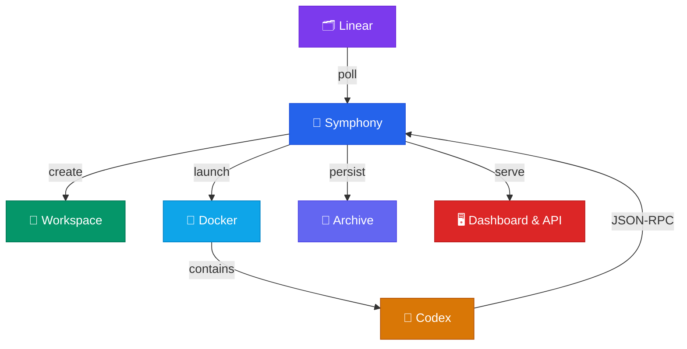

<p align="center">
  <h1 align="center">🎵 Symphony Orchestrator</h1>
  <p align="center">
    <em>Local orchestration for Linear-driven autonomous coding work — powered by Codex.</em>
  </p>
</p>

<p align="center">
  <a href="https://github.com/OmerFarukOruc/symphony-orchestrator/releases"></a>
  <a href="https://github.com/OmerFarukOruc/symphony-orchestrator/blob/main/LICENSE"></a>
  
  
  
</p>

---

## 🌟 Inspiration

This project draws direct inspiration from **[OpenAI's Symphony](https://github.com/openai/symphony)** — a framework that turns project work into isolated, autonomous implementation runs, allowing teams to *manage work* instead of *supervising coding agents*. We loved the vision of connecting a project tracker (Linear) to autonomous Codex agents and built our own TypeScript implementation tailored for local, single-host operator use.

> [!NOTE]
> While OpenAI's Symphony provides a [spec](https://github.com/openai/symphony/blob/main/SPEC.md) and an Elixir reference implementation, **Symphony Orchestrator** is an independent TypeScript implementation that follows the same core philosophy: poll Linear → create workspaces → launch agents → report results.

---

## 📐 Architecture



---

## ✨ What Ships in v0.2.0

| Feature | Description |
|---------|-------------|
| **Local orchestration** | Single-host polling loop for Linear issues |
| **Docker sandbox** | Agent runs inside a `node:22` container with Codex CLI, resource limits, security hardening, and OOM detection |
| **Workspace isolation** | One directory per issue with lifecycle hooks & cleanup |
| **Codex integration** | `codex app-server` process management via JSON-RPC |
| **Spec-conformance hardening** | Config-driven tracker endpoint and state policy, dispatch sorting, blocker filtering, per-state concurrency, retry revalidation, and startup cleanup |
| **Retry & stall handling** | Configurable backoff, turn/stall timeouts, read timeouts |
| **Model overrides** | Per-issue model selection saved by the operator, applied on next run |
| **Archived attempts** | Durable attempt summaries & event timelines under `.symphony/` |
| **Run inspection helper** | Repo-root `./symphony-logs` helper for archive-first issue and attempt inspection |
| **Dashboard & API** | Local web UI at `/` and full JSON API under `/api/v1/*` |
| **Prometheus metrics** | Local `GET /metrics` endpoint for scrape-friendly service metrics |
| **Notifications** | Slack webhook lifecycle notifications with verbosity controls |
| **Git automation** | Optional repo routing, clone/bootstrap, commit/push, and PR creation on `SYMPHONY_STATUS: DONE` |
| **Config overlay & secrets** | Persistent config overlay plus encrypted local secrets API |
| **Planning API** | Goal-to-issue planning endpoints under `/api/v1/plan*` |
| **Desktop shell** | Minimal Tauri host that can start/stop `node dist/cli.js` and embed the dashboard |
| **Strict TypeScript** | Full type safety with deterministic Vitest coverage |
| **Visual verification** | `agent-browser` + Brave headed mode for dashboard screenshot diffing and QA |

---

## 🚀 Quick Start

> [!IMPORTANT]
> Requires **Node.js 22** or newer.

```bash
# 1. Install dependencies
npm install

# 2. Run the test suite
npm test

# 3. Build the project
npm run build

# 4. Build the Docker sandbox image
bash bin/build-sandbox.sh

# 5. Choose one Codex auth path
#    API key flow:
export OPENAI_API_KEY="sk-..."
#    or ChatGPT/Codex login flow:
#    codex login

# 5.5. Point Symphony at the Linear project it should dispatch from
export LINEAR_PROJECT_SLUG="your-linear-project-slug"

# 6. Dry-start with the portable example workflow
node dist/cli.js ./WORKFLOW.example.md
```

You can get the project slug directly from the Linear project URL. In:

```text
https://linear.app/<workspace>/project/<project-slug>/overview
```

the slug is the segment after `/project/`. Example:

```text
https://linear.app/ninetech/project/symphony-test-e1e26e4576d1/overview
```

means:

```bash
export LINEAR_PROJECT_SLUG="symphony-test-e1e26e4576d1"
```

If `LINEAR_PROJECT_SLUG` is missing, startup fails clearly:

```text
error code=missing_tracker_project_slug msg="tracker.project_slug is required when tracker.kind is linear"
```

If `LINEAR_API_KEY` is missing, startup also fails clearly:

```text
error code=missing_tracker_api_key msg="tracker.api_key is required after env resolution"
```

### 🖥️ Start the Service

```bash
node dist/cli.js ./WORKFLOW.example.md --port 4000
```

Then open the dashboard at **[http://127.0.0.1:4000/](http://127.0.0.1:4000/)** or query the API:

```bash
curl -s http://127.0.0.1:4000/api/v1/state
```

### 🪟 Desktop Shell

The repository also includes a lightweight Tauri desktop wrapper under `desktop/` that can start and stop the local Symphony service and embed the existing dashboard in a desktop iframe shell.

Build the TypeScript service first with `npm run build`, then run the desktop app from `desktop/src-tauri` with your normal Tauri workflow.

### ✅ First Live Smoke Issue

For the first end-to-end proving run, use an issue that does not depend on repository files being present in the workspace.

Create a Linear issue in an active state such as `In Progress` with this title:

```text
SMOKE: create workspace proof file
```

And this description:

```md
Goal: prove Symphony can pick up a live issue, launch Codex, write a file in the issue workspace, and archive the attempt.

Steps:
1. Create `SYMPHONY_SMOKE_RESULT.md` in the workspace for this issue.
2. Include:
   - the issue identifier
   - the current UTC timestamp
   - the current working directory
   - the output of `pwd`
   - the output of `ls -la`
   - one line saying whether the workspace looks empty or repo-backed
3. Do not modify files outside the issue workspace.
4. Stop after the file exists and the summary is written.
```

Verification:

- Watch `GET /api/v1/state` for the issue to appear under `running`.
- Check `GET /api/v1/<ISSUE>` or `GET /api/v1/<ISSUE>/attempts` for a recorded attempt.
- Inspect the workspace under `workspace.root/<ISSUE>`. With the default workflow this resolves to `../symphony-workspaces/<ISSUE>` (a sibling directory of the project repo).
- After the first successful attempt lands, move the Linear issue to `Done` or another terminal state so Symphony stops scheduling follow-up turns.

The checked-in workflows now also tell the agent to finish with `SYMPHONY_STATUS: DONE` when the issue is complete, or `SYMPHONY_STATUS: BLOCKED` when progress is no longer possible. Symphony uses that signal to stop local continuation turns for one-shot issues.

---

## 📄 Workflow Files

| File | Purpose |
|------|---------|
| `WORKFLOW.example.md` | Portable example for normal local setup |
| `WORKFLOW.md` | Checked-in live smoke workflow for this repo |

> [!TIP]
> Symphony now generates a fresh temporary container-local `CODEX_HOME` for every attempt. Use `WORKFLOW.example.md` for API-key or custom provider flows, and `WORKFLOW.md` for a local `codex login` smoke path that copies `~/.codex/auth.json` into the container runtime home.

Both checked-in workflow files expect `LINEAR_PROJECT_SLUG` in the host environment, so the same repo checkout can be reused across projects without editing tracked files.

### Auth Modes

- `codex.auth.mode: "api_key"` uses env-backed provider auth. With no `codex.provider` block, Symphony targets OpenAI directly and forwards `OPENAI_API_KEY` into the container automatically.
- `codex.auth.mode: "openai_login"` reads `auth.json` from `codex.auth.source_home` and injects it into the container-local runtime home. This is the path for ChatGPT/Codex subscription users after `codex login`.
- `codex.provider` is optional and supports OpenAI-compatible endpoints with `base_url`, `env_key`, `env_http_headers`, `query_params`, and `requires_openai_auth`.
- Host-bound provider URLs such as `http://127.0.0.1:8317/v1` are rewritten to `host.docker.internal` inside Docker automatically.

---

## 📡 JSON API

| Method | Endpoint | Description |
|--------|----------|-------------|
| `GET` | `/` | Local operator dashboard |
| `GET` | `/metrics` | Prometheus metrics |
| `GET` | `/api/v1/state` | Runtime snapshot — queued, running, retrying, completed, workflow columns, and token totals |
| `POST` | `/api/v1/refresh` | Trigger immediate orchestration refresh |
| `GET` | `/api/v1/:issue` | Issue detail, recent events, archived attempts |
| `GET` | `/api/v1/:issue/attempts` | Archived attempts + current live attempt id |
| `GET` | `/api/v1/attempts/:id` | Archived event stream for a specific attempt |
| `POST` | `/api/v1/:issue/model` | Save per-issue model override |
| `GET` | `/api/v1/config` | Effective merged operator config |
| `GET` | `/api/v1/config/overlay` | Persistent overlay values only |
| `PUT` | `/api/v1/config/overlay` | Update overlay values |
| `DELETE` | `/api/v1/config/overlay/:path` | Remove one overlay path |
| `GET` | `/api/v1/secrets` | List configured secret keys |
| `POST` | `/api/v1/secrets/:key` | Store one secret |
| `DELETE` | `/api/v1/secrets/:key` | Delete one secret |
| `POST` | `/api/v1/plan` | Generate a structured implementation plan |
| `POST` | `/api/v1/plan/execute` | Create Linear issues from a generated plan |

### Example: Model Override

```bash
curl -s -X POST http://127.0.0.1:4000/api/v1/MT-42/model \
  -H 'Content-Type: application/json' \
  -d '{"model":"gpt-5","reasoning_effort":"medium"}'
```

> [!NOTE]
> Model changes do **not** interrupt the active worker — they apply on the next run.

<details>
<summary>📋 Example <code>/api/v1/state</code> response</summary>

```json
{
  "generated_at": "2026-03-15T23:30:00Z",
  "counts": { "running": 1, "retrying": 1 },
  "queued": [],
  "running": [],
  "retrying": [],
  "completed": [],
  "workflow_columns": [
    {
      "key": "todo",
      "label": "Todo",
      "kind": "todo",
      "terminal": false,
      "count": 0,
      "issues": []
    }
  ],
  "codex_totals": {
    "input_tokens": 1200,
    "output_tokens": 400,
    "total_tokens": 1600,
    "seconds_running": 18.4
  },
  "rate_limits": null,
  "recent_events": []
}
```

</details>

---

## 🗂️ Archived Attempts

Symphony persists attempt summaries and per-attempt event streams under the repo-local archive directory. By default the CLI uses `.symphony/` next to the workflow file unless `--log-dir` is provided.

```
.symphony/
├── issue-index.json
├── attempts/
│   └── <attempt-id>.json
└── events/
    └── <attempt-id>.jsonl
```

This archive powers:
- 📊 Issue detail attempt history
- 📜 Attempt detail API responses
- 🔄 Dashboard retry/run inspection after restarts

### 🔎 `symphony-logs` Helper

Use the repo-root helper for archive-first inspection without opening raw files manually:

```bash
./symphony-logs NIN-6 --dir tests/fixtures/symphony-archive-sandbox/.symphony
./symphony-logs NIN-3 --attempts --dir tests/fixtures/symphony-archive-sandbox/.symphony
./symphony-logs --attempt 00000000-0000-4000-8000-000000000422 --dir tests/fixtures/symphony-archive-sandbox/.symphony
```

It returns JSON tailored for issue summaries, retry-history inspection, and attempt-level event review.

---

## 🧪 Testing

```bash
# Deterministic unit tests
npm test

# Watch mode for local iteration
npm run test:watch

# Opt-in live integration (requires credentials)
LINEAR_API_KEY=... npm run test:integration
```

> [!TIP]
> The integration suite skips explicitly when required external inputs are absent — safe to run without credentials.

---

## 🔒 Live Proving Notes

> [!WARNING]
> For safer live proving, set `codex.turn_timeout_ms` in the workflow to a short value like `120000` so a runaway turn is interrupted after two minutes.

Example success-oriented log line:

```text
level=info msg="worker retry queued" issue_id=abc123 issue_identifier=MT-882 attempt=2 delay_ms=10000 reason="turn_failed"
```

---

## 📚 Documentation Map

| Document | Purpose |
|----------|---------|
| [`docs/OPERATOR_GUIDE.md`](docs/OPERATOR_GUIDE.md) | Day-to-day setup and operations guide |
| [`docs/OBSERVABILITY.md`](docs/OBSERVABILITY.md) | Metrics, traces, logging, and alerting notes |
| [`docs/ROADMAP_AND_STATUS.md`](docs/ROADMAP_AND_STATUS.md) | Issue-linked feature roadmap across 4 tiers |
| [`docs/CONFORMANCE_AUDIT.md`](docs/CONFORMANCE_AUDIT.md) | Per-requirement spec conformance audit |
| [`docs/RELEASING.md`](docs/RELEASING.md) | Release preparation checklist |
| [`docs/RUNBOOKS.md`](docs/RUNBOOKS.md) | Troubleshooting playbooks for common operator failures |
| [`docs/TRUST_AND_AUTH.md`](docs/TRUST_AND_AUTH.md) | Trust boundary and auth model |
| [`WORKFLOW.example.md`](WORKFLOW.example.md) | Portable example workflow |
| [`WORKFLOW.md`](WORKFLOW.md) | Checked-in live smoke workflow |
| [`EXECPLAN.md`](EXECPLAN.md) | Internal execution history and implementation log |
| [`skills/visual-verify/SKILL.md`](skills/visual-verify/SKILL.md) | Visual verification skill for dashboard UI testing |

---

## 🧭 Files to Know First

| File | Role |
|------|------|
| `src/cli.ts` | Startup, validation, archive directory selection, shutdown |
| `src/orchestrator.ts` | Polling, reconciliation, retries, snapshot building, model overrides |
| `src/agent-runner.ts` | Codex app-server client, Docker container lifecycle, and dynamic tool handling |
| `src/docker-spawn.ts` | Builds `docker run` argument array from sandbox config |
| `src/docker-lifecycle.ts` | Container stop, OOM inspection, and removal helpers |
| `src/http-server.ts` | Dashboard and API routes |
| `src/attempt-store.ts` | Archived attempt and event persistence |
| `src/workspace-manager.ts` | Workspace creation, hooks, and cleanup |

---

## 🔐 Trust Posture

The recommended `v0.2` operating mode is intentionally **high trust** and **local-only**.

- Symphony decides *when* to launch work and *which workspace* to use
- Codex decides *how* each turn executes
- The configured provider or proxy decides *how* the model call is routed

> [!CAUTION]
> This posture (`danger-full-access` sandbox, `never` approval policy) is appropriate **only** for local, operator-controlled environments. See [`docs/TRUST_AND_AUTH.md`](docs/TRUST_AND_AUTH.md) for the full trust and auth model.

---

## ⚖️ License

[MIT](LICENSE)

---

<p align="center">
  <sub>Built with ❤️ — Inspired by <a href="https://github.com/openai/symphony">OpenAI Symphony</a></sub>
</p>
