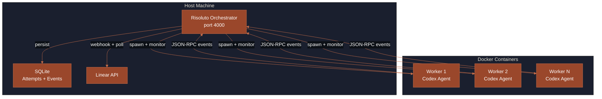

Risoluto is a **local orchestration engine** that connects your issue tracker to AI coding agents.
It receives Linear webhooks (or polls as fallback), claims eligible issues, spins up isolated Docker sandboxes, runs an AI agent inside each one, and delivers the result as a GitHub pull request.

<Frame>

</Frame>

## Issue Lifecycle

Every issue that Risoluto processes follows the same six-stage pipeline.

<Steps>
  <Step title="Detection" icon="satellite-dish">
    Risoluto receives issue changes via **Linear webhooks** in real time. Polling runs as a fallback every **15 seconds** (configurable via `polling.interval_ms`) — when webhooks are active, polling stretches to **2 minutes**.
    Issues in active states (default: *In Progress*) are sorted by priority, then by age, then by identifier as a tiebreaker.
  </Step>

  <Step title="Workspace Creation" icon="folder-open">
    Each claimed issue gets its own isolated directory under `workspace.root`. Two strategies are available:

    | Strategy | How it works | Disk usage |
    |----------|-------------|------------|
    | **`directory`** (default) | Full `git clone` per issue | Higher — full repo each time |
    | **`worktree`** | Git worktree from a shared bare clone | Lower — shares object store |
  </Step>

  <Step title="Sandbox Launch" icon="docker">
    Risoluto launches a Docker container for each issue with strict isolation:

    - **Image** — `risoluto-codex:latest` (Ubuntu 24.04 + Node.js 22 + Codex CLI)
    - **Isolation** — workspace bind-mounted at its original absolute path
    - **Permissions** — runs as your UID/GID (`--user $(id -u):$(id -g)`)
    - **Resources** — configurable memory (default 4 GB), CPU (default 2 cores), and tmpfs limits
    - **Security** — `--cap-drop=ALL`, `--security-opt=no-new-privileges`, optional egress allowlist
  </Step>

  <Step title="Agent Execution" icon="robot">
    Inside the container, the Codex agent:

    1. Reads the issue description as its task prompt
    2. Has access to the full repository in its workspace
    3. Executes tools (file edits, shell commands) per the configured approval policy
    4. Reports progress via JSON-RPC events streamed back to Risoluto
  </Step>

  <Step title="Delivery" icon="code-pull-request">
    When the agent completes successfully:

    1. Risoluto commits changes to a feature branch (`risoluto/<issue-id>`)
    2. Opens a GitHub pull request with the issue context
    3. Transitions the Linear issue to the configured success state
    4. Sends a Slack notification (if configured)
  </Step>

  <Step title="Cleanup" icon="broom">
    After delivery (or on failure after exhausting retries), the workspace is cleaned up and resources released. Archived run data persists in the SQLite database for observability.
  </Step>
</Steps>

## Architecture Overview

<Frame>

</Frame>

## Lifecycle Hooks

Workspaces support lifecycle hooks at each stage, letting you run linters, install dependencies, or clean up artifacts.

<Frame>

</Frame>

<Tip>
  Hooks time out after 60 seconds by default. Override with `hooks.timeout_ms` in your config overlay.
</Tip>

## Concurrency & Scheduling

| Setting | Config key | Default | Description |
|---------|-----------|---------|-------------|
| Global limit | `agent.maxConcurrentAgents` | `10` | Maximum simultaneous workers |
| Per-state limits | `agent.maxConcurrentAgentsByState` | — | e.g. `{"In Progress": 5}` |
| Priority sorting | — | enabled | Higher priority issues dispatch first |
| Blocked suppression | — | enabled | Issues in blocked states are skipped |

## Retry & Recovery

When an agent fails, Risoluto applies exponential backoff:

| Behavior | Config key | Default |
|----------|-----------|---------|
| Max retries | `agent.maxContinuationAttempts` | `5` |
| Backoff cap | `agent.maxRetryBackoffMs` | `300000` (5 min) |
| OOM detection | — | Exit code 137 surfaced as `container_oom` |
| Stall detection | `agent.stallTimeoutMs` | `1200000` (20 min) |

## Data Storage

All runtime state lives in a single directory (default: `~/.risoluto/`):

<Tree>
  <TreeItem name="~/.risoluto/" type="directory">
    <TreeItem name="risoluto.db" type="file" description="SQLite — attempts, events, issue index" />
    <TreeItem name="config/" type="directory">
      <TreeItem name="overlay.yaml" type="file" description="Persistent operator config" />
    </TreeItem>
    <TreeItem name="master.key" type="file" description="AES-256 encryption key" />
    <TreeItem name="secrets.enc" type="file" description="Encrypted credential store" />
  </TreeItem>
</Tree>

## What's Next

<CardGroup cols={2}>
  <Card title="Runtime Behavior" icon="gauge-high" href="/concepts/runtime">
    Polling intervals, timeouts, retries, and the state machine.
  </Card>
  <Card title="Trust Model" icon="shield-halved" href="/concepts/trust-model">
    Sandbox policies, credential handling, and security posture.
  </Card>
  <Card title="Configuration" icon="gear" href="/guides/configuration">
    Customize models, workspaces, hooks, and resource limits.
  </Card>
  <Card title="Docker Deployment" icon="docker" href="/guides/docker">
    Run Risoluto as a persistent service with Docker Compose.
  </Card>
</CardGroup>
