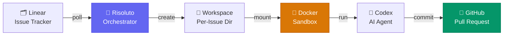
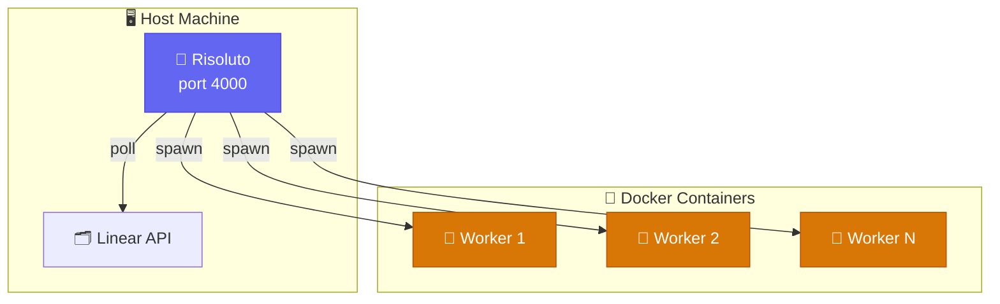

# How It Works

Risoluto is a **local orchestration engine** that connects your issue tracker to AI coding agents. Here's the full pipeline:

## The Pipeline

### 1. Polling

Risoluto polls Linear on a configurable interval (default: 30 seconds) looking for issues in active states (typically "In Progress"). Issues are sorted by priority, then by age.

### 2. Workspace Creation

Each issue gets its own isolated directory under `workspace.root`. Two strategies are available:

| Strategy | How it works | Disk usage |
|----------|-------------|------------|
| **`directory`** (default) | Full `git clone` per issue | Higher — full repo each time |
| **`worktree`** | Git worktree from a shared bare clone | Lower — shares object store |

### 3. Sandbox Execution

Risoluto launches a Docker container for each issue:

- **Image**: `risoluto-codex:latest` (Node 22 + Codex CLI)
- **Isolation**: Workspace bind-mounted at its original path
- **Permissions**: Runs as your UID/GID — no ownership drift
- **Resources**: Configurable memory, CPU, and tmpfs limits
- **Security**: `--cap-drop=ALL`, `--security-opt=no-new-privileges`, optional egress allowlist

### 4. Agent Execution

Inside the container, the Codex agent:

- Reads the issue description as its task
- Has access to the full repository in its workspace
- Executes tools (file edits, shell commands, etc.) per the configured approval policy
- Reports progress via JSON-RPC events streamed back to Risoluto

### 5. Delivery

When the agent completes successfully:

1. Risoluto commits changes to a feature branch
2. Opens a GitHub pull request
3. Transitions the Linear issue to the configured success state
4. Sends a Slack notification (if configured)

## Architecture Diagram

## Lifecycle Hooks

Workspaces support lifecycle hooks at each stage:

Use hooks to run linters, install dependencies, or clean up artifacts at each stage.

## Concurrency & Scheduling

- **Global limit**: `agent.maxConcurrentAgents` (default: 10)
- **Per-state limits**: `agent.maxConcurrentAgentsByState` (e.g., `{"In Progress": 5}`)
- **Priority sorting**: Higher priority issues are dispatched first
- **Blocked suppression**: Issues in blocked states are skipped automatically

## Retry & Recovery

When an agent fails, Risoluto applies exponential backoff:

- Retries up to `agent.maxContinuationAttempts` times (default: 5)
- Backoff capped at `agent.maxRetryBackoffMs` (default: 5 minutes)
- OOM kills (exit code 137) are detected and surfaced as `container_oom`
- Stalled agents (no events for `agent.stallTimeoutMs`) are killed

## Data Storage

All runtime state lives in a single directory (default: `~/.risoluto/`):

| Path | Purpose |
|------|---------|
| `risoluto.db` | SQLite database — attempts, events, issue index |
| `config/overlay.yaml` | Persistent operator config |
| `master.key` | AES encryption key |
| `secrets.enc` | Encrypted credential store |
