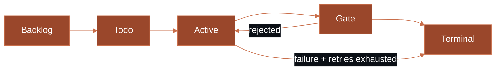

# Runtime Behavior

How Risoluto manages agents from dispatch to completion.

## Detection & Work Selection

Risoluto receives issue changes via **Linear webhooks** in real time. Polling runs as a safety net every **15 seconds** by default (`polling.interval_ms`) — when webhooks are active, polling stretches to **2 minutes** (`webhook.pollingStretchMs`).

Candidates are filtered using `tracker.active_states` and dispatched based on:

1. **Priority** — higher priority issues first (lower number = higher priority)
2. **Age** — oldest creation time within the same priority
3. **Identifier** — alphabetical as a final tiebreaker

During startup, active issues emit lifecycle events through the SSE stream so operators can see where time is being spent:

| Event | Description |
|-------|-------------|
| `issue_queued` | Issue waiting for an available slot |
| `workspace_preparing` | Git clone or worktree creation in progress |
| `workspace_ready` | Workspace available, preparing container |
| `container_starting` | Docker container being created |
| `container_running` | Container started, Codex initializing |
| `codex_initializing` | JSON-RPC handshake in progress |
| `thread_started` | Agent has begun working |

## Timeouts & Retries

<AccordionGroup>
  <Accordion title="Polling, Webhooks & Hooks">
    | Setting | Config key | Default | Purpose |
    |---------|-----------|---------|---------|
    | Poll interval | `polling.interval_ms` | `15000` (15 s) | Time between Linear polls (no webhook) |
    | Webhook stretch | `webhook.pollingStretchMs` | `120000` (2 min) | Poll interval when webhooks are active |
    | Webhook health check | `webhook.healthCheckIntervalMs` | `300000` (5 min) | Interval to verify webhook health |
    | Hook timeout | `hooks.timeout_ms` | `60000` (1 min) | Max time for lifecycle hooks |
  </Accordion>

  <Accordion title="Codex Communication">
    | Setting | Config key | Default | Purpose |
    |---------|-----------|---------|---------|
    | Read timeout | `codex.read_timeout_ms` | `5000` (5 s) | JSON-RPC read timeout |
    | Turn timeout | `codex.turn_timeout_ms` | `3600000` (1 h) | Max time per agent turn |
    | Turn stall | `codex.stall_timeout_ms` | `300000` (5 min) | Detect silent turns |
    | Startup timeout | `codex.startup_timeout_ms` | `30000` (30 s) | Container startup limit |
  </Accordion>

  <Accordion title="Agent Lifecycle">
    | Setting | Config key | Default | Purpose |
    |---------|-----------|---------|---------|
    | Agent stall | `agent.stall_timeout_ms` | `1200000` (20 min) | Kill silent agents |
    | Max turns | `agent.max_turns` | `20` | Conversation turns per run |
    | Max retries | `agent.max_continuation_attempts` | `5` | Continuation turns per issue |
    | Retry backoff | `agent.max_retry_backoff_ms` | `300000` (5 min) | Max retry delay |
  </Accordion>
</AccordionGroup>

<Tip>
  For safer live proving, set `codex.turn_timeout_ms` to something short like `120000` (2 minutes).
</Tip>

## Container Lifecycle

### Startup

Risoluto creates a fresh per-attempt `CODEX_HOME` with generated `config.toml`, injects auth credentials, and launches the container with resource limits.

### Normal Shutdown

<Frame>

</Frame>

### Abort / Shutdown

<Frame>

</Frame>

### OOM Detection

Exit code `137` with `OOMKilled=true` is surfaced as `container_oom` — a retryable failure. Increase `codex.sandbox.resources.memory` (default: `4g`) if this occurs frequently.

## Model Overrides

Override the model for any issue via the dashboard or API:

```bash
curl -s -X POST http://127.0.0.1:4000/api/v1/MT-42/model \
  -H 'Content-Type: application/json' \
  -d '{"model":"gpt-5.4","reasoning_effort":"medium"}'
```

<Note>
  Model changes do **not** interrupt the active worker — they apply on the next run.
</Note>

## State Machine

Risoluto tracks issues through configurable workflow stages.

<Frame>

</Frame>

| Stage | Kind | Description | Dispatch eligible? |
|-------|------|-------------|:------------------:|
| Backlog | `backlog` | Not yet triaged | No |
| Todo | `todo` | Ready for work | No |
| In Progress | `active` | Being worked on | **Yes** |
| In Review | `gate` | Awaiting review or approval | No |
| Done / Canceled | `terminal` | Finished — triggers cleanup | No |

<Info>
  When `stateMachine.stages` is empty (the default), Risoluto derives stages from Linear's workflow configuration automatically. You only need to configure stages explicitly if you want custom behavior.
</Info>

## What's Next

<CardGroup cols={2}>
  <Card title="Trust Model" icon="shield-halved" href="/concepts/trust-model">
    Sandbox policies, credential handling, and security posture.
  </Card>
  <Card title="Configuration" icon="gear" href="/guides/configuration">
    Customize every timeout, limit, and behavior shown on this page.
  </Card>
  <Card title="Observability" icon="chart-line" href="/operating/observability">
    SSE events, Prometheus metrics, and structured logs.
  </Card>
  <Card title="Troubleshooting" icon="wrench" href="/operating/troubleshooting">
    Diagnose OOMs, stalls, and failed deliveries.
  </Card>
</CardGroup>
