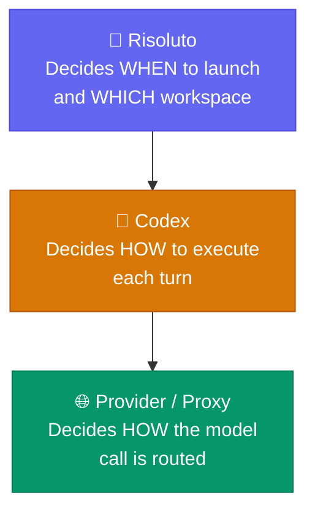

# Trust Model

Risoluto is designed for **local, operator-controlled, high-trust environments**. It runs on your machine or a VDS you control — there is no cloud service, no SaaS, and no shared infrastructure.

## Trust Layers



| Layer | Component | Responsibility |
|:-----:|-----------|---------------|
| **1** | **Risoluto** | Decides when to launch work and what workspace the worker can access |
| **2** | **Codex** | Decides how to execute each turn, including tool approvals and MCP servers |
| **3** | **Provider / Proxy** | Decides which backing account or route handles the actual model call |

## Default Trust Posture

<Warning>
  The current default posture is deliberately **high trust** — appropriate **only** for local, operator-controlled environments.
</Warning>

| Setting | Value |
|---------|-------|
| `approval_policy` | `"never"` |
| `thread_sandbox` | `"danger-full-access"` |
| `turn_sandbox_policy` | `{ type: "dangerFullAccess" }` |

## Docker Sandbox Boundary

Agents run inside Docker containers with configurable security:

| Property | How |
|----------|-----|
| **Path identity** | Workspace paths are bind-mounted at the same absolute path |
| **Auth preservation** | Credentials injected into per-attempt runtime home |
| **Host permissions** | Container runs as `--user $(id -u):$(id -g)` |
| **Network** | Default bridge (full internet) or restricted custom network |

### Security Hardening

| Option | Config Key | Default |
|--------|-----------|---------|
| No new privileges | `codex.sandbox.security.noNewPrivileges` | `true` |
| Drop capabilities | `codex.sandbox.security.dropCapabilities` | `true` |
| gVisor runtime | `codex.sandbox.security.gvisor` | `false` |
| Seccomp profile | `codex.sandbox.security.seccompProfile` | `""` |

### Egress Allowlist

Restrict outbound network access from agent containers:

```yaml
codex:
  sandbox:
    egress_allowlist:
      - api.openai.com
      - api.linear.app
      - "*.github.com"
```

<Warning>
  Enabling egress allowlist adds `CAP_NET_ADMIN` back despite `--cap-drop=ALL`. This partially weakens the default capability posture but is required for iptables-based filtering.
</Warning>

## Credentials

| Credential | Source | Purpose |
|-----------|--------|---------|
| **Linear** | `tracker.api_key` (typically `$LINEAR_API_KEY`) | Poll issues |
| **Codex auth** | API key or `auth.json` from `codex.auth.source_home` | Model calls |
| **GitHub PAT** | Optional, via setup wizard or `$GITHUB_TOKEN` | PR creation |

All credentials are stored in an AES-256-GCM encrypted store (`secrets.enc`) protected by the master key generated during setup.

## Provider Boundary

Risoluto supports three auth modes:

| Mode | Config | Use Case |
|------|--------|----------|
| **Direct API** | `codex.auth.mode: "api_key"` | OpenAI API key |
| **Custom provider** | `api_key` + `codex.provider.base_url` | OpenAI-compatible proxy |
| **Codex Login** | `codex.auth.mode: "openai_login"` | ChatGPT/Codex subscription |

When running in Docker, containers cannot reach `127.0.0.1` on the host. Risoluto transparently rewrites host-bound URLs to `host.docker.internal`.

## Network Security

See the [Network Security guide](/guides/security) for bind address, write tokens, and rate limiting configuration.
