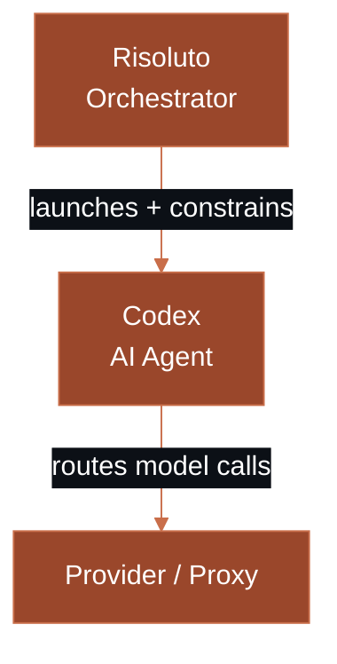

Risoluto is designed for **local-first, operator-controlled, high-trust environments**. It runs on your machine or a VDS you control. A managed cloud option is planned, but the self-hosted model remains the primary deployment path.

## Trust Layers

Three components form a chain of trust. Each layer controls a different decision boundary.

<Frame>

</Frame>

| Layer | Component | Controls |
|:-----:|-----------|----------|
| **1** | **Risoluto** | *When* to launch work, *which* workspace the worker can access, resource limits, network policy |
| **2** | **Codex** | *How* to execute each turn — tool approvals, sandbox enforcement, MCP server access |
| **3** | **Provider / Proxy** | *Where* the model call is routed — backing account, rate limits, content policy |

## Sandbox Policies

The `thread_sandbox` setting controls what the Codex agent is allowed to do inside its container.

| Policy | Description | Risk level |
|--------|-------------|:----------:|
| `workspace-read` | Read-only access to the workspace. No file writes, no shell commands. | Low |
| **`workspace-write`** (default) | Read/write access scoped to the workspace directory. Shell commands allowed within the workspace. | Medium |
| `danger-full-access` | Unrestricted filesystem and network access inside the container. | High |

<Warning>
  `danger-full-access` gives the agent full control inside the container. Only use it for trusted, well-understood workloads — never in shared or production environments.
</Warning>

### Default Trust Posture

| Setting | Default value |
|---------|--------------|
| `codex.approval_policy` | `"never"` (auto-approve all tool calls) |
| `codex.thread_sandbox` | `"workspace-write"` |

<Tip>
  **Recommended posture by environment:**
  - **Local development** — `workspace-write` with `approval_policy: "never"` (the default). Fast iteration, scoped writes.
  - **Shared staging** — `workspace-write` with `approval_policy: "unless-allow-listed"`. Require explicit approval for unknown tools.
  - **Untrusted workloads** — `workspace-read` with a strict egress allowlist. Maximum containment.
</Tip>

## Docker Sandbox Boundary

Agents run inside Docker containers with configurable security hardening.

| Property | How it works |
|----------|-------------|
| **Path identity** | Workspace paths bind-mounted at the same absolute path |
| **Auth preservation** | Credentials injected into per-attempt runtime home |
| **Host permissions** | Container runs as `--user $(id -u):$(id -g)` — no ownership drift |
| **Network** | Default bridge (full internet) or restricted custom network |

### Security Hardening

| Option | Config key | Default |
|--------|-----------|---------|
| No new privileges | `codex.sandbox.security.noNewPrivileges` | `true` |
| Drop capabilities | `codex.sandbox.security.dropCapabilities` | `true` |
| gVisor runtime | `codex.sandbox.security.gvisor` | `false` |
| Seccomp profile | `codex.sandbox.security.seccompProfile` | `""` (Docker default) |

### Egress Allowlist

Restrict outbound network access from agent containers:

```yaml
codex:
  sandbox:
    egress_allowlist:
      - api.openai.com
      - api.linear.app
      - "*.github.com"
```

<Warning>
  Enabling the egress allowlist adds `CAP_NET_ADMIN` back despite `--cap-drop=ALL`. This partially weakens the default capability posture but is required for iptables-based filtering inside the container.
</Warning>

## Credentials

| Credential | Source | Purpose |
|-----------|--------|---------|
| **Linear API key** | `tracker.api_key` (typically `$LINEAR_API_KEY`) | Poll and transition issues |
| **Codex auth** | API key or `auth.json` from `codex.auth.source_home` | Model API calls |
| **GitHub PAT** | Optional, via setup wizard or `$GITHUB_TOKEN` | PR creation |

All credentials are stored in an AES-256-GCM encrypted store (`secrets.enc`) protected by the master key generated during setup. The master key never leaves your machine.

## Provider Boundary

Risoluto supports three auth modes for connecting to the model provider:

<AccordionGroup>
  <Accordion title="Direct API Key">
    ```yaml
    codex:
      auth:
        mode: api_key
    ```
    Standard OpenAI API key (`sk-...`). Risoluto validates and encrypts it during setup.
  </Accordion>

  <Accordion title="Custom Provider / Proxy">
    ```yaml
    codex:
      auth:
        mode: api_key
      provider:
        base_url: https://my-proxy.internal/v1
    ```
    Any OpenAI-compatible endpoint. Useful for cost tracking proxies, self-hosted models, or enterprise gateways.
  </Accordion>

  <Accordion title="Codex Login (Browser Auth)">
    ```yaml
    codex:
      auth:
        mode: openai_login
    ```
    Authenticates via PKCE in your browser. Uses your ChatGPT/Codex subscription directly.
  </Accordion>
</AccordionGroup>

<Note>
  When running in Docker, containers cannot reach `127.0.0.1` on the host. Risoluto transparently rewrites host-bound URLs to `host.docker.internal`.
</Note>

## Network Security

See the [Network Security guide](/guides/security) for bind address, write tokens, and rate limiting configuration.

## What's Next

<CardGroup cols={2}>
  <Card title="How It Works" icon="diagram-project" href="/concepts/how-it-works">
    Full architecture walkthrough — polling, workspaces, sandboxes, delivery.
  </Card>
  <Card title="Network Security" icon="lock" href="/guides/security">
    Bind address, write tokens, rate limiting, and TLS.
  </Card>
  <Card title="Custom Sandbox" icon="docker" href="/recipes/custom-sandbox">
    Build a custom sandbox image with your own dependencies.
  </Card>
  <Card title="Configuration" icon="gear" href="/guides/configuration">
    Customize sandbox policies, auth modes, and security hardening.
  </Card>
</CardGroup>
