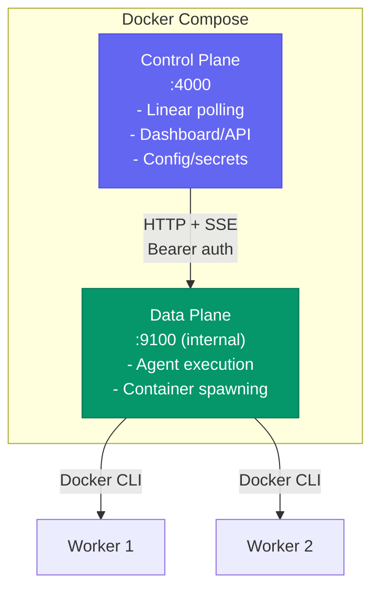

Risoluto always launches agent workers in Docker containers. The orchestrator itself can run either directly on the host or inside its own container.

## Project Structure

The repo ships three Dockerfiles:

<Tree>
  <File name="Dockerfile" description="Main orchestrator — Node.js 24, Docker CLI, port 4000" />
  <File name="Dockerfile.sandbox" description="Agent sandbox — Ubuntu 24.04, Node.js 22, Codex CLI, bubblewrap" />
  <File name="Dockerfile.data-plane" description="Remote dispatch worker — Node.js 24, Docker CLI, port 9100" />
  <File name="docker-compose.yml" description="Compose stack with named volumes and internal network" />
</Tree>

## Deployment Modes

<Tabs>
  <Tab title="Zero-Config (Wizard)">
    The simplest way to get started — no environment variables needed:

    ```bash
    docker compose up --build
    ```

    Open [http://localhost:4000](http://localhost:4000) and the **setup wizard** guides you through all credentials.

    ### Named Volumes

    | Volume | Purpose |
    |--------|---------|
    | `risoluto-archives` | Encrypted secrets, config overlay, auth tokens, run archives |
    | `risoluto-workspaces` | Cloned repositories for each issue |
    | `codex-auth` | OpenAI Codex login tokens |
  </Tab>
  <Tab title="Pre-seeded Credentials">
    For environments where you want to skip the wizard:

    ```bash
    cp .env.example .env
    # Fill in credentials and host paths
    docker compose up --build
    ```

    Key environment variables:

    ```bash
    LINEAR_API_KEY=lin_api_...
    LINEAR_PROJECT_SLUG=my-project
    MASTER_KEY=your-encryption-key
    OPENAI_API_KEY=sk-...
    GITHUB_TOKEN=ghp_...
    ```

    <Tip>
      When `MASTER_KEY` is set before first boot, Risoluto skips setup mode and starts the orchestrator immediately.
    </Tip>
  </Tab>
  <Tab title="Host (No Docker for Orchestrator)">
    Run the orchestrator directly on the host — only agent workers use Docker:

    ```bash
    # 1. Install Node.js 22+ and Docker
    # 2. Clone and build
    git clone https://github.com/OmerFarukOruc/risoluto.git && cd risoluto
    pnpm install && pnpm run build

    # 3. Build the sandbox image
    bash bin/build-sandbox.sh

    # 4. Start — complete setup via the wizard
    node dist/cli/index.js --data-dir /var/lib/risoluto --port 4000
    ```

    <Tip>
      For persistent operation, run Risoluto under `systemd`, `tmux`, or `screen`.
    </Tip>
  </Tab>
</Tabs>

## Container Behavior

Inside Docker, paths resolve differently:

| Setting | Container Value | Purpose |
|---------|----------------|---------|
| `DATA_DIR` | `/data` | Archive root becomes `/data/archives` |
| `workspace.root` | `/data/workspaces` | Cloned repos live here inside the container |
| `RISOLUTO_BIND` | `0.0.0.0` | Listen on all interfaces (required inside Docker) |

The `PathRegistry` automatically translates container paths back to host bind-mount sources before launching worker containers.

## Docker Networking

Containers cannot reach the host's `127.0.0.1`. Risoluto automatically:

1. Adds `--add-host=host.docker.internal:host-gateway` to every worker container
2. Rewrites `127.0.0.1` to `host.docker.internal` in the Codex `config.toml`

<Note>
  If you use a host-side proxy like CLIProxyAPI, run it once on the host. All sandbox containers reach it over the Docker bridge network.
</Note>

## Control / Data Plane Split

For scale-out scenarios (remote workers, hot upgrades, multi-host), enable **remote dispatch mode**:

```bash
# .env
DISPATCH_MODE=remote
DISPATCH_URL=http://data-plane:9100/dispatch
DISPATCH_SHARED_SECRET=your-secure-secret-here
```

```bash
# Start both services
docker compose --profile full up --build
```



The data plane is **not exposed to the host** — it only listens on the private `risoluto-internal` bridge network.

| Scenario | Benefit |
|----------|---------|
| Hot upgrades | Upgrade control plane without killing active agents |
| Multi-host workers | Data plane runs on remote hosts via SSH |
| Interactive workspaces | WebSocket proxy routes to correct data plane |
| Multi-repo orchestration | Multiple data planes with different checkouts |

<Note>
  Remote dispatch is opt-in. The default `DISPATCH_MODE=local` runs everything in one process.
</Note>

<AccordionGroup>
  <Accordion title="Custom Docker Networks">
    Attach worker containers to a specific network:

    ```yaml
    # config overlay
    codex:
      sandbox:
        network: my-custom-network
    ```

    This passes `--network=my-custom-network` to every `docker run` invocation.
  </Accordion>
  <Accordion title="gVisor Runtime">
    For defense-in-depth sandbox isolation, enable gVisor:

    ```yaml
    codex:
      sandbox:
        security:
          gvisor: true
    ```

    Requires `runsc` installed on the Docker host. See the [Security guide](/guides/security) for details.
  </Accordion>
  <Accordion title="Egress Allowlists">
    Restrict outbound network access from worker containers:

    ```yaml
    codex:
      sandbox:
        egressAllowlist:
          - "api.openai.com"
          - "api.github.com"
          - "registry.npmjs.org"
    ```

    Only listed domains are reachable from inside the sandbox.
  </Accordion>
</AccordionGroup>

## Sandbox Image Tooling

The `Dockerfile.sandbox` image ships with:

| Tool | Version | Purpose |
|------|---------|---------|
| Node.js | 22 (via nodesource) | Runtime |
| Codex CLI | latest | AI agent execution |
| bubblewrap | system | Sandbox isolation (`--argv0`) |
| git | system | Source control |
| jq, ripgrep | system | JSON processing, search |

The container runs as your user (`--user $(id -u):$(id -g)`) to avoid ownership drift on bind-mounted volumes.

<Warning>
  Named Docker volumes survive container/image replacement but **not** `docker system prune --volumes`. Do not prune volumes prefixed with `risoluto-`.
</Warning>

## What's Next

<CardGroup cols={2}>
  <Card title="Setup Wizard" icon="wand-magic-sparkles" href="/guides/setup-wizard">
    Walk through first-time credential configuration.
  </Card>
  <Card title="Configuration" icon="gear" href="/guides/configuration">
    Tune agent concurrency, models, timeouts, and sandbox resources.
  </Card>
</CardGroup>
