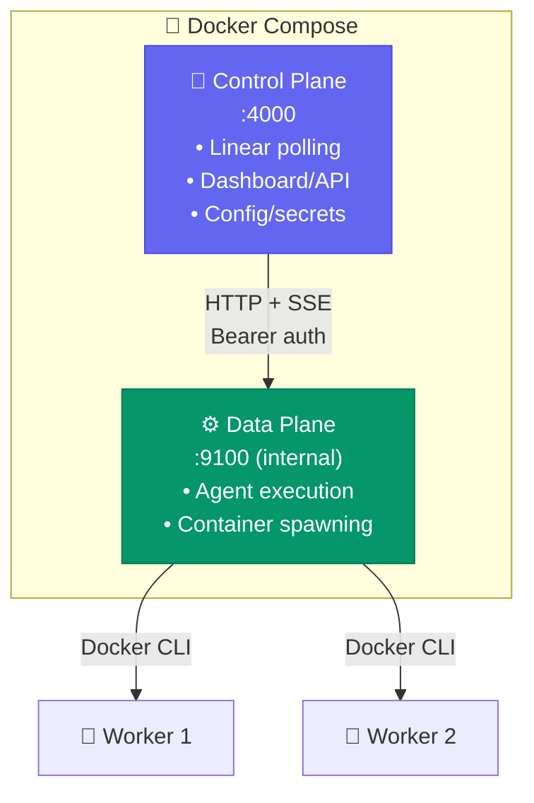

# Docker Deployment

Risoluto always launches agent workers in Docker containers. The orchestrator itself can run either directly on the host or inside its own container.

## Zero-Config Docker Compose

The simplest way to get started — no environment variables needed:

```bash
docker compose up --build
```

Open [http://localhost:4000](http://localhost:4000) and the **setup wizard** guides you through all credentials.

### Named Volumes

| Volume | Purpose |
|--------|---------|
| `risoluto-archives` | Encrypted secrets, config overlay, auth tokens, run archives |
| `risoluto-workspaces` | Cloned repositories for each issue |
| `codex-auth` | OpenAI Codex login tokens |

## Traditional Docker Compose

For pre-seeded credentials:

```bash
cp .env.example .env
# Fill in absolute host paths and credentials
docker compose up --build
```

Key container-specific behavior:

- `DATA_DIR=/data` makes the archive root `/data/archives`
- `workspace.root` resolves to `/data/workspaces` inside the service container
- `PathRegistry` translates container paths back to host bind-mount sources before launching workers

## Docker Networking

Containers cannot reach the host's `127.0.0.1`. Risoluto automatically:

1. Adds `--add-host=host.docker.internal:host-gateway` to every container
2. Rewrites `127.0.0.1` → `host.docker.internal` in the Codex `config.toml`

<Note>
  If you use a host-side proxy like CLIProxyAPI, run it once on the host. All sandbox containers reach it over the Docker bridge network.
</Note>

## Control / Data Plane Split

For scale-out scenarios (remote workers, hot upgrades, multi-host), enable **remote dispatch mode**:

```bash
# .env
DISPATCH_MODE=remote
DISPATCH_URL=http://data-plane:9100/dispatch
DISPATCH_SHARED_SECRET=your-secure-secret-here
```



The data plane is **not exposed to the host** — it only listens on the private Docker bridge network.

| Scenario | Benefit |
|----------|---------|
| Hot upgrades | Upgrade control plane without killing active agents |
| Multi-host workers | Data plane runs on remote hosts via SSH |
| Interactive workspaces | WebSocket proxy routes to correct data plane |
| Multi-repo orchestration | Multiple data planes with different checkouts |

<Note>
  Remote dispatch mode is opt-in. The default `DISPATCH_MODE=local` runs everything in one process.
</Note>

## VDS / Server Deployment

```bash
# 1. Install Node.js 22+ and Docker
# 2. Clone the repo and install
git clone <repo-url> && cd risoluto
pnpm install && pnpm run build

# 3. Build the sandbox image
bash bin/build-sandbox.sh

# 4. Start — complete setup via the wizard at http://server:4000
node dist/cli/index.js --data-dir /var/lib/risoluto --port 4000
```

<Tip>
  For persistent operation, run Risoluto under `systemd`, `tmux`, or `screen`.
</Tip>

## Container Image Tooling

The sandbox Docker image ships with:

| Tool | Version | Purpose |
|------|---------|---------|
| Node.js | 22 (bookworm) | Runtime |
| Codex CLI | 0.116.0 | AI agent execution |
| bubblewrap | system | Sandbox isolation |
| git | system | Source control |
| curl, jq, ripgrep | system | HTTP, JSON, search |

The container runs as your user (`--user $(id -u):$(id -g)`) to avoid ownership drift.

<Warning>
  Named Docker volumes survive container/image replacement but **not** `docker system prune --volumes`. Do not prune volumes prefixed with `risoluto-`.
</Warning>
