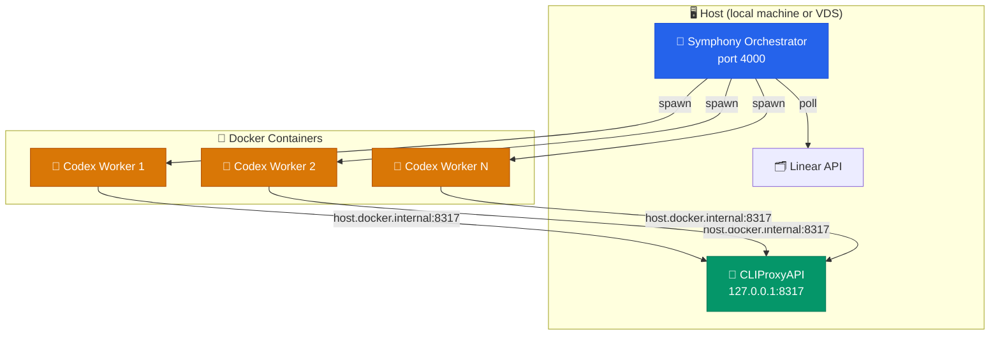

# 🛠️ Operator Guide

> Day-to-day setup and operations reference for Symphony Orchestrator.

---

## 🎵 What Symphony Does

Symphony polls Linear for candidate issues, creates a workspace per issue, launches `codex app-server` inside that workspace, and keeps a local dashboard plus JSON API up to date with live and archived attempt state.

---

## 📋 Prerequisites

| Requirement | Details |
|-------------|---------|
| **Node.js** | v22 or newer |
| **Docker** | Docker Engine installed and running (`docker info` should succeed) |
| **Linear API key** | `LINEAR_API_KEY` in your environment |
| **Codex auth** | Working auth setup for your `codex app-server` command |

---

## 🌐 Deployment Architecture

Symphony always launches workers in Docker, but the model-routing/auth layer is now generic. You can use:

- direct OpenAI API auth with `OPENAI_API_KEY`
- a custom OpenAI-compatible provider via `codex.provider`
- ChatGPT/Codex login via `codex login` and `codex.auth.mode: openai_login`

Optional host-side proxies such as [CLIProxyAPI](https://github.com/router-for-me/CLIProxyAPI) still work; Symphony rewrites host-bound URLs so Docker workers can reach them.



> [!IMPORTANT]
> If you use a host-side proxy such as CLIProxyAPI, run it **once on the host** and let all sandbox containers reach it over the network. Do not install it inside the Docker images.

### 🐳 How Docker Networking Works

Containers cannot reach the host's `127.0.0.1`. Symphony automatically:

1. Adds `--add-host=host.docker.internal:host-gateway` to every container
2. Rewrites `127.0.0.1` → `host.docker.internal` in the Codex `config.toml` when running inside Docker

This is transparent — Symphony rewrites host-bound provider URLs in the generated runtime config at container startup.

### 🖥️ VDS / Server Deployment

```bash
# 1. Install Node.js 22+ and Docker
# 2. Clone the repo and install
git clone <repo-url> && cd symphony-orchestrator
npm install && npm run build

# 3. Build the sandbox image
bash bin/build-sandbox.sh

# 4. Choose a Codex auth mode
#    API key:
export OPENAI_API_KEY="sk-..."
#    or ChatGPT/Codex login:
#    codex login
#    for headless machines:
#    codex login --device-auth

# 5. Optional: configure a host-side OpenAI-compatible proxy
#    Example: CLIProxyAPI listening on 127.0.0.1:8317

# 6. Export credentials and start
export LINEAR_API_KEY="lin_api_..."
node dist/cli.js ./WORKFLOW.md --port 4000
```

> [!TIP]
> For persistent operation, run Symphony and CLIProxyAPI under `systemd`, `tmux`, or `screen`.

---

## 📄 Choose the Right Workflow File

| File | When to use |
|------|-------------|
| `WORKFLOW.example.md` | Portable example setup (recommended for getting started) |
| `WORKFLOW.md` | Repository's checked-in live smoke path |

> [!TIP]
> `WORKFLOW.example.md` is the API-key/custom-provider example. `WORKFLOW.md` is the local `codex login` smoke path. Both create a fresh temporary container-local runtime `CODEX_HOME` for each attempt instead of relying on a checked-in fixture home.

---

## 📦 Install and Validate

```bash
# Install dependencies
npm install

# Run the deterministic test suite
npm test

# Build the project
npm run build

# Build the Docker sandbox image
bash bin/build-sandbox.sh

# Dry-start the portable workflow
node dist/cli.js ./WORKFLOW.example.md
```

If `LINEAR_API_KEY` is missing, Symphony exits with:

```text
error code=missing_tracker_api_key msg="tracker.api_key is required after env resolution"
```

If `WORKFLOW.example.md` is using the default API-key mode and `OPENAI_API_KEY` is missing, Symphony exits with:

```text
error code=missing_codex_provider_env msg="codex runtime requires OPENAI_API_KEY in the host environment"
```

---

## ▶️ Start the Service

```bash
node dist/cli.js ./WORKFLOW.example.md --port 4000
```

- 🖥️ **Dashboard**: [http://127.0.0.1:4000/](http://127.0.0.1:4000/)
- 📡 **API**: `curl -s http://127.0.0.1:4000/api/v1/state`

## 🧪 First End-to-End Smoke Issue

For the first live proving run, use an issue that can succeed even if the workspace contains no cloned repository yet.

### Create the Linear Issue

Put the issue in an active state such as `In Progress`, not `Todo`, and use:

**Title**

```text
SMOKE: create workspace proof file
```

**Description**

```md
Goal: prove Symphony can pick up a live issue, launch Codex, write a file in the issue workspace, and archive the attempt.

Steps:
1. Create `SYMPHONY_SMOKE_RESULT.md` in the workspace for this issue.
2. Include:
   - the issue identifier
   - the current UTC timestamp
   - the current working directory
   - the output of `pwd`
   - the output of `ls -la`
   - one line saying whether the workspace looks empty or repo-backed
3. Do not modify files outside the issue workspace.
4. Stop after the file exists and the summary is written.
```

### Verify the Run

1. Start Symphony and open the dashboard or poll `GET /api/v1/state`.
2. Confirm the issue appears under `running`.
3. Check `GET /api/v1/<ISSUE_IDENTIFIER>` or `GET /api/v1/<ISSUE_IDENTIFIER>/attempts` for a recorded attempt.
4. Inspect `workspace.root/<ISSUE_IDENTIFIER>/SYMPHONY_SMOKE_RESULT.md`. With the checked-in workflows, the default root is `$TMPDIR/symphony_workspaces`.
5. After the first successful attempt lands, move the issue to `Done` or another terminal state so Symphony stops scheduling continuation turns for the still-active issue.

The checked-in workflows also instruct the agent to finish with `SYMPHONY_STATUS: DONE` on success or `SYMPHONY_STATUS: BLOCKED` when it cannot proceed. Symphony uses that explicit signal to stop local continuation turns for one-shot issues.

---

## ⚙️ Runtime Behavior

### 🔄 Polling and Work Selection

Symphony polls Linear on the configured interval, filters candidates using `tracker.active_states`, sorts dispatches by priority then oldest creation time then identifier, suppresses blocked `Todo` issues, and enforces both the global concurrency limit and any per-state caps from `agent.max_concurrent_agents_by_state`.

### 📁 Workspace Lifecycle

Each issue gets its own workspace directory under `workspace.root`. Hooks run at these stages:


Hook execution is bounded by `hooks.timeout_ms`.

### ⏱️ Timeouts and Retries

| Knob | Config Key | Purpose |
|------|-----------|---------|
| Hook timeout | `hooks.timeout_ms` | Max time for any lifecycle hook |
| Read timeout | `codex.read_timeout_ms` | JSON-RPC read timeout |
| Turn timeout | `codex.turn_timeout_ms` | Total time for a single turn |
| Stall timeout | `codex.stall_timeout_ms` | Detect long-silent workers |
| Retry backoff | `agent.max_retry_backoff_ms` | Ceiling for retry delay |
| Active states | `tracker.active_states` | Which tracker states are eligible for dispatch |
| Terminal states | `tracker.terminal_states` | Which states stop work and trigger cleanup |

> [!TIP]
> For safer live proving, set `codex.turn_timeout_ms` to something short like `120000` (2 minutes).

### 🐳 Docker Sandbox

Symphony runs the Codex agent inside a Docker container by default using a `node:22-bookworm` base image with the Codex CLI installed globally. This provides process isolation, resource limits, and security hardening.

**Key runtime behavior:**

| Property | How |
|----------|-----|
| **Path identity** | All host paths are bind-mounted at their same absolute path inside the container |
| **Host permissions** | Container runs as your UID/GID — no ownership drift |
| **Writable HOME** | A persistent named volume is mounted at `/home/agent` for npm/pip/git caches |
| **Generated runtime home** | Symphony materializes a temporary container-local `CODEX_HOME` per attempt and removes it with the container |
| **Resource limits** | Memory, CPU, and tmpfs are configurable via `codex.sandbox.resources` |
| **OOM detection** | Exit code 137 with `OOMKilled=true` is surfaced as `container_oom` (retryable) |

**Container lifecycle on abort/shutdown:**


**Configuration:** See `codex.sandbox` in `WORKFLOW.example.md` for all available settings.

> [!WARNING]
> Named Docker volumes (build caches) survive container/image replacement, but **not** `docker system prune --volumes`. Do not prune volumes prefixed with `symphony-`.

> [!TIP]
> For restricted network egress, pre-provision a custom Docker network with `DOCKER-USER` iptables rules and set `codex.sandbox.network` to that network name.

### 🎯 Model Overrides

Save per-issue overrides via the dashboard or the API:

```bash
curl -s -X POST http://127.0.0.1:4000/api/v1/MT-42/model \
  -H 'Content-Type: application/json' \
  -d '{"model":"gpt-5","reasoning_effort":"medium"}'
```

> [!NOTE]
> Model changes do **not** interrupt the active worker — they apply on the next run.

---

## 📡 JSON API Reference

| Method | Endpoint | Description |
|--------|----------|-------------|
| `GET` | `/api/v1/state` | Snapshot — queued, running, retrying, completed + token totals |
| `POST` | `/api/v1/refresh` | Trigger immediate reconciliation pass |
| `GET` | `/api/v1/:issue_identifier` | Issue detail, recent events, archived attempts |
| `GET` | `/api/v1/:issue_identifier/attempts` | Archived attempts + current live attempt id |
| `GET` | `/api/v1/attempts/:attempt_id` | Archived per-attempt event timeline |

---

## 🗂️ Archived Attempts and Logs

By default, archives are stored in `.symphony/` next to the workflow file (override with `--log-dir`).

```
.symphony/
├── issue-index.json
├── attempts/<attempt-id>.json
└── events/<attempt-id>.jsonl
```

This archive keeps historical attempt information visible in the dashboard and API after a restart.

For archive-first CLI inspection, use the repo-root helper:

```bash
./symphony-logs MT-42
./symphony-logs NIN-3 --attempts --dir tests/fixtures/symphony-archive-sandbox/.symphony
./symphony-logs --attempt 00000000-0000-4000-8000-000000000422 --dir tests/fixtures/symphony-archive-sandbox/.symphony
```

The helper emits JSON and prefers `issue-index.json` when present, while still falling back to scanning archived attempt files if the index is missing.

---

## ⚠️ Common Failure Cases

> [!WARNING]
> ### Missing Tracker API Key
> If `tracker.api_key` resolves to an empty value, startup fails with `missing_tracker_api_key`.

> [!WARNING]
> ### Missing Codex Auth
> If `codex app-server` cannot authenticate, `account/read` fails the run early as a startup failure instead of leaving the worker hanging.

> [!WARNING]
> ### Required MCP Startup Failure
> This is a **Codex runtime** problem, not a Symphony bug:
> ```text
> error code=startup_failed msg="thread/start failed because a required MCP server did not initialize"
> ```

> [!WARNING]
> ### Invalid External Credentials
> If the Linear token or provider credentials are invalid, Symphony surfaces the upstream failure rather than crashing.

---

## 🔐 Trust and Auth

Symphony is designed for a local, operator-controlled, high-trust environment.

→ See **[`docs/TRUST_AND_AUTH.md`](TRUST_AND_AUTH.md)** for the full trust boundary and auth model.
