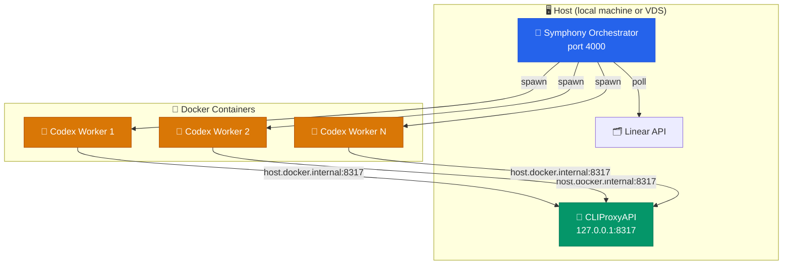
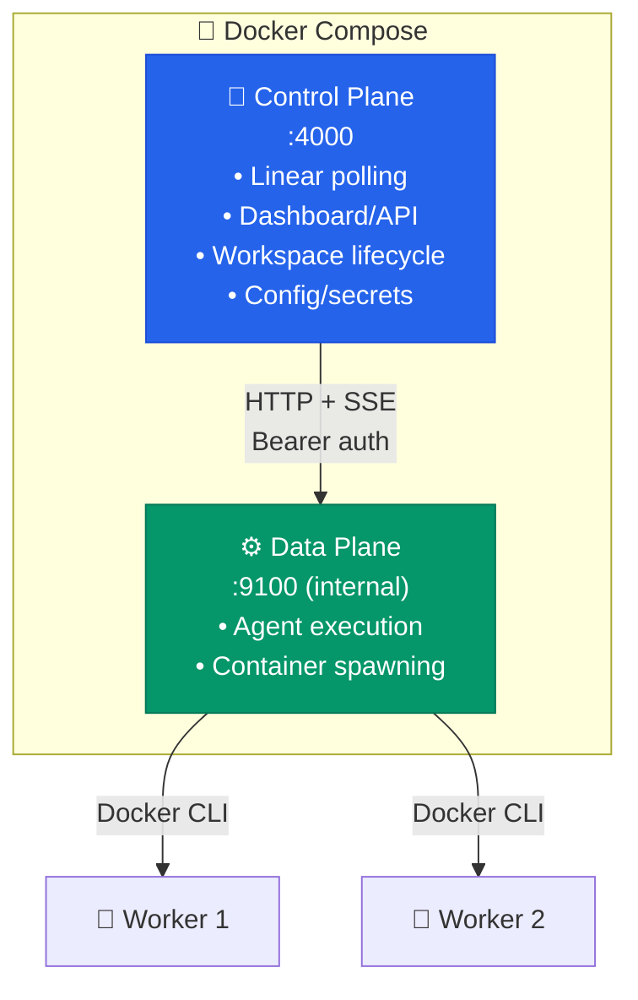

# 🛠️ Operator Guide

> Day-to-day setup and operations reference for Symphony Orchestrator.

---

## 🎵 What Symphony Does

Symphony polls Linear for candidate issues, creates a workspace per issue, launches `codex app-server` inside that workspace, and keeps a local dashboard plus JSON API up to date with live and archived attempt state.

---

## Quick start (5 minutes)

> Already familiar with Symphony? Skip to [Prerequisites](#-prerequisites) for the full setup reference.

**1. Install and build**

```bash
git clone <repo-url> && cd symphony-orchestrator
npm install && npm run build
bash bin/build-sandbox.sh
```

**2. Start Symphony**

```bash
export LINEAR_API_KEY="lin_api_..."
export LINEAR_PROJECT_SLUG="your-linear-project-slug"
node dist/cli/index.js ./WORKFLOW.example.md --port 4000
```

Open http://127.0.0.1:4000 — the **setup wizard** opens automatically and walks you through:

1. **Protect secrets** — generates an encryption master key
2. **Connect Linear** — paste your API key and select a project
3. **Add OpenAI** — paste an API key or use Codex Login (see [Setup Wizard](#-setup-wizard))
4. **Add GitHub** — paste a GitHub PAT (optional)

**3. Verify it works**
Set a Linear issue to "In Progress". Within one poll cycle (default: 30s), Symphony picks it up and the dashboard shows it running.

---

## 📋 Prerequisites

Make sure the following are in place before running Symphony:

| Requirement             | Details                                                            |
| ----------------------- | ------------------------------------------------------------------ |
| **Node.js**             | v22 or newer                                                       |
| **Docker**              | Docker Engine installed and running (`docker info` should succeed) |
| **Linear API key**      | `LINEAR_API_KEY` in your environment                               |
| **Linear project slug** | `LINEAR_PROJECT_SLUG` for the project Symphony should poll         |
| **Codex auth**          | Working auth setup for your `codex app-server` command             |

---

> **Note for new users:** The sections below are the complete operations reference. For day-one setup, the quick start above is all you need.

## 🌐 Deployment Architecture

Symphony always launches workers in Docker, but the model-routing/auth layer is now generic. You can use:

- direct OpenAI API auth with `OPENAI_API_KEY`
- a custom OpenAI-compatible provider via `codex.provider`
- ChatGPT/Codex login via `codex login` and `codex.auth.mode: openai_login`

Optional host-side proxies such as [CLIProxyAPI](https://github.com/router-for-me/CLIProxyAPI) still work; Symphony rewrites host-bound URLs so Docker workers can reach them.



> [!IMPORTANT]
> If you use a host-side proxy such as CLIProxyAPI, run it **once on the host** and let all sandbox containers reach it over the network. Do not install it inside the Docker images.

### 🐳 How Docker Networking Works

Containers cannot reach the host's `127.0.0.1`. Symphony automatically:

1. Adds `--add-host=host.docker.internal:host-gateway` to every container
2. Rewrites `127.0.0.1` → `host.docker.internal` in the Codex `config.toml` when running inside Docker

This is transparent — Symphony rewrites host-bound provider URLs in the generated runtime config at container startup.

### 🖥️ VDS / Server Deployment

```bash
# 1. Install Node.js 22+ and Docker
# 2. Clone the repo and install
git clone <repo-url> && cd symphony-orchestrator
npm install && npm run build

# 3. Build the sandbox image
bash bin/build-sandbox.sh

# 4. Choose a Codex auth mode
#    API key:
export OPENAI_API_KEY="sk-..."
#    or ChatGPT/Codex login:
#    codex login
#    for headless machines:
#    codex login --device-auth

# 5. Optional: configure a host-side OpenAI-compatible proxy
#    Example: CLIProxyAPI listening on 127.0.0.1:8317

# 6. Export credentials and start
export LINEAR_API_KEY="lin_api_..."
export LINEAR_PROJECT_SLUG="your-linear-project-slug"
node dist/cli/index.js ./WORKFLOW.md --port 4000
```

> [!TIP]
> For persistent operation, run Symphony and CLIProxyAPI under `systemd`, `tmux`, or `screen`.

---

## 📄 Choose the Right Workflow File

| File                  | When to use                                              |
| --------------------- | -------------------------------------------------------- |
| `WORKFLOW.example.md` | Portable example setup (recommended for getting started) |
| `WORKFLOW.md`         | Repository's checked-in live smoke path                  |

> [!TIP]
> `WORKFLOW.example.md` is the API-key/custom-provider example. `WORKFLOW.md` is the local `codex login` smoke path. Both create a fresh temporary container-local runtime `CODEX_HOME` for each attempt instead of relying on a checked-in fixture home.

Both checked-in workflows resolve `tracker.project_slug` from `LINEAR_PROJECT_SLUG`, so you can reuse the same files across different Linear projects without editing tracked config.

To find that value, open the Linear project in your browser and copy the segment after `/project/` from the URL:

```text
https://linear.app/<workspace>/project/<project-slug>/overview
```

Example:

```text
https://linear.app/ninetech/project/symphony-test-e1e26e4576d1/overview
```

uses:

```bash
export LINEAR_PROJECT_SLUG="symphony-test-e1e26e4576d1"
```

---

## 📦 Install and Validate

```bash
# Install dependencies
npm install

# Run the deterministic test suite
npm test

# Build the project
npm run build

# Build the Docker sandbox image
bash bin/build-sandbox.sh

# Point Symphony at the Linear project it should dispatch from
export LINEAR_PROJECT_SLUG="your-linear-project-slug"

# Dry-start the portable workflow
node dist/cli/index.js ./WORKFLOW.example.md
```

If `LINEAR_PROJECT_SLUG` is missing, Symphony exits with:

```text
error code=missing_tracker_project_slug msg="tracker.project_slug is required when tracker.kind is linear"
```

If `LINEAR_API_KEY` is missing, Symphony exits with:

```text
error code=missing_tracker_api_key msg="tracker.api_key is required after env resolution"
```

If `WORKFLOW.example.md` is using the default API-key mode and `OPENAI_API_KEY` is missing, Symphony exits with:

```text
error code=missing_codex_provider_env msg="codex runtime requires OPENAI_API_KEY in the host environment"
```

---

## ▶️ Start the Service

```bash
node dist/cli/index.js ./WORKFLOW.example.md --port 4000
```

- 🖥️ **Dashboard**: [http://127.0.0.1:4000/](http://127.0.0.1:4000/)
- 📡 **API**: `curl -s http://127.0.0.1:4000/api/v1/state`

## 🐳 Run the Service in Docker

### Zero-Environment Docker Compose

Symphony supports a zero-configuration Docker start — no environment variables needed upfront:

```bash
docker compose up --build
```

Open http://localhost:4000 and the **setup wizard** guides you through all credentials. All data is stored in named Docker volumes:

| Volume                | Purpose                                                      |
| --------------------- | ------------------------------------------------------------ |
| `symphony-archives`   | Encrypted secrets, config overlay, auth tokens, run archives |
| `symphony-workspaces` | Cloned repositories for each issue                           |
| `codex-auth`          | OpenAI Codex login tokens                                    |

### Traditional Docker Compose

```bash
cp .env.example .env
# fill in absolute host paths and credentials
docker compose up --build
```

Container-specific notes:

- The service image boots with `WORKFLOW.docker.md` copied into `/app/WORKFLOW.md`.
- `DATA_DIR=/data` makes the archive root `/data/archives`.
- `workspace.root` resolves to `/data/workspaces` inside the service container.
- `PathRegistry` translates those container paths back to the host bind-mount sources before worker containers are launched.

### Control/Data Plane Architecture (Remote Dispatch Mode)

By default, Symphony runs in **local mode** — all orchestration and agent execution happen in a single process. For scale-out scenarios (remote SSH workers, hot upgrades, multi-host distribution), enable **remote dispatch mode**:

```bash
# .env
DISPATCH_MODE=remote
DISPATCH_URL=http://data-plane:9100/dispatch
DISPATCH_SHARED_SECRET=your-secure-secret-here
```

This splits Symphony into two containers:



**Control plane responsibilities:**

- Polls Linear for issues
- Creates/manages workspaces and git clones
- Serves the dashboard and HTTP API
- Holds config overlay and secrets
- Dispatches run requests to the data plane

**Data plane responsibilities:**

- Receives dispatch requests with pre-computed config
- Spawns and manages Codex worker containers
- Streams events back to control plane via SSE
- Returns final `RunOutcome` for each dispatch

The data plane is **not exposed to the host** — it only listens on the private `symphony-internal` Docker bridge network. The `DISPATCH_SHARED_SECRET` authenticates inter-container communication.

**When to use remote dispatch mode:**

| Scenario                       | Benefit                                             |
| ------------------------------ | --------------------------------------------------- |
| Hot upgrades (#96)             | Upgrade control plane without killing active agents |
| Multi-host SSH workers (#33)   | Data plane runs on remote hosts                     |
| Interactive workspaces (#70)   | WebSocket proxy routes to correct data plane        |
| Multi-repo orchestration (#50) | Multiple data planes with different checkouts       |

> [!NOTE]
> Remote dispatch mode is opt-in. The default `DISPATCH_MODE=local` runs everything in one process with no behavior changes from prior versions.

---

## 🧙 Setup Wizard

When Symphony starts without a master key configured, it enters **setup mode** and serves a step-by-step wizard at `/setup`. The wizard enforces a navigation guard — all routes redirect to `/setup` until configuration is complete.

### Wizard Steps

| Step                   | What it does                                                                                                                                                                                               | Required?      |
| ---------------------- | ---------------------------------------------------------------------------------------------------------------------------------------------------------------------------------------------------------- | -------------- |
| **1. Protect secrets** | Calls `POST /api/v1/setup/master-key` to generate and persist the encryption key that protects stored credentials on disk.                                                                                 | Yes            |
| **2. Connect Linear**  | Stores `LINEAR_API_KEY` via `POST /api/v1/secrets/:key`, lists projects with `GET /api/v1/setup/linear-projects`, then saves the selected `tracker.project_slug` with `POST /api/v1/setup/linear-project`. | Yes            |
| **3. Add OpenAI**      | Uses `POST /api/v1/setup/openai-key` for API-key mode, browser PKCE sign-in via `POST /api/v1/setup/pkce-auth/start`, or `POST /api/v1/setup/codex-auth` for manual `auth.json` upload. | Yes            |
| **4. Add GitHub**      | Optionally validates and stores a GitHub PAT with `POST /api/v1/setup/github-token`.                                                                                                                       | No (skippable) |

After completing all steps, click **"Go to Dashboard"** to unlock normal navigation.

### Wizard Navigation

- **Clickable stepper**: completed and active step indicators in the top bar are clickable — click any completed step to go back and review or change credentials.
- **Keyboard accessible**: step indicators support `Tab`, `Enter`, and `Space` for full keyboard navigation.
- **Master key reconfigure**: returning to Step 1 after it's been completed shows a confirmation that the key is configured. Click **Reconfigure** to reset all stored secrets and generate a new encryption key (requires re-entering all credentials).
- **Empty project list**: if a valid Linear API key is connected but no projects exist in the workspace, the wizard displays a guidance message with a link to create a project in Linear.

> [!NOTE]
> The backend exposes `POST /api/v1/setup/pkce-auth/start` and `GET /api/v1/setup/pkce-auth/status` for the browser-based PKCE login flow. The wizard also supports pasting or uploading `auth.json` as a manual fallback.

### OpenAI Authentication Options

#### API Key Mode

Paste an `sk-...` API key directly. Symphony validates it and stores it in the encrypted secrets store.

#### Codex Login Mode (Browser Sign-In)

Authenticate with your ChatGPT/Codex subscription directly in the browser:

1. In the setup wizard (Step 3), select **"Codex Login"**
2. Click **"Sign in with OpenAI"** — a new browser tab opens to `auth.openai.com`
3. Log in with your OpenAI account and approve the authorization
4. The browser redirects to `localhost:1455/auth/callback` — Symphony exchanges the code for tokens automatically
5. The wizard detects success and advances to the next step

> [!TIP]
> This uses the official Codex CLI's registered OAuth client with PKCE (Proof Key for Code Exchange). No device code or CLI binary is needed — everything happens in the browser.

#### Manual Fallback

If the browser flow doesn't work (e.g., port 1455 is blocked, or you're on a headless server):

1. Run `codex login` (or `codex login --device-auth`) in your terminal
2. Paste the contents of `~/.codex/auth.json` into the manual auth field in the wizard

> [!IMPORTANT]
> The PKCE flow requires port `1455` to be free on `localhost`. If another Codex CLI instance is running, close it first.

### Reset & Re-run Setup

To re-configure credentials without a full factory reset:

1. Navigate to **System → Setup** in the sidebar (or go to `/setup` directly)
2. Click **"Reset & Re-run Setup"** on the done screen, or click **Reconfigure** on the Protect Secrets step
3. Confirm the dialog — all API keys (Linear, OpenAI, GitHub) are cleared
4. If initiated from the done screen, the wizard restarts from Step 2 (the master key is preserved). If initiated from Reconfigure, a new master key is generated and you restart from Step 1.

### Factory Reset (Full)

To start completely fresh including a new master key:

```bash
docker compose down -v && docker compose up --build -d
```

The `-v` flag deletes all named volumes. You lose:

- Master key and all encrypted secrets
- Config overlay (project slug, auth mode, custom settings)
- OpenAI `auth.json` login tokens
- Agent run archives and logs
- Cloned workspaces (re-cloned on next dispatch)

What you keep: source code, Docker images, external services (Linear issues, GitHub repos, OpenAI account).

## ⚙️ Persistent Overlay and Secrets

`WORKFLOW.md` is still the primary config source and still live-reloads on file change. Symphony now adds two operator-only persistent layers on top:

- Config overlay: stored as YAML under the archive data root and exposed through `/api/v1/config*` (including `/api/v1/config/schema`)
- Secrets store: stored encrypted at rest under the archive data root and exposed through `/api/v1/secrets*`

If Symphony finds an existing `secrets.enc` that cannot be decrypted with the current `MASTER_KEY`, startup now fails fast and leaves the encrypted file untouched. Fix the key mismatch before retrying.

Merge order:

1. built-in defaults
2. `WORKFLOW.md`
3. persistent overlay
4. environment and `$SECRET:name` resolution

Examples:

```bash
curl -s http://127.0.0.1:4000/api/v1/config
curl -s http://127.0.0.1:4000/api/v1/config/overlay
curl -s -X PUT http://127.0.0.1:4000/api/v1/config/overlay \
  -H 'Content-Type: application/json' \
  -d '{"codex":{"model":"gpt-5.4"}}'

curl -s -X POST http://127.0.0.1:4000/api/v1/secrets/SLACK_WEBHOOK_URL \
  -H 'Content-Type: application/json' \
  -d '{"value":"https://hooks.slack.com/services/..."}'
```

## 🔔 Notifications and Git Automation

The workflow can now configure:

- `notifications.slack.webhook_url`
- `notifications.slack.verbosity`
- `repos[]` routing entries for identifier-prefix or label-based repository selection

When a routed issue reports `SYMPHONY_STATUS: DONE`, Symphony can now:

1. commit and push the workspace branch
2. open a GitHub pull request
3. expose read/comment GitHub actions to the agent through the `github_api` dynamic tool

Notifications are best-effort. Delivery failures are logged but do not crash the orchestrator.

## 🧪 First End-to-End Smoke Issue

For the first live proving run, use an issue that can succeed even if the workspace contains no cloned repository yet.

### Create the Linear Issue

Put the issue in an active state such as `In Progress`, not `Todo`, and use:

**Title**

```text
SMOKE: create workspace proof file
```

**Description**

```md
Goal: prove Symphony can pick up a live issue, launch Codex, write a file in the issue workspace, and archive the attempt.

Steps:

1. Create `SYMPHONY_SMOKE_RESULT.md` in the workspace for this issue.
2. Include:
   - the issue identifier
   - the current UTC timestamp
   - the current working directory
   - the output of `pwd`
   - the output of `ls -la`
   - one line saying whether the workspace looks empty or repo-backed
3. Do not modify files outside the issue workspace.
4. Stop after the file exists and the summary is written.
```

### Verify the Run

1. Start Symphony and open the dashboard or poll `GET /api/v1/state`.
2. Confirm the issue appears under `running`.
3. Check `GET /api/v1/<ISSUE_IDENTIFIER>` or `GET /api/v1/<ISSUE_IDENTIFIER>/attempts` for a recorded attempt.
4. Inspect `workspace.root/<ISSUE_IDENTIFIER>/SYMPHONY_SMOKE_RESULT.md`. With the checked-in workflows, the default root is `../symphony-workspaces` (a sibling directory of the project repo).
5. After the first successful attempt lands, move the issue to `Done` or another terminal state so Symphony stops scheduling continuation turns for the still-active issue.

The checked-in workflows also instruct the agent to finish with `SYMPHONY_STATUS: DONE` on success or `SYMPHONY_STATUS: BLOCKED` when it cannot proceed. Symphony uses that explicit signal to stop local continuation turns for one-shot issues.

---

## ⚙️ Runtime Behavior

### 🔄 Polling and Work Selection

Symphony polls Linear on the configured interval, filters candidates using `tracker.active_states`, sorts dispatches by priority then oldest creation time then identifier, suppresses blocked `Todo` issues, and enforces both the global concurrency limit and any per-state caps from `agent.max_concurrent_agents_by_state`.

### 📁 Workspace Lifecycle

Each issue gets its own workspace directory under `workspace.root`. Hooks run at these stages:


Hook execution is bounded by `hooks.timeout_ms`.

### 🌳 Workspace Strategies

Symphony supports two workspace strategies controlled by `workspace.strategy`:

| Strategy    | Description                                     | Disk Usage                  | Default |
| ----------- | ----------------------------------------------- | --------------------------- | ------- |
| `directory` | Full clone per issue — independent workspaces   | Higher (full clone each)    | Yes     |
| `worktree`  | Git worktree per issue from a shared bare clone | Lower (shares object store) | No      |

**Worktree strategy:**

When `workspace.strategy: worktree`, Symphony creates a single bare clone under `workspace.root/.base/<repo-key>.git` and issues get lightweight worktrees that share the same object store.

- Base clone is created automatically on first issue for a given repo route
- `git fetch` syncs refs before worktree creation — existing worktrees are never reset or rebased
- On retry, existing worktrees are reused as-is (branch attached if worktree dir was deleted)
- Successful terminal runs clean up the worktree; hard failures can be preserved for debugging
- The `.base` directory is excluded from startup transient cleanup
- Fail-fast: worktree mode requires a matching repo route for every issue

**Configuration:**

```yaml
workspace:
  root: ../symphony-workspaces
  strategy: worktree # "directory" or "worktree"
  branch_prefix: "symphony/" # prefix for symphony-created branches
```

### ⏱️ Timeouts and Retries

| Knob               | Config Key                   | Purpose                                                                                                       |
| ------------------ | ---------------------------- | ------------------------------------------------------------------------------------------------------------- |
| Hook timeout       | `hooks.timeout_ms`           | Max time for any lifecycle hook                                                                               |
| Read timeout       | `codex.read_timeout_ms`      | JSON-RPC read timeout                                                                                         |
| Turn timeout       | `codex.turn_timeout_ms`      | Total time for a single turn                                                                                  |
| Turn stall timeout | `codex.stall_timeout_ms`     | Detect long-silent turns (per-turn level)                                                                     |
| Orchestrator stall | `agent.stall_timeout_ms`     | Kill agents with no events for this duration (default 1200000 ms = 20 min); set to `0` or negative to disable |
| Success state      | `agent.success_state`        | Linear state name to transition the issue to on successful completion; null = no transition                   |
| Retry backoff      | `agent.max_retry_backoff_ms` | Ceiling for retry delay                                                                                       |
| Active states      | `tracker.active_states`      | Which tracker states are eligible for dispatch                                                                |
| Terminal states    | `tracker.terminal_states`    | Which states stop work and trigger cleanup                                                                    |

> [!TIP]
> For safer live proving, set `codex.turn_timeout_ms` to something short like `120000` (2 minutes).

### 🐳 Docker Sandbox

Symphony runs the Codex agent inside a Docker container by default using a `node:22-bookworm` base image with the Codex CLI installed globally. This provides process isolation, resource limits, and security hardening.

**Key runtime behavior:**

| Property                   | How                                                                                                          |
| -------------------------- | ------------------------------------------------------------------------------------------------------------ |
| **Path identity**          | All host paths are bind-mounted at their same absolute path inside the container                             |
| **Host permissions**       | Container runs as your UID/GID — no ownership drift                                                          |
| **Writable HOME**          | A persistent named volume is mounted at `/home/agent` for npm/pip/git caches                                 |
| **Generated runtime home** | Symphony materializes a temporary container-local `CODEX_HOME` per attempt and removes it with the container |
| **Resource limits**        | Memory, CPU, and tmpfs are configurable via `codex.sandbox.resources`                                        |
| **OOM detection**          | Exit code 137 with `OOMKilled=true` is surfaced as `container_oom` (retryable)                               |

**Container lifecycle on abort/shutdown:**


**Configuration:** See `codex.sandbox` in `WORKFLOW.example.md` for all available settings.

> [!WARNING]
> Named Docker volumes (build caches) survive container/image replacement, but **not** `docker system prune --volumes`. Do not prune volumes prefixed with `symphony-`.

> [!TIP]
> For restricted network egress, pre-provision a custom Docker network with `DOCKER-USER` iptables rules and set `codex.sandbox.network` to that network name.

### 🎯 Model Overrides

Save per-issue overrides via the dashboard or the API:

```bash
curl -s -X POST http://127.0.0.1:4000/api/v1/MT-42/model \
  -H 'Content-Type: application/json' \
  -d '{"model":"gpt-5","reasoning_effort":"medium"}'
```

> [!NOTE]
> Model changes do **not** interrupt the active worker — they apply on the next run.

---

## 📂 Filesystem Paths Reference

Symphony creates and reads several directories at runtime. This section documents every path so you know what is safe to keep, move, or delete.

### Host-Side Paths

| Path                                        | Source                                                     | Purpose                                                                                    | Safe to delete?                                     |
| ------------------------------------------- | ---------------------------------------------------------- | ------------------------------------------------------------------------------------------ | --------------------------------------------------- |
| `.symphony/` (next to workflow file)        | `src/cli/index.ts` — default `archiveDir`                  | Archived attempts, event streams, issue index, config overlay, and encrypted secrets store | ⚠️ You lose all historical attempt data             |
| `../symphony-workspaces/` (sibling of repo) | `src/config/builders.ts` — default `workspace.root`        | Per-issue workspace directories (one subdirectory per issue identifier)                    | ✅ Yes — workspaces are re-created on next dispatch |
| `~/.codex/`                                 | `src/config/builders.ts` — default `codex.auth.sourceHome` | Codex CLI auth credentials (`auth.json`) read for `openai_login` mode                      | ⚠️ You'll need to re-run `codex login`              |

> [!NOTE]
> The archive directory can be overridden with `--log-dir` or the `DATA_DIR` environment variable. The workspace root can be overridden via `workspace.root` in the workflow file. The auth source home can be overridden via `codex.auth.source_home`.

### Inside Docker Containers

These paths exist only inside worker containers and are **not** on the host filesystem:

| Path                       | Source                                         | Purpose                                                                                                                                               |
| -------------------------- | ---------------------------------------------- | ----------------------------------------------------------------------------------------------------------------------------------------------------- |
| `/tmp/symphony-codex-home` | `src/docker/spawn.ts` — `CONTAINER_CODEX_HOME` | Ephemeral per-attempt `CODEX_HOME` with generated `config.toml` and optional `auth.json` — created at container startup, destroyed with the container |
| `/home/agent`              | `src/docker/spawn.ts` — `CONTAINER_HOME`       | Container `HOME` backed by a named Docker volume (`symphony-cache-<runId>`) for npm/pip/git caches                                                    |

### Named Docker Volumes

| Volume                   | Purpose                                                                                                                           |
| ------------------------ | --------------------------------------------------------------------------------------------------------------------------------- |
| `symphony-cache-<runId>` | Persistent build caches for each worker (npm, pip, git) — survives container restarts but **not** `docker system prune --volumes` |

> [!TIP]
> Directories like `~/.symphony-codex` or `~/.symphony-codex-home` are **not** created or used by Symphony. If you find them on your host, they are leftover Codex CLI application data and can safely be deleted.

---

## 📡 JSON API Reference

| Method   | Endpoint                               | Description                                                                           |
| -------- | -------------------------------------- | ------------------------------------------------------------------------------------- |
| `GET`    | `/metrics`                             | Prometheus-format service metrics                                                     |
| `GET`    | `/api/v1/runtime`                      | Runtime metadata such as version, workflow path, data directory, and provider summary |
| `GET`    | `/api/v1/state`                        | Snapshot — queued, running, retrying, completed, workflow columns, and token totals   |
| `POST`   | `/api/v1/refresh`                      | Trigger immediate reconciliation pass                                                 |
| `GET`    | `/api/v1/transitions`                  | List available workflow transitions per issue                                         |
| `GET`    | `/api/v1/:issue_identifier`            | Issue detail, recent events, and archived attempts                                    |
| `GET`    | `/api/v1/:issue_identifier/attempts`   | Archived attempts plus current live attempt id                                        |
| `GET`    | `/api/v1/attempts/:attempt_id`         | Archived per-attempt event timeline                                                   |
| `POST`   | `/api/v1/:issue_identifier/model`      | Save per-issue model override                                                         |
| `POST`   | `/api/v1/:issue_identifier/transition` | Transition an issue to another workflow state                                         |
| `GET`    | `/api/v1/config`                       | Effective merged operator config                                                      |
| `GET`    | `/api/v1/config/schema`                | Config API schema and example overlay payloads                                        |
| `GET`    | `/api/v1/config/overlay`               | Persistent overlay values only                                                        |
| `PUT`    | `/api/v1/config/overlay`               | Apply an overlay patch                                                                |
| `PATCH`  | `/api/v1/config/overlay/:path`         | Set one overlay path to a specific value                                              |
| `DELETE` | `/api/v1/config/overlay/:path`         | Remove one overlay path                                                               |
| `GET`    | `/api/v1/secrets`                      | List configured secret keys                                                           |
| `POST`   | `/api/v1/secrets/:key`                 | Store one secret                                                                      |
| `DELETE` | `/api/v1/secrets/:key`                 | Delete one secret                                                                     |
| `GET`    | `/api/v1/setup/status`                 | Setup wizard completion status for each step                                          |
| `POST`   | `/api/v1/setup/master-key`             | Set or regenerate the encryption master key                                           |
| `GET`    | `/api/v1/setup/linear-projects`        | List Linear projects using the configured `LINEAR_API_KEY`                            |
| `POST`   | `/api/v1/setup/linear-project`         | Save the selected Linear project slug into `tracker.project_slug`                     |
| `POST`   | `/api/v1/setup/openai-key`             | Validate and store an OpenAI API key                                                  |
| `POST`   | `/api/v1/setup/codex-auth`             | Upload `auth.json` for Codex Login mode                                               |
| `POST`   | `/api/v1/setup/pkce-auth/start`        | Start the browser-based PKCE login flow and return the auth URL                      |
| `GET`    | `/api/v1/setup/pkce-auth/status`       | Poll PKCE authorization status; exchanges code for tokens when the callback arrives  |
| `POST`   | `/api/v1/setup/github-token`           | Validate and store a GitHub PAT                                                       |
| `POST`   | `/api/v1/setup/reset`                  | Clear stored secrets plus auth-mode overlay values and restart setup                  |

---

## 🗂️ Archived Attempts and Logs

By default, archives are stored in `.symphony/` next to the workflow file (override with `--log-dir`).

```
.symphony/
├── issue-index.json
├── attempts/<attempt-id>.json
└── events/<attempt-id>.jsonl
```

This archive keeps historical attempt information visible in the dashboard and API after a restart.

For archive-first CLI inspection, use the repo-root helper:

```bash
./symphony-logs MT-42
./symphony-logs NIN-3 --attempts --dir tests/fixtures/symphony-archive-sandbox/.symphony
./symphony-logs --attempt 00000000-0000-4000-8000-000000000422 --dir tests/fixtures/symphony-archive-sandbox/.symphony
```

The helper emits JSON and prefers `issue-index.json` when present, while still falling back to scanning archived attempt files if the index is missing.

---

## ⚠️ Common Failure Cases

> [!WARNING]
>
> ### Missing Tracker API Key
>
> If `tracker.api_key` resolves to an empty value, startup fails with `missing_tracker_api_key`.

> [!WARNING]
>
> ### Missing Codex Auth
>
> If `codex app-server` cannot authenticate, `account/read` fails the run early as a startup failure instead of leaving the worker hanging.

> [!WARNING]
>
> ### Required MCP Startup Failure
>
> This is a **Codex runtime** problem, not a Symphony bug:
>
> ```text
> error code=startup_failed msg="thread/start failed because a required MCP server did not initialize"
> ```

> [!WARNING]
>
> ### Invalid External Credentials
>
> If the Linear token or provider credentials are invalid, Symphony surfaces the upstream failure rather than crashing.

---

## 🔭 Visual Verification of Dashboard UI

Symphony includes a `visual-verify` skill and project-level `agent-browser` configuration for visually verifying dashboard UI changes using bundled Chromium in headed mode.

### Prerequisites

| Requirement       | Details                                           |
| ----------------- | ------------------------------------------------- |
| **agent-browser** | `npm i -g agent-browser && agent-browser install` |

### Project Configuration

The `agent-browser.json` at project root configures headed mode with screenshots saved to `docs/archive/screenshots/`:

```json
{
  "headed": true,
  "screenshotDir": "./docs/archive/screenshots",
  "screenshotFormat": "png"
}
```

> [!NOTE]
> `agent-browser` uses its own bundled Chromium. Run `agent-browser install` to download it. No `executablePath` is needed.

### Quick Verify Workflow

Use after a targeted UI change to confirm the edit visually:

```bash
# 1. Start the dashboard
node dist/cli/index.js ./WORKFLOW.example.md --port 4000

# 2. Baseline screenshot
agent-browser open http://127.0.0.1:4000
agent-browser wait --load networkidle
agent-browser screenshot --annotate docs/archive/screenshots/before.png

# 3. Make code changes, then reload
agent-browser reload
agent-browser wait --load networkidle
agent-browser screenshot --annotate docs/archive/screenshots/after.png

# 4. Pixel diff
agent-browser diff screenshot --baseline docs/archive/screenshots/before.png

# 5. Cleanup
agent-browser close
```

### Full QA Workflow

For comprehensive testing (before releases, after major UI changes), the `visual-verify` skill in `skills/visual-verify/SKILL.md` teaches a structured exploration workflow with video recording, annotated screenshots, console error checking, and a report template.

> [!TIP]
> Read `skills/visual-verify/SKILL.md` for the full workflow. Reference docs in `skills/visual-verify/references/` cover the dashboard element map, command reference, and issue severity taxonomy.

---

## 🔐 Trust and Auth

Symphony is designed for a local, operator-controlled, high-trust environment.

→ See **[`docs/TRUST_AND_AUTH.md`](TRUST_AND_AUTH.md)** for the full trust boundary and auth model.
