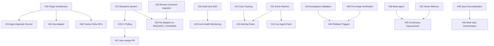

# 🗺️ Roadmap

> Symphony Orchestrator feature roadmap — all items tracked as GitHub issues.

  
  

> [!NOTE]
> For spec conformance details and shipped capabilities, see [CONFORMANCE_AUDIT.md](CONFORMANCE_AUDIT.md).

**Tracking epic:** [#9 — Symphony v2 Feature Roadmap](https://github.com/OmerFarukOruc/symphony-orchestrator/issues/9)

---

## Tier 1 — Ship First

High-value, achievable now. These directly address the most requested features and competitive gaps.

| # | Feature | Area | Source |
|---|---------|------|--------|
| [#10](https://github.com/OmerFarukOruc/symphony-orchestrator/issues/10) | Reactions system — CI/review/approval → auto agent actions | core | Composio, v2 roadmap |
| [#11](https://github.com/OmerFarukOruc/symphony-orchestrator/issues/11) | GitHub Issues adapter | core | Twitter, Composio |
| [#12](https://github.com/OmerFarukOruc/symphony-orchestrator/issues/12) | Mobile-responsive dashboard | dashboard | Twitter feedback |
| [#13](https://github.com/OmerFarukOruc/symphony-orchestrator/issues/13) | `symphony init --auto` one-command setup | core | Composio |
| [#14](https://github.com/OmerFarukOruc/symphony-orchestrator/issues/14) | Dollar cost tracking per issue / per model | dashboard, api | Twitter (@DatisAgent) |
| [#15](https://github.com/OmerFarukOruc/symphony-orchestrator/issues/15) | Live agent feed / subagent drill-down view | dashboard, api | Twitter (@VladimirNovick) |

---

## Tier 2 — High Impact, Medium Effort

Significant improvements to developer experience, extensibility, and autonomous operation.

| # | Feature | Area | Source |
|---|---------|------|--------|
| [#16](https://github.com/OmerFarukOruc/symphony-orchestrator/issues/16) | Notification routing by severity | core | Composio |
| [#17](https://github.com/OmerFarukOruc/symphony-orchestrator/issues/17) | Per-project agent rules in WORKFLOW.md | core | Composio |
| [#18](https://github.com/OmerFarukOruc/symphony-orchestrator/issues/18) | POST /api/v1/:issue/send — mid-session injection | api, dashboard | Composio (`ao send`) |
| [#19](https://github.com/OmerFarukOruc/symphony-orchestrator/issues/19) | Git worktrees as workspace strategy | core | Composio |
| [#20](https://github.com/OmerFarukOruc/symphony-orchestrator/issues/20) | Plugin / swappable architecture | core | Composio, Twitter |
| [#21](https://github.com/OmerFarukOruc/symphony-orchestrator/issues/21) | `symphony status` CLI / TUI compact view | api | Twitter (@VladimirNovick) |
| [#22](https://github.com/OmerFarukOruc/symphony-orchestrator/issues/22) | Multi-agent role pipeline (worker + reviewer) | core | Composio, OpenSwarm |
| [#23](https://github.com/OmerFarukOruc/symphony-orchestrator/issues/23) | Agent-agnostic runner (Claude Code, Aider) | core | Composio, Twitter |
| [#24](https://github.com/OmerFarukOruc/symphony-orchestrator/issues/24) | Settings UI page | dashboard | Internal |
| [#25](https://github.com/OmerFarukOruc/symphony-orchestrator/issues/25) | Acceptance criteria validation before PR | core | v2 roadmap, Composio |
| [#26](https://github.com/OmerFarukOruc/symphony-orchestrator/issues/26) | Prompt analytics | dashboard, api | Composio |
| [#35](https://github.com/OmerFarukOruc/symphony-orchestrator/issues/35) | Review comment ingestion | sentinel, core | v2 Phase 1 |
| [#36](https://github.com/OmerFarukOruc/symphony-orchestrator/issues/36) | Re-dispatch on REQUEST_CHANGES | sentinel, core | v2 Phase 1 |
| [#37](https://github.com/OmerFarukOruc/symphony-orchestrator/issues/37) | Auto-merge integration PR | sentinel, core | v2 Phase 1 |
| [#38](https://github.com/OmerFarukOruc/symphony-orchestrator/issues/38) | Merge conflict re-dispatch | sentinel, core | v2 Phase 1 |
| [#39](https://github.com/OmerFarukOruc/symphony-orchestrator/issues/39) | Pre-merge verification (test/lint before done) | core | v2 Phase 2 |
| [#51](https://github.com/OmerFarukOruc/symphony-orchestrator/issues/51) | Dashboard polish — workflow summaries, credential UI | dashboard | Follow-up |
| [#54](https://github.com/OmerFarukOruc/symphony-orchestrator/issues/54) | Default-on hardening — request tracing, error tracking | core | Follow-up |

---

## Tier 3 — Architectural, Longer Horizon

Infrastructure work, scale-out, and deeper observability.

| # | Feature | Area | Source |
|---|---------|------|--------|
| [#27](https://github.com/OmerFarukOruc/symphony-orchestrator/issues/27) | Session persistence — survive crashes/reboots | core | Composio |
| [#28](https://github.com/OmerFarukOruc/symphony-orchestrator/issues/28) | Orchestrator meta-agent — AI supervisor | core | Composio |
| [#29](https://github.com/OmerFarukOruc/symphony-orchestrator/issues/29) | CI check-run polling + auto-retry | core | v2 roadmap |
| [#30](https://github.com/OmerFarukOruc/symphony-orchestrator/issues/30) | Vector memory for agents | core | Composio, OpenSwarm |
| [#31](https://github.com/OmerFarukOruc/symphony-orchestrator/issues/31) | Drift detection | core | v2 roadmap |
| [#32](https://github.com/OmerFarukOruc/symphony-orchestrator/issues/32) | Webhook-driven dispatch | core, api | Internal |
| [#33](https://github.com/OmerFarukOruc/symphony-orchestrator/issues/33) | Multi-host SSH worker distribution | core | v2 roadmap (§8.3) |
| [#34](https://github.com/OmerFarukOruc/symphony-orchestrator/issues/34) | Jira adapter | core | v2 roadmap |
| [#40](https://github.com/OmerFarukOruc/symphony-orchestrator/issues/40) | Rollback triggers — auto-revert on failure | core | v2 Phase 2 |
| [#41](https://github.com/OmerFarukOruc/symphony-orchestrator/issues/41) | Structured event pipeline — centralized event bus | observability, core | v2 Phase 3 |
| [#42](https://github.com/OmerFarukOruc/symphony-orchestrator/issues/42) | Alerting rules — cost, failure, stall thresholds | observability, core | v2 Phase 3 |
| [#43](https://github.com/OmerFarukOruc/symphony-orchestrator/issues/43) | Trend analysis — historical metrics, regression detection | observability, dashboard | v2 Phase 3 |
| [#44](https://github.com/OmerFarukOruc/symphony-orchestrator/issues/44) | Durable dispatch state — persist retry queue | core | v2 Phase 4 |
| [#45](https://github.com/OmerFarukOruc/symphony-orchestrator/issues/45) | Host health monitoring + auto-failover | core | v2 Phase 4 |
| [#46](https://github.com/OmerFarukOruc/symphony-orchestrator/issues/46) | Tracker write APIs — orchestrator-driven transitions | core | v2 Phase 5 |
| [#52](https://github.com/OmerFarukOruc/symphony-orchestrator/issues/52) | Richer reporting — Prometheus, OTLP, webhook presets | observability, api | Follow-up |
| [#53](https://github.com/OmerFarukOruc/symphony-orchestrator/issues/53) | Desktop packaging — Tauri builds, release artifacts | desktop | Follow-up |

---

## Tier 4 — Long-Term Vision (Lights-Out)

Full autonomous codebase management — the end-state of the lights-out vision.

| # | Feature | Area | Source |
|---|---------|------|--------|
| [#47](https://github.com/OmerFarukOruc/symphony-orchestrator/issues/47) | Self-healing pipelines — auto-diagnose CI failures | core | v2 Phase 6 |
| [#48](https://github.com/OmerFarukOruc/symphony-orchestrator/issues/48) | Autonomous issue decomposition — agent delegation | core | v2 Phase 6 |
| [#49](https://github.com/OmerFarukOruc/symphony-orchestrator/issues/49) | Continuous codebase improvement — proactive refactoring | core | v2 Phase 6 |
| [#50](https://github.com/OmerFarukOruc/symphony-orchestrator/issues/50) | Multi-repo orchestration — cross-repo changes | core | v2 Phase 6 |

---

## Dependency Graph

Key dependencies between features:

---

## Summary

| Tier | Issues | Status |
|------|:------:|--------|
| **Tier 1** — Ship first | 6 | Not started |
| **Tier 2** — High impact | 19 | Not started |
| **Tier 3** — Architectural | 17 | Not started |
| **Tier 4** — Lights-Out | 4 | Not started |
| **Total** | **46** | |

---

## 📝 How to Keep This Document Current

> [!NOTE]
> Update this file when issues are completed or new features are planned. Mark completed issues with ~~strikethrough~~ and update the summary table. For spec conformance tracking, see [CONFORMANCE_AUDIT.md](CONFORMANCE_AUDIT.md).
