# 🗺️ Roadmap

> Symphony Orchestrator feature roadmap — all items tracked as GitHub issues.
> Research sources: Composio, OpenSwarm, mog, thepopebot, **jinyang**, **Orchestra**, **Eva**.

  
  

> [!NOTE]
> For spec conformance details and shipped capabilities, see [CONFORMANCE_AUDIT.md](CONFORMANCE_AUDIT.md).

**Tracking epic:** [#9 — Symphony v2 Feature Roadmap](https://github.com/OmerFarukOruc/symphony-orchestrator/issues/9)

---

## Tier 1 — Ship First

High-value, achievable now. These directly address the most requested features and competitive gaps.

| # | Feature | Area | Source |
|---|---------|------|--------|
| [#10](https://github.com/OmerFarukOruc/symphony-orchestrator/issues/10) | Reactions system — CI/review/approval → auto agent actions | core | Composio, v2 roadmap |
| [#11](https://github.com/OmerFarukOruc/symphony-orchestrator/issues/11) | GitHub Issues adapter | core | Twitter, Composio |
| [#12](https://github.com/OmerFarukOruc/symphony-orchestrator/issues/12) | Mobile-responsive dashboard | dashboard | Twitter feedback |
| [#13](https://github.com/OmerFarukOruc/symphony-orchestrator/issues/13) | `symphony init --auto` one-command setup — setup-wizard-level thoroughness: prerequisite checks, repo creation, secret config, `.env` generation; add `symphony validate` post-setup step *(jinyang)* | core | Composio, thepopebot, jinyang |
| [#14](https://github.com/OmerFarukOruc/symphony-orchestrator/issues/14) | Dollar cost tracking per issue / per model — complement with passive telemetry log watcher (#75) for agent CLI log ingestion; provider-specific extraction from nested JSON paths *(Orchestra)* | dashboard, api | Twitter (@DatisAgent), Orchestra |
| [#15](https://github.com/OmerFarukOruc/symphony-orchestrator/issues/15) | Live agent feed / subagent drill-down view — SSE event+snapshot pair pattern, 5s heartbeat, snapshot fingerprinting *(Orchestra)* | dashboard, api | Twitter (@VladimirNovick), Orchestra |
| [#59](https://github.com/OmerFarukOruc/symphony-orchestrator/issues/59) | Auto-squash + conventional commit formatting — with configurable path validation | core | v2 roadmap, thepopebot |

---

## Tier 2 — High Impact, Medium Effort

Significant improvements to developer experience, extensibility, and autonomous operation.

| # | Feature | Area | Source |
|---|---------|------|--------|
| [#16](https://github.com/OmerFarukOruc/symphony-orchestrator/issues/16) | Notification routing by severity | core | Composio |
| [#17](https://github.com/OmerFarukOruc/symphony-orchestrator/issues/17) | Per-project agent rules — with personality/identity layer (SOUL.md concept) and per-phase prompt templates | core | Composio, thepopebot |
| [#18](https://github.com/OmerFarukOruc/symphony-orchestrator/issues/18) | POST /api/v1/:issue/send — mid-session injection | api, dashboard | Composio (`ao send`) |
| [#19](https://github.com/OmerFarukOruc/symphony-orchestrator/issues/19) | Git worktrees as workspace strategy — auto-sync to `origin/<baseBranch>` before execution, enforce-commit before done, preserve on failure *(jinyang)* | core | Composio, jinyang |
| [#20](https://github.com/OmerFarukOruc/symphony-orchestrator/issues/20) | Plugin / swappable architecture — skills/SKILL.md standard with progressive discovery | core | Composio, Twitter, thepopebot |
| [#21](https://github.com/OmerFarukOruc/symphony-orchestrator/issues/21) | `symphony status` CLI / TUI compact view — Bubble Tea architecture, service manager, log viewport, keyboard controls *(Orchestra)* | api | Twitter (@VladimirNovick), Orchestra |
| [#22](https://github.com/OmerFarukOruc/symphony-orchestrator/issues/22) | Multi-agent role pipeline — agent clusters with shared workspaces, per-role concurrency, template variables | core | Composio, OpenSwarm, thepopebot |
| [#23](https://github.com/OmerFarukOruc/symphony-orchestrator/issues/23) | Agent-agnostic runner — dual LLM config, per-job model overrides, multi-provider support; priority-based provider routing; Runner interface + registry, provider cascading after 3 failures, tool/resource injection *(jinyang, Orchestra)* | core | Composio, Twitter, thepopebot, jinyang, Orchestra |
| [#24](https://github.com/OmerFarukOruc/symphony-orchestrator/issues/24) | Settings UI page | dashboard | Internal |
| [#25](https://github.com/OmerFarukOruc/symphony-orchestrator/issues/25) | Acceptance criteria validation before PR — extend with evaluation reports: structured scoring of code quality, test coverage, and requirement fulfillment; store as linked artifacts *(Eva)* | core | v2 roadmap, Composio, Eva |
| [#26](https://github.com/OmerFarukOruc/symphony-orchestrator/issues/26) | Prompt analytics | dashboard, api | Composio |
| [#35](https://github.com/OmerFarukOruc/symphony-orchestrator/issues/35) | Review comment ingestion | sentinel, core | v2 Phase 1 |
| [#36](https://github.com/OmerFarukOruc/symphony-orchestrator/issues/36) | Re-dispatch on REQUEST_CHANGES | sentinel, core | v2 Phase 1 |
| [#37](https://github.com/OmerFarukOruc/symphony-orchestrator/issues/37) | Auto-merge integration PR — with path-restriction controls (`ALLOWED_PATHS`) | sentinel, core | v2 Phase 1, thepopebot |
| [#38](https://github.com/OmerFarukOruc/symphony-orchestrator/issues/38) | Merge conflict re-dispatch | sentinel, core | v2 Phase 1 |
| [#39](https://github.com/OmerFarukOruc/symphony-orchestrator/issues/39) | Pre-merge verification (test/lint before done) | core | v2 Phase 2 |
| [#51](https://github.com/OmerFarukOruc/symphony-orchestrator/issues/51) | Dashboard polish — workflow summaries, credential UI | dashboard | Follow-up |
| [#54](https://github.com/OmerFarukOruc/symphony-orchestrator/issues/54) | Default-on hardening — request tracing, error tracking; webhook rate limiting, payload validation, request ID propagation, webhook loop detection *(jinyang)* | core | Follow-up, jinyang |
| [#56](https://github.com/OmerFarukOruc/symphony-orchestrator/issues/56) | Docker/container sandbox — self-hosted runner pattern; Unsandbox-style remote exec with credential sync + artifact retrieval *(Orchestra)*; Daytona SDK cloud sandbox provisioning with pre-built snapshots *(Eva)* | core | Follow-up, thepopebot, Orchestra, Eva |
| [#57](https://github.com/OmerFarukOruc/symphony-orchestrator/issues/57) | Agent progress monitoring — stall detection, iteration limits; session dedup, mutex status locking *(jinyang)*; claim system + stall reconciliation *(Orchestra)* | core | Follow-up, jinyang, Orchestra |
| [#58](https://github.com/OmerFarukOruc/symphony-orchestrator/issues/58) | Secret/config injection — dual-tier secret model with env-sanitizer; encrypted env var storage with resolution at sandbox startup *(Eva)* | core | Follow-up, thepopebot, Eva |
| [#61](https://github.com/OmerFarukOruc/symphony-orchestrator/issues/61) | Per-state concurrency limits — cap agents per work-item state; `max_concurrent_agents_by_state` config map with per-state dispatch guards | core | symphony-for-github-projects |
| [#66](https://github.com/OmerFarukOruc/symphony-orchestrator/issues/66) | Chat integration layer — pluggable channel adapters (Telegram, Discord, Slack) with normalized message format; MS Teams bot adapter via Bot Framework *(Eva)* | core, api | thepopebot, Eva |
| [#67](https://github.com/OmerFarukOruc/symphony-orchestrator/issues/67) | Scheduled/cron job system — JSON-configured recurring tasks with per-cron model overrides | core | thepopebot |
| [#68](https://github.com/OmerFarukOruc/symphony-orchestrator/issues/68) | Headless agent execution — lightweight runs without branch/PR workflow | core | thepopebot |
| [#71](https://github.com/OmerFarukOruc/symphony-orchestrator/issues/71) | Circuit breaker for provider reliability — per-provider closed/open/half-open states, persistent state, automatic recovery probing | core | jinyang |
| [#72](https://github.com/OmerFarukOruc/symphony-orchestrator/issues/72) | Provider health daemon — background provider probing, cached health with TTL, feeds into provider selection | core | jinyang |
| [#75](https://github.com/OmerFarukOruc/symphony-orchestrator/issues/75) | Telemetry log watcher — passive agent session ingestion with PII sanitization, multi-provider log parsing | core | Orchestra |
| [#76](https://github.com/OmerFarukOruc/symphony-orchestrator/issues/76) | Kanban board UI — drag-and-drop issue state management with column-based layout | dashboard | Orchestra |
| [#77](https://github.com/OmerFarukOruc/symphony-orchestrator/issues/77) | Issue dependency blocking — prevent dispatch of blocked issues with topological ordering; subtask decomposition with parent-child relationships *(Eva)* | core | Orchestra, Eva |
| [#80](https://github.com/OmerFarukOruc/symphony-orchestrator/issues/80) | Workspace lifecycle hooks — configurable pre/post scripts for agent execution lifecycle | core | Orchestra |
| [#82](https://github.com/OmerFarukOruc/symphony-orchestrator/issues/82) | Sandbox snapshot management — pre-built environment snapshots for faster agent startup; snapshot lifecycle with rebuild triggers | core | Eva |
| [#83](https://github.com/OmerFarukOruc/symphony-orchestrator/issues/83) | Document/PRD context store — structured storage for PRDs, specs, docs; template variable injection into agent prompts; AI interview workflow for PRD creation | core, api | Eva |
| [#85](https://github.com/OmerFarukOruc/symphony-orchestrator/issues/85) | Workflow watchdog — background health checker for stuck/zombie workflows; corrective actions with dead letter queue | core | Eva |
| [#87](https://github.com/OmerFarukOruc/symphony-orchestrator/issues/87) | Agent presence and activity tracking — real-time heartbeat-based presence indicators; dashboard badges; API endpoint | core, dashboard | Eva |

---

## Tier 3 — Architectural, Longer Horizon

Infrastructure work, scale-out, and deeper observability.

| # | Feature | Area | Source |
|---|---------|------|--------|
| [#27](https://github.com/OmerFarukOruc/symphony-orchestrator/issues/27) | Session persistence — JSONL-based session logs for replay/resume | core | Composio, thepopebot |
| [#28](https://github.com/OmerFarukOruc/symphony-orchestrator/issues/28) | Orchestrator meta-agent — AI supervisor | core | Composio |
| [#29](https://github.com/OmerFarukOruc/symphony-orchestrator/issues/29) | CI check-run polling + auto-retry | core | v2 roadmap |
| [#30](https://github.com/OmerFarukOruc/symphony-orchestrator/issues/30) | Vector memory for agents | core | Composio, OpenSwarm |
| [#31](https://github.com/OmerFarukOruc/symphony-orchestrator/issues/31) | Drift detection | core | v2 roadmap |
| [#32](https://github.com/OmerFarukOruc/symphony-orchestrator/issues/32) | Webhook-driven dispatch — job creation API, `x-api-key` auth, status polling; HMAC verification, `/webhooks/test` bypass, 202-accept-then-async pattern *(jinyang)* | core, api | Internal, thepopebot, jinyang |
| [#33](https://github.com/OmerFarukOruc/symphony-orchestrator/issues/33) | Multi-host SSH worker distribution | core | v2 roadmap (§8.3) |
| [#34](https://github.com/OmerFarukOruc/symphony-orchestrator/issues/34) | Jira adapter | core | v2 roadmap |
| [#40](https://github.com/OmerFarukOruc/symphony-orchestrator/issues/40) | Rollback triggers — auto-revert on failure | core | v2 Phase 2 |
| [#41](https://github.com/OmerFarukOruc/symphony-orchestrator/issues/41) | Structured event pipeline — centralized event bus; PubSub fan-out with 9+ lifecycle event types *(Orchestra)* | observability, core | v2 Phase 3, Orchestra |
| [#42](https://github.com/OmerFarukOruc/symphony-orchestrator/issues/42) | Alerting rules — cost, failure, stall thresholds | observability, core | v2 Phase 3 |
| [#43](https://github.com/OmerFarukOruc/symphony-orchestrator/issues/43) | Trend analysis — historical metrics, regression detection | observability, dashboard | v2 Phase 3 |
| [#44](https://github.com/OmerFarukOruc/symphony-orchestrator/issues/44) | Durable dispatch state — persist retry queue; file-based session locks + in-memory Set combo *(jinyang)* | core | v2 Phase 4, jinyang |
| [#45](https://github.com/OmerFarukOruc/symphony-orchestrator/issues/45) | Host health monitoring + auto-failover; per-provider health cache with TTL, consecutive-error tolerance *(jinyang)* | core | v2 Phase 4, jinyang |
| [#46](https://github.com/OmerFarukOruc/symphony-orchestrator/issues/46) | Tracker write APIs — orchestrator-driven transitions | core | v2 Phase 5 |
| [#52](https://github.com/OmerFarukOruc/symphony-orchestrator/issues/52) | Richer reporting — Prometheus, OTLP, webhook presets | observability, api | Follow-up |
| [#53](https://github.com/OmerFarukOruc/symphony-orchestrator/issues/53) | Desktop packaging — Tauri builds, release artifacts; Electron sidecar pattern with auto-port + random token *(Orchestra)*; electron-vite for fast dev builds *(Eva)* | desktop | Follow-up, Orchestra, Eva |
| [#69](https://github.com/OmerFarukOruc/symphony-orchestrator/issues/69) | File-watch triggers — reactive agent dispatch on file changes with debounce | core | thepopebot |
| [#70](https://github.com/OmerFarukOruc/symphony-orchestrator/issues/70) | Interactive agent workspaces — browser-based terminal access; terminal multiplexer UI for concurrent sessions *(Orchestra)*; PTY streaming for sandbox terminal relay *(Eva)* | dashboard, core | thepopebot, Orchestra, Eva |
| [#73](https://github.com/OmerFarukOruc/symphony-orchestrator/issues/73) | Background poller for missed events — safety-net polling loop, deduplicates against active sessions | core | jinyang |
| [#74](https://github.com/OmerFarukOruc/symphony-orchestrator/issues/74) | Label/tag-based multi-repo routing — label-driven routing engine, multi-tier priority | core | jinyang |
| [#78](https://github.com/OmerFarukOruc/symphony-orchestrator/issues/78) | Issue search and filter API — query filtering by state, provider, project, date range; free-text search | core, api | Orchestra |
| [#79](https://github.com/OmerFarukOruc/symphony-orchestrator/issues/79) | OpenAPI specification endpoint — machine-readable API spec for client generation | api | Orchestra |
| [#84](https://github.com/OmerFarukOruc/symphony-orchestrator/issues/84) | Chrome extension for task dispatch — browser side panel for quick task creation, context capture, status monitoring | dashboard, core | Eva |
| [#86](https://github.com/OmerFarukOruc/symphony-orchestrator/issues/86) | Automated test generation in sandboxes — AI-driven test suite generation for agent-authored code; complements pre-merge verification (#39) | core | Eva |
| [#88](https://github.com/OmerFarukOruc/symphony-orchestrator/issues/88) | Mobile companion app — React Native app for monitoring, push notifications, and remote task dispatch | mobile | Eva |

---

## Tier 4 — Long-Term Vision (Lights-Out)

Full autonomous codebase management — the end-state of the lights-out vision.

| # | Feature | Area | Source |
|---|---------|------|--------|
| [#47](https://github.com/OmerFarukOruc/symphony-orchestrator/issues/47) | Self-healing pipelines — auto-diagnose CI failures | core | v2 Phase 6 |
| [#48](https://github.com/OmerFarukOruc/symphony-orchestrator/issues/48) | Autonomous issue decomposition — agent delegation | core | v2 Phase 6 |
| [#49](https://github.com/OmerFarukOruc/symphony-orchestrator/issues/49) | Continuous codebase improvement — proactive refactoring | core | v2 Phase 6 |
| [#50](https://github.com/OmerFarukOruc/symphony-orchestrator/issues/50) | Multi-repo orchestration — cross-repo changes | core | v2 Phase 6 |

---

## Dependency Graph

Key dependencies between features:

```mermaid
graph TD
    A["#20 Plugin Architecture"] --> B["#23 Agent-Agnostic Runner"]
    A --> C["#34 Jira Adapter"]
    A --> D["#46 Tracker Write APIs"]
    E["#10 Reactions System"] --> F["#29 CI Polling"]
    E --> G["#36 Re-dispatch on REQUEST_CHANGES"]
    H["#35 Review Comment Ingestion"] --> G
    F --> I["#37 Auto-merge PR"]
    J["#33 Multi-host SSH"] --> K["#45 Host Health Monitoring"]
    L["#14 Cost Tracking"] --> M["#42 Alerting Rules"]
    N["#41 Event Pipeline"] --> M
    N --> O["#15 Live Agent Feed"]
    N --> X["#87 Agent Presence Tracking"]
    P["#25 Acceptance Validation"] --> Q["#40 Rollback Triggers"]
    R["#39 Pre-merge Verification"] --> Q
    R --> Y["#86 Auto Test Generation"]
    S["#28 Meta-agent"] --> T["#49 Continuous Improvement"]
    U["#30 Vector Memory"] --> T
    V["#48 Issue Decomposition"] --> W["#50 Multi-repo Orchestration"]
    Z["#56 Docker Sandbox"] --> AA["#82 Sandbox Snapshots"]
    Z --> AB["#70 Interactive Workspaces"]
    AC["#72 Provider Health Daemon"] --> AD["#71 Circuit Breaker"]
    AE["#77 Issue Dependencies"] --> V
```

---

## Summary

| Tier | Issues | Status |
|------|:------:|--------|
| **Tier 1** — Ship first | 7 | Not started |
| **Tier 2** — High impact | 35 | Not started |
| **Tier 3** — Architectural | 26 | Not started |
| **Tier 4** — Lights-Out | 4 | Not started |
| **Total** | **72** | |

---

## 📝 How to Keep This Document Current

> [!NOTE]
> Update this file when issues are completed or new features are planned. Mark completed issues with ~~strikethrough~~ and update the summary table. For spec conformance tracking, see [CONFORMANCE_AUDIT.md](CONFORMANCE_AUDIT.md).
