# 🗺️ Roadmap

> Symphony Orchestrator feature roadmap — all items tracked as GitHub issues.
> Research sources: Composio, OpenSwarm, mog, **thepopebot**, **jinyang**, **Orchestra**, **Eva**, **pilot (alekspetrov)**, **pilot (crisner1978)**, **vibe-kanban**, **hatice**.

  
  

> [!NOTE]
> For spec conformance details and shipped capabilities, see [CONFORMANCE_AUDIT.md](CONFORMANCE_AUDIT.md).

**Tracking epic:** [#9 — Symphony v2 Feature Roadmap](https://github.com/OmerFarukOruc/symphony-orchestrator/issues/9)

---

## Tier 1 — Ship First

High-value, achievable now. These directly address the most requested features and competitive gaps.

| #                                                                       | Feature                                                                                                                                                                                                                                                                                                                                   | Area           | Source                                          |
| ----------------------------------------------------------------------- | ----------------------------------------------------------------------------------------------------------------------------------------------------------------------------------------------------------------------------------------------------------------------------------------------------------------------------------------- | -------------- | ----------------------------------------------- |
| [#10](https://github.com/OmerFarukOruc/symphony-orchestrator/issues/10) | Reactions system — CI/review/approval → auto agent actions                                                                                                                                                                                                                                                                                | core           | Composio, v2 roadmap                            |
| [#11](https://github.com/OmerFarukOruc/symphony-orchestrator/issues/11) | ~~GitHub Issues adapter — hatice reference impl with REST+GraphQL, `owner/repo` format, write-back support _(hatice)_~~ — **Shipped.** `GitHubIssuesClient` + `GitHubTrackerAdapter` implementing `TrackerPort`; label-as-state mapping; `owner/repo#{number}` identifier format.                                                    | ~~core~~       | ~~Twitter, Composio, hatice~~                   |
| [#12](https://github.com/OmerFarukOruc/symphony-orchestrator/issues/12) | Mobile-responsive dashboard                                                                                                                                                                                                                                                                                                               | dashboard      | Twitter feedback                                |
| [#13](https://github.com/OmerFarukOruc/symphony-orchestrator/issues/13) | `symphony init --auto` one-command setup — setup-wizard-level thoroughness: prerequisite checks, repo creation, secret config, `.env` generation; add `symphony validate` post-setup step; reference: thepopebot's `npx thepopebot init` scaffolds full project with GitHub Actions, agent templates, then `npm run setup` wizard handles prereq checks, repo creation, secret config, `.env` generation, Docker start _(jinyang, thepopebot)_ | core           | Composio, thepopebot, jinyang                   |
| [#14](https://github.com/OmerFarukOruc/symphony-orchestrator/issues/14) | ~~Dollar cost tracking per issue / per model _(Orchestra, pilot, hatice)_~~ — **Shipped.** `lookupModelPrice()` static table (12 models), `sumCostUsd()` via GROUP BY SQL, `costUsd` in snapshot + per-attempt; dashboard shows cost in overview panel, attempts table, issue inspector, and attempt view. | ~~dashboard, api~~ | ~~Twitter (@DatisAgent), Orchestra, pilot, hatice~~ |
| [#15](https://github.com/OmerFarukOruc/symphony-orchestrator/issues/15) | ~~Live agent feed / subagent drill-down view _(Orchestra, hatice)_~~ — **Shipped.** `subscribeIssueEvents()` client-side SSE filtering; `createLiveLog()` auto-scroll panel; live log section in issue-inspector for `running`/`retrying` issues.                                                                                          | ~~dashboard, api~~ | ~~Twitter (@VladimirNovick), Orchestra, hatice~~ |
| [#59](https://github.com/OmerFarukOruc/symphony-orchestrator/issues/59) | Auto-squash + conventional commit formatting — with configurable path validation; rich PR comments with execution metrics; reference: thepopebot squash-merges all agent-job PRs via GitHub Actions; session logs committed to branch then removed in follow-up commit so they don't merge into main; PR body includes permalink to log commit _(pilot, thepopebot)_ | core           | v2 roadmap, thepopebot, pilot                   |

---

## Tier 2 — High Impact, Medium Effort

Significant improvements to developer experience, extensibility, and autonomous operation.

| #                                                                         | Feature                                                                                                                                                                                                                                                                                                                           | Area            | Source                                                                |
| ------------------------------------------------------------------------- | --------------------------------------------------------------------------------------------------------------------------------------------------------------------------------------------------------------------------------------------------------------------------------------------------------------------------------- | --------------- | --------------------------------------------------------------------- |
| [#16](https://github.com/OmerFarukOruc/symphony-orchestrator/issues/16)   | Notification routing by severity                                                                                                                                                                                                                                                                                                  | core            | Composio                                                              |
| [#17](https://github.com/OmerFarukOruc/symphony-orchestrator/issues/17)   | Per-project agent rules — with personality/identity layer (SOUL.md concept) and per-phase prompt templates; reference: thepopebot's `config/agent-job/SOUL.md` (identity/personality), `AGENT_JOB.md` (runtime env), `SUMMARY.md` (job summary prompt), `HEARTBEAT.md` (self-monitoring); `config/` directory acts as the agent "operating system"; complement with @mention tags (#109) _(thepopebot, vibe-kanban)_ | core            | Composio, thepopebot, vibe-kanban                                     |
| [#18](https://github.com/OmerFarukOruc/symphony-orchestrator/issues/18)   | POST /api/v1/:issue/send — mid-session injection                                                                                                                                                                                                                                                                                  | api, dashboard  | Composio (`ao send`)                                                  |
| [#19](https://github.com/OmerFarukOruc/symphony-orchestrator/issues/19)   | ~~Git worktrees as workspace strategy — auto-sync to `origin/<baseBranch>` before execution, enforce-commit before done, preserve on failure; worktree-manager module separation + branch prefix config _(jinyang, vibe-kanban)_~~ — **Shipped.**                                                                                 | ~~core~~        | ~~Composio, jinyang, vibe-kanban~~                                    |
| [#20](https://github.com/OmerFarukOruc/symphony-orchestrator/issues/20)   | Plugin / swappable architecture — skills/SKILL.md standard with progressive discovery; YAML-based adapter config for swappable input sources; reference: thepopebot's skills system uses `SKILL.md` with YAML frontmatter (name, description) for progressive discovery; skills activated via symlinks in `skills/active/`; agent scans descriptions at startup, reads full instructions on-demand; skills are self-contained folders with scripts + `package.json` _(thepopebot, pilot)_ | core            | Composio, Twitter, thepopebot, pilot                                  |
| [#21](https://github.com/OmerFarukOruc/symphony-orchestrator/issues/21)   | `symphony status` CLI / TUI compact view — Bubble Tea architecture, service manager, log viewport, keyboard controls _(Orchestra)_                                                                                                                                                                                                | api             | Twitter (@VladimirNovick), Orchestra                                  |
| [#22](https://github.com/OmerFarukOruc/symphony-orchestrator/issues/22)   | Multi-agent role pipeline — agent clusters with shared workspaces, per-role concurrency, template variables; reference: thepopebot's cluster system: multi-role agent teams with per-role concurrency (`maxConcurrency`), `{{PLACEHOLDER}}` template variables (CLUSTER_HOME, SELF_ROLE_NAME, WORKSPACE manifest), shared folders, webhook/cron/file-watch triggers; per-role serialized concurrency locks (`acquireAndRunRole`); session logs per container with resolved prompts _(thepopebot)_ | core            | Composio, OpenSwarm, thepopebot                                       |
| [#23](https://github.com/OmerFarukOruc/symphony-orchestrator/issues/23)   | Agent-agnostic runner — dual LLM config, per-job model overrides, multi-provider support; priority-based provider routing; Runner interface + registry, provider cascading after 3 failures, tool/resource injection; reference: thepopebot's dual LLM config separates chat (Event Handler) from jobs (Docker agent); per-job model overrides via `llm_provider`/`llm_model` in CRONS.json; 4 built-in providers (anthropic, openai, google, custom/OpenAI-compatible); `CUSTOM_OPENAI_BASE_URL` for local models (Ollama, vLLM); `CODING_AGENT` env var switches between Claude Code and Pi backends; OpenCode backend support; per-agent variants + 10+ agent catalog _(jinyang, Orchestra, pilot, vibe-kanban, thepopebot)_ | core            | Composio, Twitter, thepopebot, jinyang, Orchestra, pilot, vibe-kanban |
| [#24](https://github.com/OmerFarukOruc/symphony-orchestrator/issues/24)   | Settings UI page                                                                                                                                                                                                                                                                                                                  | dashboard       | Internal                                                              |
| [#25](https://github.com/OmerFarukOruc/symphony-orchestrator/issues/25)   | Acceptance criteria validation before PR — evaluation reports with structured scoring; pre-push self-review stage _(Eva, pilot)_                                                                                                                                                                                                  | core            | v2 roadmap, Composio, Eva, pilot                                      |
| [#26](https://github.com/OmerFarukOruc/symphony-orchestrator/issues/26)   | Prompt analytics                                                                                                                                                                                                                                                                                                                  | dashboard, api  | Composio                                                              |
| [#35](https://github.com/OmerFarukOruc/symphony-orchestrator/issues/35)   | Review comment ingestion — extend with dashboard-native inline diff review (#106) _(vibe-kanban)_                                                                                                                                                                                                                                 | sentinel, core  | v2 Phase 1, vibe-kanban                                               |
| [#36](https://github.com/OmerFarukOruc/symphony-orchestrator/issues/36)   | Re-dispatch on REQUEST_CHANGES                                                                                                                                                                                                                                                                                                    | sentinel, core  | v2 Phase 1                                                            |
| [#37](https://github.com/OmerFarukOruc/symphony-orchestrator/issues/37)   | Auto-merge integration PR — with path-restriction controls (`ALLOWED_PATHS`); environment-based autopilot progression: dev/stage/prod with independent branch, approval, and CI config; reference: thepopebot's `auto-merge.yml` GitHub Action checks `AUTO_MERGE` kill switch + `ALLOWED_PATHS` comma-separated prefix list; any file outside allowed paths blocks merge; `notify-pr-complete.yml` gathers job data post-merge for notification; fail-closed by default (only `/logs` auto-merges) _(thepopebot, pilot)_ | sentinel, core  | v2 Phase 1, thepopebot, pilot                                         |
| [#38](https://github.com/OmerFarukOruc/symphony-orchestrator/issues/38)   | Merge conflict re-dispatch                                                                                                                                                                                                                                                                                                        | sentinel, core  | v2 Phase 1                                                            |
| [#39](https://github.com/OmerFarukOruc/symphony-orchestrator/issues/39)   | Pre-merge verification (test/lint before done)                                                                                                                                                                                                                                                                                    | core            | v2 Phase 2                                                            |
| [#51](https://github.com/OmerFarukOruc/symphony-orchestrator/issues/51)   | Dashboard polish — workflow summaries, credential UI                                                                                                                                                                                                                                                                              | dashboard       | Follow-up                                                             |
| [#54](https://github.com/OmerFarukOruc/symphony-orchestrator/issues/54)   | ~~Default-on hardening — request tracing, error tracking; webhook rate limiting, payload validation, request ID propagation, webhook loop detection _(jinyang)_~~ — **Partially shipped.**                                                                                                                                        | ~~core~~        | ~~Follow-up, jinyang~~                                                |
| [#56](https://github.com/OmerFarukOruc/symphony-orchestrator/issues/56)   | ~~Docker/container sandbox — self-hosted runner pattern; Unsandbox-style remote exec _(Orchestra)_; Daytona SDK cloud sandbox _(Eva)_; Docker Compose + OAuth + Caddy _(pilot, vibe-kanban)_~~ — **Shipped.**                                                                                                                     | ~~core~~        | ~~Follow-up, thepopebot, Orchestra, Eva, pilot, vibe-kanban~~         |
| [#57](https://github.com/OmerFarukOruc/symphony-orchestrator/issues/57)   | ~~Agent progress monitoring — stall detection, iteration limits; session dedup, mutex status locking _(jinyang)_; claim system + stall reconciliation _(Orchestra)_; stagnation loop detection via state history _(pilot)_~~ — **Shipped in v0.3.1.**                                                                             | ~~core~~        | ~~Follow-up, jinyang, Orchestra, pilot~~                              |
| [#58](https://github.com/OmerFarukOruc/symphony-orchestrator/issues/58)   | Secret/config injection — dual-tier secret model with env-sanitizer; encrypted env var storage with resolution at sandbox startup; reference: thepopebot's `env-sanitizer` extension dynamically filters `AGENT_*` secrets from LLM bash subprocesses via `spawnHook`; secrets stored encrypted in SQLite, injected as env vars into Docker containers; `get-secret` skill for agent credential discovery _(thepopebot, Eva)_ | core            | Follow-up, thepopebot, Eva                                            |
| [#61](https://github.com/OmerFarukOruc/symphony-orchestrator/issues/61)   | ~~Per-state concurrency limits — cap agents per work-item state; `max_concurrent_agents_by_state` config map with per-state dispatch guards~~ — **Shipped.**                                                                                                                                                                      | ~~core~~        | ~~symphony-for-github-projects~~                                      |
| [#66](https://github.com/OmerFarukOruc/symphony-orchestrator/issues/66)   | Chat integration layer — pluggable channel adapters (Telegram, Discord, Slack) with normalized message format; multimodal support: voice transcription, image handling; reference: thepopebot's `ChannelAdapter` base class defines `receive()`, `acknowledge()`, `startProcessingIndicator()`, `sendResponse()`, `supportsStreaming`; adapters normalize message data to `{ threadId, text, attachments, metadata }`; voice messages fully transcribed by adapter before processing; Telegram adapter handles reactions, typing indicators, file downloads _(thepopebot, Eva, pilot)_ | core, api       | thepopebot, Eva, pilot                                                |
| [#67](https://github.com/OmerFarukOruc/symphony-orchestrator/issues/67)   | Scheduled/cron job system — JSON-configured recurring tasks with per-cron model overrides; daily brief templates via Slack/Telegram/email; reference: thepopebot's `config/CRONS.json` with `schedule`, `type` (agent/command/webhook), `llm_provider`/`llm_model` per-cron overrides; `node-cron` scheduler with validation; built-in crons for version checking; `loadCrons()` logs active schedules at startup _(thepopebot, pilot)_ | core            | thepopebot, pilot                                                     |
| [#68](https://github.com/OmerFarukOruc/symphony-orchestrator/issues/68)   | Headless agent execution — lightweight runs without branch/PR workflow; reference: thepopebot's headless mode runs Claude Code with `-p` (prompt mode) in ephemeral Docker container; auto-commits, creates PR, streams output back to chat; shared workspace volume system allows switching between interactive and headless modes _(thepopebot)_ | core            | thepopebot                                                            |
| [#71](https://github.com/OmerFarukOruc/symphony-orchestrator/issues/71)   | Circuit breaker for provider reliability — per-provider closed/open/half-open states, persistent state, automatic recovery probing                                                                                                                                                                                                | core            | jinyang                                                               |
| [#72](https://github.com/OmerFarukOruc/symphony-orchestrator/issues/72)   | Provider health daemon — background provider probing, cached health with TTL, feeds into provider selection                                                                                                                                                                                                                       | core            | jinyang                                                               |
| [#75](https://github.com/OmerFarukOruc/symphony-orchestrator/issues/75)   | Telemetry log watcher — passive agent session ingestion with PII sanitization, multi-provider log parsing                                                                                                                                                                                                                         | core            | Orchestra                                                             |
| [#76](https://github.com/OmerFarukOruc/symphony-orchestrator/issues/76)   | ~~Kanban board UI — drag-and-drop issue state management; priority/assignee cards, sub-issue hierarchy, filters with clear-all _(Orchestra, vibe-kanban)_~~ — **Partially shipped.**                                                                                                                                              | ~~dashboard~~   | ~~Orchestra, vibe-kanban~~                                            |
| [#77](https://github.com/OmerFarukOruc/symphony-orchestrator/issues/77)   | Issue dependency blocking — prevent dispatch of blocked issues with topological ordering; subtask decomposition with parent-child relationships; sub-issue PR wiring for aggregate tracking _(Eva, pilot)_                                                                                                                        | core            | Orchestra, Eva, pilot                                                 |
| [#80](https://github.com/OmerFarukOruc/symphony-orchestrator/issues/80)   | Workspace lifecycle hooks — configurable pre/post scripts for agent execution lifecycle; working reference impl with `HooksConfig` + `timeoutMs` _(Orchestra, hatice)_                                                                                                                                                            | core            | Orchestra, hatice                                                     |
| [#82](https://github.com/OmerFarukOruc/symphony-orchestrator/issues/82)   | Sandbox snapshot management — pre-built environment snapshots for faster agent startup; snapshot lifecycle with rebuild triggers                                                                                                                                                                                                  | core            | Eva                                                                   |
| [#83](https://github.com/OmerFarukOruc/symphony-orchestrator/issues/83)   | Document/PRD context store — structured storage for PRDs, specs, docs; template variable injection into agent prompts; AI interview workflow for PRD creation                                                                                                                                                                     | core, api       | Eva                                                                   |
| [#85](https://github.com/OmerFarukOruc/symphony-orchestrator/issues/85)   | ~~Workflow watchdog — background health checker for stuck/zombie workflows; corrective actions with dead letter queue; OTP-style Supervisor crash recovery _(Eva, hatice)_~~ — **Shipped in v0.3.1.**                                                                                                                             | ~~core~~        | ~~Eva, hatice~~                                                       |
| [#87](https://github.com/OmerFarukOruc/symphony-orchestrator/issues/87)   | Agent presence and activity tracking — real-time heartbeat-based presence indicators; dashboard badges; API endpoint                                                                                                                                                                                                              | core, dashboard | Eva                                                                   |
| [#65](https://github.com/OmerFarukOruc/symphony-orchestrator/issues/65)   | Capacity reservation for failure retries — reserve concurrency slots for retry attempts to prevent retry starvation under high load                                                                                                                                                                                               | core            | symphony-for-github-projects                                          |
| [#94](https://github.com/OmerFarukOruc/symphony-orchestrator/issues/94)   | Scope-aware execution mode auto-switching — parallel dispatch for non-overlapping issues, sequential for overlapping; scope overlap guard prevents merge conflicts without sacrificing throughput _(pilot)_                                                                                                                       | core            | pilot                                                                 |
| [#95](https://github.com/OmerFarukOruc/symphony-orchestrator/issues/95)   | Smart retry with error-category-specific backoff — rate_limit (30s exp), api_error (5s exp), timeout (1.5x extension), invalid_config (fail fast); per-provider config _(pilot)_                                                                                                                                                  | core            | pilot                                                                 |
| [#105](https://github.com/OmerFarukOruc/symphony-orchestrator/issues/105) | Built-in browser preview with devtools — embedded iframe preview with Eruda devtools, device emulation, inspect mode                                                                                                                                                                                                              | dashboard       | vibe-kanban                                                           |
| [#106](https://github.com/OmerFarukOruc/symphony-orchestrator/issues/106) | Inline diff review with agent feedback loop — dashboard diff viewer, file tree, inline comments, send feedback to agent                                                                                                                                                                                                           | dashboard, core | vibe-kanban                                                           |
| [#108](https://github.com/OmerFarukOruc/symphony-orchestrator/issues/108) | Dashboard command bar (Cmd+K) — searchable command palette for workspace/git/view/diff actions                                                                                                                                                                                                                                    | dashboard       | vibe-kanban                                                           |
| [#109](https://github.com/OmerFarukOruc/symphony-orchestrator/issues/109) | Prompt template tags system — @mention reusable text snippets for issue descriptions and agent prompts                                                                                                                                                                                                                            | core, dashboard | vibe-kanban                                                           |
| [#110](https://github.com/OmerFarukOruc/symphony-orchestrator/issues/110) | ~~MCP server for orchestrator tools — expose Symphony capabilities as MCP tools; query issues, update state, fetch metrics; inline MCP servers per-tracker _(vibe-kanban, hatice)_~~ — **Shipped.** `linear_graphql` dynamic tool exposed to agents via JSON-RPC.                                                                 | ~~core, api~~   | ~~vibe-kanban, hatice~~                                               |
| [#111](https://github.com/OmerFarukOruc/symphony-orchestrator/issues/111) | npx-based zero-install distribution — `npx symphony-orchestrator` with pre-built binaries, setup wizard, auto-update; subsumes part of #13                                                                                                                                                                                        | cli, core       | vibe-kanban                                                           |
| [#123](https://github.com/OmerFarukOruc/symphony-orchestrator/issues/123) | GitLab CE/EE tracker adapter — REST adapter for GitLab.com and self-hosted; severity-to-priority mapping                                                                                                                                                                                                                          | core            | hatice                                                                |
| [#124](https://github.com/OmerFarukOruc/symphony-orchestrator/issues/124) | ~~Workflow hot-reload (mtime + content hash) — detect WORKFLOW.md changes, re-parse/re-validate, graceful fallback~~ — **Shipped.** chokidar watcher with graceful fallback on parse failure.                                                                                                                                     | ~~core~~        | ~~hatice~~                                                            |
| [#125](https://github.com/OmerFarukOruc/symphony-orchestrator/issues/125) | ~~LiquidJS prompt templates in WORKFLOW.md — `{{ issue.title }}` template syntax, gray-matter YAML, fallback rendering~~ — **Shipped.** LiquidJS engine with strict variable/filter checking.                                                                                                                                     | ~~core~~        | ~~hatice~~                                                            |
| [#126](https://github.com/OmerFarukOruc/symphony-orchestrator/issues/126) | Agent input auto-responder — intercept `input_request` events, configurable auto-response for non-interactive sessions                                                                                                                                                                                                            | core            | hatice                                                                |
| [#127](https://github.com/OmerFarukOruc/symphony-orchestrator/issues/127) | Dry-run / demo mode — simulate agent execution without API calls; CI-safe orchestration testing                                                                                                                                                                                                                                   | core            | hatice                                                                |
| [#128](https://github.com/OmerFarukOruc/symphony-orchestrator/issues/128) | Fine-grained agent tool control — `allowedTools`/`disallowedTools` + `canUseTool` per-tool boolean map                                                                                                                                                                                                                            | core            | hatice                                                                |
| [#175](https://github.com/OmerFarukOruc/symphony-orchestrator/issues/175) | Upgrade notification system — background version check (npm/GitHub releases) + dashboard upgrade banner with release notes; reference: thepopebot's `runVersionCheck()` polls npm hourly, compares semver across stable+beta channels, stores in SQLite, shows banner in UI; complements #96 (self-update CLI) _(inspired by [thepopebot](https://github.com/stephengpope/thepopebot))_ | core, dashboard | thepopebot                                                            |
| [#177](https://github.com/OmerFarukOruc/symphony-orchestrator/issues/177) | Database-backed configuration store — SQLite for settings, API keys, state; enables Settings UI (#24) and secret management (#58) without manual file editing; reference: thepopebot uses Drizzle ORM + SQLite with 20+ migrations for users, API keys (SHA-256 hashed), chat history, workspaces _(inspired by [thepopebot](https://github.com/stephengpope/thepopebot))_ | core            | thepopebot                                                            |
| [#178](https://github.com/OmerFarukOruc/symphony-orchestrator/issues/178) | Zod schema validation for workflow configuration — type-safe config parsing with composable schemas, automatic defaults, structured error aggregation, env var resolution _(inspired by [hatice](https://github.com/mksglu/hatice))_ | core            | hatice                                                                |
| [#179](https://github.com/OmerFarukOruc/symphony-orchestrator/issues/179) | Structured error hierarchy — domain-specific error classes with error codes, `Result<T,E>` pattern, HTTP status tracking for provider errors _(inspired by [hatice](https://github.com/mksglu/hatice))_ | core            | hatice                                                                |
| [#180](https://github.com/OmerFarukOruc/symphony-orchestrator/issues/180) | Startup workspace cleanup daemon — stale workspace removal by configurable max age with scan/remove/error reporting _(inspired by [hatice](https://github.com/mksglu/hatice))_ | core            | hatice                                                                |
| [#184](https://github.com/OmerFarukOruc/symphony-orchestrator/issues/184) | Structured JSON file logging with daily rotation — production-grade structured logging with JSON entries, domain-specific log methods, configurable retention _(inspired by [jinyang-public](https://github.com/romancircus/jinyang-public))_ | core            | jinyang                                                               |
| [#192](https://github.com/OmerFarukOruc/symphony-orchestrator/issues/192) | Multi-agent self-healing pipeline — HealerAgent/ReviewerAgent with bounded escalation (heal→heal→rethink→escalate); structured agent output parsing _(inspired by [pilot](https://github.com/crisner1978/pilot))_ | core | pilot |
| [#193](https://github.com/OmerFarukOruc/symphony-orchestrator/issues/193) | Loop completion reporting — per-task diff stats, decision log, timing, drill-in git commands; configurable verbosity _(inspired by [pilot](https://github.com/crisner1978/pilot))_ | core, dashboard | pilot |
| [#185](https://github.com/OmerFarukOruc/symphony-orchestrator/issues/185) | Session concurrency scheduler with waiting queue — max-parallelism limits, FIFO queue drain, completion callbacks, queue position tracking _(inspired by [jinyang-public](https://github.com/romancircus/jinyang-public))_ | core            | jinyang                                                               |
| [#186](https://github.com/OmerFarukOruc/symphony-orchestrator/issues/186) | OAuth token lifecycle manager with background refresh — automated OAuth2 token refresh with expiry-aware caching, proactive background daemon _(inspired by [jinyang-public](https://github.com/romancircus/jinyang-public))_ | core            | jinyang                                                               |
| [#187](https://github.com/OmerFarukOruc/symphony-orchestrator/issues/187) | Disk space guard before session persistence — pre-write disk validation preventing silent data loss from full-disk conditions _(inspired by [jinyang-public](https://github.com/romancircus/jinyang-public))_ | core            | jinyang                                                               |
| [#189](https://github.com/OmerFarukOruc/symphony-orchestrator/issues/189) | Proof-of-work commit messages — structured commit format assembling approach/alternatives/review evidence from multiple pipeline stages; makes `git log` tell the full story _(inspired by [pilot](https://github.com/crisner1978/pilot))_ | core | pilot |
| [#190](https://github.com/OmerFarukOruc/symphony-orchestrator/issues/190) | Protected-path guardrails — auto-detected sensitive file protection (.env, .pem, migrations, CI configs); hard-blocked in autonomous mode, prompted in manual mode; auto-stash/rollback _(inspired by [pilot](https://github.com/crisner1978/pilot))_ | core | pilot |

---

## Tier 3 — Architectural, Longer Horizon

Infrastructure work, scale-out, and deeper observability.

| #                                                                         | Feature                                                                                                                                                                                                                                                                                          | Area                     | Source                                  |
| ------------------------------------------------------------------------- | ------------------------------------------------------------------------------------------------------------------------------------------------------------------------------------------------------------------------------------------------------------------------------------------------ | ------------------------ | --------------------------------------- |
| [#27](https://github.com/OmerFarukOruc/symphony-orchestrator/issues/27)   | Session persistence — JSONL-based session logs for replay/resume; execution replay with playback, analysis, and HTML/JSON/MD export; reference: thepopebot's per-job log directories at `logs/{AGENT_JOB_ID}/` with `agent-job.config.json` + structured `.jsonl` session logs; cluster logs include `system-prompt.md`, `user-prompt.md`, `meta.json`, `trigger.json`, `stdout.jsonl`, `stderr.txt` _(thepopebot, pilot)_ | core                     | Composio, thepopebot, pilot             |
| [#28](https://github.com/OmerFarukOruc/symphony-orchestrator/issues/28)   | Orchestrator meta-agent — AI supervisor                                                                                                                                                                                                                                                          | core                     | Composio                                |
| [#29](https://github.com/OmerFarukOruc/symphony-orchestrator/issues/29)   | CI check-run polling + auto-retry                                                                                                                                                                                                                                                                | core                     | v2 roadmap                              |
| [#30](https://github.com/OmerFarukOruc/symphony-orchestrator/issues/30)   | Vector memory for agents — extend with SQLite-backed cross-project pattern learning; confidence-scored patterns injected into agent prompts _(pilot)_                                                                                                                                            | core                     | Composio, OpenSwarm, pilot              |
| [#31](https://github.com/OmerFarukOruc/symphony-orchestrator/issues/31)   | Drift detection                                                                                                                                                                                                                                                                                  | core                     | v2 roadmap                              |
| [#32](https://github.com/OmerFarukOruc/symphony-orchestrator/issues/32)   | Webhook-driven dispatch — job creation API, `x-api-key` auth, status polling; HMAC verification, `/webhooks/test` bypass, 202-accept-then-async pattern; reference: thepopebot's `/api/create-agent-job` with `x-api-key` auth, `/api/agent-jobs/status` polling; `TRIGGERS.json` with path-based trigger matching and `{{body.field}}` template resolution; actions fire-and-forget with error isolation _(jinyang, thepopebot)_ | core, api                | Internal, thepopebot, jinyang           |
| [#33](https://github.com/OmerFarukOruc/symphony-orchestrator/issues/33)   | Multi-host SSH worker distribution                                                                                                                                                                                                                                                               | core                     | v2 roadmap (§8.3)                       |
| [#34](https://github.com/OmerFarukOruc/symphony-orchestrator/issues/34)   | Jira adapter                                                                                                                                                                                                                                                                                     | core                     | v2 roadmap                              |
| [#40](https://github.com/OmerFarukOruc/symphony-orchestrator/issues/40)   | Rollback triggers — auto-revert on failure                                                                                                                                                                                                                                                       | core                     | v2 Phase 2                              |
| [#41](https://github.com/OmerFarukOruc/symphony-orchestrator/issues/41)   | Structured event pipeline — centralized event bus; PubSub fan-out with 9+ lifecycle event types; typed `EventBus<T>` with `onAny()` _(Orchestra, hatice)_                                                                                                                                        | observability, core      | v2 Phase 3, Orchestra, hatice           |
| [#42](https://github.com/OmerFarukOruc/symphony-orchestrator/issues/42)   | Alerting rules — cost, failure, stall thresholds                                                                                                                                                                                                                                                 | observability, core      | v2 Phase 3                              |
| [#43](https://github.com/OmerFarukOruc/symphony-orchestrator/issues/43)   | Trend analysis — historical metrics, regression detection                                                                                                                                                                                                                                        | observability, dashboard | v2 Phase 3                              |
| [#44](https://github.com/OmerFarukOruc/symphony-orchestrator/issues/44)   | Durable dispatch state — persist retry queue; file-based session locks + in-memory Set combo _(jinyang)_                                                                                                                                                                                         | core                     | v2 Phase 4, jinyang                     |
| [#45](https://github.com/OmerFarukOruc/symphony-orchestrator/issues/45)   | Host health monitoring + auto-failover; per-provider health cache with TTL, consecutive-error tolerance _(jinyang)_                                                                                                                                                                              | core                     | v2 Phase 4, jinyang                     |
| [#191](https://github.com/OmerFarukOruc/symphony-orchestrator/issues/191) | Codebase-aware planning agents (ScoutAgent/GapAgent/ArchitectAgent) — multi-agent codebase analysis for task planning with dependency graphs and parallel execution groups; enhances #48 _(inspired by [pilot](https://github.com/crisner1978/pilot))_ | core | pilot |
| [#46](https://github.com/OmerFarukOruc/symphony-orchestrator/issues/46)   | ~~Tracker write APIs — orchestrator-driven transitions; working write-back impl: completion comments + state update _(hatice)_~~ — **Partially shipped in v0.3.1.**                                                                                                                              | ~~core~~                 | ~~v2 Phase 5, hatice~~                  |
| [#52](https://github.com/OmerFarukOruc/symphony-orchestrator/issues/52)   | Richer reporting — Prometheus, OTLP, webhook presets; SQLite-backed persistent metrics for historical trends _(pilot)_                                                                                                                                                                           | observability, api       | Follow-up, pilot                        |
| [#53](https://github.com/OmerFarukOruc/symphony-orchestrator/issues/53)   | ~~Desktop packaging~~ — **Removed.** Tauri shell deleted; CLI-first approach preferred                                                                                                                                                                                                           | ~~desktop~~              | Follow-up, Orchestra, Eva, vibe-kanban  |
| [#69](https://github.com/OmerFarukOruc/symphony-orchestrator/issues/69)   | File-watch triggers — reactive agent dispatch on file changes with debounce; reference: thepopebot's cluster file-watch uses chokidar with 5s debounce window, comma-separated path patterns, `logs/` exclusion; triggers respect concurrency limits via `canRunRole()` gate _(thepopebot)_      | core                     | thepopebot                              |
| [#70](https://github.com/OmerFarukOruc/symphony-orchestrator/issues/70)   | Interactive agent workspaces — browser terminal access; workspace-per-issue model with browser preview (#105); diff viewer (#106); reference: thepopebot's code workspaces use Docker containers with ttyd + xterm.js for in-browser terminals; Monaco editor for file editing; WebSocket proxy for terminal I/O; features: shell tabs, commit/merge buttons, theme cycling; container lifecycle with named volume persistence + auto-recovery; headless/interactive mode toggle _(Orchestra, Eva, vibe-kanban, thepopebot)_ | dashboard, core          | thepopebot, Orchestra, Eva, vibe-kanban |
| [#107](https://github.com/OmerFarukOruc/symphony-orchestrator/issues/107) | Relay/tunnel remote access — encrypted WebSocket relay with pairing-code auth, NAT traversal, self-hostable relay server                                                                                                                                                                         | core, api                | vibe-kanban                             |
| [#73](https://github.com/OmerFarukOruc/symphony-orchestrator/issues/73)   | Background poller for missed events — safety-net polling loop, deduplicates against active sessions                                                                                                                                                                                              | core                     | jinyang                                 |
| [#74](https://github.com/OmerFarukOruc/symphony-orchestrator/issues/74)   | Label/tag-based multi-repo routing — label-driven routing engine, multi-tier priority                                                                                                                                                                                                            | core                     | jinyang                                 |
| [#78](https://github.com/OmerFarukOruc/symphony-orchestrator/issues/78)   | Issue search and filter API — query filtering by state, provider, project, date range; free-text search                                                                                                                                                                                          | core, api                | Orchestra                               |
| [#79](https://github.com/OmerFarukOruc/symphony-orchestrator/issues/79)   | OpenAPI specification endpoint — machine-readable API spec for client generation                                                                                                                                                                                                                 | api                      | Orchestra                               |
| [#84](https://github.com/OmerFarukOruc/symphony-orchestrator/issues/84)   | Chrome extension for task dispatch — browser side panel for quick task creation, context capture, status monitoring                                                                                                                                                                              | dashboard, core          | Eva                                     |
| [#86](https://github.com/OmerFarukOruc/symphony-orchestrator/issues/86)   | Automated test generation in sandboxes — AI-driven test suite generation for agent-authored code; complements pre-merge verification (#39)                                                                                                                                                       | core                     | Eva                                     |
| [#88](https://github.com/OmerFarukOruc/symphony-orchestrator/issues/88)   | Mobile companion app — React Native app for monitoring, push notifications, and remote task dispatch                                                                                                                                                                                             | mobile                   | Eva                                     |
| [#96](https://github.com/OmerFarukOruc/symphony-orchestrator/issues/96)   | Hot upgrade / self-update — `symphony upgrade` CLI command with check, rollback, health-check validation; dashboard keyboard shortcut; reference: thepopebot's `npx thepopebot upgrade` saves local changes, pulls from GitHub, installs new version, rebuilds, pushes, restarts Docker; `rebuild-event-handler.yml` handles post-push auto-rebuild; version comparison supports stable/beta channels _(pilot, thepopebot)_ | core                     | pilot, thepopebot                       |
| [#174](https://github.com/OmerFarukOruc/symphony-orchestrator/issues/174) | Voice/audio input transcription — voice messages via Telegram/web transcribed (Whisper/Groq) before agent dispatch; extends #66 chat integration _(inspired by [thepopebot](https://github.com/stephengpope/thepopebot))_                                                                       | core                     | thepopebot                              |
| [#176](https://github.com/OmerFarukOruc/symphony-orchestrator/issues/176) | Agent job summary system — AI-generated completion summaries injected into orchestrator context; reference: thepopebot's `config/agent-job/SUMMARY.md` prompt template + `notify-pr-complete.yml` data gathering _(inspired by [thepopebot](https://github.com/stephengpope/thepopebot))_        | core                     | thepopebot                              |

---

## Tier 4 — Long-Term Vision (Lights-Out)

Full autonomous codebase management — the end-state of the lights-out vision.

| #                                                                       | Feature                                                 | Area | Source     |
| ----------------------------------------------------------------------- | ------------------------------------------------------- | ---- | ---------- |
| [#47](https://github.com/OmerFarukOruc/symphony-orchestrator/issues/47) | Self-healing pipelines — auto-diagnose CI failures      | core | v2 Phase 6 |
| [#48](https://github.com/OmerFarukOruc/symphony-orchestrator/issues/48) | Autonomous issue decomposition — agent delegation       | core | v2 Phase 6 |
| [#49](https://github.com/OmerFarukOruc/symphony-orchestrator/issues/49) | Continuous codebase improvement — proactive refactoring | core | v2 Phase 6 |
| [#194](https://github.com/OmerFarukOruc/symphony-orchestrator/issues/194) | Recipe-based specialized autonomous loops — pluggable loops for coverage, lint-fix, security, a11y, deps, types, docs; self-executing with prerequisite validation _(inspired by [pilot](https://github.com/crisner1978/pilot))_ | core | pilot |
| [#50](https://github.com/OmerFarukOruc/symphony-orchestrator/issues/50) | Multi-repo orchestration — cross-repo changes           | core | v2 Phase 6 |

---

## Dependency Graph

Key dependencies between features:

```mermaid
graph TD
    A["#20 Plugin Architecture"] --> B["#23 Agent-Agnostic Runner"]
    A --> C["#34 Jira Adapter"]
    A --> D["#46 Tracker Write APIs"]
    E["#10 Reactions System"] --> F["#29 CI Polling"]
    E --> G["#36 Re-dispatch on REQUEST_CHANGES"]
    H["#35 Review Comment Ingestion"] --> G
    F --> I["#37 Auto-merge PR"]
    J["#33 Multi-host SSH"] --> K["#45 Host Health Monitoring"]
    L["#14 Cost Tracking"] --> M["#42 Alerting Rules"]
    N["#41 Event Pipeline"] --> M
    N --> O["#15 Live Agent Feed"]
    N --> X["#87 Agent Presence Tracking"]
    P["#25 Acceptance Validation"] --> Q["#40 Rollback Triggers"]
    R["#39 Pre-merge Verification"] --> Q
    R --> Y["#86 Auto Test Generation"]
    S["#28 Meta-agent"] --> T["#49 Continuous Improvement"]
    U["#30 Vector Memory"] --> T
    V["#48 Issue Decomposition"] --> W["#50 Multi-repo Orchestration"]
    Z["#56 Docker Sandbox"] --> AA["#82 Sandbox Snapshots"]
    Z --> AB["#70 Interactive Workspaces"]
    AC["#72 Provider Health Daemon"] --> AD["#71 Circuit Breaker"]
    AE["#77 Issue Dependencies"] --> V
    AF["#66 Chat Integration"] --> AG["#174 Voice Transcription"]
    AH["#175 Upgrade Notification"] --> AI["#96 Hot Upgrade"]
    AJ["#177 Config Store"] --> AK["#24 Settings UI"]
    AJ --> AL["#58 Secret Injection"]
```

---

## Summary

| Tier                       | Issues | Status                                     |
| -------------------------- | :----: | ------------------------------------------ |
| **Tier 1** — Ship first    |   7    | 3 shipped                                  |
| **Tier 2** — High impact   |   63   | 10 shipped, 1 partially shipped, 1 removed |
| **Tier 3** — Architectural |   32   | 4 shipped, 2 partially shipped, 1 removed  |
| **Tier 4** — Lights-Out    |   5    | Not started                                |
| **Total**                  | **107** | 17 shipped, 3 partially shipped, 2 removed |

> [!NOTE]
> **Shipped in v0.3.1:** #57 (orchestrator stall detector + watchdog health monitor), #85 (workflow watchdog), #56 (Docker sandbox), #61 (per-state concurrency). **Shipped in v0.4.0:** #19 (git worktrees as workspace strategy), #110 (MCP server — `linear_graphql` dynamic tool), #124 (workflow hot-reload via chokidar), #125 (LiquidJS prompt templates). **Shipped in v0.5.0:** #11 (GitHub Issues adapter), #14 (cost tracking — model pricing + dashboard), #15 (live agent feed — SSE per-issue log). **Partially shipped:** #54 (request tracing/error tracking), #76 (Kanban state machine), #46 (Linear write-back: completion comments + optional state transition). **Removed:** #53 (Tauri desktop shell) in favor of CLI-first operation. See [CONFORMANCE_AUDIT.md §Extensions](CONFORMANCE_AUDIT.md#-extensions-beyond-spec) for details.

---

## 📝 How to Keep This Document Current

> [!NOTE]
> Update this file when issues are completed or new features are planned. Mark completed issues with ~~strikethrough~~ and update the summary table. For spec conformance tracking, see [CONFORMANCE_AUDIT.md](CONFORMANCE_AUDIT.md).
