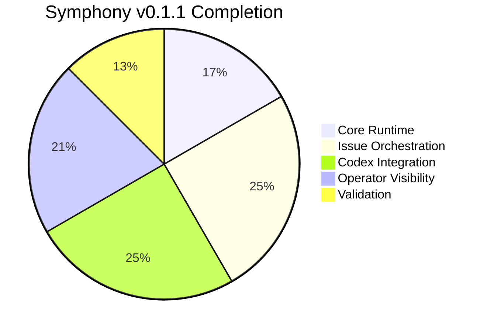

# 🗺️ Roadmap and Status

> Public-facing status snapshot for Symphony Orchestrator — intentionally factual.

  
  

---

## 📌 Current Release Baseline

The repository is at **`v0.1.1`** and implements a working local orchestration loop for Linear-driven Codex work.

---

## ✅ What Is Achieved So Far

### 🏗️ Core Runtime

- ✅ Workflow loading and config validation
- ✅ Workflow file reload with last-known-good fallback
- ✅ Local CLI entrypoint and built binary wrapper
- ✅ Local archive directory selection with `--log-dir`

### 🎯 Issue Orchestration

- ✅ Linear polling for candidate issues
- ✅ Per-issue workspace creation and cleanup
- ✅ Workspace lifecycle hooks with timeout enforcement
- ✅ Retry handling with bounded backoff
- ✅ Shutdown handling and non-retriable hard-failure handling
- ✅ Stall detection for long-silent workers

### 🤖 Codex Worker Integration

- ✅ `codex app-server` process orchestration
- ✅ JSON-RPC initialization and thread/turn lifecycle handling
- ✅ Authentication preflight via `account/read`
- ✅ Rate limit preflight via `account/rateLimits/read`
- ✅ Dynamic `linear_graphql` tool exposure to the worker
- ✅ Per-issue model override selection saved by the operator
- ✅ Docker container sandbox with `codex-universal` base image
- ✅ Resource limits (memory, CPU, tmpfs) and security hardening (cap-drop, no-new-privileges)
- ✅ OOM kill detection via `docker inspect` with distinct `container_oom` error code
- ✅ Container lifecycle management (stop, inspect, remove) on abort/shutdown

### 🖥️ Operator Visibility

- ✅ Local dashboard at `/`
- ✅ JSON API for state, issue detail, attempt listing, attempt detail, refresh, and model override updates
- ✅ Aggregate token accounting in the runtime snapshot
- ✅ Recent event visibility for active work
- ✅ Durable archived attempts and per-attempt event timelines under `.symphony/`
- ✅ Repo-root `./symphony-logs` helper for issue and attempt inspection from archived evidence

### 🧪 Validation

- ✅ Deterministic Vitest unit coverage
- ✅ Fixture-driven protocol tests for the agent runner
- ✅ Docker spawn argument building tests
- ✅ Opt-in live integration test path

---

## 📊 Progress Overview

---

## 🔭 Current Operating Scope

Symphony is currently meant for **local, operator-controlled use on a single host**. It is a practical orchestration tool for:

1. 📋 Watching Linear for candidate issues
2. 📁 Launching Codex workspaces locally
3. 🖥️ Inspecting live or archived work through the dashboard and API

---

## 🔲 Remaining Major Roadmap Gap

> [!IMPORTANT]
> The largest remaining gap is **multi-host worker distribution over SSH**. The current codebase launches workers on the local machine only.

---

## 💡 Smaller Follow-Up Opportunities

These are not blockers for `v0.1.1`, but reasonable follow-up areas:

| Area | Description |
|------|-------------|
| 🎨 Dashboard polish | Further UI improvements and interactivity |
| 🚀 Release automation | Stronger CI/CD and release pipeline |
| 📦 Local static assets | Replace remote CDN assets with fully local ones |
| 📊 Richer reporting | Operator reporting and release metadata |

---

## 📝 How to Keep This Document Current

> [!NOTE]
> Update this file when the shipped operator surface changes. If a capability is not implemented in the code or exposed in the actual runtime, **do not list it here as achieved**.
