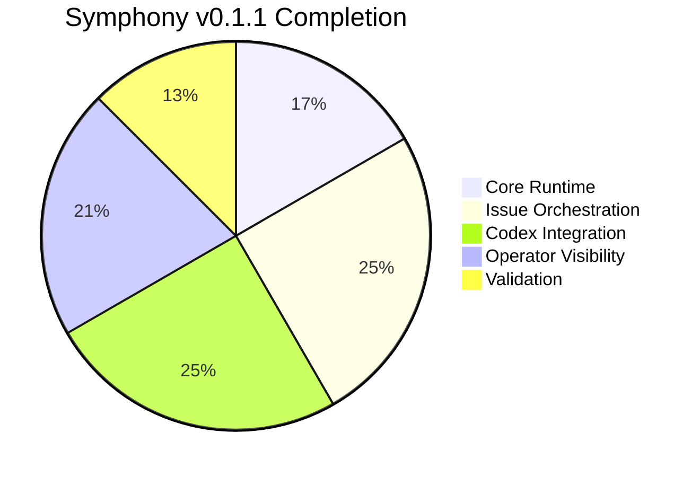

# 🗺️ Roadmap and Status

> Public-facing status snapshot for Symphony Orchestrator — intentionally factual.

  
  

---

## 📌 Current Release Baseline

The repository is at **`v0.1.1`** and implements a working local orchestration loop for Linear-driven Codex work.

---

## ✅ What Is Achieved So Far

### 🏗️ Core Runtime

- ✅ Workflow loading and config validation
- ✅ Workflow file reload with last-known-good fallback
- ✅ Local CLI entrypoint and built binary wrapper
- ✅ Local archive directory selection with `--log-dir`

### 🎯 Issue Orchestration

- ✅ Linear polling for candidate issues
- ✅ Per-issue workspace creation and cleanup
- ✅ Workspace lifecycle hooks with timeout enforcement
- ✅ Retry handling with bounded backoff
- ✅ Shutdown handling and non-retriable hard-failure handling
- ✅ Stall detection for long-silent workers

### 🤖 Codex Worker Integration

- ✅ `codex app-server` process orchestration
- ✅ JSON-RPC initialization and thread/turn lifecycle handling
- ✅ Authentication preflight via `account/read`
- ✅ Rate limit preflight via `account/rateLimits/read`
- ✅ Dynamic `linear_graphql` tool exposure to the worker
- ✅ Per-issue model override selection saved by the operator
- ✅ Docker container sandbox with `node:22-bookworm` base image and Codex CLI
- ✅ Resource limits (memory, CPU, tmpfs) and security hardening (cap-drop, no-new-privileges)
- ✅ OOM kill detection via `docker inspect` with distinct `container_oom` error code
- ✅ Container lifecycle management (stop, inspect, remove) on abort/shutdown

### 🖥️ Operator Visibility

- ✅ Local dashboard at `/`
- ✅ JSON API for state, issue detail, attempt listing, attempt detail, refresh, and model override updates
- ✅ Aggregate token accounting in the runtime snapshot
- ✅ Recent event visibility for active work
- ✅ Durable archived attempts and per-attempt event timelines under `.symphony/`
- ✅ Repo-root `./symphony-logs` helper for issue and attempt inspection from archived evidence

### 🧪 Validation

- ✅ Deterministic Vitest unit coverage
- ✅ Fixture-driven protocol tests for the agent runner
- ✅ Docker spawn argument building tests
- ✅ Opt-in live integration test path

---

## 📊 Progress Overview

---

## 🔭 Current Operating Scope

Symphony is currently meant for **local, operator-controlled use on a single host**. It is a practical orchestration tool for:

1. 📋 Watching Linear for candidate issues
2. 📁 Launching Codex workspaces locally
3. 🖥️ Inspecting live or archived work through the dashboard and API

---

## 🔴 Spec Conformance Gap Analysis

> [!IMPORTANT]
> The following items are **missing or insufficiently implemented** relative to `SPEC.md`. They are grouped by severity and component.

### 🔴 High Priority — Orchestration Logic Gaps

| Gap | Spec Reference | Current State |
|-----|----------------|---------------|
| **Dispatch sorting** | §8.2 — priority asc → oldest `created_at` → identifier tiebreak | `launchAvailableWorkers` dispatches in the order returned by `fetchCandidateIssues` (Linear API order) with no sort applied |
| **Blocker filtering for `Todo`** | §8.2 — `Todo` issues with non-terminal blockers must not dispatch | No blocker check exists in dispatch path |
| **Per-state concurrency** | §5.3.5, §8.3 — `max_concurrent_agents_by_state` map | Config field not parsed; no per-state slot counting in dispatch |
| **Startup terminal workspace cleanup** | §8.6, §16.1 — query terminal issues at startup, remove their workspaces | `cli.ts` only cleans transient subdirs (`tmp`, `.elixir_ls`); does not query Linear for terminal issues or remove their workspaces |
| **Retry timer re-validation** | §16.6 — retry handler re-fetches candidates, checks slot availability, releases claim if absent | `queueRetry` fires a timer that calls `launchWorker` directly without re-fetching candidates or checking slots |
| **`claimed` set** | §4.1.8, §7.1 — explicit claimed set prevents duplicate dispatch across running+retrying | No explicit `claimed` set; checks `runningEntries` + `retryEntries` individually |

### 🟠 Medium Priority — Config / Workflow Gaps

| Gap | Spec Reference | Current State |
|-----|----------------|---------------|
| **`tracker.active_states` / `terminal_states` from config** | §5.3.1 — configurable lists with defaults | `isActiveState()` and `isTerminalState()` are hard-coded in `views.ts`; config fields are ignored |
| **`tracker.kind` validation** | §6.3 — validate `tracker.kind` is present and supported | `validateDispatch()` does not check `tracker.kind`; it is hard-wired to `"linear"` |
| **`tracker.project_slug` validation** | §6.3 — validate when required by tracker kind | `validateDispatch()` does not check `tracker.project_slug` |
| **`tracker.endpoint` config** | §5.3.1 — configurable endpoint, default `https://api.linear.app/graphql` | `LINEAR_ENDPOINT` is a constant in `linear-client.ts`; not configurable |
| **Candidate query uses active states** | §8.2, §11.1 — filter candidates using configured `active_states` | `fetchCandidateIssues` uses a hard-coded `state.type nin` filter instead of the configured `active_states` list |
| **Workspace default root** | §5.3.3 — default `<system-temp>/symphony_workspaces` | Defaults to `./workspaces` relative to process CWD |
| **Prompt template strict error typing** | §5.5 — `template_parse_error`, `template_render_error` | Liquid errors are caught as generic `startup_failed` without spec'd error codes |
| **`codex.stall_timeout_ms <= 0` disables stall detection** | §5.3.6 | `reconcileRunningAndRetrying` always checks stall timeout, doesn't skip when `<= 0` |

### 🟡 Low Priority — Spec Polish / Completeness Gaps

| Gap | Spec Reference | Current State |
|-----|----------------|---------------|
| **`AgentRunner.isActiveState` duplicated** | §4.2 | Both `orchestrator/views.ts` and `agent-runner.ts` define `isActiveState` with slightly different logic (agent-runner excludes `backlog`, `triage`, `todo`, `planned`; views.ts matches). They should share a single source |
| **`linear_graphql` `success=false` for GraphQL errors** | §10.5 — top-level GraphQL `errors` ⇒ `success=false` | `handleLinearGraphqlToolCall` returns `success: true` even when the GraphQL response includes top-level `errors` |
| **Issue state refresh query pagination** | §11.2 | `fetchIssueStatesByIds` does not paginate; will miss issues if `>50` are running concurrently |
| **Runtime `seconds_running` uses tick-based accumulation** | §13.5 — aggregate from ended sessions + live elapsed | `codexTotals.secondsRunning` is incremented by tick duration (`Date.now() - startedAtMs`), not by ended session durations + live session elapsed |
| **`hooks.timeout_ms` non-positive fallback** | §5.3.4 — non-positive values fall back to default | Config layer accepts any number; does not clamp to default if `<= 0` |
| **No `before_remove` hook failure logging distinction** | §9.4 | Hook failures all throw; `removeWorkspace` catches inline but doesn't distinguish logged-and-ignored from fatal |
| **`$VAR` expansion for `workspace.root`** | §6.1 | `config.ts` only expands `~` and `$TMPDIR`; general `$VAR` expansion for `workspace.root` is not implemented |
| **`turn/start` `title` field** | §10.2 — `title = <issue.identifier>: <issue.title>` | `turn/start` request does not include `title` |
| **`session_id` composition** | §4.2 — `<thread_id>-<turn_id>` | Session ID tracking in orchestrator only stores the last received string from events; does not compose `thread_id + turn_id` |

---

## 🔲 Remaining Major Roadmap Gaps

> [!IMPORTANT]
> The largest remaining gap is **multi-host worker distribution over SSH**. The current codebase launches workers on the local machine only.

Other significant remaining features not yet started:

| Feature | Spec Section |
|---------|-------------|
| SSH worker host distribution (`worker.ssh_hosts`, per-host concurrency) | Appendix A |
| Persisted retry queue across restarts | §18.2 (TODO) |
| Pluggable tracker adapters beyond Linear | §18.2 (TODO) |
| First-class tracker write APIs | §18.2 (TODO) |

---

## 💡 Smaller Follow-Up Opportunities

These are not blockers for `v0.1.1`, but reasonable follow-up areas:

| Area | Description |
|------|-------------|
| 🎨 Dashboard polish | Further UI improvements and interactivity |
| 🚀 Release automation | Stronger CI/CD and release pipeline |
| 📦 Local static assets | Replace remote CDN assets with fully local ones |
| 📊 Richer reporting | Operator reporting and release metadata |
| 🧪 Test coverage for dispatch sorting/blocker logic | Spec §17.4 requires deterministic tests for dispatch sort and blocker rules |
| 📄 Configurable observability settings | Spec §18.2 TODO |

---

## 📝 How to Keep This Document Current

> [!NOTE]
> Update this file when the shipped operator surface changes. If a capability is not implemented in the code or exposed in the actual runtime, **do not list it here as achieved**.
