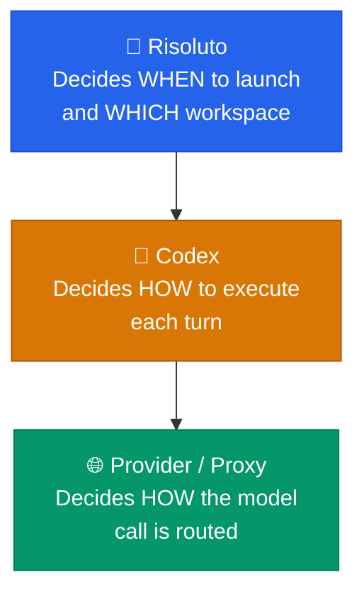

# 🔐 Trust and Auth

> Trust boundary and authentication model for Risoluto.

---

## 🎵 Risoluto's Role

Risoluto has a narrow job: it launches a local Codex app-server, talks to Linear, manages issue workspaces, and reports state locally. It does **not** choose backing Codex accounts, perform browser login, or implement provider pooling itself.

---

## 🏗️ Trust Layers



| Layer | Component            | Responsibility                                                                       |
| :---: | -------------------- | ------------------------------------------------------------------------------------ |
| **1** | **Risoluto**         | Decides when to launch work and what workspace directory the worker can use          |
| **2** | **Codex**            | Decides how to execute each turn, including approvals and any configured MCP servers |
| **3** | **Provider / Proxy** | Decides which backing account or route handles the actual model call                 |

---

## ⚠️ Recommended v0.2 Trust Posture

> [!WARNING]
> The recommended v0.2 posture is deliberately **high trust** — appropriate **only** for local, operator-controlled environments:

| Setting               | Value                          |
| --------------------- | ------------------------------ |
| `approval_policy`     | `"never"`                      |
| `thread_sandbox`      | `"danger-full-access"`         |
| `turn_sandbox_policy` | `{ type: "dangerFullAccess" }` |

Risoluto now generates a fresh per-attempt container-local `CODEX_HOME` for every worker run. API-key flows render provider config into that runtime home, and `openai_login` flows read `auth.json` from `codex.auth.source_home` and inject it into the container runtime home.

---

## 🌐 Provider Boundary

Risoluto launches the exact `codex.command` from the workflow, but it now owns the minimal runtime config that `codex app-server` sees inside Docker. That config is generic:

- Direct OpenAI API usage: `codex.auth.mode: "api_key"` with no `codex.provider` block
- OpenAI-compatible proxy or third-party endpoint: `codex.auth.mode: "api_key"` plus `codex.provider.base_url`, `env_key`, and optional headers/query params
- ChatGPT/Codex login backed flows: `codex.auth.mode: "openai_login"` with an optional custom provider that sets `requires_openai_auth: true`

When running inside Docker, the container cannot reach the host's `127.0.0.1` directly. Risoluto handles that transparently by:

- adding `--add-host=host.docker.internal:host-gateway` to every container
- rewriting host-bound provider URLs such as `127.0.0.1` and `localhost` to `host.docker.internal` in the generated runtime config

This keeps provider routing **below** Risoluto without keeping repo-local launcher scripts or checked-in Codex homes.

---

## 🐳 Docker Sandbox Boundary

Risoluto runs the Codex agent inside a Docker container using a `node:22-bookworm` base image with the Codex CLI installed globally. The container is a **transparent wrapper** — the same `codex.command` runs inside, with the same paths and environment.

**Key properties:**

| Property                | How                                                                                                                               |
| ----------------------- | --------------------------------------------------------------------------------------------------------------------------------- |
| **Path identity**       | Workspace and archive paths are bind-mounted at the same absolute path inside the container                                       |
| **Auth preservation**   | `openai_login` reads `auth.json` from `codex.auth.source_home` and injects it into the container-local runtime home before launch |
| **Host permissions**    | Container runs as `--user $(id -u):$(id -g)` — files it creates are owned by the host user                                        |
| **Provider decoupling** | Risoluto renders the runtime config, but the configured provider still decides how model calls are routed                         |
| **Network**             | Default is Docker's default bridge (full internet). Operators can pre-provision a restricted network and reference it by name     |

> [!NOTE]
> Named Docker volumes (used for build caches) survive container and image replacement, but **not** `docker system prune --volumes`. Operator docs should warn against pruning volumes prefixed with `risoluto-`.

### Sandbox Hardening Options

Risoluto supports several opt-in hardening knobs configured under `codex.sandbox` in the config overlay.

#### Egress Domain Allowlist

Set `codex.sandbox.egress_allowlist` to restrict which external hosts the sandbox container can reach:

```yaml
codex:
  sandbox:
    egress_allowlist:
      - api.openai.com
      - api.linear.app
      - "*.github.com"
```

When the allowlist is non-empty, Risoluto:

1. Adds `--cap-add=NET_ADMIN` to the container (required for iptables manipulation)
2. Injects iptables OUTPUT rules before launching Codex:
   - Allows loopback, established/related, and DNS (port 53) traffic
   - Resolves each allowlisted domain and allows traffic to the resolved IPs
   - Rejects all other outbound traffic

> [!WARNING]
> Enabling egress allowlist adds `CAP_NET_ADMIN` back despite `--cap-drop=ALL`. This partially weakens the default capability posture. This is the same trade-off used by OpenSandbox's egress sidecar. The sandbox image must include `iptables` and `getent`; if unavailable, egress filtering silently degrades (no enforcement).

#### Seccomp Profile

Set `codex.sandbox.security.seccomp_profile` to apply a custom seccomp profile for syscall-level filtering:

```yaml
codex:
  sandbox:
    security:
      seccomp_profile: /etc/docker/seccomp-strict.json
```

When empty (default), Docker's built-in default seccomp profile applies.

#### Container Labels

Every sandbox container is tagged with observability labels:

| Label                 | Value                           |
| --------------------- | ------------------------------- |
| `risoluto.issue`      | Issue identifier (e.g. `NIN-5`) |
| `risoluto.model`      | Model in use (e.g. `gpt-5.4`)   |
| `risoluto.workspace`  | Workspace directory path        |
| `risoluto.started-at` | UTC ISO-8601 start timestamp    |

Filter containers with: `docker ps --filter label=risoluto.issue=NIN-5`

#### Startup Readiness & Graceful Drain

- **Startup readiness** (`codex.startup_timeout_ms`, default 30s): Risoluto waits for the child process to emit output before sending `initialize`. Returns `startup_timeout` error on failure.
- **Graceful drain** (`codex.drain_timeout_ms`, default 2s): After the last turn completes, Risoluto waits before closing the JSON-RPC connection, giving final notifications (token usage, events) time to flush.

### Containerized Risoluto

When Risoluto itself runs inside Docker, worker containers still need host-side bind mounts for the workspace and archive directories. Risoluto now supports that by translating container-visible paths back to host-visible paths before it launches a worker container.

Required environment variables for the service container:

- `DATA_DIR=/data`
- `RISOLUTO_HOST_WORKSPACE_ROOT`
- `RISOLUTO_HOST_ARCHIVE_DIR`
- `RISOLUTO_CONTAINER_WORKSPACE_ROOT=/data/workspaces`
- `RISOLUTO_CONTAINER_ARCHIVE_DIR=/data/archives`

This keeps the worker contract stable:

- Risoluto sees `/data/workspaces/<ISSUE>` inside its own container.
- Docker bind mounts the real host workspace root into `/data/workspaces`.
- Before launching a worker, Risoluto translates `/data/workspaces/<ISSUE>` back to the host path and mounts it into the worker container at the original container-side path.

### `openai_login` Auth Chain in Docker

For `codex.auth.mode: openai_login`, the expected mount chain is:

1. Host `~/.codex/auth.json`
2. Service container mount at `/codex-auth`
3. `WORKFLOW.docker.md` sets `codex.auth.source_home: /codex-auth`
4. Risoluto reads `/codex-auth/auth.json`, base64-encodes it, and injects it into the worker container runtime home

That means the service container must be able to read the mounted source home directly. Risoluto does not perform browser login inside containers.

## 🔔 Local Operator APIs

The local loopback HTTP surface now includes operator-only configuration and secret management routes:

- `GET /metrics`
- `GET /api/v1/config`
- `GET /api/v1/config/schema`
- `GET /api/v1/config/overlay`
- `PUT /api/v1/config/overlay`
- `PATCH /api/v1/config/overlay/:path`
- `DELETE /api/v1/config/overlay/:path`
- `GET /api/v1/secrets`
- `POST /api/v1/secrets/:key`
- `DELETE /api/v1/secrets/:key`

These routes are intentionally loopback-local like the rest of the dashboard/API surface. They are suitable for trusted operator environments, not public exposure.

---

## 🔑 Required Credentials

| Credential        | Source                                                                             | Purpose                                   |
| ----------------- | ---------------------------------------------------------------------------------- | ----------------------------------------- |
| **Linear access** | `tracker.api_key` (typically `$LINEAR_API_KEY`)                                    | Polling issues from Linear                |
| **Codex auth**    | Either provider env vars on the host or `auth.json` under `codex.auth.source_home` | Authenticating model calls                |
| **GitHub PAT**    | Optional, stored via setup wizard or `$GITHUB_TOKEN`                               | Creating pull requests for completed work |

### Credential Entry via Setup Wizard

The setup wizard at `/setup` stores all credentials in the encrypted secrets store. For OpenAI auth, the wizard offers two modes:

- **API Key**: paste an `sk-...` key directly
- **Codex Login**: click **"Sign in with OpenAI"** to authenticate via your browser using the PKCE authorization code flow, or paste `~/.codex/auth.json` as a manual fallback

> [!NOTE]
> The browser sign-in flow uses `auth.openai.com` with PKCE and a local callback server on port `1455` (the same port registered with the official Codex CLI client ID). Make sure port `1455` is not in use by another process when signing in.

---

## 🚨 Required MCP Failure

> [!NOTE]
> This failure is a **Codex runtime startup problem**, not a Risoluto orchestration bug:
>
> ```text
> error code=startup_failed msg="thread/start failed because a required MCP server did not initialize"
> ```
