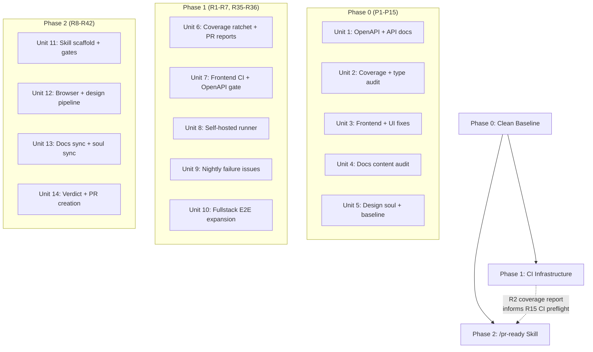

> **⚠️ ARCHIVED** — This is a historical planning artifact from April 2026. It is preserved for context but does not reflect current project state. See [ROADMAP_AND_STATUS.md](../ROADMAP_AND_STATUS.md) for the active roadmap.

# Testing Infrastructure & PR Readiness System

## Overview

Build a four-layer system that establishes a perfect baseline (Phase 0), prevents testing decay through CI automation (Layer 1), orchestrates PR readiness via a compound Claude Code skill (Layer 2), enforces design alignment through a living design soul (Layer 3), and keeps Mintlify docs in sync with code (Layer 4). 57 requirements across 5 phases.

## Problem Frame

Risoluto's test suite is broad (333 files, 10 tiers, 86%+ coverage) but shipping is bottlenecked by manual verification. Coverage thresholds are static and will silently decay. PR authors have no per-file visibility. Frontend tests never run in CI. Mutation testing times out. Docs are already drifted (OpenAPI v0.4.0 vs code v0.6.0). The manual PR checklist — build, lint, tests, docs, design, UI — is the real bottleneck.

The system must be built on a clean foundation. Building automation on top of existing drift means the ratchet locks in wrong thresholds, docs sync flags everything as "new," and the verdict report is all yellow on day one. (see origin: docs/brainstorms/2026-04-06-testing-infrastructure-requirements.md)

## Requirements Trace

**Phase 0 (P1-P15):** OpenAPI sync, coverage baseline, frontend test validation, docs-site audit, repo docs sync, design soul refresh, UI bug fixes, test suite health, baseline tag.

**Layer 1 (R1-R7):** Coverage autoUpdate, PR coverage reports, nightly failure GitHub issues, frontend CI job, type-only exclusion audit, fullstack E2E for all 15 pages, self-hosted runner for mutation.

**Layer 2 (R8-R22):** `/pr-ready` compound skill — verify/report/fix/ship pipeline, mechanical gates, backend/frontend gates, docs sync check, CI preflight, dynamic skill orchestration, browser skill routing, expect-cli gate, verdict report, PR creation.

**Layer 3 (R23-R34):** `.impeccable.md` as design truth, design token verification, living soul (propose+approve per PR, stale detection, revision tracking), full impeccable composition pipeline (audit/critique → downstream skills), intensity guard.

**Layer 4 (R35-R42):** OpenAPI CI hard gate, dynamic code-to-docs mapping, stale/missing/example detection, same-PR doc fixes, doc-it principles.

## Scope Boundaries

- No new integration test scenarios (covered by 2026-04-01 testing expansion requirements)
- No test framework changes (Vitest, Playwright, Stryker stay)
- No manual coverage threshold bumps after Phase 0 (ratchet handles it)
- `/pr-ready` does not replace human code review — it handles mechanical verification
- No CI-based Claude Code Action for narrative docs — local `/pr-ready` only
- Browser skills stay separate (orchestrate, don't merge) — two CLIs are incompatible

## Context & Research

### Relevant Code and Patterns

- **CI workflow:** `.github/workflows/ci.yml` — Phase 2 parallel block is where new PR jobs go. Add to `build-and-test` needs array. Nightly block uses `schedule || workflow_dispatch` guard.
- **Vitest config:** `vitest.config.ts` — thresholds at 82/73/82/82, v8 provider, 13 exclusions (4 type-only). No `autoUpdate`. No `json-summary` reporter.
- **Vitest frontend config:** `vitest.frontend.config.ts` — bare config, no coverage, no CI job.
- **Playwright:** `playwright.config.ts` (smoke + visual projects), `playwright.fullstack.config.ts` (fullstack project with globalSetup for real backend). Fullstack specs in `tests/e2e/specs/fullstack/`.
- **Stryker:** `stryker.config.json` — 58 mutate files, 4-shard nightly matrix in `mutation.yml`, `concurrency: 8`.
- **OpenAPI:** `src/http/openapi.ts` → `getOpenApiSpec()` (lazily cached). Served via `src/http/routes/system.ts`. 8 path-builder imports from `src/http/openapi-paths.ts`.
- **Skill structure:** `skills/visual-verify/` — `SKILL.md` + `scripts/preflight.sh` + `references/` + `templates/`. Anvil-aware artifact pathing. Mandatory trigger via description field.
- **Pre-push hooks:** `.husky/pre-push` — 3 modes (SKIP_HOOKS, FULL_CHECK, default 80/20). Default runs build + test + typecheck.
- **Plan naming:** `docs/plans/YYYY-MM-DD-NNN-<type>-<slug>-plan.md`.

### External Skill Patterns Adopted

- **Next.js `update-docs`:** CODE-TO-DOCS-MAPPING reference file + 5-step workflow (diff → map → review → validate → commit). Adopted as a lightweight hints file alongside dynamic scanning.
- **Gemini `docs-writer`:** 4-phase workflow (Investigate → Audit → Connect → Plan). Sidebar check maps to `mint.json` verification. Adopted as docs sync module structure.
- **clawdis:** Evidence bar (all pages found → updated → nav verified). Batch safety gate (>N pages → confirm). Heredoc quoting for `gh` CLI. Adopted for verification + PR creation.
- **turbo `comprehensive-test`:** Escalating 4-level testing (basic → complex → adversarial → cross-cutting). Confirms our pipeline escalation pattern.
- **Impeccable cheatsheet:** Full composition graph with `leadsTo` and `combinesWith` relationships. Diagnostic → downstream routing. 20 skills, 6 categories.
- **browserbase `ui-test`:** Diff-driven 3-round testing, fan-out sub-agents, HTML report with embedded screenshots.
- **million `expect`:** Natural-language instruction testing, automatic a11y+perf, enforcement gate.

## Key Technical Decisions

- **Coverage autoUpdate:** Enable `autoUpdate: true` in `vitest.config.ts` after bumping thresholds to actual levels in Phase 0. The ratchet only works if the starting point is accurate.
- **PR coverage report:** Use `davelosert/vitest-coverage-report-action`. Requires adding `json-summary` reporter to vitest config. Action posts a PR comment with per-file coverage.
- **OpenAPI CI gate:** Unit test approach — call `getOpenApiSpec()` directly, compare output against `docs-site/openapi.json` using structural diff (deep equality ignoring key order). No server startup needed. Falls back to `oasdiff` binary if structural comparison needs schema-aware diffing. Runs only when `src/http/**` changed.
- **Nightly failure tracking:** Custom composite action using `gh` CLI (evaluate `dorny/test-reporter` as alternative first — 3K+ stars, handles this pattern natively). For each failed test: track consecutive failure count. Create issue only after **2 consecutive nightly failures** of the same test (prevents issue spam from transient infra blips). Update existing issues on subsequent failures. Auto-close when test passes for 2 consecutive nights.
- **Fullstack E2E:** Reuse existing `playwright.fullstack.config.ts` with its `fullstack` project and `globalSetup` (real backend). Add 11 new specs to `tests/e2e/specs/fullstack/` covering remaining pages.
- **Self-hosted runner:** Install GitHub Actions runner on VDS. Labels: `self-hosted, linux, x64, risoluto-vds`. Dedicated `_runner` user, ephemeral workdir cleanup. Only mutation job uses it.
- **Type-only file heuristic:** Files containing only `type`/`interface`/`export type`/`export interface` declarations and import statements. No function/class declarations, no executable statements. Script in `scripts/audit-type-only.ts`.
- **Skill structure:** `/pr-ready` follows `visual-verify` pattern: `skills/pr-ready/SKILL.md` + `skills/pr-ready/scripts/` + `skills/pr-ready/references/`. Symlinked into `.claude/skills/`.
- **Dynamic docs mapping (hybrid):** Primary: regex scan of `docs-site/**/*.mdx` for references to changed code (endpoint paths, config keys, component names). Boost: `skills/pr-ready/references/code-to-docs-hints.md` for known relationships. Dynamic scan always runs; hints speed it up.
- **Browser CLI unavailability:** Graceful skip with warning. `/pr-ready` checks for `agent-browser`, `browse`, and `expect-cli` at startup. Missing CLIs produce a clear warning in the verdict report but don't fail the pipeline.
- **MDX editing:** Edit directly. Mintlify components are standard JSX — preserve them, edit prose only. Smallest edit that fixes the gap.

## Open Questions

### Resolved During Planning

- **vitest-coverage-report compatibility:** Requires `json-summary` reporter. Add `reporter: ["json-summary", "text"]` to vitest coverage config.
- **Fullstack E2E project:** Reuse existing `playwright.fullstack.config.ts`. No new Playwright project needed.
- **OpenAPI diff method:** `oasdiff` for structural comparison. Install as devDependency or CI binary.
- **Skill file structure:** Single orchestrator SKILL.md with `references/` for mapping hints, `scripts/` for preflight checks.

### Deferred to Implementation

- **expect-cli localhost compatibility:** Install and test against Risoluto localhost. May need `--cookies` flag or custom config. Runtime discovery.
- **Impeccable finding-to-skill routing accuracy:** The `leadsTo` graph from the cheatsheet is the design intent. Actual diagnostic output format from `/audit` and `/critique` may need parsing logic tuned at implementation time.
- **docs-site content freshness (Phase 0):** The full audit of 20 MDX pages requires reading each page + verifying against code. Specific stale references will be discovered during execution, not planning.

## Phased Delivery

Phase 0 must complete first (clean baseline). Phase 1 units depend on specific Phase 0 completions (see dependency chains below). Phase 2 depends on Phase 0 + Phase 1 Units 6-7. Honest assessment: there is limited true parallelism — most Phase 1 units are blocked by Phase 0.

### Sizing and Time-Boxing

| Unit | Size | Effort | Notes |
|------|------|--------|-------|
| Unit 1: OpenAPI sync | M | 1-2 days | Known scope — spec generation + reconciliation |
| Unit 2: Coverage baseline | S | 0.5 day | Script + config change |
| Unit 3: UI bug fixes | L | 2-4 days | 6 bugs, unknown root causes for functional issues |
| Unit 4: Docs content audit | XL | 3-5 days | **Largest Phase 0 effort.** 20 pages + repo docs. Time-box: 3 days for critical pages (config, API ref, quickstart, setup), defer remaining to follow-up. |
| Unit 5: Design soul + tag | S | 0.5 day | Audit + update + run tests |
| Unit 6: Coverage ratchet | S | 0.5 day | Config change + CI step |
| Unit 7: Frontend CI + OpenAPI gate | M | 1 day | Two new CI jobs |
| Unit 8: Self-hosted runner | M | 1-2 days | VDS setup + CI config |
| Unit 9: Nightly failure issues | M | 1 day | Composite action |
| Unit 10: Fullstack E2E expansion | XL | 5-8 days | **Largest overall effort.** 11 new specs + POMs. Split: critical-first (5 pages, 3 days) then secondary (6 pages, 3-5 days). |
| Unit 11: Skill scaffold | L | 2-3 days | Core SKILL.md + pipeline logic |
| Unit 12: Browser + design | L | 2-3 days | Orchestration + impeccable routing |
| Unit 13: Soul + docs sync | L | 2-3 days | Two sync modules |
| Unit 14: Verdict + PR | M | 1 day | Template + ship pipeline |

**Total estimate: 20-35 developer-days** across all phases.

**Phase 0 time-box:** If the docs content audit (Unit 4) exceeds 3 days, ship what's done and defer remaining pages to a tracked follow-up. The baseline tag happens when tests are green and critical docs are synced, not when every page is perfect.

### Escape Hatches

Every new CI gate needs a bypass for emergencies:

| Gate | Escape Hatch | When to Use |
|------|-------------|-------------|
| Coverage ratchet (`autoUpdate`) | Manually lower threshold in PR with `[coverage-override]` label | Rounding errors, test removals |
| Frontend test CI job | `[skip-frontend-tests]` PR label → `if: !contains(...)` | Known flaky test, blocked by upstream |
| OpenAPI sync gate | `[skip-openapi-check]` PR label | Intentional spec divergence, WIP endpoint |
| Nightly failure issues | `SKIP_NIGHTLY_ISSUES=1` env var | Infra blip, mass failure event |
| `/pr-ready` full pipeline | `--minimal` flag (mechanical gates only) | Speed-critical PRs, backend-only changes |

## Implementation Units

### Phase 0: Clean Baseline

- [ ] **Unit 1: OpenAPI & API Documentation Sync**

**Goal:** Bring `docs-site/openapi.json` to parity with runtime spec and reconcile hand-authored API reference.

**Requirements:** P1, P2

**Dependencies:** None

**Files:**
- Modify: `docs-site/openapi.json`
- Modify: `docs-site/api-reference/endpoints.mdx`
- Modify: `src/http/openapi.ts` (bump API version to 0.6.0)
- Modify: `src/http/openapi-paths.ts` (add any missing path builders)
- Modify: `src/http/response-schemas.ts` (add missing schemas)

**Approach:**
- Run Risoluto locally, hit `/api/v1/openapi.json`, capture runtime spec
- Diff against `docs-site/openapi.json` to identify all divergences
- Add missing endpoints to `openapi-paths.ts` (Templates CRUD, Audit log, SSE events, Swagger UI, `/steer`)
- Update `docs-site/openapi.json` with regenerated spec
- Reconcile `api-reference/endpoints.mdx` against the updated spec — remove hand-authored entries that now live in OpenAPI, keep any that are intentionally excluded from the spec

**Patterns to follow:**
- Existing path builder pattern in `src/http/openapi-paths.ts` (one function per tag group)
- Response schema pattern in `src/http/response-schemas.ts`

**Test scenarios:**
- Happy path: Runtime spec matches `docs-site/openapi.json` after sync (byte-level or structural equality)
- Edge case: Endpoints in `endpoints.mdx` but not in spec are either added to spec or explicitly documented as excluded
- Integration: `getOpenApiSpec()` returns valid OpenAPI 3.1.0 (validate with a schema validator)

**Verification:**
- `docs-site/openapi.json` version is 0.6.0
- All 37+ operations documented
- `endpoints.mdx` references match the spec

---

- [ ] **Unit 2: Coverage Baseline & Type-Only Audit**

**Goal:** Expand type-only exclusions, bump thresholds to match actual coverage, validate frontend tests pass.

**Requirements:** P3, P4, P5

**Dependencies:** None

**Files:**
- Modify: `vitest.config.ts`
- Create: `scripts/audit-type-only.ts`
- Modify: `vitest.frontend.config.ts` (add coverage config if warranted)

**Approach:**
- Write `scripts/audit-type-only.ts`: scan `src/**/*.ts`, parse each file's AST (via ts-morph or simple regex), identify files with only type/interface/export type declarations and imports. Output list.
- Run audit, add all qualifying files to `vitest.config.ts` coverage exclude list with `// Type-only file` comment
- Run `pnpm test -- --coverage` to get exact current coverage numbers
- Bump thresholds to match actual (e.g., `statements: 86, branches: 79, functions: 85, lines: 86`)
- Run `pnpm run test:frontend` — fix any failures in the 28 tests

**Patterns to follow:**
- Existing coverage exclude pattern in `vitest.config.ts` (comment annotations per category)

**Test scenarios:**
- Happy path: audit script identifies all type-only files, none have executable code
- Edge case: file with only `export type` re-exports (barrel file) is correctly classified
- Edge case: file with a single `const` or `enum` is NOT classified as type-only
- Verification: `pnpm run test:frontend` passes with 0 failures

**Verification:**
- Coverage exclusion list is complete
- Thresholds match actual coverage (no gap > 0.5%)
- All 28 frontend tests pass locally

---

- [ ] **Unit 3: UI Bug Fixes**

**Goal:** Fix the 6 failures found in the exploratory ui-test run.

**Requirements:** P12

**Dependencies:** None

**Files:**
- Modify: `frontend/src/` (specific files TBD based on each bug)

**Approach:**
- Fix each of the 6 failures in priority order:
  1. `settings-tabs` — Settings page renders blank (likely a routing or data-fetching issue)
  2. `notifications-page` — Stuck in loading skeleton (likely missing API response handling)
  3. `back-forward` — SPA router desync on history navigation (router state management)
  4. `axe-settings` — 6 inputs with no accessible labels (add `aria-label` or `<label>` elements)
  5. `axe-overview` — Color contrast + landmark violations (adjust CSS custom properties)
  6. `axe-queue` — Color contrast + missing h1 (add heading, fix contrast)
- After each fix, run `/visual-verify` to confirm the fix

**Execution note:** Fix functional issues (1-3) first, then a11y issues (4-6). Functional fixes may resolve some a11y findings.

**Test scenarios:**
- Happy path: Settings page renders all tabs (General, Devtools, Credentials)
- Happy path: Notifications page shows notification config, not loading skeleton
- Happy path: Navigate 3 pages → back twice → forward once → correct page at each step
- Happy path: All Settings page inputs have accessible labels (axe-core: 0 critical violations)
- Happy path: Overview page passes axe-core with 0 serious/critical violations
- Happy path: Queue page has an h1 heading and passes color contrast checks

**Verification:**
- Re-run `/ui-test` exploratory QA — 0 failures on all 6 previously-failing tests
- All Playwright smoke tests still pass

---

- [ ] **Unit 4: Docs-Site & Repo Docs Content Audit**

**Goal:** Audit all 20 docs-site MDX pages and key repo docs against current codebase. Fix stale references.

**Requirements:** P6, P7, P8, P9

**Dependencies:** Unit 1 (OpenAPI must be synced first)

**Files:**
- Modify: `docs-site/**/*.mdx` (pages with stale content)
- Modify: `docs-site/changelog.mdx`
- Modify: `docs-site/docs.json` (fix og-image reference)
- Modify: `README.md`, `docs/OPERATOR_GUIDE.md`, `docs/ROADMAP_AND_STATUS.md` (as needed)

**Approach:**
- For each of the 20 MDX pages: read page → grep for config keys, endpoint paths, CLI flags, env vars → verify each reference exists in current code
- Fix stale references (renamed endpoints, removed config options, changed defaults)
- Update `changelog.mdx` with v0.5.0 and v0.6.0 entries
- Fix `docs.json` og-image reference (either add the image or remove the reference)
- Audit `README.md`, `OPERATOR_GUIDE.md`, `ROADMAP_AND_STATUS.md` for stale claims
- Check `mint.json` navigation matches actual file structure

**Patterns to follow:**
- Gemini docs-writer 4-phase workflow: Investigate → Audit → Connect → Plan
- doc-it principles: never invent fields, match existing voice, smallest edit

**Test scenarios:**
- Happy path: Every config key mentioned in `guides/configuration.mdx` exists in `src/config/` or config schema
- Happy path: Every endpoint in `api-reference/endpoints.mdx` exists in the OpenAPI spec or is documented as excluded
- Edge case: `changelog.mdx` has entries for all versions from v0.1.0 through v0.6.0
- Verification: `mint.json` navigation references only existing files

**Verification:**
- Zero stale references across all 20 MDX pages
- `mint.json` navigation matches actual file structure
- Changelog is current through v0.6.0

---

- [ ] **Unit 5: Design Soul Refresh & Baseline Tag**

**Goal:** Refresh `.impeccable.md`, add revision history, run full test suite, and create baseline tag.

**Requirements:** P10, P11, P13, P14, P15

**Dependencies:** Units 1-4

**Files:**
- Modify: `.impeccable.md`
- No new files

**Approach:**
- Run `/audit` on current frontend to identify design drift
- Compare `.impeccable.md` tokens against actual CSS custom properties in `frontend/src/`
- Compare `mc-*` component classes against actual frontend components
- Update `.impeccable.md` to reflect current reality
- Add Revision History section with initial baseline entry
- Run full test suite: `pnpm test`, `pnpm run test:frontend`, `pnpm exec playwright test --project=smoke`, `pnpm exec playwright test --project=visual`
- Run `pnpm run lint`, `pnpm run format:check`, `pnpm run knip` — fix any issues
- Create tagged commit: `baseline/pre-automation`

**Test scenarios:**
- Happy path: All CSS custom properties in `.impeccable.md` exist in frontend stylesheets
- Happy path: All `mc-*` classes in `.impeccable.md` are used in frontend components
- Edge case: Tokens documented but not found → removed from `.impeccable.md`
- Edge case: Tokens found in code but not documented → added to `.impeccable.md`

**Verification:**
- `.impeccable.md` accurately reflects current frontend
- Full test suite passes green (all tiers)
- Zero lint/format/knip issues
- `baseline/pre-automation` tag exists

---

### Phase 1: CI Infrastructure

- [ ] **Unit 6: Coverage Ratcheting & PR Coverage Reports**

**Goal:** Enable auto-ratcheting thresholds and add per-file coverage reports to PRs.

**Requirements:** R1, R2

**Dependencies:** Unit 2 (thresholds must be at actual levels first)

**Files:**
- Modify: `vitest.config.ts` (add `autoUpdate: true`, add `json-summary` reporter)
- Modify: `.github/workflows/ci.yml` (add coverage report step to `test` job)

**Approach:**
- In `vitest.config.ts`: add `thresholds: { autoUpdate: true }` and `reporter: ["json-summary", "text"]` to coverage config
- In `ci.yml`: after the `test` job's vitest step, add `davelosert/vitest-coverage-report-action` step that posts a PR comment with per-file coverage
- The action reads `coverage/coverage-summary.json` produced by the `json-summary` reporter

**Patterns to follow:**
- Existing `test` job structure in `ci.yml` (Node matrix, cache restore)

**Test scenarios:**
- Happy path: PR with new code gets a coverage comment showing per-file delta
- Happy path: `autoUpdate: true` bumps thresholds in `vitest.config.ts` when coverage improves (verify by adding a well-covered file and checking threshold change)
- Edge case: PR that decreases coverage below threshold fails CI

**Verification:**
- `vitest.config.ts` has `autoUpdate: true`
- PRs receive coverage comments
- Thresholds auto-bump when coverage improves

---

- [ ] **Unit 7: Frontend CI Job & OpenAPI Gate**

**Goal:** Add frontend test job to CI and OpenAPI spec drift gate.

**Requirements:** R4, R35, R36

**Dependencies:** Unit 2 (frontend tests must pass first)

**Files:**
- Modify: `.github/workflows/ci.yml`
- Create: `scripts/check-openapi-sync.sh`

**Approach:**
- Add `test-frontend` job in Phase 2 parallel block: runs `pnpm run test:frontend`, `needs: [build]`. Add to `build-and-test` needs array.
- Add `openapi-sync` job: runs a lightweight Node script that imports `getOpenApiSpec()`, serializes the output, and compares it against `docs-site/openapi.json` using structural deep equality (ignoring key order). No server startup needed — just import and call. Gate: use `dorny/paths-filter` for `src/http/**`. Add to `build-and-test` needs array.
- Create `scripts/check-openapi-sync.ts`: import `getOpenApiSpec()`, read `docs-site/openapi.json`, deep-compare, exit non-zero on diff with a clear diff summary

**Patterns to follow:**
- Existing job structure: `needs: [build]`, timeout, ubuntu-24.04 runner
- `dorny/paths-filter` for conditional execution (referenced in Dosu research)

**Test scenarios:**
- Happy path: PR with frontend changes — `test-frontend` job runs and passes
- Happy path: PR with `src/http/` changes — `openapi-sync` job runs and passes when spec is in sync
- Error path: PR adds new endpoint without updating `docs-site/openapi.json` — `openapi-sync` job fails
- Edge case: PR touching only `docs-site/` — neither job runs (no wasted CI time)

**Verification:**
- `test-frontend` blocks merge on failure
- `openapi-sync` blocks merge when spec drifts
- Both jobs appear in PR checks

---

- [ ] **Unit 8: Self-Hosted Runner for Mutation**

**Goal:** Set up VDS as GitHub Actions self-hosted runner. Migrate nightly mutation job.

**Requirements:** R7

**Dependencies:** None (can run in parallel with other Phase 1 units)

**Files:**
- Modify: `.github/workflows/mutation.yml`
- Create: `scripts/setup-runner.sh` (documentation/reference script)

**Approach:**
- On VDS: create `_runner` user, install GitHub Actions runner, configure with labels `self-hosted, linux, x64, risoluto-vds`
- Enable auto-update for runner binary
- In `mutation.yml`: change nightly `mutation` job from `runs-on: ubuntu-24.04` to `runs-on: [self-hosted, linux, x64, risoluto-vds]`
- Keep `mutation-incremental` (PR) on GitHub-hosted runners — it's fast enough
- Add cleanup step: `rm -rf _work` after mutation completes
- Document setup in `scripts/setup-runner.sh` for reproducibility

**Test scenarios:**
- Happy path: Nightly mutation job runs on VDS and completes within 30 minutes (vs. 6h+ on GH Actions)
- Happy path: `mutation-incremental` still runs on GitHub-hosted for PRs
- Error path: Runner goes offline → nightly job fails → Slack notification fires (existing `nightly-notify` job)

**Verification:**
- Nightly mutation completes without timeout
- All 4 shards finish on VDS
- PR mutation-incremental still works on GitHub-hosted

---

- [ ] **Unit 9: Nightly Failure GitHub Issues**

**Goal:** Auto-create GitHub issues per failing nightly test with dedup and auto-close.

**Requirements:** R3

**Dependencies:** None

**Files:**
- Create: `.github/actions/nightly-failure-tracker/action.yml`
- Modify: `.github/workflows/ci.yml` (add step to nightly jobs)

**Approach:**
- **First:** evaluate `dorny/test-reporter` (3K+ stars) and GitHub's native test analytics. If either handles per-test issue dedup + auto-close, use it instead of custom code.
- **If custom:** Create composite action that tracks consecutive failure counts (stored as issue labels or comments). Issue creation requires **2 consecutive nightly failures** of the same test — a single failure is logged but does not create an issue (prevents spam from transient infra blips).
- For each failed test with 2+ consecutive failures: search for open issue with `nightly-failure` label + test name. Create if not found, update if found.
- For previously-failing tests that pass for **2 consecutive nights**: auto-close with "Resolved" comment.
- Run after each nightly job (fullstack-e2e, visual-regression, live-provider-smoke)
- **Safety valve:** `SKIP_NIGHTLY_ISSUES=1` env var disables issue creation during known infra maintenance

**Patterns to follow:**
- clawdis heredoc quoting for `gh` CLI bodies
- Existing `nightly-notify` job structure for `if` conditions

**Test scenarios:**
- Happy path: Nightly test fails → issue created with `nightly-failure` label and test name
- Happy path: Same test fails again → existing issue updated (not duplicated)
- Happy path: Test passes after previous failure → issue auto-closed with "Resolved"
- Edge case: Multiple tests fail in same run → one issue per test, not one per job

**Verification:**
- Issues appear with correct labels and test names
- No duplicate issues for the same test
- Issues auto-close when tests recover

---

- [ ] **Unit 10: Fullstack E2E Expansion**

**Goal:** Add fullstack E2E specs for all 15 frontend pages.

**Requirements:** R6

**Dependencies:** Unit 3 (UI bugs must be fixed first)

**Files:**
- Create: `tests/e2e/specs/fullstack/` — 11 new spec files (4 already exist)
- Modify: `tests/e2e/mocks/data/` (add data factories for new pages if needed)
- Create: `tests/e2e/pages/` — new POMs for uncovered pages

**Approach:**
- Reuse `playwright.fullstack.config.ts` — no project changes needed
- **Critical-first (3 days):** overview, queue, settings, logs, observability — the 5 most-used pages
- **Secondary (3-5 days):** runs, attempt, notifications, git, workspaces, containers, templates — remaining 6 pages
- Ship critical-first as a standalone PR. Secondary follows as a separate PR. This avoids blocking downstream work on 11 specs.
- Follow existing fullstack spec patterns (e.g., `issue-lifecycle.fullstack.spec.ts`)
- Each spec tests: page loads without error, data from real API renders, at least one interactive action works

**Patterns to follow:**
- Existing fullstack specs: `tests/e2e/specs/fullstack/*.fullstack.spec.ts`
- Existing POMs: `tests/e2e/pages/`
- `ScenarioBuilder` for test setup

**Test scenarios:**
- Happy path: Each of 15 pages loads with real backend data
- Happy path: Each page's primary action works (e.g., settings save, log filter, issue abort)
- Error path: Navigate to nonexistent page → 404 rendered
- Integration: SSE events propagate to pages that use real-time updates

**Verification:**
- `pnpm run test:e2e:fullstack` passes with all 15 pages covered
- No flaky failures across 3 consecutive runs

---

### Phase 2: PR Readiness Skill

- [ ] **Unit 11: Skill Scaffold & Core Pipeline**

**Goal:** Create the `/pr-ready` skill with change scope detection, mechanical gates, and the verify → report → fix → ship pipeline.

**Requirements:** R8, R9, R10, R11, R12, R13, R15, R16

**Dependencies:** Phase 0 (baseline), Phase 1 Units 6-7 (coverage + CI gates inform preflight)

**Files:**
- Create: `skills/pr-ready/SKILL.md`
- Create: `skills/pr-ready/scripts/preflight.sh`
- Create: `skills/pr-ready/references/code-to-docs-hints.md`
- Create: `.claude/skills/pr-ready` (symlink to `skills/pr-ready`)

**Approach:**
- **Two modes:** `--minimal` (mechanical gates only — build, lint, format, typecheck, tests) and `--full` (everything including browser, design, docs sync). Default: auto-detect based on scope — backend-only PRs default to `--minimal`, frontend/mixed PRs default to `--full`. User can override.
- SKILL.md orchestrates the full pipeline: detect scope → select mode → run gates → collect findings → present verdict → fix on approval → commit → push → PR
- Change scope detection: parse `git diff --stat` output, classify files into frontend/backend/docs/mixed based on path prefixes (`frontend/src/` → frontend, `src/` → backend, `docs-site/` → docs)
- Mechanical gates section: run `pnpm run build && pnpm run lint && pnpm run format:check && pnpm run typecheck && pnpm test --coverage` — block further verification if any fail
- Backend gates: run relevant integration tests for changed modules, check API contract alignment
- Frontend gates (full mode only): run `pnpm run test:frontend`, invoke `/visual-verify`
- CI preflight: compare local verification results against known CI job structure, flag mismatches
- Two-phase workflow: VERIFY phase collects all findings without changing anything. FIX phase applies changes only after user approval.
- **Compact report for happy path:** When all checks pass, the verdict is 5 lines max. Detailed sections expand only on warnings/failures. This is critical for adoption — a wall of green checkmarks is noise.
- PR creation: use existing `/git-commit-push-pr` patterns — commit with verification report, push, create PR with enriched description

**Patterns to follow:**
- `skills/visual-verify/SKILL.md` (structure, trigger description, preflight script)
- turbo `comprehensive-test` (escalating levels: mechanical → browser → design → docs)

**Test scenarios:**
**Test scenarios:**
- The skill itself is a SKILL.md (prompt), not executable code — no unit tests apply. However, the preflight script and scope detection logic can be tested:
- Happy path: `scripts/preflight.sh` exits 0 when all CLIs are available
- Happy path: scope detection correctly classifies `frontend/src/App.tsx` as frontend, `src/http/routes/state.ts` as backend
- Edge case: scope detection handles mixed diffs (frontend + backend files)
- **Smoke test protocol:** After initial build and after any skill modification, run `/pr-ready --minimal` on a test branch with known changes. Verify the verdict report renders correctly. This is manual but structured — document the smoke test steps in `skills/pr-ready/references/smoke-test-protocol.md`.

**Verification:**
- `/pr-ready` invoked on a mixed (frontend + backend) PR correctly detects both scopes
- Mechanical gates run and report pass/fail
- Verdict report renders with all sections
- Fix-on-approval workflow pauses for user input before changing files
- PR creation works end-to-end

---

- [ ] **Unit 12: Browser & Design Orchestration**

**Goal:** Add browser skill routing (visual-verify, ui-test, expect-cli) and the full impeccable composition pipeline.

**Requirements:** R17, R18, R19, R20, R24, R29, R30, R31, R32, R33, R34

**Dependencies:** Unit 11 (skill scaffold must exist)

**Files:**
- Modify: `skills/pr-ready/SKILL.md`
- Create: `skills/pr-ready/references/impeccable-routing.md`

**Approach:**
- Browser orchestration section in SKILL.md: when frontend files detected in diff, route to strategy skills based on context (visual-verify for screenshot QA, ui-test for diff-driven adversarial testing, expect-cli as final gate)
- CLI availability check at startup: verify `agent-browser`, `browse`, `expect-cli` exist. Missing → warning in report, skip that verification.
- Install `expect-cli` globally: `npm install -g expect-cli@latest`
- Impeccable pipeline section: when frontend files in diff, run `/audit` then `/critique`. Parse findings. Route to downstream skills via `leadsTo` graph (documented in `references/impeccable-routing.md`). Intensity guard: if both `/bolder` and `/quieter` triggered, ask user.
- Enhancement skills (`/animate`, `/delight`, `/overdrive`) are never auto-invoked — suggest only in the report.
- `references/impeccable-routing.md`: codifies the full composition graph from the cheatsheet for runtime reference.

**Patterns to follow:**
- Impeccable cheatsheet composition graph (leadsTo, combinesWith)
- visual-verify's `agent-browser` invocation patterns
- ui-test's diff-driven fan-out pattern

**Test scenarios:**
Test expectation: none — skill orchestration logic in SKILL.md. Verification is behavioral.

**Verification:**
- Frontend PR triggers visual-verify + ui-test + expect gate
- Backend-only PR skips all browser/design skills
- `/audit` findings correctly route to downstream skills
- Missing CLI produces warning, not failure

---

- [ ] **Unit 13: Design Soul Sync & Docs Sync Modules**

**Goal:** Add living design soul (propose+approve, stale detection, revision tracking) and docs-site sync module.

**Requirements:** R25, R26, R27, R28, R37, R38, R39, R40, R41, R42

**Dependencies:** Unit 11 (skill scaffold), Unit 4 (docs baseline must be clean)

**Files:**
- Modify: `skills/pr-ready/SKILL.md`
- Modify: `skills/pr-ready/references/code-to-docs-hints.md`

**Approach:**
- Design soul sync section: after impeccable pipeline, run `/extract` on changed frontend files. Compare discovered patterns against `.impeccable.md`. New patterns → propose add with approval. Removed patterns → propose remove. On approval, update `.impeccable.md` and append to Revision History with commit hash + date.
- Docs sync section follows Gemini's 4-phase model:
  1. **Investigate:** parse `git diff`, identify changed code areas
  2. **Audit:** scan `docs-site/**/*.mdx` for references to changed code (regex: endpoint paths, config keys, function names). Boost with `code-to-docs-hints.md` for known mappings.
  3. **Connect:** for each affected page, check stale references, missing coverage, example accuracy
  4. **Plan:** propose doc updates in verdict report. On approval, edit MDX directly.
- Also check repo-level docs (`README.md`, `OPERATOR_GUIDE.md`, etc.) using same approach.
- **MDX-aware editing:** Mintlify components (`<CodeGroup>`, `<Accordion>`, `<Card>`, `<Steps>`) have specific prop contracts that differ from standard React. The skill must preserve component boundaries — edit prose between components, never insert text inside component structures. When unsure, propose the edit in the verdict report rather than applying it.
- **False positive management:** Regex scanning will produce false positives (e.g., `/api/v1/state` appearing in troubleshooting examples). The skill should classify matches as "direct reference" (the page documents this endpoint) vs. "incidental mention" (the page uses this endpoint as an example of something else). Only "direct reference" matches trigger update proposals. When in doubt, flag as "review needed" rather than auto-proposing.
- Evidence bar (from clawdis): all affected pages found → all updated → `mint.json` verified.

**Patterns to follow:**
- Next.js `update-docs` 5-step workflow (diff → map → review → validate → commit)
- Gemini 4-phase doc workflow
- doc-it principles (never invent, match voice, smallest edit)

**Test scenarios:**
Test expectation: none — skill logic in SKILL.md. Verification is behavioral.

**Verification:**
- Frontend PR with new component triggers soul extension proposal
- Backend PR with new endpoint flags stale docs-site references
- Docs updates edit MDX directly and preserve Mintlify components
- `mint.json` navigation is verified after doc changes

---

- [ ] **Unit 14: Verdict Report & PR Creation**

**Goal:** Assemble the structured verdict report and implement the full ship pipeline.

**Requirements:** R21, R22, R10

**Dependencies:** Units 11-13 (all verification modules must exist)

**Files:**
- Modify: `skills/pr-ready/SKILL.md`
- Create: `skills/pr-ready/templates/verdict-report.md`

**Approach:**
- Verdict report template: structured sections (Mechanical Gates, Browser Verification, Impeccable Pipeline, Design Soul Sync, Documentation, Verdict)
- Each section shows pass/fail/warning with evidence
- Verdict logic: READY (all green), READY WITH FIXES (has warnings, fixable on approval), NOT READY (hard failures in mechanical gates)
- Fix-on-approval: present the full report, ask user to approve fixes, apply approved changes
- PR creation: commit with conventional format (`feat:`, `fix:`, etc.), push, create PR with `gh pr create`. PR body includes the verdict report summary.
- PR description uses heredoc for clean formatting (clawdis pattern)

**Patterns to follow:**
- `skills/visual-verify/templates/verification-report-template.md`
- clawdis heredoc quoting for `gh` CLI

**Test scenarios:**
Test expectation: none — template and skill logic. Verification is behavioral.

**Verification:**
- Verdict report renders correctly for all-pass, mixed, and all-fail scenarios
- PR description includes verification summary
- Fix-on-approval only applies changes the user approved

## System-Wide Impact

- **CI workflow:** 3 new jobs added (test-frontend, openapi-sync, nightly-failure-tracker). `build-and-test` gate gains 2 new dependencies.
- **Pre-push hooks:** No change — the default 80/20 gate already covers build + test + typecheck. The new CI jobs catch what pre-push doesn't.
- **Vitest config:** `autoUpdate: true` will modify `vitest.config.ts` on every coverage-improving test run. This is expected behavior but creates merge noise if multiple branches improve coverage simultaneously.
- **Playwright:** 11 new fullstack specs. Nightly CI time increases proportionally (~5-10 min extra).
- **Mutation testing:** Moves to VDS. If VDS is down, nightly mutation fails (acceptable — other CI stays on GitHub-hosted).
- **`.impeccable.md`:** Becomes a living document modified by `/pr-ready`. Merge conflict strategy: Revision History is append-only (low conflict risk). Design tokens section uses one-token-per-line formatting to minimize merge conflicts. If a conflict occurs, the skill should re-run `/extract` after merge resolution rather than manually resolving token entries.
- **`docs-site/openapi.json`:** Now a CI-gated artifact. Any API route change requires updating it.
- **Skill ecosystem:** `/pr-ready` orchestrates 7+ existing skills. If any skill's interface changes, `/pr-ready` may need updating.

## Risks & Dependencies

| Risk | Likelihood | Impact | Mitigation |
|------|-----------|--------|------------|
| VDS runner goes offline | Medium | Medium | Other CI stays on GitHub-hosted. Mutation failure → Slack alert. Runner auto-restarts via systemd. |
| VDS runner security (compromise) | Low | High | Dedicated `_runner` user with no sudo. Runner group restricted to mutation job only. Network: outbound HTTPS only (GitHub API + npm registry). No access to production secrets — mutation job uses read-only repo token. Audit logging via systemd journal. |
| `expect-cli` incompatible with localhost | Low | Low | Graceful skip. Visual-verify + ui-test still cover browser testing. Evaluate during implementation — if it adds no value beyond existing tools, drop it rather than maintaining a third CLI dependency. |
| `autoUpdate` merge noise | Medium | Low | Standard git workflow handles. Thresholds only go up. |
| Impeccable skill interface changes | Low | Medium | Pin skill versions. `references/impeccable-routing.md` is the adapter. |
| docs-site OpenAPI gate too strict | Low | Medium | `oasdiff` has `--exclude-elements` for intentional differences. |
| `/pr-ready` skill too slow (>5min) | Medium | Medium | `--minimal` mode for speed. Full mode: parallelize browser + design + docs after mechanical gates. Target: <2min minimal, <5min full. |
| Phase 0 docs audit discovers extensive drift | High | Medium | Time-boxed to 3 days for critical pages. Remaining deferred to follow-up with tracked issues. |
| Impeccable pipeline noise (false findings) | Medium | Medium | Threshold: only surface P0/P1 findings in the compact report. P2/P3 go to a collapsible "Advisory" section. If noise persists, reduce to `/audit` only (skip `/critique` downstream). |
| `autoUpdate` merge conflicts | Medium | Low | Coverage thresholds only go up. Conflicts are trivially resolved by taking the higher number. Document this in CLAUDE.md. |
| CI gate blocks all PRs (spec generation bug, etc.) | Low | High | Every gate has a labeled escape hatch (see Escape Hatches table). Monitor for gate-failure spikes in first week. |

## Maintenance Ownership

The `/pr-ready` skill orchestrates 7+ external skills and 3 CLIs. Each is a maintenance surface:

| Dependency | Update Signal | Owner Action |
|---|---|---|
| `agent-browser` CLI | New version released | Test `/visual-verify` still works. Update SKILL.md if CLI interface changed. |
| `browse` CLI (browserbase) | New version released | Test `/ui-test` still works. |
| `expect-cli` (million) | New version released | Re-test against localhost. Weakest dependency — drop if maintenance exceeds value. |
| Impeccable skills (20) | Skill renamed/removed | Update `references/impeccable-routing.md`. Routing file is the adapter layer. |
| `davelosert/vitest-coverage-report-action` | Major version bump | Pin to major version. Test on a PR before updating. |
| `oasdiff` | Major version bump | Pin version in CI. |
| VDS self-hosted runner | Runner binary auto-updates | Monitor via systemd. Replace if VDS changes. |

**Review cadence:** Quarterly check that all skill invocations in `/pr-ready` still work. The smoke test protocol (`skills/pr-ready/references/smoke-test-protocol.md`) covers this.

**Baseline measurement (pre-automation):** Before shipping Phase 1, measure: (1) average time from "code done" to "PR merged" for last 20 PRs, (2) frequency of "passed local, failed CI" incidents, (3) frequency of docs drift discovered post-merge. This establishes the baseline that the system should improve.

## Documentation / Operational Notes

- Phase 0 baseline tag (`baseline/pre-automation`) serves as rollback reference
- Self-hosted runner setup should be documented in `docs/OPERATOR_GUIDE.md`
- `/pr-ready` skill usage should be documented in `README.md` developer workflow section
- Coverage ratchet behavior should be noted in `CLAUDE.md` testing guidelines

## Sources & References

- **Origin document:** [docs/brainstorms/2026-04-06-testing-infrastructure-requirements.md](docs/brainstorms/2026-04-06-testing-infrastructure-requirements.md)
- **Prior testing expansion:** [docs/brainstorms/2026-04-01-testing-expansion-requirements.md](docs/brainstorms/2026-04-01-testing-expansion-requirements.md)
- **Impeccable cheatsheet:** https://impeccable.style/cheatsheet
- **Dosu blog (doc drift):** https://dosu.dev/blog/how-to-catch-documentation-drift-claude-code-github-actions
- **vitest-coverage-report-action:** https://github.com/davelosert/vitest-coverage-report-action
- **oasdiff:** https://github.com/Tufin/oasdiff
- Existing skill: `skills/visual-verify/SKILL.md`
- Existing skill: `skills/pr-ready/` (to be created)
- CI config: `.github/workflows/ci.yml`, `.github/workflows/mutation.yml`
- Vitest config: `vitest.config.ts`, `vitest.frontend.config.ts`
- Playwright config: `playwright.config.ts`, `playwright.fullstack.config.ts`
- OpenAPI: `src/http/openapi.ts`, `src/http/openapi-paths.ts`
