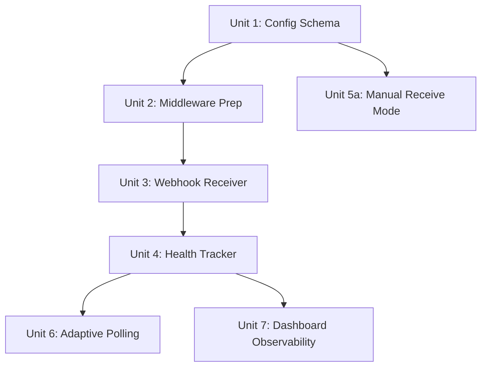
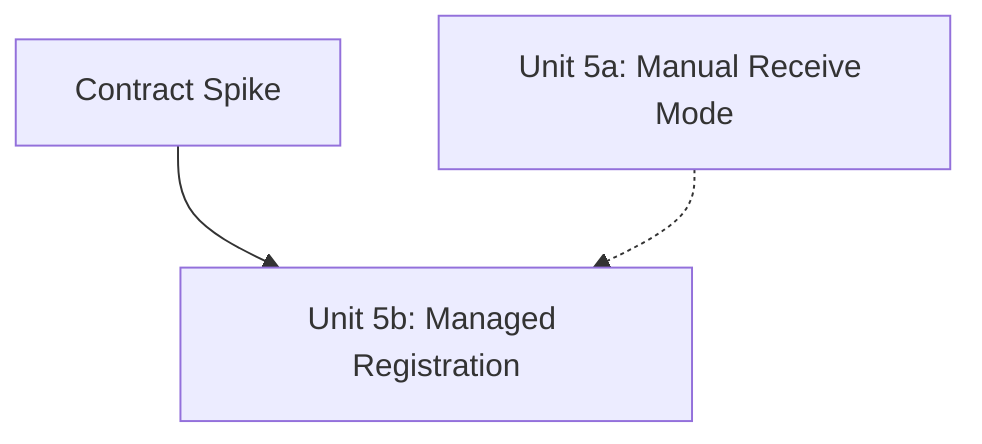

# feat: Add Linear webhook integration with adaptive polling

## Overview

Replace Symphony's polling-only Linear integration with an adaptive hybrid model. Inbound Linear webhooks trigger immediate orchestrator refreshes, while polling stretches to a 120-second heartbeat when webhooks are healthy and shrinks back to 15 seconds when they degrade. The result: sub-2-second issue detection latency, 80%+ fewer polling API calls, and a reusable event ingestion pattern for future sources.

**Phasing**: This plan ships in two phases. Phase 1 delivers the core latency and efficiency win with manual webhook setup (operator registers in Linear's UI). Phase 2 adds automated webhook registration after a contract spike confirms the Linear API's signing secret lifecycle and re-enable behavior.

## Problem Frame

Symphony detects Linear issue changes by polling the GraphQL API every 15 seconds. This creates up to 15s latency for issue pickup, unnecessary API traffic during quiet periods, and locks the architecture into a request-driven model. Webhooks fix all three while the adaptive polling fallback ensures no events are ever missed. (see origin: docs/brainstorms/2026-03-29-linear-webhook-integration-requirements.md)

## Requirements Trace

### Phase 1 Requirements

- R1. `POST /webhooks/linear` endpoint on Symphony's HTTP server
- R2. HMAC-SHA256 signature verification; reject invalid with 401
- R3. Accept all Linear issue mutation event types
- R4. Respond 200 immediately; process asynchronously
- R5. Rate-limit inbound webhook requests (abuse protection, not traffic shaping)
- R7. Manual webhook setup with clear operator instructions; polling-only when webhooks not configured
- R8. Stretch polling interval to 120s when webhooks healthy
- R9. Track webhook health via positive signals (verified delivery success, subscription status), not invalid signatures or time-since-last-event
- R10. Shrink polling interval back to 15s when health degrades
- R11. Unchanged polling behavior when webhooks not configured
- R12. Expose effective polling interval and health status via runtime state API
- R13. Dashboard webhook health indicator (connected/degraded/disconnected)
- R14. Last received webhook event timestamp and type on dashboard
- R15. Current adaptive polling interval displayed on dashboard
- R16. Webhook delivery statistics on dashboard
- R17. Idempotent webhook processing (webhooks are triggers, not state carriers)
- R18. Opt-in webhook config in workflow file (`webhook_url`, `webhook_secret`, thresholds)
- R19. Environment variable expansion for webhook secrets
- R20. URL scheme validation: `webhook_url` must be an HTTPS URL when set

### Phase 2 Requirements (post-contract-spike)

- R6. Auto-register webhook with Linear on startup and config reload (requires Admin scope)
- R6a. Re-enable disabled webhooks programmatically -- **hypothesis**, not confirmed by official docs. Gated behind live API proof.

## Scope Boundaries

- **In scope (Phase 1)**: Inbound Linear webhooks, HMAC verification, adaptive polling, manual webhook setup, dashboard observability
- **In scope (Phase 2)**: Auto-registration, auto-re-enable (if API supports), signing secret lifecycle management
- **Out of scope**: Generic webhook dispatch API (Issue #32), Cloudflare Tunnel provisioning, webhook replay/retry logic, multi-instance coordination
- **Out of scope**: `@linear/sdk` dependency -- Symphony uses its own Linear GraphQL client; webhook verification uses `node:crypto` directly

### Phase Definitions

| Phase | Units | Scope | Admin Scope Required | Shippable Independently |
|-------|-------|-------|---------------------|------------------------|
| **Phase 1** | 1, 2, 3, 4, 5a, 6, 7 | Manual webhook receive + adaptive polling + dashboard | No | Yes |
| **Phase 2** | 5b | Managed registration + auto-re-enable | Yes | Yes (additive) |

Phase 1 delivers the core value proposition: sub-2-second latency, 80% fewer polling calls, and operator-visible health status. Phase 2 is a convenience improvement that automates what the operator can already do manually in Linear's UI.

## Context & Research

### Relevant Code and Patterns

- **HTTP server middleware stack** (`src/http/server.ts`): tracing -> metrics -> `express.json()` -> write guard -> routes -> error handler. The webhook endpoint must integrate at two points: raw body capture in the JSON parser, and write guard exemption.
- **Write guard** (`src/http/write-guard.ts`): Rejects non-GET/HEAD/OPTIONS from non-loopback IPs unless `SYMPHONY_WRITE_TOKEN` is set. Webhook POSTs from Linear will 403 without a path-based exemption.
- **`requestRefresh(reason)`** (`src/orchestrator/orchestrator.ts`): Sets `refreshQueued = true` and calls `scheduleTick(0)`. Returns `{ queued, coalesced, requestedAt }`. Multiple calls coalesce into a single immediate tick -- this is the exact integration point for webhook-triggered refreshes.
- **Tick loop finally block** (`src/orchestrator/orchestrator.ts:~317`): `delayMs = this.refreshQueued ? 0 : this.deps.configStore.getConfig().polling.intervalMs`. This is where adaptive polling overrides the static config value.
- **Config store** (`src/config/store.ts`): Reactive with chokidar file watcher + overlay + secrets store subscriptions. `subscribe(listener)` pattern for change notifications. Polling interval derived from `polling.interval_ms` in workflow YAML.
- **Config schemas** (`src/config/schemas/*.ts`): Use **camelCase** normalized field names (`apiKey`, `projectSlug`, `maxConcurrentAgents`, `intervalMs`). The `derive*Config()` builders in `builders.ts` translate raw YAML snake_case input to this normalized shape.
- **OrchestratorDeps** (`src/orchestrator/runtime-types.ts`): Interface needs a new optional `webhookHealthTracker` dep.
- **RuntimeSnapshot** (`src/core/types.ts`): Needs new webhook health fields.
- **SymphonyEventMap** (`src/core/symphony-events.ts`): 11 channels currently. Needs webhook channels. SSE bridge (`src/http/sse.ts`) auto-streams via `onAny()` -- new channels are broadcast to clients but **require explicit frontend handlers** in `frontend/src/state/event-source.ts` to be processed by the dashboard.
- **Notification channel pattern** (`src/notification/`): `NotificationChannel` interface + `NotificationManager` fan-out + deduplication. `NotificationEvent` is **issue-scoped** (`NotificationEventType` values are all issue-related). System-level webhook alerts would require either a new event type with optional issue context, or a separate notification channel. Deferred from Phase 1.
- **Rate limiter** (`src/http/routes.ts:~57`): `express-rate-limit` at 300/min on `/api/` prefix. Webhook endpoint at `/webhooks/` is outside this prefix -- needs its own rate limiter.
- **Linear client** (`src/linear/client.ts`): `runGraphQL` is a **public** method. Bare API key in `authorization` header (no Bearer prefix). GraphQL endpoint at `https://api.linear.app/graphql`.
- **Config env var expansion** (`src/config/resolvers.ts`): `resolveConfigString()` already supports `$VAR`, `$SECRET:name`, `~`, `$TMPDIR` generically. No modification needed for webhook secrets -- the `deriveWebhookConfig()` builder calls the existing resolver.
- **Secrets store** (`src/secrets/store.ts`): Encrypted at rest via AES-256-GCM with `master.key`. Supports async `set(key, value)` with subscriber notifications. Used in Phase 2 for storing auto-generated signing secrets.
- **Snapshot serializer** (`src/http/route-helpers.ts`): `serializeSnapshot()` does manual camelCase->snake_case field-by-field mapping. New `RuntimeSnapshot` fields do not appear in the API unless the serializer is explicitly updated.

### External References

- **Linear webhook API**: GraphQL mutations `webhookCreate`, `webhookUpdate`, `webhookDelete`. Requires Admin scope on API key. No OAuth needed for single-workspace use.
- **Linear webhook payload**: Headers `Linear-Delivery` (UUID), `Linear-Event` (entity type), `Linear-Signature` (HMAC-SHA256 hex). Body: `{ action, type, data, actor, webhookTimestamp, url, createdAt }`.
- **Linear webhook signing**: HMAC-SHA256 of raw body bytes using the signing secret. Replay protection via `webhookTimestamp` (reject if >60s old).
- **Linear webhook health**: Only `enabled` field on subscription is exposed. No delivery logs, fail counts, or health status enum. Health model must be receiver-side.
- **Linear auto-disable**: After sustained delivery failures, Linear sets `enabled: false` on the webhook. Official docs state this must be "re-enabled manually." Whether `webhookUpdate` can programmatically re-enable is **unverified** -- treated as a Phase 2 hypothesis.
- **Linear `webhookCreate` return shape**: Official docs show `success` + `webhook { id enabled }`. The signing secret is described as visible on the webhook detail page. Whether the GraphQL mutation returns the secret is **unverified** -- this is the core Phase 2 blocker.

## Key Technical Decisions

- **`express.json({ verify })` for raw body capture**: Add a `verify` callback to the existing global `express.json()` middleware that conditionally stashes `req.rawBody` when the path starts with `/webhooks/`. This is the least invasive approach -- no middleware reordering, no sub-app, minimal overhead for non-webhook requests.

- **Path-based write guard exemption**: Add `if (req.path.startsWith("/webhooks/")) return next()` after the existing `SAFE_METHODS` check in `createWriteGuard()`. The webhook route authenticates via HMAC, not IP/token. This is cleaner than middleware reordering or a separate Express sub-app.

- **Same server, port 4000**: The webhook endpoint lives on the existing Express server. No separate port. Deployment stays simple -- one port, one process.

- **Manual `node:crypto` verification over `@linear/sdk`**: Symphony has its own Linear GraphQL client. The verification is ~15 lines with `createHmac` + `timingSafeEqual`. Full control over error handling, logging, and the timestamp check.

- **camelCase Zod schema fields (matching codebase convention)**: The webhook config schema in `src/config/schemas/webhook.ts` uses camelCase field names (`webhookUrl`, `webhookSecret`, `pollingStretchMs`, `pollingBaseMs`, `healthCheckIntervalMs`) to match the existing convention in `trackerConfigSchema`, `agentConfigSchema`, `codexConfigSchema`, etc. The `deriveWebhookConfig()` builder in `builders.ts` handles the raw YAML snake_case -> camelCase translation, following the established pattern of `deriveTrackerConfig()` and `derivePollingConfig()`.

- **Receiver-side health model driven by positive signals only**: Invalid HMAC signatures are security telemetry (logged, metered), **not** health inputs. The health tracker drives state from: (1) verified delivery count as a positive signal, (2) periodic query of webhook subscription `enabled` status (every 5 minutes) as an authoritative external signal. The `enabled: false` flip from Linear (after sustained delivery failures) is the strongest degradation trigger. This prevents unauthenticated internet noise from forcing Symphony back to 15s polling.

- **`resourceTypes: ["Issue"]` with broad action acceptance**: Subscribe to Issue events only at the Linear webhook level. Within Symphony, accept all actions (create, update, delete) and always trigger `requestRefresh()`. The authoritative state comes from `fetchCandidateIssues()`, so there's no need to filter by action type.

- **Signing secret is operator-managed in Phase 1**: The operator provides `webhook_secret` via config (env var or secrets store reference) and registers the webhook themselves in Linear's UI. Symphony is receive-only -- no admin-scope API calls. Phase 2 adds managed registration after the contract spike confirms the secret lifecycle.

- **`getEffectivePollingInterval()` method on orchestrator**: The tick loop's finally block calls this new method instead of reading `polling.intervalMs` from config directly. When webhooks are unconfigured, it returns the config value unchanged.

- **Startup sequence invariant**: The HTTP listener must be live and accepting requests before any webhook is created or enabled. This is a hard invariant for Phase 2 (managed registration). In Phase 1 (manual mode), the operator registers the webhook themselves, so the invariant is implicitly satisfied -- Symphony just needs the secret available when deliveries arrive.

- **Rate limiter as abuse protection, not traffic shaping**: The webhook rate limiter is set to 600/min per IP (10/sec), high enough that legitimate Linear delivery bursts never trigger it. HMAC verification is the real protection layer -- invalid requests are rejected cheaply. A tight rate limit would cause 429 responses, triggering Linear retries, potentially cascading into webhook disablement. The limiter protects against endpoint flooding from bots/scanners, not from Linear.

- **JSON 404 for unmatched `/webhooks/*` paths**: All `/webhooks/*` routes that don't match a registered handler return `404 { error: "not_found" }` as JSON, never the SPA fallback HTML. This prevents the SPA catch-all from returning `index.html` for webhook-prefixed paths.

## Open Questions

### Resolved During Review Debate

- **Webhook payload schema**: `action` ("create"/"update"/"delete"), `type` ("Issue"), `data` (full entity mirroring GraphQL shape), headers (`Linear-Delivery`, `Linear-Event`, `Linear-Signature`). `webhookTimestamp` in milliseconds.
- **Rate limiter placement**: Webhook endpoint at `/webhooks/linear` is outside the `/api/` prefix, so the existing 300/min limiter doesn't apply. A separate rate limiter at 600/min per IP (abuse protection) is added specifically for `/webhooks/`.
- **Event type filtering at subscription level**: `resourceTypes: ["Issue"]` at Linear's end. All issue actions accepted within Symphony. No per-action filtering needed since webhooks are triggers only.
- **Health model inputs**: Verified deliveries + subscription `enabled` status only. Invalid signatures are security telemetry, not health signals. Settled across 4 review rounds.
- **Schema convention**: camelCase Zod fields with snake_case -> camelCase builder translation. Matches existing `trackerConfigSchema`, `agentConfigSchema`, etc.

### Deferred to Contract Spike (Phase 2 Blocker)

- **Signing secret lifecycle**: Does `webhookCreate` return the signing secret in the GraphQL response? Official docs show `success` + `webhook { id enabled }` with no secret field. The secret is described as visible on the webhook detail page. A live `webhookCreate` mutation must confirm whether the secret is programmatically accessible.
- **Programmatic re-enable**: Can `webhookUpdate` re-enable a webhook that Linear disabled after delivery failures? Official docs say "must be re-enabled manually." Live API test needed.
- **Exact permission granularity**: What scope is needed for `webhookCreate` vs. `listWebhooks`? Admin scope is documented, but the error shape for insufficient permissions needs characterization.

### Deferred to Implementation

- **Exact adaptive polling thresholds**: Defaults of 120s stretched / 15s base / 5-minute subscription check interval / 60-second cooldown before re-healthy are starting points. Tune based on testing.
- **Dashboard UI layout for webhook stats panel**: The data shape is defined (health status, last event, interval, stats). Visual layout is implementation-time.
- **Error response body format for 401 signature failures**: Follow the existing `service-errors.ts` pattern. Exact error code string TBD.

## High-Level Technical Design

> *This illustrates the intended approach and is directional guidance for review, not implementation specification. The implementing agent should treat it as context, not code to reproduce.*

```
┌─────────────────────────────────────────────────────────────────┐
│  Middleware Layer (server.ts)                                   │
│                                                                 │
│  express.json({ verify: stash rawBody for /webhooks/* })        │
│       │                                                         │
│       ▼                                                         │
│  writeGuard (skip for /webhooks/*)                              │
│       │                                                         │
│       ▼                                                         │
│  routes                                                         │
└────┬────────────────────────────────────────────────────────────┘
     │
     ├── /webhooks/linear (POST)
     │       │
     │       ├── Rate limiter (600/min per IP — abuse protection)
     │       ├── verifyLinearSignature(rawBody, secret)
     │       │     ├── valid: continue
     │       │     └── invalid: log security event, return 401
     │       ├── Replay check (webhookTimestamp < 60s)
     │       ├── webhookHealthTracker.recordVerifiedDelivery()
     │       ├── 200 OK (immediate)
     │       └── orchestrator.requestRefresh("webhook:issue_update")
     │
     ├── /webhooks/* (unmatched)
     │       └── 404 JSON { error: "not_found" }
     │
     └── /api/v1/* (existing routes, unchanged)

┌─────────────────────────────────────────────────────────────────┐
│  WebhookHealthTracker (new module)                              │
│                                                                 │
│  State: connected | degraded | disconnected                     │
│                                                                 │
│  Inputs (positive signals only):                                │
│    recordVerifiedDelivery()   ← from webhook receiver           │
│    recordSubscriptionCheck(enabled)  ← from periodic query      │
│                                                                 │
│  Security telemetry (separate, NOT health inputs):              │
│    Signature failures logged + metered via standard logger      │
│                                                                 │
│  Outputs:                                                       │
│    getHealth() → { status, effectiveIntervalMs, stats }         │
│    Events → webhook.received, webhook.health_changed            │
│                                                                 │
│  Transitions:                                                   │
│    disconnected → connected: first verified delivery            │
│    connected → degraded: subscription check finds enabled=false │
│    degraded → connected: verified delivery + 60s cooldown       │
│    * → disconnected: webhook unconfigured                       │
└─────────────────────────────────────────────────────────────────┘

┌─────────────────────────────────────────────────────────────────┐
│  Orchestrator Tick Loop (modified)                              │
│                                                                 │
│  tick() finally block:                                          │
│    delayMs = refreshQueued                                      │
│      ? 0                                                        │
│      : this.getEffectivePollingInterval()                       │
│                ↓                                                │
│    WebhookHealthTracker.getHealth().status === "connected"      │
│      ? stretchedIntervalMs (120s)                               │
│      : configStore.getConfig().polling.intervalMs (15s)         │
└─────────────────────────────────────────────────────────────────┘

┌─────────────────────────────────────────────────────────────────┐
│  Phase 1: Manual Webhook Config                                 │
│                                                                 │
│  Operator provides in workflow YAML:                            │
│    webhook_url: "https://webhooks.risolu.to/webhooks/linear"    │
│    webhook_secret: "$LINEAR_WEBHOOK_SECRET"                     │
│                                                                 │
│  Operator registers webhook in Linear UI:                       │
│    URL → webhook_url from config                                │
│    Resource types → Issue                                       │
│    Secret → matches webhook_secret                              │
│                                                                 │
│  Symphony: receive-only, no admin-scope API calls               │
└─────────────────────────────────────────────────────────────────┘

┌─────────────────────────────────────────────────────────────────┐
│  Phase 2: WebhookRegistrar (post-contract-spike)                │
│                                                                 │
│  Startup (after httpServer.start()):                            │
│    1. Check config for webhook_url                              │
│    2. Query Linear for existing webhook matching URL            │
│    3. If exists + enabled → reuse (load stored secret)          │
│    4. If exists + disabled → re-enable (if API supports)        │
│    5. If not exists → webhookCreate, store secret               │
│    6. On failure → log instructions, continue manual mode       │
│                                                                 │
│  ⚠ Blocked until contract spike confirms:                      │
│    a) webhookCreate returns signing secret                      │
│    b) webhookUpdate can re-enable disabled webhooks             │
│    c) exact permission requirements for CRUD                    │
└─────────────────────────────────────────────────────────────────┘
```

## Implementation Units

### Phase 1 Dependency Graph



### Phase 2 Dependency



---

### Phase 1: Units 1-4, 5a, 6, 7

- [ ] **Unit 1: Webhook config schema and validation**

**Goal:** Define the webhook configuration surface in the workflow schema so all downstream units have a typed config to read from.

**Requirements:** R18, R19, R20

**Dependencies:** None

**Files:**
- Create: `src/config/schemas/webhook.ts`
- Modify: `src/config/schemas/index.ts` (export new schema)
- Modify: `src/config/builders.ts` (add `deriveWebhookConfig()` alongside existing derive functions)
- Modify: `src/core/types.ts` (add `WebhookConfig` interface to `ServiceConfig`)
- Test: `tests/config-webhook.test.ts`

**Approach:**
- Define a Zod schema for the webhook config block with **camelCase** field names matching the existing schema convention: `webhookUrl` (string, optional), `webhookSecret` (string, optional), `pollingStretchMs` (number, default 120000), `pollingBaseMs` (number, default 15000), `healthCheckIntervalMs` (number, default 300000)
- All fields optional -- webhook integration is opt-in. If `webhookUrl` is absent, the feature is entirely disabled
- Add URL validation: when `webhookUrl` is present, it must be a valid HTTPS URL (Zod `.url()` + `.startsWith("https://")` refinement). Document that this must be a publicly reachable endpoint.
- **Dual path (matching existing pattern):** The Zod schema provides validation and type documentation, but the actual config derivation uses manual coercion helpers (`asString`, `asNumber`) in a new `deriveWebhookConfig()` function in `builders.ts`. The builder handles snake_case -> camelCase translation from raw YAML input (`webhook_url` -> `webhookUrl`, `webhook_secret` -> `webhookSecret`, etc.), following the pattern of `deriveTrackerConfig()` and `derivePollingConfig()`.
- `webhookSecret` resolves through the existing `resolveConfigString()` to support `$LINEAR_WEBHOOK_SECRET` and `$SECRET:LINEAR_WEBHOOK_SECRET`. No modification to `resolvers.ts` needed -- the resolver already handles both patterns generically.
- Add a `WebhookConfig` interface to `src/core/types.ts` (added to `ServiceConfig`)
- Wire `deriveWebhookConfig()` into `deriveServiceConfig()` alongside existing polling, tracker, and notification configs

**Patterns to follow:**
- `src/config/schemas/tracker.ts` for Zod schema structure with camelCase fields and defaults
- `src/config/builders.ts` `deriveTrackerConfig()` for snake_case -> camelCase translation pattern
- `src/config/resolvers.ts` `resolveConfigString()` for secret resolution (use as-is, no changes needed)

**Test scenarios:**
- Happy path: Webhook config with all fields present parses correctly and resolves env vars
- Happy path: Webhook config with only `webhookUrl` uses defaults for all other fields
- Happy path: Builder translates `webhook_url` -> `webhookUrl`, `webhook_secret` -> `webhookSecret`, etc.
- Edge case: Missing webhook config entirely results in `undefined` webhook section (feature disabled)
- Edge case: `webhookSecret` resolves `$LINEAR_WEBHOOK_SECRET` via env var expansion
- Edge case: `webhookSecret` resolves `$SECRET:LINEAR_WEBHOOK_SECRET` via secrets store
- Error path: Invalid `pollingStretchMs` (negative number) fails validation
- Error path: `webhookUrl` with HTTP (not HTTPS) scheme fails validation
- Error path: `webhookUrl` with invalid URL format fails validation

**Verification:**
- `pnpm run build` passes with the new schema
- Config store correctly derives webhook config from a workflow YAML with the new `webhook:` section
- All Zod schema fields are camelCase, matching existing convention

---

- [ ] **Unit 2: Middleware preparation (write guard exemption + raw body capture + webhook 404)**

**Goal:** Prepare the HTTP middleware stack so the webhook endpoint can receive POSTs from external IPs, access raw body bytes for HMAC verification, and return proper JSON 404s for unmatched webhook paths.

**Requirements:** R1, R2

**Dependencies:** Unit 1

**Files:**
- Modify: `src/http/write-guard.ts` (add path-based exemption)
- Modify: `src/http/server.ts` (add `verify` callback to `express.json()`)
- Modify: `src/http/routes.ts` (add JSON 404 handler for `/webhooks/*` before SPA catch-all)
- Test: `tests/http/write-guard.test.ts` (extend existing write guard tests)
- Test: `tests/http/raw-body.test.ts`

**Approach:**
- In `createWriteGuard()`, add a path-based exemption for `/webhooks/` routes after the existing `SAFE_METHODS` check (not at the very top -- safe methods should still short-circuit first). These routes handle their own authentication via HMAC.
- In the `express.json()` call in `HttpServer` constructor, add a `verify` callback that conditionally stashes `req.rawBody = buf` when `req.url?.startsWith("/webhooks/")`. Note: `@types/express@5.0.3` does not export a `verify` option type -- cast the options or use a local type augmentation.
- The path-based check means non-webhook routes have zero overhead from the raw body capture
- Type the raw body via a scoped `WebhookRequest` interface extending `Request` with `rawBody?: Buffer`. Cast only at the webhook handler boundary -- avoid polluting global Express types via module augmentation.
- Add a JSON 404 handler for `/webhooks/*` paths before the SPA catch-all in route registration. This prevents `GET /webhooks/anything` from returning `index.html` and ensures `POST /webhooks/unknown` returns `{ error: "not_found" }` as JSON.

**Patterns to follow:**
- `src/http/write-guard.ts` existing structure for the middleware function
- Express `verify` callback signature: `(req, res, buf, encoding) => void`
- `src/http/service-errors.ts` for JSON error response format

**Test scenarios:**
- Happy path: POST to `/webhooks/linear` from non-loopback IP passes through write guard
- Happy path: POST to `/webhooks/linear` has `req.rawBody` populated as a Buffer
- Happy path: GET to `/webhooks/unknown` returns JSON 404, not HTML
- Happy path: POST to `/webhooks/unknown` returns JSON 404, not SPA fallback
- Integration: POST to `/api/v1/refresh` from non-loopback IP still blocked by write guard (unchanged behavior)
- Integration: GET requests to any non-webhook path still pass through unchanged
- Edge case: POST to `/webhooks/linear` with `SYMPHONY_WRITE_TOKEN` set still passes (write guard skipped entirely for webhook paths, token not checked)
- Note: Existing write guard tests mount the guard path-scoped to `/api/`. New tests must mount globally (matching production `server.ts`) to exercise the `/webhooks/` exemption.

**Verification:**
- Write guard unit tests pass with the new exemption
- Non-webhook routes remain fully protected (regression test)
- Unmatched webhook paths return JSON 404

---

- [ ] **Unit 3: Webhook receiver endpoint with HMAC verification**

**Goal:** Build the core webhook endpoint that receives Linear events, verifies their signature, and triggers an orchestrator refresh.

**Requirements:** R1, R2, R3, R4, R5, R17

**Dependencies:** Unit 2 (middleware), Unit 1 (config -- for webhook secret)

**Files:**
- Create: `src/http/webhook-handler.ts` (route handler + verification logic)
- Create: `src/http/webhook-types.ts` (Linear webhook payload types)
- Modify: `src/http/routes.ts` (register webhook route + rate limiter)
- Modify: `src/http/server.ts` (add webhook handler deps to `HttpServer` constructor deps interface)
- Test: `tests/http/webhook-handler.test.ts`

**Approach:**
- Create a `LinearWebhookPayload` type matching Linear's schema: `{ action, type, data, actor, id, webhookTimestamp, url, createdAt }`
- Create a `verifyLinearSignature(rawBody: Buffer, signature: string, secret: string): boolean` function using `createHmac("sha256", secret)` and `timingSafeEqual`
- Add timestamp replay protection: reject if `|Date.now() - webhookTimestamp| > 60_000`
- The route handler on valid signature: verify timestamp -> respond 200 -> call `orchestrator.requestRefresh("webhook:<action>:<type>")` -> call `webhookHealthTracker.recordVerifiedDelivery()`
- The route handler on invalid signature: **log as security telemetry** (event type, source IP, failure reason) -> respond 401. Do **not** call `webhookHealthTracker` -- invalid signatures are security events, not health signals.
- If signing secret is not yet available (e.g., config loading race), return 503 with `Retry-After` header. Do not return 401, which would create false degradation signals if health tracking is wired incorrectly.
- Register at `POST /webhooks/linear` in `registerHttpRoutes()` with a dedicated rate limiter (**600/min per IP** via `express-rate-limit`). This is abuse protection -- high enough that legitimate Linear bursts never trigger it, preventing the 429->retry->disable cascade. Place registration before the webhook 404 catch-all but after static file serving.
- Handler receives via typed deps: `orchestrator` (via `OrchestratorPort` for `requestRefresh`), `webhookHealthTracker` (for delivery recording), and the webhook secret (from config store). Follow the port-based dep pattern used in `transition-handler.ts`.

**Patterns to follow:**
- `src/http/transition-handler.ts` for route handler structure with typed deps
- `src/http/route-helpers.ts` for response formatting
- `src/http/service-errors.ts` for error response codes

**Test scenarios:**
- Happy path: Valid HMAC signature + valid timestamp -> 200 response + `requestRefresh()` called + `healthTracker.recordVerifiedDelivery()` called
- Happy path: Issue create event -> refresh triggered with reason containing "create"
- Happy path: Issue update event -> refresh triggered with reason containing "update"
- Error path: Invalid HMAC signature -> 401 response, `requestRefresh()` not called, `healthTracker` **not called** (security telemetry only)
- Error path: Missing `Linear-Signature` header -> 401 response
- Error path: Valid signature but `webhookTimestamp` older than 60 seconds -> 401 response (replay rejection)
- Error path: Rate limit exceeded -> 429 response
- Error path: Signing secret not available -> 503 response with `Retry-After`
- Edge case: Empty body with valid signature structure -> 401 (HMAC mismatch)
- Edge case: Non-Issue event type (e.g., Comment) -> 200 response, refresh still triggered (broad acceptance per Key Decision)
- Integration: Burst of 10 rapid webhook deliveries -> first triggers `requestRefresh()`, subsequent coalesce via `refreshQueued`

**Verification:**
- All signature verification tests pass with known Linear test vectors
- `requestRefresh()` is called exactly once per valid webhook (coalescing tested separately in orchestrator)
- 401 responses include the error code pattern from `service-errors.ts`
- Invalid signatures are logged but do not affect health tracker state

---

- [ ] **Unit 4: Webhook health tracker**

**Goal:** Track webhook delivery health using receiver-side positive signals and periodic subscription status checks, providing a health state that the adaptive polling system and dashboard can consume.

**Requirements:** R9, R10, R12

**Dependencies:** Unit 3

**Files:**
- Create: `src/webhook/health-tracker.ts`
- Create: `src/webhook/types.ts` (health state types, stats interface)
- Modify: `src/core/symphony-events.ts` (add webhook event channels)
- Test: `tests/webhook-health-tracker.test.ts`

**Approach:**
- Health states: `"connected"` | `"degraded"` | `"disconnected"`. Start at `"disconnected"` when webhook is configured but no deliveries yet; transition to `"connected"` on first verified delivery
- Track: `deliveriesReceived`, `lastDeliveryAt`, `lastEventType`
- **Health inputs are positive signals only:**
  - `recordVerifiedDelivery()`: called by webhook handler on successful HMAC verification
  - `recordSubscriptionCheck(enabled: boolean)`: called by periodic subscription check
- **NOT health inputs:** Invalid HMAC signatures are security telemetry handled by the webhook handler's logger, completely separate from health state
- Degradation trigger: periodic subscription check finds `enabled: false` (authoritative signal from Linear that the webhook has been disabled after sustained delivery failures)
- Recovery: verified delivery after degradation starts 60-second cooldown; transition from degraded to connected requires delivery + cooldown expiry (prevent flapping)
- Periodic subscription check: every 5 minutes, query Linear's `webhooks` for the registered webhook URL and check `enabled` field. Uses the existing Linear GraphQL client. If the check itself fails (network error, missing admin scope), maintain current state and log the failure -- don't assume degradation.
- Emit events on `TypedEventBus`: `"webhook.received"` (on every verified delivery), `"webhook.health_changed"` (on state transitions). SSE bridge picks these up automatically on the backend side.
- The tracker exposes `getHealth(): WebhookHealthState` returning `{ status, effectiveIntervalMs, stats, lastDeliveryAt, lastEventType }`
- Constructor accepts: `configStore` (for threshold config), `eventBus` (for emissions), `linearClient` (for subscription checks -- best-effort when admin scope available), `logger`
- Must expose a `stop()` method that clears the periodic subscription check interval timer. Called during graceful shutdown alongside `Orchestrator.stop()` -- follow the `nextTickTimer` cleanup pattern in `orchestrator.ts`. Wire into the shutdown sequence in `src/cli/services.ts`.

**Patterns to follow:**
- `src/orchestrator/orchestrator.ts` for state machine patterns with dirty tracking
- `src/core/event-bus.ts` `TypedEventBus` for event emission
- `src/notification/manager.ts` for periodic background task pattern

**Test scenarios:**
- Happy path: First verified delivery transitions from disconnected to connected
- Happy path: Multiple verified deliveries keep status as connected, increment counter
- Happy path: Periodic subscription check with `enabled: true` maintains connected status
- Error path: Subscription check finds `enabled: false` -> immediate degradation from connected
- Error path: Subscription check fails (network error) -> state unchanged, failure logged
- Edge case: Verified delivery after degradation starts 60-second cooldown; status stays degraded until cooldown expires
- Edge case: Subscription check finds `enabled: false` during cooldown -> cooldown resets, stays degraded
- Edge case: Degraded -> disconnected when webhook is removed from config
- Integration: State transition emits `webhook.health_changed` event on the event bus with old and new status
- **Verify**: invalid signature events never reach the health tracker

**Verification:**
- Health state transitions are deterministic and testable with fake timers
- Event bus emissions match the expected channel and payload shape
- Health tracker has no dependency on signature failure counts

---

- [ ] **Unit 5a: Manual receive mode**

**Goal:** Provide a fully functional webhook integration that requires zero admin-scope API calls. The operator registers the webhook in Linear's UI and provides the secret via config. Symphony is receive-only.

**Requirements:** R7, R18, R19

**Dependencies:** Unit 1 (config)

**Files:**
- Modify: `src/cli/services.ts` (wire webhook config into HTTP server deps and health tracker instantiation)
- Create: `src/webhook/index.ts` (module entry point -- exports health tracker, types)
- Test: `tests/webhook-manual-mode.test.ts`

**Approach:**
- When `webhookUrl` and `webhookSecret` are both present in config: instantiate `WebhookHealthTracker`, pass it to orchestrator deps and HTTP server deps. The webhook endpoint starts accepting deliveries.
- When `webhookUrl` is present but `webhookSecret` is absent: log a warning with instructions ("webhook_url is configured but webhook_secret is missing -- set $LINEAR_WEBHOOK_SECRET or add webhook_secret to your workflow file"). Feature disabled.
- When `webhookUrl` is absent: webhook feature entirely disabled. No health tracker instantiated. Polling unchanged (R11).
- **No `listWebhooks()` call**. No admin-scope API dependency. Manual mode is purely receive-and-verify using the operator-provided secret.
- Registration status is implicitly `manual` when the config is present. The health tracker starts at `disconnected` and moves to `connected` on first verified delivery -- giving the operator clear feedback that their setup is working.
- Secret management is the operator's responsibility. If the configured secret no longer matches the webhook, the operator must update either the webhook secret in Linear's UI or the `webhook_secret` config value.

**Patterns to follow:**
- `src/cli/services.ts` `createServices()` for dependency wiring pattern
- Existing conditional feature instantiation (e.g., notification channels)

**Test scenarios:**
- Happy path: Full config -> health tracker instantiated, webhook endpoint active
- Happy path: Missing `webhookUrl` -> no health tracker, no webhook endpoint, polling unchanged
- Error path: `webhookUrl` present but `webhookSecret` missing -> warning logged, feature disabled
- Integration: Config reload adding webhook config -> health tracker starts fresh
- Integration: Config reload removing webhook config -> health tracker stopped, polling reverts to base

**Verification:**
- Zero admin-scope API calls made in manual mode
- Polling is completely unchanged when webhook config is absent
- Clear operator feedback via health status and logs

---

- [ ] **Unit 6: Adaptive polling integration**

**Goal:** Wire the webhook health tracker into the orchestrator's tick loop so polling interval adapts based on webhook health.

**Requirements:** R8, R10, R11, R12

**Dependencies:** Unit 4

**Files:**
- Modify: `src/orchestrator/runtime-types.ts` (add `webhookHealthTracker?` to `OrchestratorDeps`)
- Modify: `src/orchestrator/orchestrator.ts` (add `getEffectivePollingInterval()`, modify tick finally block)
- Modify: `src/core/types.ts` (add webhook fields to `RuntimeSnapshot`)
- Modify: `src/http/route-helpers.ts` (update `serializeSnapshot()` for webhook health fields)
- Modify: `src/http/routes.ts` (expose webhook health in `/api/v1/state`)
- Modify: `src/cli/services.ts` (pass `webhookHealthTracker` to orchestrator deps when webhook config present)
- Test: `tests/orchestrator-adaptive-polling.test.ts`

**Approach:**
- Add optional `webhookHealthTracker` to `OrchestratorDeps` interface. Because it's optional, all existing construction sites compile without changes.
- Add `getEffectivePollingInterval(): number` method to orchestrator. Two distinct pathways for R11:
  - `!this.deps.webhookHealthTracker` (tracker never instantiated -- webhook feature disabled): return config value unchanged
  - `this.deps.webhookHealthTracker.getHealth().status === "disconnected"` (tracker exists but webhook is not yet active): return config value unchanged
  - `status === "connected"`: return `webhookConfig.pollingStretchMs` (default 120s)
  - `status === "degraded"`: return `configStore.getConfig().polling.intervalMs` (base rate, 15s)
- Modify tick finally block: replace direct config read with `this.getEffectivePollingInterval()` call
- Add webhook health fields to `RuntimeSnapshot`: `webhookHealth?: { status, effectiveIntervalMs, stats, lastDeliveryAt, lastEventType }`. Include in snapshot serialization **if and only if** `webhookHealthTracker` is instantiated. When the tracker exists but status is `"disconnected"`, the field is still present (shows the operator that webhook integration is configured but not yet active).
- Update `serializeSnapshot()` in `src/http/route-helpers.ts` to include webhook health fields with camelCase->snake_case mapping matching the existing pattern.

**Patterns to follow:**
- `src/orchestrator/orchestrator.ts` existing `scheduleTick()` and dirty tracking pattern
- `src/core/types.ts` `RuntimeSnapshot` optional field pattern (see `systemHealth?`, `availableModels?`)
- `src/http/route-helpers.ts` `serializeSnapshot()` for field-by-field serialization

**Test scenarios:**
- Happy path: Webhooks connected -> polling interval is 120s (stretched)
- Happy path: Webhooks degraded -> polling interval is 15s (base rate)
- Happy path: Webhooks not configured (no health tracker injected) -> polling interval unchanged from config
- Happy path: Health tracker exists but status is `"disconnected"` -> polling interval unchanged from config
- Edge case: Health transitions from connected to degraded mid-tick -> next tick uses base rate
- Edge case: Health transitions from degraded to connected -> next tick uses stretched rate
- Integration: `requestRefresh()` still triggers immediate tick regardless of adaptive interval (delayMs = 0 when refreshQueued)
- Integration: `/api/v1/state` response includes webhook health fields when webhooks are configured
- Integration: `/api/v1/state` response omits webhook health fields when webhooks are not configured
- Serialization: `serializeSnapshot()` correctly maps webhook health to snake_case

**Verification:**
- Tick finally block uses `getEffectivePollingInterval()` instead of direct config read
- RuntimeSnapshot includes webhook health when configured, omits it when not
- Existing polling behavior is completely unchanged when webhook feature is not configured
- `/api/v1/state` serialization includes webhook health data

---

- [ ] **Unit 7: Dashboard observability**

**Goal:** Surface webhook health, delivery stats, and adaptive polling state in the Symphony dashboard.

**Requirements:** R13, R14, R15, R16

**Dependencies:** Unit 4 (health tracker provides data), Unit 6 (RuntimeSnapshot has the fields)

**Files:**
- Modify: `frontend/src/state/event-source.ts` (add system-level handler for `webhook.*` events)
- Modify: `frontend/src/` (dashboard components for webhook health panel)
- Test: `tests/e2e/specs/smoke/webhook-dashboard.smoke.spec.ts`
- Test: `tests/e2e/mocks/data/` (webhook health mock data factory)
- Test: `tests/e2e/specs/visual/` (visual regression for webhook panel)

**Approach:**
- Add a webhook health section to the dashboard that shows:
  - Health status badge: connected (green) / degraded (yellow) / disconnected (gray)
  - Last received event: timestamp + event type
  - Current adaptive polling interval (e.g., "120s" or "15s")
  - Delivery stats: total received, processing time
- The section is only visible when webhook integration is configured (check `webhookHealth` presence in RuntimeSnapshot)
- **Frontend event-source wiring:** `frontend/src/state/event-source.ts` currently dispatches events filtered by `payload.identifier` (issue-scoped). Webhook health is system-level -- it has no issue identifier. Add a dedicated system-level event handler that processes `webhook.received` and `webhook.health_changed` events without requiring an identifier match. This could be a separate subscription mechanism alongside the issue-scoped one, or a broadened handler that checks for system-level event types first.
- Initial state loaded from `/api/v1/state` (webhook health fields added in Unit 6). Real-time updates arrive via SSE.
- Follow existing dashboard component patterns for consistency

**Execution note:** After implementing, run `/visual-verify` to validate dashboard changes per CLAUDE.md requirements.

**Patterns to follow:**
- Existing dashboard components for health/status display patterns
- `tests/e2e/mocks/data/` factories for mock data
- `tests/e2e/pages/` Page Object Models for dashboard interaction

**Test scenarios:**
- Happy path: Dashboard shows "Connected" badge when webhook health status is connected
- Happy path: Dashboard shows last event timestamp and type, updating on new `webhook.received` SSE events
- Happy path: Dashboard shows current adaptive polling interval
- Happy path: Dashboard shows delivery statistics
- Edge case: Webhook section hidden when `webhookHealth` is absent from RuntimeSnapshot (feature not configured)
- Edge case: Health status transitions from connected to degraded -> badge updates in real time via SSE
- Edge case: Webhook section appears when config is added (state transitions from no-webhook to disconnected)

**Verification:**
- Dashboard renders webhook health panel when webhooks are configured
- Panel is absent when webhooks are not configured
- SSE events update the dashboard in real time without page reload
- Visual verification passes (`/visual-verify`)

---

### Phase 2: Unit 5b (Post-Contract-Spike)

- [ ] **Unit 5b: Managed webhook registration with Linear**

**Goal:** Automatically register (or re-enable) a Linear webhook subscription on startup and config change, with graceful fallback to manual mode on failure.

**Requirements:** R6, R6a

**Dependencies:** Unit 5a (manual mode must already work). **Blocked by contract spike.**

**Pre-execution gate -- contract spike must confirm:**
1. Whether `webhookCreate` GraphQL mutation returns the signing secret in the response
2. Whether `webhookUpdate` can re-enable a webhook that Linear disabled after delivery failures
3. Exact permission requirements (Admin scope granularity for CRUD vs. list-only)
4. Error payload shape for insufficient permissions

**Files:**
- Create: `src/webhook/registrar.ts`
- Modify: `src/linear/queries.ts` (add webhook CRUD GraphQL mutations/queries)
- Modify: `src/linear/client.ts` (add webhook management methods)
- Modify: `src/cli/services.ts` (instantiate registrar, wire into startup sequence **after** `httpServer.start()`)
- Test: `tests/webhook-registrar.test.ts`

**Approach (subject to redesign based on spike results):**
- Add GraphQL operations to `src/linear/queries.ts`: `buildWebhooksQuery`, `buildWebhookCreateMutation`, `buildWebhookUpdateMutation`, `buildWebhookDeleteMutation`
- Add methods to the Linear client: `listWebhooks()`, `createWebhook(url, teamId, resourceTypes, label)`, `updateWebhook(id, input)`, `deleteWebhook(id)`. New methods use the existing `withRetry()` + `runGraphQL()` pattern as instance methods (note: `runGraphQL` is public). Permission errors must be detected from GraphQL error payloads.
- **Startup invariant:** `WebhookRegistrar.register()` is called **after** `httpServer.start()` completes. The HTTP listener must be live and accepting requests before any webhook is created or enabled. This prevents delivery failures during the startup gap.
- Secret resolution priority:
  1. If `webhookSecret` is present in workflow config (manual setup): use it, skip `webhookCreate`. Managed registration adds metadata lookup but doesn't override manual secret.
  2. If no config secret, check SecretsStore for key `LINEAR_WEBHOOK_SECRET` from a previous auto-registration.
  3. If neither: call `webhookCreate`, store returned secret in SecretsStore.
- Must expose a `stop()` method that unsubscribes from config store changes. Wire into shutdown sequence alongside health tracker.
- On failure: log warning with manual setup instructions (Phase 1 fallback), continue polling-only. System-level notifications deferred (NotificationEvent is issue-scoped).
- **Config change handling:** When `webhookUrl` changes, deregister old webhook (best-effort via `webhookDelete`), register new. If deregistration fails, log and continue.
- **Auto-re-enable:** If spike confirms `webhookUpdate` can re-enable, implement. If not, document that disabled webhooks require operator intervention in Linear UI.

**Test scenarios (preliminary -- finalize after spike):**
- Happy path: No existing webhook -> `webhookCreate` -> secret stored
- Happy path: Existing webhook + enabled -> reuse, load stored secret
- Happy path: Config change -> old deregistered, new created
- Error path: Permission error -> log manual setup instructions, no exception, polling continues
- Edge case: Manual `webhookSecret` in config -> skip `webhookCreate`

**Verification:**
- Auto-registration creates exactly one webhook subscription
- Signing secret persists across restarts
- Permission failures produce actionable log messages
- Registration only happens after HTTP listener is confirmed live

---

## System-Wide Impact

- **Interaction graph:** The webhook receiver calls `orchestrator.requestRefresh()` (via `OrchestratorPort`) and `webhookHealthTracker.recordVerifiedDelivery()` (new). The health tracker emits events on `TypedEventBus` which the SSE bridge forwards to the dashboard. In Phase 2, the registrar calls the Linear GraphQL client and `SecretsStore`. The orchestrator's tick finally block calls `getEffectivePollingInterval()` which reads from the health tracker. **Composition root:** `src/cli/services.ts` instantiates `WebhookHealthTracker` (when webhook config present), wires into orchestrator deps and HTTP server deps. Phase 2 adds `WebhookRegistrar` instantiation after `httpServer.start()`.
- **Error propagation:** Webhook signature failures return 401 to Linear (which may retry) and are logged as security telemetry -- they never affect health state. Registration failures (Phase 2) log warnings and fall back to manual mode -- they never crash the orchestrator. Health tracker errors are non-fatal (log and continue with last known state). All new code follows the existing non-fatal-on-failure pattern.
- **State lifecycle risks:** In Phase 1, the signing secret is operator-managed via config. If it becomes stale, the operator must rotate it. In Phase 2, the signing secret survives restarts via SecretsStore. The webhook health tracker state is in-memory only (acceptable -- it rebuilds quickly from first delivery after restart). Config reloads that change `webhookUrl` in Phase 1 just update the secret -- the operator must update Linear's UI to match.
- **API surface parity:** `/api/v1/state` gains new optional `webhookHealth` field. SSE gains new `webhook.received` and `webhook.health_changed` channels. Both are additive -- no existing consumers break. Frontend requires explicit handler for the new system-level events in `event-source.ts`.
- **Unchanged invariants:** The polling-only path is completely unchanged when webhooks are not configured. `fetchCandidateIssues()` remains the authoritative state source. `requestRefresh()` semantics are unchanged -- webhooks just call it with a new reason string. The tick loop, reconciliation, and worker dispatch logic are untouched except for the polling interval calculation.

## Risks & Dependencies

| Risk | Mitigation |
|------|------------|
| Operator misconfigures webhook secret (Phase 1) | Health tracker shows `disconnected` with 0 deliveries. Dashboard makes the problem visible. Operator docs include troubleshooting section. |
| `express.json({ verify })` callback adds overhead to all requests | Conditional path check (`/webhooks/` only) means non-webhook requests just run a string comparison -- negligible overhead. |
| Linear auto-disables webhook after sustained delivery failures (e.g., during Symphony downtime) | Health tracker detects via periodic subscription check. Dashboard shows degraded status. In Phase 1, operator re-enables in Linear UI. Phase 2 may auto-re-enable (pending spike). |
| Webhook endpoint exposed to internet scanners/bots | Rate limiter (600/min per IP) + HMAC rejection. Invalid requests are security telemetry, not health signals -- bots cannot force polling degradation. |
| Frontend drops unknown SSE event types | Unit 7 adds explicit system-level handler in `event-source.ts` for `webhook.*` events. |
| SPA catch-all serves HTML for `/webhooks/*` | Unit 2 adds JSON 404 handler for unmatched webhook paths before the catch-all. |
| Health tracker periodic timer leaks on shutdown | Health tracker exposes `stop()` method, called during graceful shutdown in `services.ts`. |
| Phase 2: signing secret lifecycle unknown | Blocked by contract spike. Phase 1 ships without this dependency. |
| Phase 2: startup race (register before listener live) | Hard invariant: registration only after `httpServer.start()` completes. |
| Phase 2: config reload secret atomicity | During re-registration window, brief HMAC failures expected. Health tracker grace window. |

## Documentation / Operational Notes

- Update `docs/OPERATOR_GUIDE.md` with webhook setup section: how to configure `webhook_url` and `webhook_secret`, how to register the webhook in Linear's UI (resource types, URL, secret), troubleshooting guide
- Update `README.md` feature list to include webhook support
- Update `docs/TRUST_AND_AUTH.md` with webhook HMAC verification as a trust boundary
- Update `WORKFLOW.example.md` with commented-out webhook config section showing all fields and defaults
- Document the **public endpoint requirement**: `webhook_url` must be a publicly reachable HTTPS URL. Options: reverse proxy, Cloudflare Tunnel (`webhooks.risolu.to` pattern), cloud load balancer. Symphony does not provision ingress -- the operator must ensure reachability.
- Document **secret management** as operator responsibility in Phase 1: if the configured secret no longer matches the webhook, the operator updates either Linear's UI or the config value.

## Pre-Execution Gate: Contract Spike (Phase 2)

**Scope:** A single `webhookCreate` mutation against the Linear API to answer:

1. Does the response include the signing secret? (Check the full response shape, not just documented fields)
2. Can `webhookUpdate` re-enable a webhook with `enabled: false`?
3. What error shape is returned for insufficient permissions?
4. What scope is needed for `webhookCreate` vs. `listWebhooks`?

**Budget:** 30 minutes. Output: findings document saved to `docs/spikes/`. If the spike confirms the API returns secrets and supports re-enable, Phase 2 proceeds. If not, Phase 2 is redesigned around operator-managed secrets (Phase 1 becomes the permanent model).

**Timing:** The spike is independent of Phase 1. Run it whenever convenient. Phase 1 does not wait for it.

## Sources & References

- **Origin document:** [docs/brainstorms/2026-03-29-linear-webhook-integration-requirements.md](docs/brainstorms/2026-03-29-linear-webhook-integration-requirements.md)
- **Review history:** 4 rounds across Codex GPT-5, Claude Opus 4.6, Codex GPT-5.4 (see `reviews/` directory)
- Related code: `src/http/server.ts`, `src/http/write-guard.ts`, `src/orchestrator/orchestrator.ts`, `src/linear/client.ts`, `src/config/store.ts`
- Related issues: #32 (webhook-driven dispatch), #54 (webhook hardening)
- External docs: Linear webhook API (GraphQL mutations, payload format, HMAC signing)
