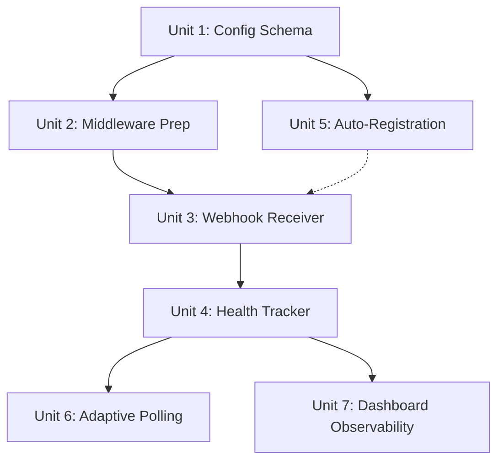

# feat: Add Linear webhook integration with adaptive polling

## Overview

Replace Risoluto's polling-only Linear integration with an adaptive hybrid model. Inbound Linear webhooks trigger immediate orchestrator refreshes, while polling stretches to a 120-second heartbeat when webhooks are healthy and shrinks back to 15 seconds when they degrade. The result: sub-2-second issue detection latency, 80%+ fewer polling API calls, and a reusable event ingestion pattern for future sources.

## Problem Frame

Risoluto detects Linear issue changes by polling the GraphQL API every 15 seconds. This creates up to 15s latency for issue pickup, unnecessary API traffic during quiet periods, and locks the architecture into a request-driven model. Webhooks fix all three while the adaptive polling fallback ensures no events are ever missed. (see origin: docs/brainstorms/2026-03-29-linear-webhook-integration-requirements.md)

## Requirements Trace

- R1. `POST /webhooks/linear` endpoint on Risoluto's HTTP server
- R2. HMAC-SHA256 signature verification; reject invalid with 401
- R3. Accept all Linear issue mutation event types
- R4. Respond 200 immediately; process asynchronously
- R5. Rate-limit inbound webhook requests
- R6. Auto-register webhook with Linear on startup and config reload; re-enable if disabled
- R7. Fallback to polling-only with clear manual setup instructions on registration failure
- R8. Stretch polling interval to 120s when webhooks healthy
- R9. Track webhook health via positive signals (delivery success, subscription status), not time-since-last-event
- R10. Shrink polling interval back to 15s when health degrades
- R11. Unchanged polling behavior when webhooks not configured
- R12. Expose effective polling interval and health status via runtime state API
- R13. Dashboard webhook health indicator (connected/degraded/disconnected)
- R14. Last received webhook event timestamp and type on dashboard
- R15. Current adaptive polling interval displayed on dashboard
- R16. Webhook delivery statistics on dashboard
- R17. Idempotent webhook processing (webhooks are triggers, not state carriers)
- R18. Opt-in webhook config in workflow file (`webhook_url`, `webhook_secret`, thresholds)
- R19. Environment variable expansion for webhook secrets

## Scope Boundaries

- **In scope**: Inbound Linear webhooks, adaptive polling, auto-registration, dashboard observability, HMAC verification
- **Out of scope**: Generic webhook dispatch API (Issue #32), Cloudflare Tunnel provisioning, webhook replay/retry logic, multi-instance coordination
- **Out of scope**: `@linear/sdk` dependency — Risoluto uses its own Linear GraphQL client; webhook verification uses `node:crypto` directly (see origin: Key Decisions)

## Context & Research

### Relevant Code and Patterns

- **HTTP server middleware stack** (`src/http/server.ts`): tracing -> metrics -> `express.json()` -> write guard -> routes -> error handler. The webhook endpoint must integrate at two points: raw body capture in the JSON parser, and write guard exemption.
- **Write guard** (`src/http/write-guard.ts`): Rejects non-GET/HEAD/OPTIONS from non-loopback IPs unless `RISOLUTO_WRITE_TOKEN` is set. Webhook POSTs from Linear will 403 without a path-based exemption.
- **`requestRefresh(reason)`** (`src/orchestrator/orchestrator.ts`): Sets `refreshQueued = true` and calls `scheduleTick(0)`. Returns `{ queued, coalesced, requestedAt }`. Multiple calls coalesce into a single immediate tick — this is the exact integration point for webhook-triggered refreshes.
- **Tick loop finally block** (`src/orchestrator/orchestrator.ts:~317`): `delayMs = this.refreshQueued ? 0 : this.deps.configStore.getConfig().polling.intervalMs`. This is where adaptive polling overrides the static config value.
- **Config store** (`src/config/store.ts`): Reactive with chokidar file watcher + overlay + secrets store subscriptions. `subscribe(listener)` pattern for change notifications. Polling interval derived from `polling.interval_ms` in workflow YAML.
- **OrchestratorDeps** (`src/orchestrator/runtime-types.ts`): Interface needs a new optional `webhookHealthTracker` dep.
- **RuntimeSnapshot** (`src/core/types.ts`): Needs new webhook health fields.
- **RisolutoEventMap** (`src/core/risoluto-events.ts`): 11 channels currently. Needs webhook channels. SSE bridge (`src/http/sse.ts`) auto-streams via `onAny()` — new channels are automatically available to dashboard.
- **Notification channel pattern** (`src/notification/`): `NotificationChannel` interface + `NotificationManager` fan-out + deduplication. Reusable for webhook registration failure alerts.
- **Rate limiter** (`src/http/routes.ts:~57`): `express-rate-limit` at 300/min on `/api/` prefix. Webhook endpoint at `/webhooks/` is outside this prefix — needs its own rate limiter.
- **Linear client auth** (`src/linear/client.ts`): Bare API key in `authorization` header (no Bearer prefix). GraphQL endpoint at `https://api.linear.app/graphql`.
- **Config env var expansion** (`src/config/resolvers.ts`): `resolveConfigString()` supports `$VAR`, `$SECRET:name`, `~`, `$TMPDIR`. Webhook secrets should use this same resolver.
- **Secrets store** (`src/secrets/store.ts`): Encrypted at rest via AES-256-GCM with `master.key`. Supports async `set(key, value)` with subscriber notifications. Ideal for storing the auto-generated signing secret from Linear.

### External References

- **Linear webhook API**: GraphQL mutations `webhookCreate`, `webhookUpdate`, `webhookDelete`. Requires Admin scope on API key. No OAuth needed for single-workspace use.
- **Linear webhook payload**: Headers `Linear-Delivery` (UUID), `Linear-Event` (entity type), `Linear-Signature` (HMAC-SHA256 hex). Body: `{ action, type, data, actor, webhookTimestamp, url, createdAt }`.
- **Linear webhook signing**: HMAC-SHA256 of raw body bytes using the auto-generated signing secret. Replay protection via `webhookTimestamp` (reject if >60s old).
- **Linear webhook health**: Only `enabled` field on subscription is exposed. No delivery logs, fail counts, or health status enum. Health model must be receiver-side.
- **Linear auto-disable**: After sustained delivery failures, Linear sets `enabled: false` on the webhook. This is the strongest external signal that delivery is broken.

## Key Technical Decisions

- **`express.json({ verify })` for raw body capture**: Add a `verify` callback to the existing global `express.json()` middleware that conditionally stashes `req.rawBody` when the path starts with `/webhooks/`. This is the least invasive approach — no middleware reordering, no sub-app, minimal overhead for non-webhook requests. (Resolves origin deferred question about raw body access)

- **Path-based write guard exemption**: Add `if (req.path.startsWith("/webhooks/")) return next()` at the top of `createWriteGuard()`. The webhook route authenticates via HMAC, not IP/token. This is cleaner than middleware reordering or a separate Express sub-app. (Resolves origin deferred question about write guard)

- **Same server, port 4000**: The webhook endpoint lives on the existing Express server. No separate port. The write guard exemption and raw body capture are solved at the middleware level. Deployment stays simple — one port, one process. (Resolves origin deferred question about port isolation)

- **Manual `node:crypto` verification over `@linear/sdk`**: Risoluto has its own Linear GraphQL client. Adding `@linear/sdk` just for webhook verification adds an unnecessary dependency. The verification is ~15 lines with `createHmac` + `timingSafeEqual`. We also get full control over error handling, logging, and the timestamp check.

- **Receiver-side health model with periodic subscription check**: Since Linear exposes no delivery logs or health endpoints, the health tracker uses: (1) successful delivery counter as a positive signal, (2) signature failure counter as a negative signal, (3) periodic query of webhook subscription `enabled` status (every 5 minutes) as an authoritative external signal. The `enabled: false` flip from Linear (after sustained delivery failures) is the strongest degradation trigger. (Resolves origin deferred question about health signals)

- **`resourceTypes: ["Issue"]` with broad action acceptance**: Subscribe to Issue events only at the Linear webhook level (no Comment, Project, Cycle noise). Within Risoluto, accept all actions (create, update, delete) and always trigger `requestRefresh()`. The authoritative state comes from `fetchCandidateIssues()`, so there's no need to filter by action type — every Issue webhook is a signal that something changed.

- **Signing secret stored in SecretsStore**: Auto-registration stores the Linear-generated signing secret in `SecretsStore` (encrypted at rest via `master.key`). Manual registration uses `$LINEAR_WEBHOOK_SECRET` env var or `webhook_secret` config field. Manual config takes precedence over stored auto-generated secret.

- **`getEffectivePollingInterval()` method on orchestrator**: The tick loop's finally block calls this new method instead of reading `polling.intervalMs` from config directly. The method checks webhook health status and returns the adaptive interval (stretched or shrunk). When webhooks are unconfigured, it returns the config value unchanged. (Resolves origin deferred question about immutable config override)

## Open Questions

### Resolved During Planning

- **Linear API permissions for webhook CRUD**: Admin scope on personal API key. Standard API key works, no OAuth needed. The existing `tracker.apiKey` may or may not have Admin scope — R7's manual fallback handles the case where it doesn't.
- **Webhook payload schema**: `action` ("create"/"update"/"delete"), `type` ("Issue"), `data` (full entity mirroring GraphQL shape), headers (`Linear-Delivery`, `Linear-Event`, `Linear-Signature`). `webhookTimestamp` in milliseconds.
- **Signing secret lifecycle**: Linear auto-generates the secret on `webhookCreate` and returns it once. Stored in SecretsStore. On restart, Risoluto queries `webhooks` for matching URL — if found, reuses stored secret. If not found, creates new webhook and gets new secret.
- **Rate limiter placement**: Webhook endpoint at `/webhooks/linear` is outside the `/api/` prefix, so the existing 300/min limiter doesn't apply. A separate rate limiter at 120/min per IP is added specifically for `/webhooks/` to prevent abuse while allowing Linear's burst deliveries.
- **Event type filtering at subscription level**: `resourceTypes: ["Issue"]` at Linear's end. All issue actions accepted within Risoluto. No per-action filtering needed since webhooks are triggers only.
- **Deregistration on config change**: When `webhook_url` changes, deregister old webhook (if ID is known) before registering new one. If deregistration fails, log and continue — orphaned webhooks on Linear's side are harmless (they deliver to a dead URL until Linear auto-disables them).

### Deferred to Implementation

- **Exact adaptive polling thresholds**: Defaults of 120s stretched / 15s base / 5-minute subscription check interval / 3-failure degradation trigger / 60-second cooldown before re-healthy are starting points. Tune based on testing.
- **Dashboard UI layout for webhook stats panel**: The data shape is defined (health status, last event, interval, stats). Visual layout is implementation-time.
- **Error response body format for 401 signature failures**: Follow the existing `service-errors.ts` pattern. Exact error code string TBD.

## High-Level Technical Design

> *This illustrates the intended approach and is directional guidance for review, not implementation specification. The implementing agent should treat it as context, not code to reproduce.*

```
┌─────────────────────────────────────────────────────────────────┐
│  Middleware Layer (server.ts)                                   │
│                                                                 │
│  express.json({ verify: stash rawBody for /webhooks/* })        │
│       │                                                         │
│       ▼                                                         │
│  writeGuard (skip for /webhooks/*)                              │
│       │                                                         │
│       ▼                                                         │
│  routes                                                         │
└────┬────────────────────────────────────────────────────────────┘
     │
     ├── /webhooks/linear (POST)
     │       │
     │       ├── Rate limiter (120/min per IP)
     │       ├── verifyLinearSignature(rawBody, secret)
     │       ├── Replay check (webhookTimestamp < 60s)
     │       ├── webhookHealthTracker.recordDelivery(success)
     │       ├── 200 OK (immediate)
     │       └── orchestrator.requestRefresh("webhook:issue_update")
     │
     └── /api/v1/* (existing routes, unchanged)

┌─────────────────────────────────────────────────────────────────┐
│  WebhookHealthTracker (new module)                              │
│                                                                 │
│  State: connected | degraded | disconnected                     │
│                                                                 │
│  Inputs:                                                        │
│    recordDelivery(success: boolean)  ← from webhook receiver    │
│    recordSubscriptionCheck(enabled)  ← from periodic query      │
│                                                                 │
│  Outputs:                                                       │
│    getHealth() → { status, effectiveInterval, stats }           │
│    Events → webhook.received, webhook.health_changed            │
│                                                                 │
│  Transitions:                                                   │
│    disconnected → connected: first successful delivery          │
│    connected → degraded: subscription disabled OR 3+ failures   │
│    degraded → connected: successful delivery + 60s cooldown     │
│    * → disconnected: webhook unconfigured                       │
└─────────────────────────────────────────────────────────────────┘

┌─────────────────────────────────────────────────────────────────┐
│  Orchestrator Tick Loop (modified)                              │
│                                                                 │
│  tick() finally block:                                          │
│    delayMs = refreshQueued                                      │
│      ? 0                                                        │
│      : this.getEffectivePollingInterval()                       │
│                ↓                                                │
│    WebhookHealthTracker.getHealth().status === "connected"      │
│      ? stretchedIntervalMs (120s)                               │
│      : configStore.getConfig().polling.intervalMs (15s)         │
└─────────────────────────────────────────────────────────────────┘

┌─────────────────────────────────────────────────────────────────┐
│  WebhookRegistrar (new module)                                  │
│                                                                 │
│  Startup:                                                       │
│    1. Check config for webhook_url                              │
│    2. Query Linear for existing webhook matching URL            │
│    3. If exists + enabled → reuse (load stored secret)          │
│    4. If exists + disabled → webhookUpdate to re-enable         │
│    5. If not exists → webhookCreate, store secret               │
│    6. On failure → log instructions, continue poll-only         │
│                                                                 │
│  Config change (webhook_url):                                   │
│    1. Deregister old webhook (best-effort)                      │
│    2. Register new webhook                                      │
│    3. Update stored secret                                      │
└─────────────────────────────────────────────────────────────────┘
```

## Implementation Units



- [ ] **Unit 1: Webhook config schema and validation**

**Goal:** Define the webhook configuration surface in the workflow schema so all downstream units have a typed config to read from.

**Requirements:** R18, R19

**Dependencies:** None

**Files:**
- Create: `src/config/schemas/webhook.ts`
- Modify: `src/config/schemas/index.ts` (export new schema)
- Modify: `src/config/builders.ts` (add `deriveWebhookConfig()` alongside existing derive functions)
- Modify: `src/config/resolvers.ts` (env var expansion for webhook_secret)
- Modify: `src/core/types.ts` (add `WebhookConfig` interface to `ServiceConfig`)
- Test: `tests/config-webhook.test.ts`

**Approach:**
- Define a Zod schema for the webhook config block: `webhook_url` (string, optional), `webhook_secret` (string, optional), `polling_stretch_ms` (number, default 120000), `polling_base_ms` (number, default 15000), `health_check_interval_ms` (number, default 300000)
- All fields optional — webhook integration is opt-in. If `webhook_url` is absent, the feature is entirely disabled
- `webhook_secret` resolves through `resolveConfigString()` to support `$LINEAR_WEBHOOK_SECRET` and `$SECRET:LINEAR_WEBHOOK_SECRET`
- **Dual path (matching existing pattern):** The Zod schema provides validation and type documentation, but the actual config derivation uses manual coercion helpers (`asString`, `asNumber`) in a new `deriveWebhookConfig()` function in `builders.ts`. This matches how `deriveTrackerConfig()` and `derivePollingConfig()` work — the Zod schemas are not used for runtime `.parse()`.
- Add a `WebhookConfig` interface to `src/core/types.ts` (added to `ServiceConfig`)
- Wire `deriveWebhookConfig()` into `deriveServiceConfig()` alongside existing polling, tracker, and notification configs

**Patterns to follow:**
- `src/config/schemas/tracker.ts` for Zod schema structure with defaults
- `src/config/builders.ts` `deriveTrackerConfig()` for how config sections are derived
- `src/config/resolvers.ts` `resolveConfigString()` for secret resolution

**Test scenarios:**
- Happy path: Webhook config with all fields present parses correctly and resolves env vars
- Happy path: Webhook config with only `webhook_url` uses defaults for all other fields
- Edge case: Missing webhook config entirely results in `undefined` webhook section (feature disabled)
- Edge case: `webhook_secret: "$LINEAR_WEBHOOK_SECRET"` resolves via env var expansion
- Edge case: `webhook_secret: "$SECRET:LINEAR_WEBHOOK_SECRET"` resolves via secrets store
- Error path: Invalid `polling_stretch_ms` (negative number) fails Zod validation

**Verification:**
- `pnpm run build` passes with the new schema
- Config store correctly derives webhook config from a workflow YAML with the new `webhook:` section

---

- [ ] **Unit 2: Middleware preparation (write guard exemption + raw body capture)**

**Goal:** Prepare the HTTP middleware stack so the webhook endpoint can receive POSTs from external IPs and access raw body bytes for HMAC verification.

**Requirements:** R1, R2

**Dependencies:** Unit 1

**Files:**
- Modify: `src/http/write-guard.ts` (add path-based exemption)
- Modify: `src/http/server.ts` (add `verify` callback to `express.json()`)
- Test: `tests/http/write-guard.test.ts` (extend existing write guard tests)
- Test: `tests/http/raw-body.test.ts`

**Approach:**
- In `createWriteGuard()`, add a path-based exemption for `/webhooks/` routes after the existing `SAFE_METHODS` check (not at the very top — safe methods should still short-circuit first). These routes handle their own authentication via HMAC.
- In the `express.json()` call in `HttpServer` constructor, add a `verify` callback that conditionally stashes `req.rawBody = buf` when `req.url?.startsWith("/webhooks/")`. Note: `@types/express@5.0.3` does not export a `verify` option type — cast the options or use a local type augmentation.
- The path-based check means non-webhook routes have zero overhead from the raw body capture
- Type the raw body via a scoped `WebhookRequest` interface extending `Request` with `rawBody?: Buffer`. Cast only at the webhook handler boundary — avoid polluting global Express types via module augmentation.

**Patterns to follow:**
- `src/http/write-guard.ts` existing structure for the middleware function
- Express `verify` callback signature: `(req, res, buf, encoding) => void`

**Test scenarios:**
- Happy path: POST to `/webhooks/linear` from non-loopback IP passes through write guard
- Happy path: POST to `/webhooks/linear` has `req.rawBody` populated as a Buffer
- Integration: POST to `/api/v1/refresh` from non-loopback IP still blocked by write guard (unchanged behavior)
- Integration: GET requests to any path still pass through unchanged
- Edge case: POST to `/webhooks/linear` with `RISOLUTO_WRITE_TOKEN` set still passes (write guard skipped entirely for webhook paths, token not checked)
- Note: Existing write guard tests mount the guard path-scoped to `/api/`. New tests must mount globally (matching production `server.ts`) to exercise the `/webhooks/` exemption.

**Verification:**
- Write guard unit tests pass with the new exemption
- Non-webhook routes remain fully protected (regression test)

---

- [ ] **Unit 3: Webhook receiver endpoint with HMAC verification**

**Goal:** Build the core webhook endpoint that receives Linear events, verifies their signature, and triggers an orchestrator refresh.

**Requirements:** R1, R2, R3, R4, R5, R17

**Dependencies:** Unit 2 (middleware), Unit 1 (config — for webhook secret). Unit 3 is testable with a hardcoded mock secret, but the integration path requires either Unit 1's config or Unit 5's auto-registration to have provided the signing secret.

**Files:**
- Create: `src/http/webhook-handler.ts` (route handler + verification logic)
- Create: `src/http/webhook-types.ts` (Linear webhook payload types)
- Modify: `src/http/routes.ts` (register webhook route + rate limiter)
- Modify: `src/http/server.ts` (add webhook handler deps to `HttpServer` constructor deps interface)
- Test: `tests/http/webhook-handler.test.ts`

**Approach:**
- Create a `LinearWebhookPayload` type matching Linear's schema: `{ action, type, data, actor, id, webhookTimestamp, url, createdAt }`
- Create a `verifyLinearSignature(rawBody: Buffer, signature: string, secret: string): boolean` function using `createHmac("sha256", secret)` and `timingSafeEqual`
- Add timestamp replay protection: reject if `|Date.now() - webhookTimestamp| > 60_000`
- The route handler: verify signature -> verify timestamp -> respond 200 -> call `orchestrator.requestRefresh("webhook:<action>:<type>")` -> call `webhookHealthTracker.recordDelivery(true)` (or `false` on signature failure)
- Register at `POST /webhooks/linear` in `registerHttpRoutes()` with a dedicated rate limiter (120/min per IP via `express-rate-limit`). Place registration before the SPA catch-all but after static file serving. Also update the catch-all's 404 logic to exempt `/webhooks/` paths.
- Handler receives via typed deps: `orchestrator` (via `OrchestratorPort` for `requestRefresh`), `webhookHealthTracker` (for delivery recording), and the webhook secret (from config store or secrets store). Follow the port-based dep pattern used in `transition-handler.ts`.

**Patterns to follow:**
- `src/http/transition-handler.ts` for route handler structure with typed deps
- `src/http/route-helpers.ts` for response formatting
- `src/http/service-errors.ts` for error response codes

**Test scenarios:**
- Happy path: Valid HMAC signature + valid timestamp -> 200 response + `requestRefresh()` called + `healthTracker.recordDelivery(true)` called
- Happy path: Issue create event -> refresh triggered with reason containing "create"
- Happy path: Issue update event -> refresh triggered with reason containing "update"
- Error path: Invalid HMAC signature -> 401 response, `requestRefresh()` not called, `healthTracker.recordDelivery(false)` called
- Error path: Missing `Linear-Signature` header -> 401 response
- Error path: Valid signature but `webhookTimestamp` older than 60 seconds -> 401 response (replay rejection)
- Error path: Rate limit exceeded -> 429 response
- Edge case: Empty body with valid signature structure -> 401 (HMAC mismatch)
- Edge case: Non-Issue event type (e.g., Comment) -> 200 response, refresh still triggered (broad acceptance per origin decision)
- Integration: Burst of 10 rapid webhook deliveries -> first triggers `requestRefresh()`, subsequent coalesce via `refreshQueued`

**Verification:**
- All signature verification tests pass with known Linear test vectors
- `requestRefresh()` is called exactly once per valid webhook (coalescing tested separately in orchestrator)
- 401 responses include the error code pattern from `service-errors.ts`

---

- [ ] **Unit 4: Webhook health tracker**

**Goal:** Track webhook delivery health using receiver-side signals and periodic subscription status checks, providing a health state that the adaptive polling system and dashboard can consume.

**Requirements:** R9, R10, R12

**Dependencies:** Unit 3

**Files:**
- Create: `src/webhook/health-tracker.ts`
- Create: `src/webhook/types.ts` (health state types, stats interface)
- Modify: `src/core/risoluto-events.ts` (add webhook event channels)
- Test: `tests/webhook-health-tracker.test.ts`

**Approach:**
- Health states: `"connected"` | `"degraded"` | `"disconnected"`. Start at `"disconnected"` when webhook is configured but no deliveries yet; transition to `"connected"` on first successful delivery
- Track: `deliveriesReceived`, `signatureFailures`, `lastDeliveryAt`, `lastEventType`, `consecutiveFailures`
- Degradation triggers: (a) `consecutiveFailures >= 3`, or (b) periodic subscription check finds `enabled: false`
- Recovery: successful delivery resets `consecutiveFailures`; transition from degraded to connected requires a successful delivery + 60-second cooldown (prevent flapping)
- Periodic subscription check: every 5 minutes, query Linear's `webhooks` for the registered webhook ID and check `enabled` field. Uses the existing Linear GraphQL client.
- Emit events on `TypedEventBus`: `"webhook.received"` (on every delivery), `"webhook.health_changed"` (on state transitions). SSE bridge picks these up automatically.
- The tracker exposes `getHealth(): WebhookHealthState` returning `{ status, effectiveIntervalMs, stats, lastDeliveryAt, lastEventType }`
- Constructor accepts: `configStore` (for threshold config), `eventBus` (for emissions), `linearClient` (for subscription checks), `logger`
- Must expose a `stop()` method that clears the periodic subscription check interval timer. Called during graceful shutdown alongside `Orchestrator.stop()` — follow the `nextTickTimer` cleanup pattern in `orchestrator.ts`. Wire into the shutdown sequence in `src/cli/services.ts`.

**Patterns to follow:**
- `src/orchestrator/orchestrator.ts` for state machine patterns with dirty tracking
- `src/core/event-bus.ts` `TypedEventBus` for event emission
- `src/notification/manager.ts` for periodic background task pattern (if needed for subscription checks)

**Test scenarios:**
- Happy path: First successful delivery transitions from disconnected to connected
- Happy path: Multiple successful deliveries keep status as connected, increment counter
- Happy path: Periodic subscription check with `enabled: true` maintains connected status
- Error path: 3 consecutive signature failures transition from connected to degraded
- Error path: Subscription check finds `enabled: false` -> immediate degradation
- Edge case: Successful delivery after degradation starts 60-second cooldown; status stays degraded until cooldown expires
- Edge case: Another failure during cooldown resets the cooldown timer
- Edge case: Degraded -> disconnected when webhook is removed from config
- Integration: State transition emits `webhook.health_changed` event on the event bus with old and new status

**Verification:**
- Health state transitions are deterministic and testable with fake timers
- Event bus emissions match the expected channel and payload shape
- Consecutive failure count resets correctly on successful delivery

---

- [ ] **Unit 5: Auto-registration with Linear**

**Goal:** Automatically register (or re-enable) a Linear webhook subscription on startup and config change, with graceful fallback to polling-only on failure.

**Requirements:** R6, R7

**Dependencies:** Unit 1 (config). Must complete before HTTP server starts accepting webhook deliveries to avoid a startup race where Linear sends events before the signing secret is stored.

**Files:**
- Create: `src/webhook/registrar.ts`
- Modify: `src/linear/queries.ts` (add webhook CRUD GraphQL mutations/queries)
- Modify: `src/linear/client.ts` (add webhook management methods)
- Modify: `src/cli/services.ts` (instantiate registrar, wire into startup sequence before `httpServer.start()`)
- Test: `tests/webhook-registrar.test.ts`

**Approach:**
- Add GraphQL operations to `src/linear/queries.ts`: `buildWebhooksQuery` (list existing), `buildWebhookCreateMutation`, `buildWebhookUpdateMutation`, `buildWebhookDeleteMutation`
- Add methods to the Linear client: `listWebhooks()`, `createWebhook(url, teamId, resourceTypes, label)`, `updateWebhook(id, input)`, `deleteWebhook(id)`. Note: the client's `runGraphQL` is private — new methods follow the existing `withRetry()` + `runGraphQL()` pattern as instance methods. Permission errors (Admin scope missing) must be detected from GraphQL error payloads since `LinearClientError` codes don't carry permission-specific granularity.
- `WebhookRegistrar` constructor takes: `linearClient`, `configStore`, `secretsStore` (at `src/secrets/store.ts`, encrypted via AES-256-GCM), `eventBus`, `logger`
- Secret resolution priority (clear order):
  1. If `webhook_secret` is present in workflow config (manual setup): use it, skip `webhookCreate`. Verify the subscription exists via `listWebhooks()`.
  2. If no config secret, check SecretsStore for key `LINEAR_WEBHOOK_SECRET` from a previous auto-registration: use it, verify subscription exists and is enabled.
  3. If neither: call `webhookCreate`, store the returned secret in SecretsStore under `LINEAR_WEBHOOK_SECRET`.
- `WebhookRegistrar.register()` is called during startup in `createServices()`, before `httpServer.start()`. This ensures the signing secret is available before the webhook endpoint starts receiving deliveries.
- Subscribe to config store changes. On `webhook_url` change: deregister old (best-effort via `webhookDelete`), register new, update stored secret.
- On failure (any step): log warning with manual setup instructions, continue polling-only. System-level notifications via NotificationManager are deferred to implementation (NotificationEvent currently requires issue context — a system-level event type may be needed).

**Patterns to follow:**
- `src/linear/client.ts` existing GraphQL operations and `withRetry()` pattern
- `src/linear/queries.ts` for GraphQL query/mutation builders
- `src/config/store.ts` `subscribe()` pattern for reactive config changes

**Test scenarios:**
- Happy path: No existing webhook -> `webhookCreate` called -> secret stored in SecretsStore
- Happy path: Existing webhook with matching URL + enabled -> no API mutation, secret loaded from SecretsStore
- Happy path: Existing webhook with matching URL + disabled -> `webhookUpdate` called to re-enable
- Happy path: Config change to `webhook_url` -> old webhook deregistered, new one created
- Error path: `webhookCreate` fails with permission error -> log instructions for manual setup, no exception thrown, polling continues
- Error path: `webhookCreate` fails with network error -> retry via `withRetry()`, eventual fallback to manual instructions
- Error path: Deregistration of old webhook fails on config change -> log warning, continue with new registration
- Edge case: Manual `webhook_secret` provided in config -> skip `webhookCreate`, just verify subscription exists
- Edge case: SecretsStore has a signing secret from a previous run but the webhook was deleted from Linear -> detect via `listWebhooks()`, create a new one

**Verification:**
- Auto-registration creates exactly one webhook subscription in Linear (no duplicates)
- Signing secret is persisted in SecretsStore and survives process restart
- Permission failures produce clear, actionable log messages

---

- [ ] **Unit 6: Adaptive polling integration**

**Goal:** Wire the webhook health tracker into the orchestrator's tick loop so polling interval adapts based on webhook health.

**Requirements:** R8, R10, R11, R12

**Dependencies:** Unit 4

**Files:**
- Modify: `src/orchestrator/runtime-types.ts` (add `webhookHealthTracker?` to `OrchestratorDeps`)
- Modify: `src/orchestrator/orchestrator.ts` (add `getEffectivePollingInterval()`, modify tick finally block)
- Modify: `src/core/types.ts` (add webhook fields to `RuntimeSnapshot`)
- Modify: `src/http/routes.ts` (expose webhook health in `/api/v1/state` and `/api/v1/runtime`)
- Modify: `src/cli/services.ts` (pass `webhookHealthTracker` to orchestrator deps when webhook config present)
- Test: `tests/orchestrator-adaptive-polling.test.ts`

**Approach:**
- Add optional `webhookHealthTracker` to `OrchestratorDeps` interface. Because it's optional, all 4 existing construction sites (1 production in `services.ts`, 3 test mocks) compile without changes.
- Add `getEffectivePollingInterval(): number` method to orchestrator. Two distinct pathways for R11:
  - `!this.deps.webhookHealthTracker` (tracker never instantiated — webhook feature disabled): return config value unchanged
  - `this.deps.webhookHealthTracker.getHealth().status === "disconnected"` (tracker exists but webhook is not yet active): return config value unchanged
  - `status === "connected"`: return `webhookConfig.polling_stretch_ms` (default 120s)
  - `status === "degraded"`: return `configStore.getConfig().polling.intervalMs` (base rate, 15s)
- Modify tick finally block: replace direct config read with `this.getEffectivePollingInterval()` call
- Add webhook health fields to `RuntimeSnapshot`: `webhookHealth?: { status, effectiveIntervalMs, stats, lastDeliveryAt, lastEventType }`. Include in snapshot serialization **if and only if** `webhookHealthTracker` is instantiated (i.e., `webhook_url` is configured). When the tracker exists but status is `"disconnected"`, the field is still present (shows the operator that webhook integration is configured but not yet active).

**Patterns to follow:**
- `src/orchestrator/orchestrator.ts` existing `scheduleTick()` and dirty tracking pattern
- `src/core/types.ts` `RuntimeSnapshot` optional field pattern (see `systemHealth?`, `availableModels?`)

**Test scenarios:**
- Happy path: Webhooks connected -> polling interval is 120s (stretched)
- Happy path: Webhooks degraded -> polling interval is 15s (base rate)
- Happy path: Webhooks not configured (no health tracker injected) -> polling interval unchanged from config
- Happy path: Health tracker exists but status is `"disconnected"` (webhook configured, no deliveries yet) -> polling interval unchanged from config
- Edge case: Health transitions from connected to degraded mid-tick -> next tick uses base rate
- Edge case: Health transitions from degraded to connected -> next tick uses stretched rate
- Integration: `requestRefresh()` still triggers immediate tick regardless of adaptive interval (delayMs = 0 when refreshQueued)
- Integration: `/api/v1/state` response includes webhook health fields when webhooks are configured

**Verification:**
- Tick finally block uses `getEffectivePollingInterval()` instead of direct config read
- RuntimeSnapshot includes webhook health when configured, omits it when not
- Existing polling behavior is completely unchanged when webhook feature is not configured

---

- [ ] **Unit 7: Dashboard observability**

**Goal:** Surface webhook health, delivery stats, and adaptive polling state in the Risoluto dashboard.

**Requirements:** R13, R14, R15, R16

**Dependencies:** Unit 4 (health tracker provides data), Unit 6 (RuntimeSnapshot has the fields)

**Files:**
- Modify: `frontend/src/` (dashboard components for webhook health panel)
- Modify: `src/http/dashboard-template.ts` (if server-rendered portions exist)
- Test: `tests/e2e/specs/smoke/webhook-dashboard.smoke.spec.ts`
- Test: `tests/e2e/mocks/data/` (webhook health mock data factory)

**Approach:**
- Add a webhook health section to the dashboard that shows:
  - Health status badge: connected (green) / degraded (yellow) / disconnected (gray)
  - Last received event: timestamp + event type
  - Current adaptive polling interval (e.g., "120s" or "15s")
  - Delivery stats: total received, signature failures, processing errors
- The section is only visible when webhook integration is configured (check `webhookHealth` presence in RuntimeSnapshot)
- Data arrives via SSE (`webhook.received`, `webhook.health_changed` events) and initial state from `/api/v1/state`
- Follow existing dashboard component patterns for consistency

**Execution note:** After implementing, run `/visual-verify` to validate dashboard changes per CLAUDE.md requirements.

**Patterns to follow:**
- Existing dashboard components for health/status display patterns
- `tests/e2e/mocks/data/` factories for mock data
- `tests/e2e/pages/` Page Object Models for dashboard interaction

**Test scenarios:**
- Happy path: Dashboard shows "Connected" badge when webhook health status is connected
- Happy path: Dashboard shows last event timestamp and type, updating on new webhook.received SSE events
- Happy path: Dashboard shows current adaptive polling interval
- Happy path: Dashboard shows delivery statistics counters
- Edge case: Webhook section hidden when `webhookHealth` is absent from RuntimeSnapshot (feature not configured)
- Edge case: Health status transitions from connected to degraded -> badge updates in real time via SSE

**Verification:**
- Dashboard renders webhook health panel when webhooks are configured
- Panel is absent when webhooks are not configured
- SSE events update the dashboard in real time without page reload
- Visual verification passes (`/visual-verify`)

## System-Wide Impact

- **Interaction graph:** The webhook receiver calls `orchestrator.requestRefresh()` (via `OrchestratorPort`) and `webhookHealthTracker.recordDelivery()` (new). The health tracker emits events on `TypedEventBus` which the SSE bridge forwards to the dashboard. The registrar calls the Linear GraphQL client and `SecretsStore` (`src/secrets/store.ts`). The orchestrator's tick finally block calls `getEffectivePollingInterval()` which reads from the health tracker. **Composition root:** `src/cli/services.ts` instantiates `WebhookRegistrar` and `WebhookHealthTracker`, wires them into orchestrator deps and HTTP server deps, and calls `registrar.register()` before `httpServer.start()`.
- **Error propagation:** Webhook signature failures return 401 to Linear (which may retry). Registration failures log warnings and fall back to polling-only — they never crash the orchestrator. Health tracker errors are non-fatal (log and continue with last known state). All new code follows the existing non-fatal-on-failure pattern.
- **State lifecycle risks:** The signing secret must survive process restarts (SecretsStore handles this). The webhook health tracker state is in-memory only (acceptable — it rebuilds quickly from first delivery after restart). Config reloads that change `webhook_url` create a brief gap where the old webhook is still delivering to the old URL — this is harmless because webhooks are triggers only.
- **API surface parity:** `/api/v1/state` gains new optional `webhookHealth` field. SSE gains new `webhook.received` and `webhook.health_changed` channels. Both are additive — no existing consumers break.
- **Unchanged invariants:** The polling-only path is completely unchanged when webhooks are not configured. `fetchCandidateIssues()` remains the authoritative state source. `requestRefresh()` semantics are unchanged — webhooks just call it with a new reason string. The tick loop, reconciliation, and worker dispatch logic are untouched except for the polling interval calculation.

## Risks & Dependencies

| Risk | Mitigation |
|------|------------|
| Linear API key lacks Admin scope for webhook CRUD | R7 mandates graceful fallback to polling-only with clear manual setup instructions. Operator can always register manually via Linear's UI. |
| `express.json({ verify })` callback adds overhead to all requests | Conditional path check (`/webhooks/` only) means non-webhook requests just run a string comparison — negligible overhead. |
| Linear auto-disables webhook after sustained delivery failures (e.g., during Risoluto downtime) | Auto-registration re-enables on next startup (R6). Adaptive polling shrinks back to base rate immediately. |
| Signing secret lost (SecretsStore corruption, master.key rotation) | Re-registration creates a new webhook with a new secret. Old webhook remains on Linear's side delivering to the same URL — once the new secret is active, old deliveries fail HMAC but the new webhook starts delivering with the correct secret. |
| Webhook endpoint exposed to internet scanners/bots | Rate limiter (120/min per IP) + HMAC rejection means invalid requests are cheap to reject. No sensitive data is returned in 401 responses. |
| Startup race: Linear delivers before signing secret stored | Registrar completes before `httpServer.start()` in `services.ts`. If signing secret is not yet available, webhook handler returns 503 (not 401) to avoid false degradation signals in health tracker. |
| Config reload secret atomicity: new URL active while old secret still stored | During re-registration window, HMAC failures from the new webhook (signed with the new secret) are expected. Health tracker ignores failures that occur within a configurable re-registration grace window (default 30s). |
| Health tracker periodic timer leaks on shutdown | Health tracker exposes `stop()` method, called during graceful shutdown in `services.ts`. Follows the `nextTickTimer` cleanup pattern from the orchestrator. |

## Documentation / Operational Notes

- Update `docs/OPERATOR_GUIDE.md` with webhook setup section: how to configure `webhook_url`, how to manually register if auto-registration fails, how to provide `webhook_secret` via env var
- Update `README.md` feature list to include webhook support
- Update `docs/TRUST_AND_AUTH.md` with webhook HMAC verification as a trust boundary
- Update `WORKFLOW.example.md` with commented-out webhook config section
- Document the Cloudflare subdomain pattern (`webhooks.risolu.to`) as the recommended approach for reachability

## Sources & References

- **Origin document:** [docs/brainstorms/2026-03-29-linear-webhook-integration-requirements.md](docs/brainstorms/2026-03-29-linear-webhook-integration-requirements.md)
- Related code: `src/http/server.ts`, `src/http/write-guard.ts`, `src/orchestrator/orchestrator.ts`, `src/linear/client.ts`, `src/config/store.ts`
- Related issues: #32 (webhook-driven dispatch), #54 (webhook hardening)
- External docs: Linear webhook API (GraphQL mutations, payload format, HMAC signing)
