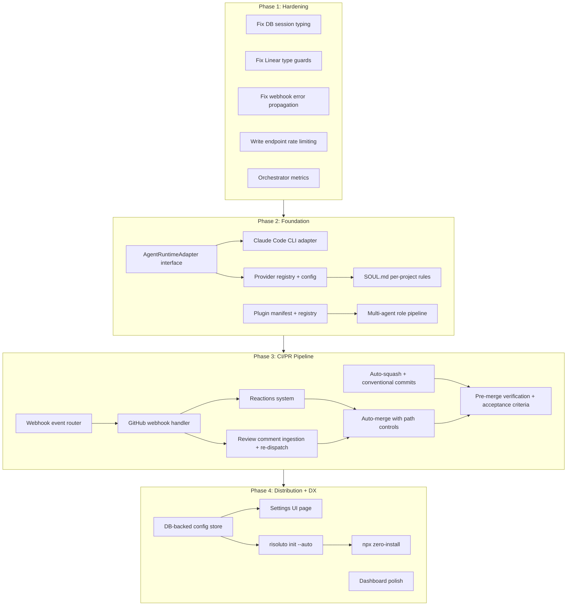

# Risoluto v1.0 — Full Roadmap Implementation Plan

## Overview

Ship Risoluto v1.0 as a feature-complete orchestration platform. The work spans 4 phases: a hardening pass to fix critical code issues, a foundation layer for multi-provider and extensibility, a CI/PR pipeline for full pull request lifecycle automation, and a distribution + DX layer for zero-friction adoption. The current UI/UX polish branch (Phase 0) merges first.

## Problem Frame

Risoluto v0.6.0 has excellent infrastructure (238/239 spec conformance, 223 test files, production-grade persistence and security) but is missing the feature breadth expected of a v1.0 platform. 17 features across 3 pillars are unstarted. Three critical code quality issues (unsafe DB casts, incomplete type narrowing, silent webhook data loss) must be fixed before feature work begins. (see origin: `docs/brainstorms/2026-04-01-v1-roadmap-assessment-requirements.md`)

## Requirements Trace

| ID | Requirement | Phase |
|----|-------------|-------|
| R0 | Complete v1 UI/UX polish and merge | 0 |
| R1 | Replace `as any` DB session access with typed wrapper | 1 |
| R2 | Replace `as Record<string, unknown>` with type guards in Linear client | 1 |
| R3 | Throw on inbox insert failure instead of returning success | 1 |
| R4 | Apply rate limiting to write-mutating API endpoints | 1 |
| R5 | Add orchestrator metrics (workers, queue depth, completions) | 1 |
| R6 | Agent-agnostic runner — Runner interface + registry, multi-provider | 2 |
| R7 | Per-project agent rules — SOUL.md, per-phase prompt templates | 2 |
| R8 | Plugin / swappable architecture — SKILL.md, progressive discovery | 2 |
| R9 | Multi-agent role pipeline — clusters, shared workspaces, per-role concurrency | 2 |
| R10 | Reactions system — CI/review/approval triggers | 3 |
| R11 | Auto-squash + conventional commit formatting | 3 |
| R12 | Review comment ingestion | 3 |
| R13 | Re-dispatch on REQUEST_CHANGES | 3 |
| R14 | Auto-merge integration PR with path controls | 3 |
| R15 | Pre-merge verification (test/lint before done) | 3 |
| R16 | Acceptance criteria validation with structured scoring | 3 |
| R17 | Database-backed configuration store | 4 |
| R18 | Settings UI page | 4 |
| R19 | `risoluto init --auto` one-command setup | 4 |
| R20 | npx-based zero-install distribution | 4 |
| R21 | Dashboard polish — workflow summaries, credential UI | 4 |

## Scope Boundaries

- **#12 (mobile-responsive dashboard)**: Deferred to v1.1
- **Chat integrations (#66)**, **cron jobs (#67)**, **GitLab adapter (#123)**: Post-v1.0
- **Circuit breaker (#71)**, **health daemon (#72)**: Post-v1.0
- **Secret/config injection (#58)**: Post-v1.0
- **OpenTelemetry distributed tracing**: Nice-to-have, not required
- **All Tier 3 and Tier 4 roadmap items**: Post-v1.0

## Context & Research

### Relevant Code and Patterns

**Dispatch abstraction (the multi-provider extension point):**
- `src/dispatch/types.ts` — `RunAttemptDispatcher` interface: `runAttempt(input) → Promise<RunOutcome>`
- `src/dispatch/factory.ts` — `createDispatcher()` already switches between `AgentRunner` (local) and `DispatchClient` (remote) based on `DISPATCH_MODE` env var
- This factory + interface pattern is the natural seam for adding new runtime adapters

**Port pattern (the plugin extension point):**
- `src/orchestrator/port.ts` — `OrchestratorPort` (14 methods)
- `src/tracker/port.ts` — `TrackerPort` (7 methods)
- `src/git/port.ts` — `GitIntegrationPort`
- `src/core/attempt-store-port.ts` — `AttemptStorePort`
- All ports are TypeScript interfaces (structural typing, easy to mock)
- Adapters registered via DI in `src/cli/services.ts:createServices()`

**Agent runner internals (what must be abstracted):**
- `src/agent-runner/index.ts` — `AgentRunner` class (269 LOC), tightly coupled to Docker + Codex
- `src/agent-runner/docker-session.ts` — Docker container lifecycle
- `src/agent-runner/session-init.ts` — Codex-specific thread lifecycle (thread/start, thread/resume)
- `src/agent/json-rpc-connection.ts` — Codex JSON-RPC protocol

**Webhook handling (the CI/PR extension point):**
- `src/http/webhook-handler.ts` — Linear-specific handler with HMAC verification, inbox dedup, entity routing
- `src/http/webhook-types.ts` — `SUPPORTED_WEBHOOK_TYPES = Set(["Issue", "Comment"])`
- `src/webhook/registrar.ts` — webhook registration lifecycle
- Entity-aware routing at handler level dispatches to orchestrator methods

**Config system (the DB-backed config extension point):**
- `src/config/store.ts` — `ConfigStore` with `start()` → `refresh()` → `getConfig()` lifecycle
- `src/config/overlay.ts` — `ConfigOverlayPort` for runtime patches
- `src/config/builders.ts` — `deriveServiceConfig()` merges workflow + overlay + secrets
- Already has change subscriptions and rollback-on-error

**Rate limiting:**
- `src/http/routes.ts:61` — `express-rate-limit` at 300 req/min on `/api/`, 600 req/min on `/webhooks/linear`
- All write endpoints share the global 300/min pool; no per-endpoint granularity

**Metrics:**
- `src/observability/metrics.ts` — Custom Counter/Histogram/Gauge implementations
- Prometheus text format output at `GET /metrics`
- 16 metrics currently tracked (HTTP, webhook-related)
- Missing: orchestrator queue depth, active workers, completion rates
- Data source: `Orchestrator._state.runningEntries.size`, `.retryEntries.size`, `.queuedViews.length`

**Test infrastructure:**
- `tests/helpers.ts` — `createMockLogger()`, `makeMockResponse()`, `createJsonResponse()`
- `tests/orchestrator/issue-test-factories.ts` — `createIssue()`, `createRunningEntry()` factories
- `tests/e2e/mocks/scenario-builder.ts` — fluent `ScenarioBuilder` for E2E setup
- `tests/e2e/pages/base.page.ts` — Playwright POM base class
- Property-based tests use `fast-check`

**Setup wizard:**
- `src/setup/api.ts` — 10+ REST endpoints for interactive setup
- `src/setup/handlers/` — 12 handler files (codex-auth, github-token, linear-project, etc.)
- No handler has isolated unit tests (coverage gap)

### Institutional Learnings

- Existing `docs/solutions/` not found — no prior solutions database
- Pre-push hook runs 11-step gate (build, lint, format, test, knip, jscpd, playwright, semgrep, typecheck coverage)
- Webhook inbox schema already has retry infrastructure (`status`, `next_attempt_at`, `attempt_count`) but no async retry processor

## Key Technical Decisions

- **Multi-provider via `RunAttemptDispatcher` extension**: The existing interface + factory pattern is the right seam. New providers implement `RunAttemptDispatcher` and register in the factory. No need to create a separate "adapter" abstraction — the dispatcher IS the adapter. **Rationale:** Avoids a redundant abstraction layer; the factory already handles mode switching.

- **Plugin system as port + manifest registry**: Plugins declare which ports they implement via a manifest file. A `PluginRegistry` scans a plugins directory, validates manifests, and registers implementations. **Rationale:** Builds on the existing port pattern naturally; avoids dynamic `require()` which complicates bundling.

- **DB-backed config layers on top of overlay**: The SQLite config store supplements (not replaces) the overlay YAML system. Overlay remains the file-based layer; DB store handles UI-driven settings, per-issue overrides, and API-managed config. **Rationale:** Preserves the file-based workflow for operators who prefer it; DB adds the programmatic layer the settings UI needs.

- **Webhook event router pattern for CI/PR pipeline**: Extract a `WebhookEventRouter` from the current handler that supports registering new event type handlers. GitHub webhook events (PR reviews, CI status) get their own handler implementations. **Rationale:** Keeps webhook-handler.ts from growing unboundedly; enables plugins to register custom handlers.

- **Phase 2 Foundation as architectural prerequisite**: Multi-provider runner (#23) ships before CI/PR pipeline because the pipeline benefits from provider abstraction (different agents for review vs implementation). Plugin architecture (#20) ships before multi-agent pipeline (#22) because pipelines are a natural plugin use case.

## Open Questions

### Resolved During Planning

- **Which agent runtimes for v1.0?** Codex (existing) + Claude Code CLI (highest demand). Other providers (Ollama, custom OpenAI-compatible) via the `RunAttemptDispatcher` interface but not built-in for v1.0. **Basis:** Codex is the current runtime; Claude Code CLI is the most requested alternative per roadmap issue #23 research notes.

- **Runtime registry vs compile-time adapters for plugins?** Compile-time with static imports for v1.0. Runtime dynamic loading adds bundling complexity and is unnecessary when the plugin count is small. Plugin manifests declare types; `createServices()` resolves them at startup. **Basis:** Existing factory pattern uses static imports; matches the ESM module resolution strategy.

- **DB-backed config: replace or layer?** Layer on top. See Key Technical Decisions above.

### Deferred to Implementation

- **Exact SOUL.md schema format**: The per-project rules schema needs prototyping — the right structure depends on how prompt templates compose with identity/personality layers. Design during R7 implementation.
- **Auto-merge ALLOWED_PATHS defaults**: Needs research into common repo structures. Likely default to restrictive (empty = nothing auto-merges) with operator opt-in.
- **npx packaging strategy**: esbuild single-bundle vs Node SEA vs pkg — requires build experiments. Defer to R20 implementation.
- **Plugin hot-reload**: Whether plugins can be loaded/unloaded without restart. v1.0 likely requires restart; hot-reload is a v1.1 concern.

## High-Level Technical Design

> *This illustrates the intended approach and is directional guidance for review, not implementation specification. The implementing agent should treat it as context, not code to reproduce.*



**Provider abstraction model:**

```
┌─────────────────────────────────────────────┐
│              Orchestrator                    │
│  (dispatch loop, concurrency, state mgmt)   │
│                    │                         │
│          RunAttemptDispatcher                │
│          (existing interface)                │
│                    │                         │
│      ┌─────────────┼─────────────┐          │
│      ▼             ▼             ▼          │
│  AgentRunner   ClaudeCodeCli  DispatchClient│
│  (Codex+Docker) (subprocess)  (remote SSE)  │
│                                              │
│  Each implements: runAttempt() → RunOutcome  │
│  Each streams:    onEvent() callbacks        │
│  Each respects:   signal (AbortSignal)       │
└─────────────────────────────────────────────┘
```

**Plugin registry model:**

```
plugins/
  my-plugin/
    plugin.yaml          # manifest: name, version, ports, entry
    index.ts             # exports: { tracker?: TrackerPort, ... }

PluginRegistry:
  1. Scan plugins/ dir for plugin.yaml manifests
  2. Validate manifest schema (name, version, ports)
  3. Import entry module at startup
  4. Register port implementations in DI container
  5. createServices() resolves plugins alongside built-in adapters
```

## Phased Delivery

### Phase 0: UI/UX Polish (in progress)

Complete the `feature/v1-ui-ux-polish` branch and merge to main. This is a prerequisite for all subsequent phases.

### Phase 1: Hardening

Fix critical code quality issues to establish a trustworthy base. 5 focused fixes, each independently testable and mergeable.

### Phase 2: Foundation — Multi-Provider + Extensibility

The architectural core of v1.0. Ships the multi-provider runner, per-project rules, plugin system, and multi-agent pipeline. This phase has the highest design risk and should be executed carefully with architecture review checkpoints.

### Phase 3: CI/PR Pipeline

The primary value differentiator. Enables full pull request lifecycle automation: reactions, review comment ingestion, re-dispatch, auto-merge, pre-merge verification, and acceptance criteria validation.

### Phase 4: Distribution + DX

The adoption layer. Makes Risoluto effortless to install and configure: DB-backed settings, Settings UI, `risoluto init --auto`, npx distribution, and final dashboard polish.

## Implementation Units

### Phase 1: Hardening

- [ ] **Unit 1: Fix unsafe database session access**

  **Goal:** Replace `as any` Drizzle session cast with typed connection management

  **Requirements:** R1

  **Dependencies:** None

  **Files:**
  - Modify: `src/persistence/sqlite/database.ts`
  - Modify: `src/persistence/sqlite/runtime.ts`
  - Test: `tests/persistence/sqlite/database.test.ts`

  **Approach:**
  - Store the raw BetterSqlite3 `Database` instance alongside the Drizzle wrapper in a `DatabaseHandle` object: `{ drizzle: RisolutoDatabase; raw: BetterSQLite3.Database }`
  - `openDatabase()` returns the handle; `closeDatabase()` calls `handle.raw.close()`
  - Update all callers of `openDatabase()` and `closeDatabase()` to use the handle
  - Remove the `as any` cast and the eslint-disable comment

  **Patterns to follow:**
  - Existing `openDatabase()` / `closeDatabase()` pair in `database.ts`
  - `PersistenceRuntime` lifecycle in `runtime.ts`

  **Test scenarios:**
  - Happy path: `closeDatabase()` calls `raw.close()` on the stored connection
  - Happy path: `openDatabase()` returns a handle with both `drizzle` and `raw` properties
  - Edge case: `closeDatabase()` on an already-closed handle does not throw
  - Integration: Full lifecycle — open, run a query via drizzle, close via raw — no type errors

  **Verification:**
  - No `as any` casts remain in database.ts
  - `pnpm run build` and `pnpm test` pass
  - TypeScript infers correct types throughout the database lifecycle

---

- [ ] **Unit 2: Fix Linear client type narrowing**

  **Goal:** Replace `as Record<string, unknown>` casts with Zod schemas for GraphQL response validation

  **Requirements:** R2

  **Dependencies:** None

  **Files:**
  - Modify: `src/linear/issue-pagination.ts`
  - Modify: `src/linear/graphql-tool.ts`
  - Create: `src/linear/schemas.ts`
  - Test: `tests/linear/issue-pagination.test.ts`
  - Test: `tests/linear/graphql-tool.test.ts`

  **Approach:**
  - Define Zod schemas for `IssuesConnection`, `PageInfo`, and GraphQL tool args in a new `schemas.ts`
  - Replace `extractIssuesConnection()` casts with `safeParse()` — throw `LinearClientError` on validation failure
  - Replace `graphql-tool.ts` casts with schema validation
  - Zod v4.3.6 is already in package.json

  **Patterns to follow:**
  - Existing `LinearClientError` class for error handling
  - Existing `isRecord()` / `asRecord()` in `src/utils/type-guards.ts` as the lighter alternative (but Zod is preferred here for structured GraphQL responses)

  **Test scenarios:**
  - Happy path: Valid GraphQL response with nodes + pageInfo parsed correctly
  - Happy path: Valid paginated response with `hasNextPage: true` and `endCursor`
  - Edge case: Response with `hasNextPage: false` and `endCursor: null` (terminal page)
  - Error path: Response missing `nodes` field throws `LinearClientError`
  - Error path: Response with `hasNextPage` as string instead of boolean throws
  - Error path: Response with completely unexpected shape (array instead of object) throws
  - Happy path: GraphQL tool args with variables object parsed correctly
  - Error path: GraphQL tool args with non-object variables rejected

  **Verification:**
  - No `as Record<string, unknown>` casts remain in issue-pagination.ts or graphql-tool.ts
  - All existing Linear client tests continue passing
  - New schema validation tests cover malformed response handling

---

- [ ] **Unit 3: Fix silent webhook inbox insert failures**

  **Goal:** Propagate inbox insert errors instead of silently swallowing them

  **Requirements:** R3

  **Dependencies:** None

  **Files:**
  - Modify: `src/http/webhook-handler.ts`
  - Modify: `src/observability/metrics.ts`
  - Test: `tests/http/webhook-handler.test.ts`

  **Approach:**
  - Remove the `.catch()` that returns `{ isNew: true }` on inbox insert failure
  - Let the error propagate to the handler, which responds with 500
  - Linear will retry the webhook delivery (their retry policy handles transient failures)
  - Add an `inbox_insert_failures_total` counter metric for operator visibility
  - Keep the dedup logic intact — only the error swallowing changes

  **Patterns to follow:**
  - Existing error propagation pattern in webhook signature verification (returns 401 on failure)
  - Existing metric counter pattern in `metrics.ts`

  **Test scenarios:**
  - Happy path: Successful inbox insert returns `{ isNew: true }`, handler processes webhook
  - Happy path: Duplicate delivery (inbox returns `{ isNew: false }`), handler skips processing
  - Error path: Inbox insert throws — handler responds 500, does NOT process side effects
  - Error path: Inbox insert throws — `inbox_insert_failures_total` metric incremented
  - Integration: Full webhook flow with inbox failure — verify no orchestrator side effects triggered

  **Verification:**
  - No silent error swallowing in webhook-handler.ts
  - Existing webhook tests pass (adjust expectations for error behavior)
  - New metric appears in `/metrics` output

---

- [ ] **Unit 4: Add write endpoint rate limiting**

  **Goal:** Apply granular rate limiting to write-mutating API endpoints

  **Requirements:** R4

  **Dependencies:** None

  **Files:**
  - Modify: `src/http/routes.ts`
  - Test: `tests/http/routes.test.ts`

  **Approach:**
  - Create a `writeLimiter` with stricter limits (e.g., 60 req/min) using existing `express-rate-limit`
  - Apply to all POST/PUT/DELETE routes on `/api/v1/` that pass through WriteGuard
  - Keep the existing 300 req/min `apiLimiter` on read endpoints
  - Keep the existing 600 req/min webhook limiter unchanged

  **Patterns to follow:**
  - Existing `apiLimiter` definition at `routes.ts:61`
  - Existing webhook limiter at `routes.ts:347-352`

  **Test scenarios:**
  - Happy path: Write request within limit succeeds (200/201)
  - Error path: Write requests exceeding limit receive 429 Too Many Requests
  - Happy path: Read requests are not affected by write limiter
  - Edge case: Webhook endpoint uses its own limiter, not the write limiter

  **Verification:**
  - Write endpoints respond 429 when rate exceeded
  - Read endpoints and webhooks unaffected
  - `pnpm test` passes

---

- [ ] **Unit 5: Add orchestrator metrics**

  **Goal:** Expose orchestrator operational metrics in Prometheus format

  **Requirements:** R5

  **Dependencies:** None

  **Files:**
  - Modify: `src/observability/metrics.ts`
  - Modify: `src/orchestrator/orchestrator.ts`
  - Test: `tests/observability/metrics.test.ts`
  - Test: `tests/orchestrator/orchestrator.test.ts`

  **Approach:**
  - Add three new metrics to `MetricsCollector`:
    - `risoluto_orchestrator_running_workers` (Gauge) — `_state.runningEntries.size`
    - `risoluto_orchestrator_queued_issues` (Gauge) — `_state.queuedViews.length`
    - `risoluto_orchestrator_completed_attempts_total` (Counter) — incremented in `processWorkerOutcome()`, labeled by outcome kind
  - Update gauges in the orchestrator's tick/reconcile cycle
  - Increment counter when a worker outcome is processed

  **Patterns to follow:**
  - Existing `httpRequestsTotal` counter pattern
  - Existing `webhookBacklogCount` gauge pattern
  - `globalMetrics` singleton access pattern

  **Test scenarios:**
  - Happy path: Running workers gauge reflects `runningEntries.size` after dispatch
  - Happy path: Queued issues gauge reflects `queuedViews.length` after refresh
  - Happy path: Completed attempts counter increments on worker outcome with correct label
  - Edge case: Gauges return 0 when orchestrator is idle
  - Integration: `/metrics` endpoint includes new metric lines in Prometheus format

  **Verification:**
  - `GET /metrics` output includes `risoluto_orchestrator_*` metrics
  - Metrics update correctly during orchestrator lifecycle
  - Existing metrics unaffected

---

### Phase 2: Foundation — Multi-Provider + Extensibility

- [ ] **Unit 6: Define AgentRuntimeAdapter and refactor Codex runner**

  **Goal:** Extract an `AgentRuntimeAdapter` interface from the existing `AgentRunner` and refactor the Codex implementation to use it

  **Requirements:** R6

  **Dependencies:** Phase 1 complete

  **Files:**
  - Create: `src/agent-runner/adapter.ts` (interface definition)
  - Create: `src/agent-runner/codex-adapter.ts` (refactored from AgentRunner internals)
  - Modify: `src/agent-runner/index.ts` (delegates to adapter)
  - Modify: `src/dispatch/factory.ts` (adapter selection)
  - Modify: `src/dispatch/types.ts` (add adapter type to config)
  - Modify: `src/core/types.ts` (add `agent.runtime` config field)
  - Test: `tests/agent-runner/adapter.test.ts`
  - Test: `tests/agent-runner/codex-adapter.test.ts`

  **Approach:**
  - Define `AgentRuntimeAdapter` interface with lifecycle methods: `createSession()`, `initializeSession()`, `executeTurn()`, `cleanup()`, `abort()`
  - Extract Docker + Codex-specific logic from `AgentRunner` into `CodexDockerAdapter` implementing the interface
  - `AgentRunner` becomes a thin orchestrator that delegates to the adapter
  - Add `agent.runtime: "codex" | "claude-code-cli" | "custom"` to `AgentConfig`
  - Update `createDispatcher()` factory to resolve adapter based on config

  **Technical design:** *(directional guidance, not implementation specification)*
  ```
  AgentRuntimeAdapter:
    createSession(workspace, config) → SessionHandle
    initializeSession(handle, prompt, model) → void
    executeTurn(handle, signal, onEvent) → TurnResult
    cleanup(handle) → void
    abort(handle) → void

  SessionHandle:
    id: string
    steerTurn?: (message: string) → Promise<boolean>
    metadata: Record<string, unknown>
  ```

  **Patterns to follow:**
  - Existing `RunAttemptDispatcher` interface in `dispatch/types.ts`
  - Existing factory pattern in `dispatch/factory.ts`
  - Port-based DI in `cli/services.ts`

  **Test scenarios:**
  - Happy path: `CodexDockerAdapter.createSession()` spawns Docker container and returns handle
  - Happy path: Full lifecycle via adapter — create, init, execute, cleanup
  - Error path: `createSession()` failure propagates cleanly to `AgentRunner`
  - Error path: `abort()` triggers container cleanup
  - Integration: Existing `AgentRunner` behavior unchanged after refactor (regression tests)
  - Edge case: Adapter cleanup called after abort does not double-cleanup

  **Verification:**
  - All existing agent-runner tests pass unchanged
  - New adapter interface is importable and type-correct
  - `CodexDockerAdapter` passes the same test scenarios as the old inline implementation

---

- [ ] **Unit 7: Implement Claude Code CLI adapter**

  **Goal:** Add a Claude Code CLI runtime adapter as the first alternative to Codex

  **Requirements:** R6

  **Dependencies:** Unit 6

  **Files:**
  - Create: `src/agent-runner/claude-code-adapter.ts`
  - Modify: `src/dispatch/factory.ts`
  - Test: `tests/agent-runner/claude-code-adapter.test.ts`

  **Approach:**
  - Implement `AgentRuntimeAdapter` for Claude Code CLI
  - `createSession()` prepares workspace (no Docker — direct subprocess)
  - `initializeSession()` constructs CLI args (`claude --dangerouslySkipPermissions -p <prompt>`)
  - `executeTurn()` spawns subprocess, parses stdout/stderr for events, maps to `RecentEvent` format
  - `cleanup()` kills subprocess if still running
  - Map Claude Code CLI output format to the existing event handler contract
  - Add `CLAUDE_CODE_PATH` env var for CLI binary location

  **Patterns to follow:**
  - `CodexDockerAdapter` session lifecycle (Unit 6)
  - Existing subprocess spawning in `src/docker/spawn.ts`

  **Test scenarios:**
  - Happy path: CLI adapter spawns subprocess with correct args and workspace
  - Happy path: CLI output parsed into `RecentEvent` stream
  - Error path: Subprocess exits non-zero — mapped to appropriate `RunOutcome` error kind
  - Error path: Subprocess timeout — abort signal kills process
  - Edge case: CLI binary not found — clear error message with `CLAUDE_CODE_PATH` hint
  - Integration: Full attempt lifecycle via CLI adapter produces valid `RunOutcome`

  **Verification:**
  - Adapter passes unit tests with mocked subprocess
  - Config `agent.runtime: "claude-code-cli"` selects this adapter via factory
  - `pnpm run build` succeeds with new module

---

- [ ] **Unit 8: Provider registry and config-driven selection**

  **Goal:** Formalize provider registration and config-driven runtime selection

  **Requirements:** R6

  **Dependencies:** Units 6, 7

  **Files:**
  - Create: `src/agent-runner/registry.ts`
  - Modify: `src/dispatch/factory.ts`
  - Modify: `src/config/schemas/agent.ts`
  - Test: `tests/agent-runner/registry.test.ts`

  **Approach:**
  - Create `AdapterRegistry` that maps runtime names to adapter constructors
  - Built-in registrations: `"codex"` → `CodexDockerAdapter`, `"claude-code-cli"` → `ClaudeCodeCliAdapter`
  - `createDispatcher()` resolves adapter from registry based on `agent.runtime` config
  - Add Zod validation for `agent.runtime` field in config schema
  - Support per-job model overrides (already in `ModelSelection`) routing to appropriate adapter

  **Patterns to follow:**
  - Existing `createDispatcher()` factory with env-var switching
  - Existing config schema validation in `src/config/schemas/`

  **Test scenarios:**
  - Happy path: Registry resolves `"codex"` to CodexDockerAdapter constructor
  - Happy path: Registry resolves `"claude-code-cli"` to ClaudeCodeCliAdapter constructor
  - Error path: Unknown runtime name throws descriptive error
  - Happy path: Config validation accepts valid runtime names
  - Error path: Config validation rejects invalid runtime name with helpful message

  **Verification:**
  - Factory correctly selects adapter based on config
  - Config schema validates runtime field
  - Existing tests pass (default `"codex"` selection)

---

- [ ] **Unit 9: Per-project agent rules (SOUL.md)**

  **Goal:** Enable per-project personality, identity, and prompt template configuration

  **Requirements:** R7

  **Dependencies:** Unit 6 (adapter interface exists)

  **Files:**
  - Create: `src/config/soul.ts`
  - Create: `src/config/schemas/soul.ts`
  - Modify: `src/orchestrator/orchestrator.ts` (load and inject soul config)
  - Modify: `src/agent-runner/index.ts` (pass soul context to adapter)
  - Modify: `src/core/types.ts` (add `SoulConfig` to service config)
  - Test: `tests/config/soul.test.ts`

  **Approach:**
  - Define `SoulConfig` schema: `{ identity, personality, rules[], perPhaseTemplates: Record<phase, template> }`
  - Load from `SOUL.md` in project root (YAML frontmatter + markdown body, matching WORKFLOW.md pattern)
  - Orchestrator loads soul config at startup and on file change (reuse chokidar watcher pattern)
  - Soul context injected into prompt template via LiquidJS `{{ soul.identity }}`, `{{ soul.rules }}`
  - Per-phase templates override the default prompt for specific workflow states

  **Patterns to follow:**
  - Existing WORKFLOW.md YAML frontmatter parsing in `src/workflow/`
  - Existing LiquidJS template engine usage
  - Existing chokidar file watcher for hot-reload

  **Test scenarios:**
  - Happy path: SOUL.md with identity and rules parsed into `SoulConfig`
  - Happy path: Soul context available in LiquidJS template rendering
  - Happy path: Per-phase template overrides default for matching state
  - Edge case: Missing SOUL.md — no soul config, default templates used
  - Edge case: Invalid SOUL.md YAML — warning logged, falls back to no soul config
  - Error path: SOUL.md schema validation failure — descriptive error with field path

  **Verification:**
  - Soul config loads and injects into prompt templates
  - Hot-reload updates soul config without restart
  - Missing SOUL.md does not break existing behavior

---

- [ ] **Unit 10: Plugin manifest and registry**

  **Goal:** Enable swappable architecture via plugin manifests and a registry

  **Requirements:** R8

  **Dependencies:** Unit 8 (registry pattern exists)

  **Files:**
  - Create: `src/plugin/manifest.ts` (manifest schema and loader)
  - Create: `src/plugin/registry.ts` (plugin lifecycle management)
  - Create: `src/plugin/types.ts` (plugin interface definitions)
  - Modify: `src/cli/services.ts` (resolve plugins in DI)
  - Modify: `src/cli/index.ts` (load plugins at startup)
  - Test: `tests/plugin/manifest.test.ts`
  - Test: `tests/plugin/registry.test.ts`

  **Approach:**
  - Define `PluginManifest` schema (Zod): `{ name, version, description, ports: string[], entry: string }`
  - `PluginRegistry` scans `<dataDir>/plugins/` for `plugin.yaml` manifests at startup
  - Each plugin's `entry` module exports a factory: `(deps) => { tracker?: TrackerPort, ... }`
  - Registry validates manifest, imports entry, calls factory, registers port implementations
  - `createServices()` checks registry for port overrides before using built-in adapters
  - SKILL.md standard: plugins include a `SKILL.md` with name/description YAML frontmatter for progressive discovery

  **Patterns to follow:**
  - Existing port interface definitions (`TrackerPort`, `GitIntegrationPort`, etc.)
  - Existing `createServices()` DI assembly in `cli/services.ts`
  - Existing Zod schema validation patterns

  **Test scenarios:**
  - Happy path: Valid plugin manifest parsed and plugin loaded
  - Happy path: Plugin's TrackerPort implementation used instead of built-in
  - Error path: Missing `plugin.yaml` — directory skipped with warning
  - Error path: Invalid manifest schema — descriptive error, plugin skipped
  - Error path: Plugin entry module fails to import — error logged, plugin skipped
  - Edge case: Empty plugins directory — no plugins loaded, built-in adapters used
  - Edge case: Multiple plugins declaring same port — last-loaded wins with warning

  **Verification:**
  - Plugin discovery and loading works with a test fixture plugin
  - Built-in adapters still work when no plugins present
  - Plugin failures do not crash the service

---

- [ ] **Unit 11: Multi-agent role pipeline**

  **Goal:** Enable sequential multi-agent execution with role-based dispatch

  **Requirements:** R9

  **Dependencies:** Units 6, 8, 9 (adapter interface, registry, soul config)

  **Files:**
  - Create: `src/orchestrator/role-pipeline.ts`
  - Create: `src/orchestrator/role-pipeline-types.ts`
  - Modify: `src/orchestrator/orchestrator.ts` (integrate pipeline dispatch)
  - Modify: `src/core/types.ts` (add pipeline config types)
  - Modify: `src/config/schemas/agent.ts` (pipeline schema)
  - Test: `tests/orchestrator/role-pipeline.test.ts`

  **Approach:**
  - Define `RolePipeline` config: `{ roles: [{ name, runtime, model, promptTemplate, concurrency }] }`
  - Pipeline executor runs roles sequentially for a given issue: analyzer → implementer → reviewer
  - Each role gets its own workspace view (shared base, role-specific branch)
  - Prior role outputs passed as context to next role via prompt template injection
  - Per-role concurrency limits enforce resource constraints
  - Pipeline state tracked in orchestrator alongside individual worker state

  **Patterns to follow:**
  - Existing `RunningEntry` worker tracking in orchestrator
  - Existing per-state concurrency via `maxConcurrentAgentsByState`
  - Existing prompt template LiquidJS injection

  **Test scenarios:**
  - Happy path: 3-role pipeline executes sequentially — analyzer, implementer, reviewer
  - Happy path: Prior role output injected into next role's prompt template
  - Happy path: Per-role concurrency limits enforced independently
  - Error path: Middle role fails — pipeline aborted, failure recorded
  - Error path: Role timeout — pipeline aborted with timeout outcome
  - Edge case: Single-role pipeline behaves identically to current single-agent dispatch
  - Edge case: Pipeline abort cancels current and skips remaining roles
  - Integration: Pipeline outcome recorded as single attempt with role annotations

  **Verification:**
  - Pipeline executor handles the full lifecycle: dispatch, monitor, pass context, record outcome
  - Single-agent dispatch (no pipeline config) works unchanged
  - Pipeline state visible in `/api/v1/state` snapshot

---

### Phase 3: CI/PR Pipeline

- [ ] **Unit 12: Webhook event router**

  **Goal:** Extract a pluggable event routing system from the webhook handler

  **Requirements:** R10, R12, R13

  **Dependencies:** Phase 2 complete (plugin registry available)

  **Files:**
  - Create: `src/webhook/event-router.ts`
  - Create: `src/webhook/event-router-types.ts`
  - Modify: `src/http/webhook-handler.ts` (delegate to router)
  - Modify: `src/http/routes.ts` (register GitHub webhook endpoint)
  - Test: `tests/webhook/event-router.test.ts`

  **Approach:**
  - Define `EventHandler` interface: `(event, deps) → Promise<EventHandlerResult>`
  - `WebhookEventRouter` maintains a registry of `(type, action) → EventHandler[]`
  - Migrate existing Linear issue/comment handlers to this pattern
  - Add GitHub webhook endpoint (`POST /webhooks/github`) with signature verification (HMAC-SHA256 using `X-Hub-Signature-256`)
  - Router resolves handlers for incoming events, executes in order, aggregates results
  - Plugins can register custom handlers via the plugin registry

  **Patterns to follow:**
  - Existing Linear webhook handler structure
  - Existing HMAC verification in `webhook-handler.ts`
  - Existing plugin registration pattern (Unit 10)

  **Test scenarios:**
  - Happy path: Linear issue event routed to existing handler via router
  - Happy path: GitHub PR review event routed to registered handler
  - Error path: Unknown event type — logged and skipped (200 response)
  - Error path: Handler throws — error logged, other handlers still execute
  - Happy path: Multiple handlers for same event type all execute
  - Edge case: No handlers registered for event type — 200 (acknowledged but no action)

  **Verification:**
  - Existing Linear webhook behavior unchanged after router extraction
  - GitHub webhook endpoint accepts and verifies GitHub signatures
  - Router supports dynamic handler registration

---

- [ ] **Unit 13: Reactions system and review comment ingestion**

  **Goal:** Trigger agent actions from CI/review events; ingest PR review comments

  **Requirements:** R10, R12, R13

  **Dependencies:** Unit 12

  **Files:**
  - Create: `src/webhook/handlers/github-pr-review.ts`
  - Create: `src/webhook/handlers/github-check-run.ts`
  - Create: `src/webhook/handlers/reactions.ts`
  - Create: `src/orchestrator/review-context.ts`
  - Modify: `src/orchestrator/orchestrator.ts` (add review-triggered re-dispatch)
  - Test: `tests/webhook/handlers/github-pr-review.test.ts`
  - Test: `tests/webhook/handlers/github-check-run.test.ts`
  - Test: `tests/webhook/handlers/reactions.test.ts`

  **Approach:**
  - **PR review handler:** Parse `pull_request_review` events, extract review comments, map PR to tracked issue via branch name or PR body
  - **Check run handler:** Parse `check_run` events for CI pass/fail, trigger reactions
  - **Reactions engine:** Config-driven rules: `{ on: "check_run.completed", when: "conclusion == 'failure'", then: "re-dispatch" }`
  - **Review context:** Store review comments as context for re-dispatched agent (injected into prompt)
  - **Re-dispatch on REQUEST_CHANGES:** `pull_request_review` with `state: "changes_requested"` triggers new attempt with review comments as context

  **Patterns to follow:**
  - Existing `requestTargetedRefresh()` for triggering orchestrator action from webhook
  - Existing event handler pattern from Unit 12
  - Existing prompt template injection via LiquidJS

  **Test scenarios:**
  - Happy path: PR review with `changes_requested` triggers re-dispatch with review comments in prompt
  - Happy path: CI check failure triggers configured reaction (e.g., comment on issue)
  - Happy path: CI check success triggers configured reaction (e.g., transition to review)
  - Error path: PR cannot be mapped to tracked issue — logged and skipped
  - Edge case: Multiple reviews on same PR — latest review's comments used
  - Edge case: Review with no comments — re-dispatch with review state only
  - Integration: Full flow — PR review webhook → review context stored → agent re-dispatched with context

  **Verification:**
  - PR review events correctly trigger re-dispatch
  - CI status events trigger configured reactions
  - Review comments appear in re-dispatched agent's prompt context

---

- [ ] **Unit 14: Auto-squash and conventional commit formatting**

  **Goal:** Automatically squash agent commits and format with conventional commit style

  **Requirements:** R11

  **Dependencies:** Unit 6 (adapter interface — needs post-run hook point)

  **Files:**
  - Create: `src/git/auto-squash.ts`
  - Create: `src/git/commit-formatter.ts`
  - Modify: `src/workspace/manager.ts` (add post-run squash hook)
  - Modify: `src/core/types.ts` (add squash config to WorkspaceConfig)
  - Test: `tests/git/auto-squash.test.ts`
  - Test: `tests/git/commit-formatter.test.ts`

  **Approach:**
  - `autoSquash()` — squash all agent commits on the work branch into a single commit
  - `formatConventionalCommit()` — generate commit message from issue metadata: `feat(scope): issue title`
  - Configurable path validation: reject squash if changes touch files outside `ALLOWED_PATHS`
  - Rich PR comment generation with execution metrics (turns, tokens, cost, duration)
  - Hook into workspace `after_run` lifecycle

  **Patterns to follow:**
  - Existing git operations in `src/git/`
  - Existing workspace hooks in `WorkspaceManager`
  - Existing PR comment creation via `TrackerPort.createComment()`

  **Test scenarios:**
  - Happy path: Multiple agent commits squashed into single conventional commit
  - Happy path: Commit message follows `type(scope): description` format from issue metadata
  - Happy path: PR comment includes execution metrics (turns, tokens, cost)
  - Error path: Path validation rejects changes outside allowed paths — commit aborted
  - Edge case: Single commit — no squash needed, just format
  - Edge case: No commits (agent made no changes) — skip squash, report empty

  **Verification:**
  - Agent work branch has single squashed commit after run
  - Commit message follows conventional format
  - PR comment includes metrics

---

- [ ] **Unit 15: Auto-merge with path controls and pre-merge verification**

  **Goal:** Automatically merge approved PRs with safety controls; verify tests/lint before marking done

  **Requirements:** R14, R15

  **Dependencies:** Units 12, 13 (event router, reactions system)

  **Files:**
  - Create: `src/git/auto-merge.ts`
  - Create: `src/git/pre-merge-verify.ts`
  - Modify: `src/orchestrator/orchestrator.ts` (integrate pre-merge + auto-merge into outcome processing)
  - Modify: `src/core/types.ts` (add auto-merge config)
  - Test: `tests/git/auto-merge.test.ts`
  - Test: `tests/git/pre-merge-verify.test.ts`

  **Approach:**
  - **Pre-merge verification:** Run configurable commands (test, lint, build) in workspace before marking issue as done
  - **Auto-merge:** After pre-merge passes and PR is approved, merge via GitHub API
  - **Path controls:** `ALLOWED_PATHS` prefix list — any file change outside these paths blocks auto-merge
  - **Environment-based progression:** Config supports different auto-merge policies per environment (dev: auto, staging: require approval, prod: manual)
  - Fail-closed by default: empty `ALLOWED_PATHS` means nothing auto-merges

  **Patterns to follow:**
  - Existing `GitIntegrationPort` for git operations
  - Existing `TrackerPort.transitionIssue()` for state changes
  - Existing workspace hook execution in `WorkspaceManager`

  **Test scenarios:**
  - Happy path: Pre-merge verification passes → auto-merge triggered → issue transitioned to done
  - Error path: Pre-merge lint fails → issue stays in current state, failure comment posted
  - Error path: Files outside `ALLOWED_PATHS` changed → auto-merge blocked with explanation
  - Happy path: Environment `dev` auto-merges; environment `prod` requires manual merge
  - Edge case: PR already merged (race condition) — detected and handled gracefully
  - Edge case: Merge conflict — auto-merge fails, comment posted, re-dispatch option offered
  - Integration: Full pipeline — agent completes → pre-merge verify → auto-merge → issue done

  **Verification:**
  - Pre-merge commands execute in workspace before merge attempt
  - Path controls correctly block or allow auto-merge
  - Auto-merge creates merge commit via GitHub API

---

- [ ] **Unit 16: Acceptance criteria validation**

  **Goal:** Validate agent work against issue acceptance criteria before marking complete

  **Requirements:** R16

  **Dependencies:** Unit 15 (pre-merge verification exists)

  **Files:**
  - Create: `src/orchestrator/acceptance-validator.ts`
  - Create: `src/orchestrator/acceptance-types.ts`
  - Modify: `src/orchestrator/orchestrator.ts` (integrate validation into outcome pipeline)
  - Test: `tests/orchestrator/acceptance-validator.test.ts`

  **Approach:**
  - Extract acceptance criteria from issue description (structured format: `## Acceptance Criteria\n- [ ] ...`)
  - Run a separate validation agent (lightweight model) that reviews the diff against criteria
  - Generate evaluation report with structured scoring: `{ criteria, status: pass|fail|partial, evidence }`
  - Failed validation triggers re-dispatch with failing criteria as context
  - Configurable: can be disabled per-project or per-state
  - Runs after agent completion, before pre-merge verification

  **Patterns to follow:**
  - Existing self-review pattern in agent runner
  - Existing prompt template injection for context
  - Existing `RunOutcome` processing pipeline

  **Test scenarios:**
  - Happy path: All acceptance criteria pass — proceed to pre-merge
  - Happy path: Evaluation report includes per-criterion scoring
  - Error path: One criterion fails — re-dispatch triggered with failing criteria context
  - Edge case: No acceptance criteria in issue — validation skipped
  - Edge case: Acceptance criteria extraction fails (no structured format) — warning, validation skipped
  - Error path: Validation agent timeout — proceed without validation (fail-open for liveness)

  **Verification:**
  - Acceptance criteria extracted from issue descriptions
  - Validation report generated with structured scores
  - Failed criteria trigger re-dispatch with context

---

### Phase 4: Distribution + DX

- [ ] **Unit 17: Database-backed configuration store**

  **Goal:** Add SQLite-backed settings storage for UI-driven configuration

  **Requirements:** R17

  **Dependencies:** Phase 3 complete

  **Files:**
  - Create: `src/persistence/sqlite/config-store.ts`
  - Create: `src/persistence/sqlite/config-schema.ts`
  - Modify: `src/persistence/sqlite/schema.ts` (add settings tables)
  - Modify: `src/config/store.ts` (integrate DB layer)
  - Modify: `src/cli/services.ts` (wire DB config store)
  - Test: `tests/persistence/sqlite/config-store.test.ts`

  **Approach:**
  - Add `settings` table: `(key TEXT PRIMARY KEY, value TEXT, updated_at TEXT)`
  - Add `api_keys` table: `(id TEXT PRIMARY KEY, name TEXT, key_hash TEXT, created_at TEXT)`
  - `DbConfigStore` implements read/write for settings, exposes change events
  - Integrates with existing `ConfigStore` as an additional source in `deriveServiceConfig()`
  - Priority: DB settings > overlay YAML > workflow defaults
  - Change events trigger config refresh (reuse existing subscription pattern)

  **Patterns to follow:**
  - Existing Drizzle schema definitions in `src/persistence/sqlite/schema.ts`
  - Existing `ConfigOverlayPort` change subscription pattern
  - Existing `deriveServiceConfig()` merge logic in `builders.ts`

  **Test scenarios:**
  - Happy path: Setting stored and retrieved from DB
  - Happy path: DB setting overrides overlay YAML value
  - Happy path: Setting change triggers config refresh
  - Error path: Invalid setting key rejected with descriptive error
  - Edge case: DB unavailable — falls back to overlay + workflow defaults
  - Edge case: Setting deleted — config reverts to overlay/default value
  - Integration: Full config priority chain — DB > overlay > workflow defaults

  **Verification:**
  - Settings persist across restarts (SQLite)
  - Config refresh triggered on DB changes
  - Existing overlay-based config unaffected when DB layer empty

---

- [ ] **Unit 18: Settings UI page**

  **Goal:** Dashboard page for managing Risoluto configuration

  **Requirements:** R18

  **Dependencies:** Unit 17

  **Files:**
  - Create: `src/frontend/pages/settings.ts` (or appropriate frontend module path)
  - Modify: `src/http/routes.ts` (add settings API endpoints)
  - Create: `tests/e2e/specs/smoke/settings.smoke.spec.ts`
  - Create: `tests/e2e/pages/settings.page.ts`

  **Approach:**
  - REST API: `GET /api/v1/settings`, `PUT /api/v1/settings/:key`, `DELETE /api/v1/settings/:key`
  - Settings UI organized by category: Tracker, Agent, Workspace, Notifications, Webhook
  - Form validation using existing Zod schemas (derive from config schema)
  - Real-time feedback: save indicator, validation errors inline
  - Protected by existing WriteGuard

  **Patterns to follow:**
  - Existing dashboard page patterns (Vite SPA)
  - Existing API route patterns in `routes.ts`
  - Existing POM pattern in `tests/e2e/pages/`
  - Existing `ScenarioBuilder` for E2E mock setup

  **Test scenarios:**
  - Happy path: Load settings page, all current settings displayed
  - Happy path: Edit a setting, save, verify persisted
  - Error path: Invalid setting value — inline validation error shown
  - Happy path: Delete a custom setting — reverts to default
  - Integration: Setting change on UI → API → DB → config refresh → orchestrator picks up new value
  - E2E: Settings page loads, form fields present, save works

  **Verification:**
  - Settings page accessible from dashboard navigation
  - CRUD operations work through UI
  - Playwright E2E smoke test passes

---

- [ ] **Unit 19: `risoluto init --auto` one-command setup**

  **Goal:** Automate the full setup process for non-interactive environments

  **Requirements:** R19

  **Dependencies:** Unit 17 (DB config store for persisting setup results)

  **Files:**
  - Create: `src/cli/init.ts`
  - Modify: `src/cli/index.ts` (add `init` subcommand)
  - Modify: `src/setup/api.ts` (extract handler logic for programmatic use)
  - Test: `tests/cli/init.test.ts`

  **Approach:**
  - New CLI subcommand: `risoluto init --auto`
  - Reads env vars: `LINEAR_API_KEY`, `GITHUB_TOKEN`, `OPENAI_API_KEY`, `RISOLUTO_MASTER_KEY`
  - Accepts CLI flags: `--workspace-root`, `--repo-url`, `--project-slug`
  - Calls setup handlers programmatically (extract from HTTP handler layer)
  - Prerequisite checks: verify API connectivity, repo access, required env vars
  - Generates `.env` template with placeholders for missing vars
  - Validates full config after setup; exits with clear pass/fail diagnostics
  - Also supports interactive prompts as fallback when env vars missing

  **Patterns to follow:**
  - Existing CLI arg parsing in `src/cli/index.ts`
  - Existing setup handlers in `src/setup/handlers/`
  - Existing config validation in `ConfigStore.start()`

  **Test scenarios:**
  - Happy path: All env vars set → init completes, config validated, service ready to start
  - Happy path: Missing env vars → interactive prompts for each missing value
  - Error path: LINEAR_API_KEY invalid → clear error with remediation hint
  - Error path: Repo URL unreachable → error with connectivity diagnostic
  - Edge case: Partial setup (some keys set, some missing) → init fills gaps
  - Edge case: Re-running init on already-configured instance → updates only changed values

  **Verification:**
  - `risoluto init --auto` works end-to-end with all env vars set
  - Service starts successfully after init
  - Error messages are actionable

---

- [ ] **Unit 20: npx-based zero-install distribution**

  **Goal:** Enable `npx risoluto` for instant installation and setup

  **Requirements:** R20

  **Dependencies:** Unit 19 (init command exists)

  **Files:**
  - Modify: `package.json` (bin field, publish config)
  - Create: `scripts/build-dist.ts` (packaging script)
  - Modify: `tsconfig.json` (if build output needs adjustment)
  - Test: `tests/cli/npx-smoke.test.ts`

  **Approach:**
  - Configure `package.json` `bin` field: `{ "risoluto": "dist/cli/index.js" }`
  - Packaging strategy deferred to implementation (esbuild bundle, Node SEA, or plain dist)
  - `npx risoluto` should: print version, check prerequisites (Node 22+), run `init --auto` if unconfigured, start service
  - Include setup wizard auto-trigger for first-time users
  - Auto-update check on startup (compare npm registry version)
  - Publish to npm as `risoluto` package

  **Patterns to follow:**
  - Existing `scripts/` directory for build tooling
  - Existing `dist/` output structure

  **Test scenarios:**
  - Happy path: `npx risoluto --version` prints version
  - Happy path: `npx risoluto` on fresh machine triggers setup wizard
  - Happy path: `npx risoluto` on configured machine starts service
  - Error path: Node version < 22 — clear error with upgrade instructions
  - Edge case: Offline environment — skip update check, start normally

  **Verification:**
  - `npx risoluto` works end-to-end on a fresh machine
  - Package publishes to npm successfully
  - Binary resolves correctly cross-platform

---

- [ ] **Unit 21: Dashboard polish**

  **Goal:** Final visual and UX refinements for v1.0 launch quality

  **Requirements:** R21

  **Dependencies:** Unit 18 (settings UI exists)

  **Files:**
  - Modify: `src/frontend/` (multiple dashboard template/component files)
  - Modify: `src/http/routes.ts` (any new API endpoints for workflow summaries)
  - Create: `tests/e2e/specs/smoke/dashboard-polish.smoke.spec.ts`
  - Modify: `tests/e2e/specs/visual/*.visual.spec.ts` (update baselines)

  **Approach:**
  - Workflow summaries: aggregate view of issue pipeline status, completion rates, cost totals
  - Credential UI: visual indicators for configured/missing credentials, easy rotation
  - Navigation polish: consistent breadcrumbs, keyboard shortcuts, loading states
  - Visual consistency: align with Mintlify docs theme, consistent spacing/typography
  - Update visual regression baselines after changes

  **Patterns to follow:**
  - Existing dashboard template patterns
  - Existing visual test baseline workflow
  - Existing `freezeClock()` for deterministic timestamps in visual tests

  **Test scenarios:**
  - Happy path: Workflow summary shows correct aggregate stats
  - Happy path: Credential status indicators reflect actual config state
  - E2E: Dashboard loads without errors, navigation works
  - Visual: Updated baselines match expected design
  - Edge case: Empty state (no issues, no credentials) — helpful empty state messages

  **Verification:**
  - Dashboard visually complete for v1.0 standard
  - Visual regression tests pass with updated baselines
  - Playwright smoke tests cover new UI surfaces

## System-Wide Impact

- **Interaction graph:** Multi-provider runner (Unit 6-8) affects: orchestrator dispatch loop, config system, CLI bootstrap, metrics, and workspace management. All these surfaces need adapter-aware code paths.
- **Error propagation:** Webhook error fix (Unit 3) changes the contract from "always succeed" to "fail on infrastructure errors." Callers (Linear retry) must handle 500 responses correctly. This is the intended behavior — Linear's webhook retry handles transient failures.
- **State lifecycle risks:** Multi-agent pipeline (Unit 11) introduces pipeline state alongside worker state. Partial pipeline failures (middle role fails) must clean up all role artifacts. Abort must cancel current + skip remaining roles.
- **API surface parity:** Settings API (Unit 18) adds new REST endpoints. These must be covered by WriteGuard, rate limiting (Unit 4), and audit logging (existing).
- **Integration coverage:** The full CI/PR pipeline (Units 12-16) creates a long chain: webhook → router → handler → orchestrator → agent → pre-merge → auto-merge → issue transition. Integration tests must cover the full chain, not just individual units.
- **Unchanged invariants:** Existing Linear webhook handling, SSE event streaming, cost tracking, and kanban board behavior are explicitly not changed. New features extend, not replace, these surfaces.

## Risks & Dependencies

| Risk | Likelihood | Impact | Mitigation |
|------|-----------|--------|------------|
| Agent-agnostic runner (R6) is architecturally complex and touches the core dispatch loop | High | High | Extract interface first (Unit 6), verify existing tests pass before adding new adapter (Unit 7) |
| Plugin architecture (R8) may over-engineer for v1.0 scope | Medium | Medium | Keep v1.0 plugin system simple (static imports, startup-only loading). Hot-reload deferred to v1.1 |
| Multi-agent pipeline (R9) concurrent workspace management | Medium | High | Reuse existing worktree isolation; each role gets its own worktree branch |
| CI/PR pipeline (Phase 3) depends on GitHub webhook access | Low | Medium | GitHub webhook handler tested with fixture payloads; E2E lifecycle test covers real GitHub API |
| npx distribution (R20) packaging strategy unknown | Medium | Medium | Defer strategy decision to implementation; start with simplest approach (plain dist with bin field) |
| 21 implementation units = large surface area for regressions | Medium | High | Each unit independently testable and mergeable; pre-push hook enforces full gate |

## Documentation / Operational Notes

After each phase, update:
- `README.md` — new features, updated getting started section
- `docs/OPERATOR_GUIDE.md` — new config options, new API endpoints, plugin setup
- `docs/ROADMAP_AND_STATUS.md` — mark issues as shipped
- `docs/CONFORMANCE_AUDIT.md` — new spec requirements met
- `EXECPLAN.md` — implementation log entries for each unit

Phase 4 specifically requires:
- Updated setup documentation for `risoluto init --auto`
- npm package publishing documentation in `docs/RELEASING.md`
- Plugin authoring guide (new doc: `docs/PLUGIN_GUIDE.md`)

## Sources & References

- **Origin document:** [docs/brainstorms/2026-04-01-v1-roadmap-assessment-requirements.md](docs/brainstorms/2026-04-01-v1-roadmap-assessment-requirements.md)
- Related code: `src/dispatch/types.ts` (RunAttemptDispatcher interface), `src/dispatch/factory.ts` (provider factory), `src/orchestrator/port.ts` (OrchestratorPort)
- Related issues: #10, #13, #17, #20, #22, #23, #24, #25, #35, #36, #37, #39, #51, #59, #111, #177
- Archived roadmap: #9 (Symphony v2 Feature Roadmap — closed)
